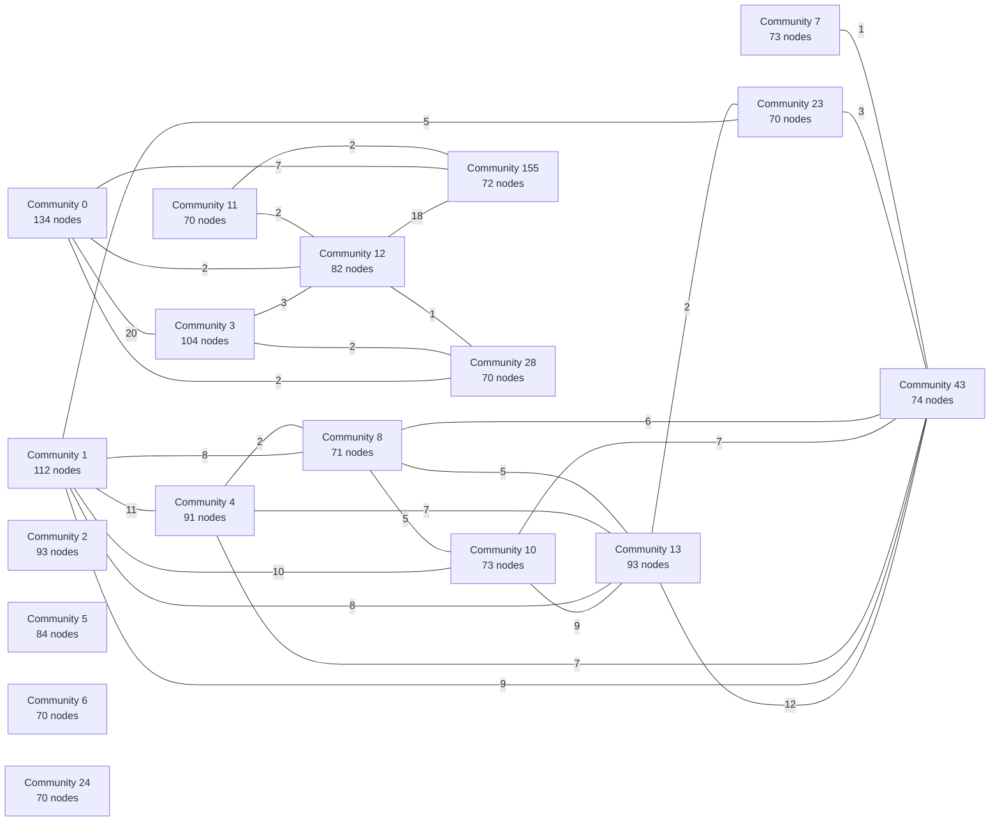

# Semantic graph — generated human view

> **GENERATED FILE — do not hand-edit.** Run `npm run graph:view:write` after Graphify updates.
> The machine graph is a rebuildable semantic projection; curated architecture and contracts remain truth.

This is the repository’s single tracked human-readable view of `graphify-out/graph.json`. It compresses
the graph into communities, cross-community connections, bridge nodes, and hyperedges. It is deliberately
lossy: use `graphify query`, `graphify path`, or `graphify explain` for node-level investigation.

## Snapshot

| Measure | Value |
|---|---:|
| Nodes | 11670 |
| Pair links | 18201 |
| Hyperedges | 0 |
| Communities | 766 |
| Source files represented | 1062 |
| Dangling pair-link endpoints | 0 |
| Dangling hyperedge members | 0 |

- Graphify revision stamp: `a3e427ae822740d6661b5bac46a245fec63adf57`
- Exact source-file SHA-256: `92ef1af7c72cd6278cb3ed28233cef4875dc475f06cd2ef521736d65aac21ea2`
- Semantic-content SHA-256 (revision metadata excluded): `4e0b343e2bdb8ab5219a4192ec58749885ebdb8c472a711f0060692e6bf9bae8`

## Main community topology

The 18 largest communities are shown. Edge labels are aggregated pair-link counts;
an absent line does not mean two areas have no path through smaller communities.

## Graph composition

### Node types

| Kind | Count | Share |
|---|---:|---:|
| code | 7509 | 64.3% |
| document | 3785 | 32.4% |
| rationale | 375 | 3.2% |
| concept | 1 | 0.0% |

### Node origins

| Kind | Count | Share |
|---|---:|---:|
| ast | 11670 | 100.0% |

### Pair-link confidence

| Kind | Count | Share |
|---|---:|---:|
| EXTRACTED | 17389 | 95.5% |
| INFERRED | 812 | 4.5% |

### Most common pair-link relations

| Relation | Links |
|---|---:|
| contains | 6936 |
| calls | 2889 |
| imports | 2544 |
| defines | 2085 |
| references | 887 |
| method | 779 |
| imports_from | 603 |
| uses | 581 |
| rationale_for | 375 |
| re_exports | 259 |
| inherits | 212 |
| exports | 19 |
| mixes_in | 13 |
| navigates | 7 |
| implements | 6 |
| configures | 5 |
| extends | 1 |

## Strongest cross-community connections

| Community A | Community B | Pair links |
|---|---|---:|
| `3` Community 3 | `50` Community 50 | 44 |
| `121` Community 121 | `177` Community 177 | 39 |
| `3` Community 3 | `21` Community 21 | 37 |
| `5` Community 5 | `58` Community 58 | 35 |
| `18` Community 18 | `45` Community 45 | 33 |
| `12` Community 12 | `21` Community 21 | 30 |
| `34` Community 34 | `41` Community 41 | 30 |
| `3` Community 3 | `123` Community 123 | 29 |
| `28` Community 28 | `177` Community 177 | 29 |
| `88` Community 88 | `121` Community 121 | 27 |
| `6` Community 6 | `68` Community 68 | 26 |
| `3` Community 3 | `15` Community 15 | 25 |
| `28` Community 28 | `121` Community 121 | 25 |
| `93` Community 93 | `121` Community 121 | 25 |
| `5` Community 5 | `30` Community 30 | 23 |
| `59` Community 59 | `121` Community 121 | 23 |
| `17` Community 17 | `56` Community 56 | 22 |
| `0` Community 0 | `123` Community 123 | 21 |
| `24` Community 24 | `54` Community 54 | 21 |
| `0` Community 0 | `3` Community 3 | 20 |
| `0` Community 0 | `21` Community 21 | 20 |
| `18` Community 18 | `54` Community 54 | 20 |
| `141` Community 141 | `199` Community 199 | 19 |
| `12` Community 12 | `155` Community 155 | 18 |
| `22` Community 22 | `51` Community 51 | 18 |
| `63` Community 63 | `87` Community 87 | 18 |
| `0` Community 0 | `38` Community 38 | 17 |
| `18` Community 18 | `70` Community 70 | 17 |
| `18` Community 18 | `147` Community 147 | 17 |
| `20` Community 20 | `21` Community 21 | 17 |
| `28` Community 28 | `93` Community 93 | 16 |
| `63` Community 63 | `100` Community 100 | 16 |
| `12` Community 12 | `33` Community 33 | 15 |
| `18` Community 18 | `273` Community 273 | 15 |
| `141` Community 141 | `229` Community 229 | 15 |
| `6` Community 6 | `83` Community 83 | 14 |
| `17` Community 17 | `96` Community 96 | 14 |
| `35` Community 35 | `68` Community 68 | 14 |
| `52` Community 52 | `315` Community 315 | 14 |
| `121` Community 121 | `154` Community 154 | 14 |
| `6` Community 6 | `32` Community 32 | 13 |
| `6` Community 6 | `41` Community 41 | 13 |
| `17` Community 17 | `37` Community 37 | 13 |
| `17` Community 17 | `113` Community 113 | 13 |
| `22` Community 22 | `115` Community 115 | 13 |
| `38` Community 38 | `93` Community 93 | 13 |
| `0` Community 0 | `15` Community 15 | 12 |
| `13` Community 13 | `43` Community 43 | 12 |
| `17` Community 17 | `118` Community 118 | 12 |
| `21` Community 21 | `123` Community 123 | 12 |

## Bridge nodes

Bridge nodes touch several communities. They are useful starting points for blast-radius questions,
but high degree can also reflect generic infrastructure or documentation hubs.

| Node | Community | Neighbor communities | Cross links | Source |
|---|---|---:|---:|---|
| package:flutter/material.dart | `43` Community 43 | 35 | 57 | `no source` |
| package:supabase_flutter/supabase_flutter.dart | `105` Community 105 | 26 | 33 | `no source` |
| List | `243` Community 243 | 24 | 29 | `no source` |
| static const | `105` Community 105 | 20 | 21 | `no source` |
| ../../../../core/theme.dart | `9` Community 9 | 19 | 24 | `no source` |
| package:google_fonts/google_fonts.dart | `43` Community 43 | 19 | 24 | `no source` |
| package:flutter_test/flutter_test.dart | `27` Community 27 | 18 | 47 | `no source` |
| _state | `13` Community 13 | 16 | 22 | `apps/biotope/lib/modules/m2_self_report/ui/screens/scan_tab.dart` |
| StatefulWidget | `13` Community 13 | 16 | 21 | `no source` |
| run.ts | `12` Community 12 | 15 | 67 | `tools/brain-ingest/src/run.ts` |
| cli.ts | `21` Community 21 | 15 | 46 | `tools/brain-ingest/src/cli.ts` |
| home_tab.dart | `4` Community 4 | 14 | 41 | `apps/biotope/lib/modules/m1_core/ui/screens/home_tab.dart` |
| StatelessWidget | `1` Community 1 | 14 | 39 | `no source` |
| SourceName | `106` Community 106 | 14 | 31 | `tools/brain-ingest/src/types.ts` |
| errors.py | `69` Community 69 | 14 | 30 | `model-training/src/ourobion_model_lab/errors.py` |
| scan_tab.dart | `10` Community 10 | 13 | 41 | `apps/biotope/lib/modules/m2_self_report/ui/screens/scan_tab.dart` |
| index.ts | `3` Community 3 | 12 | 39 | `tools/brain-ingest/src/synth/index.ts` |
| daily_log_screen.dart | `8` Community 8 | 12 | 26 | `apps/biotope/lib/modules/m2_self_report/ui/screens/daily_log_screen.dart` |
| index.ts | `121` Community 121 | 11 | 66 | `tools/llm-router/src/index.ts` |
| PaperRecord | `152` Community 152 | 11 | 25 | `tools/brain-ingest/src/types.ts` |
| SourceCtx | `155` Community 155 | 11 | 22 | `tools/brain-ingest/src/types.ts` |
| ModelLabError | `69` Community 69 | 11 | 16 | `model-training/src/ourobion_model_lab/errors.py` |
| index.ts | `100` Community 100 | 10 | 50 | `supabase/functions/generate-insights/index.ts` |
| paperRun.ts | `3` Community 3 | 10 | 23 | `tools/brain-ingest/src/synth/paperRun.ts` |
| Config | `12` Community 12 | 10 | 13 | `tools/brain-ingest/src/types.ts` |
| ConfigError | `5` Community 5 | 9 | 42 | `model-training/src/ourobion_model_lab/errors.py` |
| insight_provenance_screen.dart | `1` Community 1 | 9 | 21 | `apps/biotope/lib/modules/m5b_insight_engine/ui/screens/insight_provenance_screen.dart` |
| types.ts | `114` Community 114 | 9 | 19 | `tools/brain-ingest/src/types.ts` |
| FetchOptions | `155` Community 155 | 9 | 14 | `tools/brain-ingest/src/types.ts` |
| metric_detail_screen.dart | `23` Community 23 | 9 | 14 | `apps/biotope/lib/modules/m5a_baselines/ui/screens/metric_detail_screen.dart` |
| run_inference() | `17` Community 17 | 9 | 13 | `model-training/src/ourobion_model_lab/inference/predict.py` |
| dart:io | `186` Community 186 | 9 | 10 | `no source` |
| SupabaseClient | `207` Community 207 | 9 | 10 | `no source` |
| ViceroyConfig | `41` Community 41 | 8 | 43 | `docs/temp/model-training/viceroy-training/src/viceroy/config.py` |
| __init__.py | `35` Community 35 | 8 | 36 | `docs/temp/model-training/viceroy-training/src/viceroy/__init__.py` |
| verifier.ts | `0` Community 0 | 8 | 22 | `tools/brain-ingest/src/verify/verifier.ts` |
| liveAcceptance.ts | `38` Community 38 | 8 | 20 | `tools/brain-ingest/src/liveAcceptance.ts` |
| LlmRouter | `88` Community 88 | 8 | 16 | `tools/llm-router/src/router.ts` |
| predict.py | `17` Community 17 | 8 | 12 | `model-training/src/ourobion_model_lab/inference/predict.py` |
| scan_tab_widgets_test.dart | `91` Community 91 | 8 | 11 | `apps/biotope/test/m2_self_report/scan_tab_widgets_test.dart` |
| ../../../../shared/constants/copy_guidelines.dart | `64` Community 64 | 8 | 10 | `no source` |
| metric_detail_screen_test.dart | `55` Community 55 | 8 | 10 | `apps/biotope/test/m5a_baselines/metric_detail_screen_test.dart` |
| scan_test_support.dart | `71` Community 71 | 8 | 10 | `apps/biotope/test/m2_self_report/scan_test_support.dart` |
| tmpDir() | `28` Community 28 | 8 | 10 | `tools/secret_scan_guard.test.mjs` |
| int? | `43` Community 43 | 8 | 9 | `no source` |
| wearable_service.dart | `156` Community 156 | 8 | 9 | `apps/biotope/lib/modules/m3_passive_health/impl/wearable_service.dart` |
| Issue 221 Run 4 base reconciliation | `440` Community 440 | 8 | 8 | `docs/sessions/20260731T073421Z-agentjwork-codex-issue221-reconciliation.md` |
| Map | `180` Community 180 | 8 | 8 | `no source` |
| provenance_models.dart | `19` Community 19 | 8 | 8 | `apps/biotope/lib/modules/m5b_insight_engine/impl/provenance_models.dart` |
| return | `317` Community 317 | 8 | 8 | `no source` |

## Hyperedges

Hyperedges express one relationship spanning three or more nodes. A non-zero missing-member count is
an integrity defect in the machine graph and should be resolved before treating that hyperedge as usable.

| Hyperedge | Relation | Members | Missing | Confidence | Source |
|---|---|---:|---:|---|---|

<strong>Complete community directory (766)</strong>

Communities are ordered by node count. “Cross links” counts incidences, so each connection contributes
once to each endpoint community.

| ID | Community | Nodes | Internal links | Cross links | Inferred incidences | Key nodes | Representative sources |
|---:|---|---:|---:|---:|---:|---|---|
| 0 | Community 0 | 134 | 357 | 120 | 1 | verifier.ts · verify.test.ts · types.ts · enforce.ts | `tools/brain-ingest/src/verify/types.ts` `tools/brain-ingest/src/verify/enforce.ts` `tools/brain-ingest/src/verify/retrieval.ts` |
| 1 | Community 1 | 112 | 120 | 89 | 0 | insight_provenance_screen.dart · StatelessWidget · _ActiveCourseCard · _ArmstrongControl | `apps/biotope/lib/modules/m5b_insight_engine/ui/screens/insight_provenance_screen.dart` `apps/biotope/lib/modules/m1_core/ui/screens/home_tab.dart` `apps/biotope/lib/modules/m2_self_report/ui/screens/scan_tab.dart` |
| 3 | Community 3 | 104 | 292 | 210 | 0 | index.ts · paperRun.ts · types.ts · synth.test.ts | `tools/brain-ingest/src/synth/types.ts` `tools/brain-ingest/src/synth/artifact.ts` `tools/brain-ingest/src/synth/load.ts` |
| 2 | Community 2 | 93 | 92 | 2 | 0 | index.dart · activeTitle · anxietyScore · appetiteScore | `shared/types/index.dart` |
| 13 | Community 13 | 93 | 124 | 104 | 0 | _state · StatefulWidget · biotope_auth_scaffold.dart · waking_screen.dart | `apps/biotope/lib/core/widgets/biotope_auth_scaffold.dart` `apps/biotope/lib/modules/m1_core/ui/screens/waking_screen.dart` `apps/biotope/lib/core/widgets/biotope_screen_entrance.dart` |
| 4 | Community 4 | 91 | 91 | 48 | 0 | home_tab.dart · MaterialPageRoute · how_ourobion_works_screen_test.dart · _open | `apps/biotope/lib/modules/m1_core/ui/screens/home_tab.dart` `apps/biotope/test/m1_core/how_ourobion_works_screen_test.dart` `apps/biotope/lib/modules/m1_core/ui/screens/sign_in_screen.dart` |
| 5 | Community 5 | 84 | 221 | 131 | 173 | ConfigError · JobSpec · StepResult · DryRunResult | `model-training/src/ourobion_model_lab/job.py` `model-training/tests/test_job_and_cli.py` `model-training/src/ourobion_model_lab/self_check.py` |
| 12 | Community 12 | 82 | 159 | 143 | 5 | run.ts · r2.ts · run() · run.test.ts | `tools/brain-ingest/src/run.ts` `tools/brain-ingest/src/storage/r2.ts` `tools/brain-ingest/src/extract.ts` |
| 43 | Community 43 | 74 | 85 | 139 | 0 | package:flutter/material.dart · package:google_fonts/google_fonts.dart · biotope_bottom_navigation.dart · symptom_flags_screen.dart | `apps/biotope/lib/core/widgets/biotope_bottom_navigation.dart` `apps/biotope/lib/modules/m2_self_report/ui/screens/symptom_flags_screen.dart` `apps/biotope/lib/modules/m1_core/ui/widgets/about_biotope_card.dart` |
| 7 | Community 7 | 73 | 72 | 4 | 0 | guard_support.dart · _numericField · _quotedField · _scaleFields | `apps/biotope/test/guards/guard_support.dart` |
| 10 | Community 10 | 73 | 73 | 44 | 0 | scan_tab.dart · _ScanDialBreatheState · _ScanDialBreathe · _answerInline | `apps/biotope/lib/modules/m2_self_report/ui/screens/scan_tab.dart` |
| 155 | Community 155 | 72 | 130 | 92 | 0 | SourceCtx · FetchOptions · crossref.test.ts · Seed | `tools/brain-ingest/src/sources/discovery/crossref.ts` `tools/brain-ingest/src/sources/discovery/arxiv.ts` `tools/brain-ingest/src/sources/discovery/s2.ts` |
| 8 | Community 8 | 71 | 72 | 36 | 0 | daily_log_screen.dart · _DailyLogScreenState · _NotesCard · _NotesCardState | `apps/biotope/lib/modules/m2_self_report/ui/screens/daily_log_screen.dart` `apps/biotope/lib/modules/m2_self_report/index.dart` |
| 6 | Community 6 | 70 | 177 | 76 | 93 | _small_config() · _row() · build_groups() · InsufficientFoldSupportError | `docs/temp/model-training/viceroy-training/tests/test_splits.py` `docs/temp/model-training/viceroy-training/src/viceroy/splits.py` `docs/temp/model-training/zebra-training/tests/test_splits.py` |
| 11 | Community 11 | 70 | 233 | 5 | 7 | run4_release_gate.mjs · fail() · run4_release_gate.test.mjs · validateRun4Workflow() | `tools/run4_release_gate.mjs` `tools/run4_release_gate.test.mjs` `tools/brain-ingest/src/sources/discovery/s2.ts` |
| 23 | Community 23 | 70 | 75 | 23 | 0 | metric_detail_screen.dart · index.dart · _MetricDetailScreenState · ../../impl/chart_math.dart | `apps/biotope/lib/modules/m5a_baselines/ui/screens/metric_detail_screen.dart` `apps/biotope/lib/modules/m5a_baselines/index.dart` |
| 24 | Community 24 | 70 | 115 | 45 | 1 | loaderRuns.test.ts · loaderRuns.ts · buildPublicationSummary() · parseApplyResult() | `apps/nao/src/lib/loaderRuns.ts` `apps/nao/tests/loaderRuns.test.ts` `apps/nao/src/lib/simulatedHealth.ts` |
| 28 | Community 28 | 70 | 122 | 109 | 19 | router.test.ts · apiWorker.test.ts · helpers.ts · errors.ts | `tools/llm-router/tests/router.test.ts` `tools/llm-router/tests/helpers.ts` `tools/llm-router/src/errors.ts` |
| 14 | Community 14 | 68 | 123 | 21 | 11 | assert_no_forbidden_schema() · assert_allowed_input_path() · data_guard.py · ForbiddenDataError | `model-training/tests/test_data_guard.py` `model-training/src/ourobion_model_lab/data_guard.py` `model-training/src/ourobion_model_lab/errors.py` |
| 16 | Community 16 | 67 | 121 | 8 | 14 | release.py · EnvironmentSnapshot · ReleaseIncompleteError · TestForbiddenValues | `model-training/tests/test_release.py` `model-training/src/ourobion_model_lab/release.py` `model-training/src/ourobion_model_lab/environment.py` |
| 21 | Community 21 | 67 | 129 | 158 | 2 | cli.ts · artifactPromotion.ts · artifactPromotion.test.ts · R2Store | `tools/brain-ingest/src/cli.ts` `tools/brain-ingest/src/artifactPromotion.ts` `tools/brain-ingest/tests/artifactPromotion.test.ts` |
| 57 | Community 57 | 67 | 68 | 19 | 0 | living_backdrop.dart · daily_scale_value_visual.dart · daily_scale_visuals.dart · Color | `apps/biotope/lib/modules/m1_core/ui/widgets/living_backdrop.dart` `apps/biotope/lib/modules/m2_self_report/ui/widgets/daily_scale_value_visual.dart` `apps/biotope/lib/modules/m2_self_report/ui/widgets/daily_scale_visuals.dart` |
| 17 | Community 17 | 65 | 146 | 124 | 99 | PredictionRow · ReadOnlyR2Client · predict.py · R2Credentials | `model-training/src/ourobion_model_lab/inference/predict.py` `model-training/src/ourobion_model_lab/inference/schemas.py` `model-training/src/ourobion_model_lab/inference/runners/_engine.py` |
| 70 | Community 70 | 65 | 92 | 31 | 0 | redact.test.ts · authz.ts · authz.test.ts · redactRelayBody() | `apps/nao/tests/redact.test.ts` `apps/nao/src/lib/authz.ts` `apps/nao/tests/authz.test.ts` |
| 19 | Community 19 | 64 | 63 | 14 | 0 | provenance_models.dart · ProvenanceCardInfo · ProvenanceCitation · ProvenanceCompleteness | `apps/biotope/lib/modules/m5b_insight_engine/impl/provenance_models.dart` |
| 20 | Community 20 | 64 | 167 | 48 | 0 | index.ts · seeder.test.ts · artifact.ts · candidates.ts | `tools/brain-ingest/src/seeder/types.ts` `tools/brain-ingest/src/seeder/artifact.ts` `tools/brain-ingest/src/seeder/candidates.ts` |
| 25 | Community 25 | 61 | 61 | 18 | 0 | metric_trend_section.dart · MetricTrendSectionState · MetricTrendSection · ../../../m2_self_report/index.dart | `apps/biotope/lib/modules/m5a_baselines/ui/widgets/metric_trend_section.dart` |
| 41 | Community 41 | 61 | 134 | 88 | 65 | ViceroyConfig · cli.py · RawExample · cmd_dry_run() | `docs/temp/model-training/viceroy-training/src/viceroy/cli.py` `docs/temp/model-training/viceroy-training/src/viceroy/config.py` `docs/temp/model-training/viceroy-training/src/viceroy/data.py` |
| 18 | Community 18 | 60 | 214 | 142 | 0 | authzServer.ts · guardRole() · redactDeep() · route.ts | `apps/nao/src/lib/authzServer.ts` `apps/nao/src/app/(app)/api/ingest-control/route.ts` `apps/nao/src/app/(app)/api/seeds/route.ts` |
| 9 | Community 9 | 58 | 62 | 69 | 0 | archive_tab.dart · ../../../../core/theme.dart · insights_tab.dart · wearable_sync_row.dart | `apps/biotope/lib/modules/m5b_insight_engine/ui/screens/archive_tab.dart` `apps/biotope/lib/modules/m5b_insight_engine/ui/screens/insights_tab.dart` `apps/biotope/lib/modules/m3_passive_health/ui/widgets/wearable_sync_row.dart` |
| 30 | Community 30 | 58 | 137 | 55 | 29 | load_data_manifest() · Path · manifests.py · TestDataManifest | `model-training/tests/test_manifests.py` `model-training/src/ourobion_model_lab/manifests.py` `model-training/src/ourobion_model_lab/errors.py` |
| 32 | Community 32 | 57 | 108 | 50 | 38 | splits.py · build_components() · _row() · build_splits() | `docs/temp/model-training/zebra-training/src/zebra/splits.py` `docs/temp/model-training/zebra-training/tests/test_splits.py` |
| 26 | Community 26 | 56 | 95 | 41 | 8 | data.py · build_example() · select_evidence_sentences() · FakeTokenizer | `docs/temp/model-training/zebra-training/src/zebra/data.py` `docs/temp/model-training/zebra-training/tests/test_evidence_label_blind.py` |
| 31 | Community 31 | 56 | 60 | 24 | 0 | sign_up_screen.dart · sign_in_screen.dart · profile_setup_screen.dart · _ProfileSetupScreenState | `apps/biotope/lib/modules/m1_core/ui/screens/sign_up_screen.dart` `apps/biotope/lib/modules/m1_core/ui/screens/profile_setup_screen.dart` `apps/biotope/lib/modules/m1_core/ui/screens/sign_in_screen.dart` |
| 45 | Community 45 | 56 | 105 | 43 | 0 | types.ts · ingestControl.ts · seedsControl.ts · ingestControl.test.ts | `apps/nao/src/lib/seedsControl.ts` `apps/nao/src/lib/types.ts` `apps/nao/src/components/IngestControlPanel.tsx` |
| 27 | Community 27 | 55 | 67 | 54 | 0 | package:flutter_test/flutter_test.dart · guard_support.dart · how_ourobion_works_copy_gate_test.dart · metrics_registry_engine_test.dart | `apps/biotope/test/guards/rules_table_contract_test.dart` `apps/biotope/test/m5b_insight_engine/citation_link_test.dart` `apps/biotope/test/core/session_refresh_retry_test.dart` |
| 34 | Community 34 | 55 | 96 | 55 | 14 | data.py · build_dataset() · build_example() · FakeTokenizer | `docs/temp/model-training/viceroy-training/tests/test_data.py` `docs/temp/model-training/viceroy-training/src/viceroy/data.py` |
| 55 | Community 55 | 55 | 57 | 26 | 0 | metric_detail_screen_test.dart · baseline_service.dart · signals_detail_copy_gate_test.dart · double? | `apps/biotope/lib/modules/m5a_baselines/impl/baseline_service.dart` `apps/biotope/test/m5a_baselines/metric_detail_screen_test.dart` `apps/biotope/test/m5a_baselines/signals_detail_copy_gate_test.dart` |
| 35 | Community 35 | 54 | 127 | 58 | 25 | __init__.py · MetricsError · metrics.py · _check_nonempty() | `docs/temp/model-training/viceroy-training/src/viceroy/metrics.py` `docs/temp/model-training/viceroy-training/tests/test_metrics.py` `docs/temp/model-training/viceroy-training/src/viceroy/__init__.py` |
| 33 | Community 33 | 53 | 102 | 49 | 0 | identity.ts · idconv.ts · idconv.test.ts · normalizeIdentifiers() | `tools/brain-ingest/src/identity.ts` `tools/brain-ingest/src/sources/idconv.ts` `tools/brain-ingest/tests/idconv.test.ts` |
| 36 | Community 36 | 53 | 58 | 17 | 0 | evidence_chain_rendering_test.dart · provenance_screen_widget_test.dart · provenance_citation_link_widget_test.dart · provenance_model_test.dart | `apps/biotope/test/m5b_insight_engine/evidence_chain_rendering_test.dart` `apps/biotope/test/m5b_insight_engine/provenance_citation_link_widget_test.dart` `apps/biotope/test/m5b_insight_engine/provenance_screen_widget_test.dart` |
| 37 | Community 37 | 53 | 133 | 41 | 61 | HashMismatchError · ResolvedRelease · acquire_release() · _release() | `model-training/tests/test_inference_acquire.py` `model-training/src/ourobion_model_lab/inference/releases.py` `model-training/src/ourobion_model_lab/inference/acquire.py` |
| 42 | Community 42 | 53 | 104 | 29 | 1 | core.retrieval.test.ts · capture.ts · core.ts · capture.test.ts | `tools/brain-ingest/src/retrieval/capture.ts` `tools/brain-ingest/src/retrieval/core.ts` `tools/brain-ingest/tests/core.retrieval.test.ts` |
| 39 | Community 39 | 52 | 51 | 3 | 0 | theme.dart · authBreathe · background · base | `apps/biotope/lib/core/theme.dart` |
| 40 | Community 40 | 52 | 53 | 3 | 0 | registry.dart · DailyProjection · num? · EventDailyProjection | `shared/metrics/lib/src/registry.dart` |
| 44 | Community 44 | 51 | 82 | 0 | 3 | win32_window.cpp · Create() · MessageHandler() · WndProc() | `apps/biotope/windows/runner/win32_window.cpp` `apps/biotope/windows/runner/flutter_window.cpp` `apps/biotope/windows/flutter/generated_plugin_registrant.cc` |
| 47 | Community 47 | 51 | 112 | 1 | 1 | check_arch_boundaries.mjs · check_arch_boundaries.test.mjs · analyze() · checkR2b() | `tools/check_arch_boundaries.mjs` `tools/check_arch_boundaries.test.mjs` |
| 50 | Community 50 | 51 | 86 | 54 | 0 | paperSynth.test.ts · blueprint.ts · blueprintArtifact.ts · blueprintDedupeKey() | `tools/brain-ingest/tests/paperSynth.test.ts` `tools/brain-ingest/src/synth/blueprint.ts` `tools/brain-ingest/src/synth/blueprintArtifact.ts` |
| 38 | Community 38 | 50 | 110 | 74 | 0 | liveAcceptance.ts · runLiveAcceptance() · liveAcceptance.test.ts · logicalCallIdSha256() | `tools/brain-ingest/src/liveAcceptance.ts` `tools/brain-ingest/tests/liveAcceptance.test.ts` `tools/brain-ingest/src/verify/verifier.ts` |
| 105 | Community 105 | 50 | 51 | 64 | 0 | package:supabase_flutter/supabase_flutter.dart · consent_screen.dart · static const · consent_service.dart | `apps/biotope/lib/modules/m1_core/ui/screens/consent_screen.dart` `apps/biotope/lib/modules/m1_core/impl/consent_service.dart` `apps/biotope/lib/modules/m1_core/impl/profile_service.dart` |
| 121 | Community 121 | 50 | 136 | 185 | 0 | index.ts · router.ts · budget.ts · LlmNodeId | `tools/llm-router/src/types.ts` `tools/llm-router/src/overrides.ts` `tools/llm-router/src/router.ts` |
| 46 | Community 46 | 49 | 50 | 24 | 0 | profile_tab.dart · ../../impl/auth_service.dart · ../../impl/profile_service.dart · _DailyDigestToggleState | `apps/biotope/lib/modules/m1_core/ui/screens/profile_tab.dart` `apps/biotope/lib/modules/m1_core/index.dart` |
| 53 | Community 53 | 46 | 80 | 0 | 0 | TestLicenceGate · _approval() · .write() · test_cli.py | `docs/temp/model-training/viceroy-training/tests/test_cli.py` |
| 48 | Community 48 | 45 | 46 | 29 | 0 | archive_status_widget_test.dart · archive_trends_widget_test.dart · InsightService · package:src/modules/m5a_baselines/ui/widgets/metric_trend_section.dart | `apps/biotope/test/m5b_insight_engine/archive_status_widget_test.dart` `apps/biotope/test/m5b_insight_engine/archive_trends_widget_test.dart` `apps/biotope/lib/modules/m5b_insight_engine/impl/insight_service.dart` |
| 56 | Community 56 | 45 | 73 | 34 | 33 | R2Error · r2.py · build_signed_headers() · credentials_from_env() | `model-training/tests/test_inference_r2.py` `model-training/src/ourobion_model_lab/inference/r2.py` |
| 64 | Community 64 | 45 | 47 | 29 | 0 | ../../../../shared/constants/copy_guidelines.dart · profile_load_failure_test.dart · profile_digest_test.dart · quick_count_control_test.dart | `apps/biotope/test/m1_core/profile_load_failure_test.dart` `apps/biotope/test/m1_core/profile_preference_truthfulness_test.dart` `apps/biotope/test/m1_core/profile_digest_test.dart` |
| 123 | Community 123 | 45 | 87 | 80 | 0 | offlineAcceptance.ts · corpus.ts · prepareOfflineAcceptance() · evidenceTier.ts | `tools/brain-ingest/src/evidenceTier.ts` `tools/brain-ingest/src/offlineAcceptance.ts` `tools/brain-ingest/src/verify/corpus.ts` |
| 58 | Community 58 | 44 | 109 | 37 | 30 | Path · ._write_config() · TestCliWiring · TestGatedJobFailsClosed | `model-training/tests/test_job_and_cli.py` |
| 60 | Community 60 | 43 | 76 | 0 | 0 | render_graph_view.mjs · generate_graph_view.mjs · render_graph_html.mjs · renderGraphView() | `tools/graph-view/lib/render_graph_view.mjs` `tools/graph-view/generate_graph_view.mjs` `tools/graph-view/lib/render_graph_html.mjs` |
| 61 | Community 61 | 43 | 42 | 7 | 0 | insight_service.dart · _client · _parseCategory · _parseDbTimestamp | `apps/biotope/lib/modules/m5b_insight_engine/impl/insight_service.dart` |
| 62 | Community 62 | 43 | 42 | 0 | 0 | 5 · Authoring + loop stages (the paper side) · Insight-engine architecture — ground truth · 4 · Serve-path stages · 8 · Control flow | `docs/shared/insight-engine-architecture.md` |
| 90 | Community 90 | 43 | 72 | 19 | 1 | internal_auth.ts · internal_auth.test.ts · internalSecret.test.ts · index.ts | `supabase/functions/_shared/internal_auth.test.ts` `supabase/functions/_shared/internal_auth.ts` `apps/nao/tests/internalSecret.test.ts` |
| 49 | Community 49 | 42 | 42 | 18 | 0 | quick_count_control.dart · package:ourobion_metrics/ourobion_metrics.dart · metric_axis_policy_test.dart · _QuickCountControlState | `apps/biotope/lib/modules/m2_self_report/ui/widgets/quick_count_control.dart` `apps/biotope/test/m5a_baselines/metric_axis_policy_test.dart` |
| 52 | Community 52 | 42 | 87 | 36 | 11 | cli.py · build_dataset() · RawExample · ZebraConfig | `docs/temp/model-training/zebra-training/src/zebra/cli.py` `docs/temp/model-training/zebra-training/src/zebra/data.py` |
| 63 | Community 63 | 41 | 71 | 46 | 0 | composer.ts · engine_orientation_gap.test.ts · edge_trust_gate.test.ts · classifyPattern() | `supabase/functions/generate-insights/composer.ts` `tools/rules/tests/engine_orientation_gap.test.ts` `tools/rules/tests/edge_trust_gate.test.ts` |
| 71 | Community 71 | 41 | 41 | 12 | 0 | scan_test_support.dart · ScanGapListHost · ScanGapListHostState · answered | `apps/biotope/test/m2_self_report/scan_test_support.dart` |
| 83 | Community 83 | 41 | 70 | 49 | 36 | ProcessedExample · model.py · train() · ToySmokeTokenizer | `docs/temp/model-training/viceroy-training/src/viceroy/model.py` `docs/temp/model-training/viceroy-training/src/viceroy/config.py` `docs/temp/model-training/viceroy-training/src/viceroy/data.py` |
| 145 | Community 145 | 41 | 41 | 18 | 0 | daily_log_partial_write_test.dart · inline_control_range_test.dart · package:src/modules/m2_self_report/impl/logging_controller.dart · package:src/modules/m2_self_report/impl/normaliser.dart | `apps/biotope/test/m2_self_report/daily_log_partial_write_test.dart` `apps/biotope/test/m2_self_report/inline_control_range_test.dart` `apps/biotope/test/m2_self_report/normaliser_test.dart` |
| 65 | Community 65 | 40 | 65 | 37 | 27 | load_release() · releases.py · parse_checksum_manifest() · sha256_file() | `model-training/tests/test_inference_releases.py` `model-training/src/ourobion_model_lab/inference/releases.py` `model-training/src/ourobion_model_lab/manifests.py` |
| 66 | Community 66 | 40 | 39 | 0 | 0 | Run 3 Next-Build Optimizations — historical locked tranche · Adversarial-verdict reconciliation (2026-07-22) · Run 3.0 locked tranche — half-sized remediation run (2026-07-26) · next-build-optimizations.md | `docs/temp/run3/next-build-optimizations.md` |
| 67 | Community 67 | 39 | 40 | 9 | 0 | logging_controller.dart · @visibleForTesting · authorizeWithTimeout · buildFieldPatch | `apps/biotope/lib/modules/m2_self_report/impl/logging_controller.dart` `apps/biotope/lib/core/app_preferences.dart` `apps/biotope/lib/modules/m3_passive_health/impl/wearable_service.dart` |
| 68 | Community 68 | 39 | 64 | 57 | 25 | splits.py · build_splits() · near_duplicate_pairs() · ProcessedExample | `docs/temp/model-training/viceroy-training/src/viceroy/splits.py` `docs/temp/model-training/viceroy-training/tests/test_splits.py` `docs/temp/model-training/viceroy-training/src/viceroy/data.py` |
| 69 | Community 69 | 39 | 64 | 48 | 20 | errors.py · ModelLabError · MetricInputError · TestExpectedCalibrationError | `model-training/tests/test_metrics.py` `model-training/src/ourobion_model_lab/errors.py` `model-training/src/ourobion_model_lab/metrics.py` |
| 73 | Community 73 | 39 | 99 | 0 | 0 | context_sync.mjs · read() · runCheck() · isFile() | `tools/context_sync.mjs` |
| 74 | Community 74 | 39 | 99 | 37 | 2 | __init__.py · metrics.py · MetricsError · _check_nonempty() | `docs/temp/model-training/zebra-training/src/zebra/metrics.py` `docs/temp/model-training/zebra-training/src/zebra/__init__.py` |
| 87 | Community 87 | 39 | 55 | 31 | 0 | engine_composer_render.test.ts · render.ts · causal_copy_gate.test.ts · renderCard() | `supabase/functions/generate-insights/render.ts` `tools/rules/tests/causal_copy_gate.test.ts` `tools/rules/tests/engine_composer_render.test.ts` |
| 72 | Community 72 | 38 | 76 | 9 | 0 | venue.test.ts · banding.ts · cache.ts · openalexSources.ts | `tools/brain-ingest/src/venue/cache.ts` `tools/brain-ingest/src/venue/openalexSources.ts` `tools/brain-ingest/src/venue/banding.ts` |
| 77 | Community 77 | 37 | 36 | 12 | 8 | test_metrics.py · TestBrierAndEce · TestConfusionMatrixAndPrf1 · TestTemperature | `docs/temp/model-training/viceroy-training/tests/test_metrics.py` |
| 79 | Community 79 | 37 | 75 | 16 | 0 | stats.ts · s5_pairwise.test.ts · config.ts · s4_signal.test.ts | `supabase/functions/evaluate-signals/stats.ts` `supabase/functions/evaluate-signals/config.ts` `tools/engine-stats/tests/s4_signal.test.ts` |
| 80 | Community 80 | 37 | 36 | 2 | 0 | chart_math.dart · _shortMonths · _snapTick · compactValueLabel | `apps/biotope/lib/modules/m5a_baselines/impl/chart_math.dart` |
| 86 | Community 86 | 37 | 38 | 18 | 4 | config.py · TestViceroyConfigValidation · TestViceroyConfigSerialization · Path | `docs/temp/model-training/viceroy-training/tests/test_config.py` `docs/temp/model-training/viceroy-training/src/viceroy/config.py` |
| 15 | Community 15 | 36 | 75 | 53 | 1 | singlePaper.ts · runSinglePaper() · passages.ts · defaultTermsForKeys() | `tools/brain-ingest/src/singlePaper.ts` `tools/brain-ingest/src/synth/passages.ts` `tools/brain-ingest/tests/singlePaper.test.ts` |
| 54 | Community 54 | 36 | 65 | 46 | 0 | route.ts · simulatedHealth.ts · simulatedHealth.test.ts · generateSimulatedDays() | `apps/nao/src/lib/simulatedHealth.ts` `apps/nao/tests/simulatedHealth.test.ts` `apps/nao/src/app/(app)/api/loader/route.ts` |
| 78 | Community 78 | 36 | 62 | 30 | 19 | ProcessedExample · model.py · train() · ToySmokeTokenizer | `docs/temp/model-training/zebra-training/src/zebra/model.py` `docs/temp/model-training/zebra-training/src/zebra/config.py` `docs/temp/model-training/zebra-training/src/zebra/data.py` |
| 81 | Community 81 | 36 | 38 | 9 | 0 | relationships.schema.ts · edge_table_schema.test.ts · relationKindSchema · verdictSchema | `shared/brain/relationships.schema.ts` `tools/edge-loader/tests/edge_table_schema.test.ts` |
| 82 | Community 82 | 36 | 35 | 1 | 0 | trust_labels.dart · copy_guidelines.dart · static const List · static const Map | `shared/brain/trust_labels.dart` `shared/constants/copy_guidelines.dart` |
| 84 | Community 84 | 36 | 35 | 0 | 0 | hackathon-direction.md — Ourobion @ Launchpad 2026 AI Challenge · 3 · Positioning & narrative · 0.5 · Self-judgement response (post-adversarial round) · 5 · Sponsor integration (all three, each load-bearing — sponsors are … | `docs/shared/hackathon/hackathon-direction.md` |
| 85 | Community 85 | 36 | 36 | 7 | 0 | how_ourobion_works_screen.dart · _HowOurobionWorksScreenState · HowOurobionWorksScreen · _availableExpanded | `apps/biotope/lib/modules/m1_core/ui/screens/how_ourobion_works_screen.dart` |
| 91 | Community 91 | 36 | 38 | 21 | 0 | scan_tab_widgets_test.dart · named_scale_visual_test.dart · _AnsweringList · _AnsweringListState | `apps/biotope/test/m2_self_report/scan_tab_widgets_test.dart` `apps/biotope/test/m5a_baselines/named_scale_visual_test.dart` |
| 93 | Community 93 | 36 | 75 | 72 | 0 | attemptJournal.ts · AttemptJournal · acceptanceAuthorizationHash() · validateAcceptanceAuthorization() | `tools/llm-router/src/attemptJournal.ts` `tools/brain-ingest/tests/liveAcceptance.test.ts` `tools/llm-router/src/config.ts` |
| 177 | Community 177 | 36 | 77 | 97 | 0 | apiWorker.ts · config.ts · callApiWorker() · validateConfig() | `tools/llm-router/src/config.ts` `tools/llm-router/src/routes/apiWorker.ts` `tools/llm-router/src/raw.ts` |
| 243 | Community 243 | 36 | 36 | 55 | 0 | List · metric_trend_section_widget_test.dart · archive_empty_state_widget_test.dart · home_hero_parity_widget_test.dart | `apps/biotope/test/m5b_insight_engine/archive_empty_state_widget_test.dart` `apps/biotope/test/m5a_baselines/metric_trend_section_widget_test.dart` `apps/biotope/test/m1_core/home_hero_parity_widget_test.dart` |
| 22 | Community 22 | 35 | 59 | 37 | 0 | scientific_provenance.test.ts · provenance.ts · trustFailures() · effectiveClaimKind() | `tools/rules/tests/scientific_provenance.test.ts` `shared/brain/provenance.ts` `shared/brain/trust_labels.ts` |
| 89 | Community 89 | 35 | 34 | 0 | 0 | 2. New optimisation items (O31–O40) · Run 4 — reviewed candidate scope and priority tranche · 4. Carried forward from the pending-build register · 3c. Run 4 exit gate — local qualification before cloud promotion | `docs/temp/run4/next-build-optimizations.md` |
| 92 | Community 92 | 34 | 33 | 0 | 0 | devDependencies · scripts · dependencies · package.json | `apps/nao/package.json` |
| 94 | Community 94 | 34 | 34 | 0 | 0 | test_model_inference_workflow.py · TestNoProhibitedOperations · TestPermissionsAndEnvironment · TestInputSurface | `model-training/tests/test_model_inference_workflow.py` |
| 97 | Community 97 | 33 | 52 | 21 | 0 | pubmed.ts · pubmed.test.ts · articleToCandidate() · textOf() | `tools/brain-ingest/src/sources/discovery/pubmed.ts` `tools/brain-ingest/tests/pubmed.test.ts` |
| 75 | Community 75 | 32 | 35 | 24 | 0 | stool_form_screen.dart · urine_color_screen.dart · Animation · _StoolFormScreenState | `apps/biotope/lib/modules/m2_self_report/ui/screens/stool_form_screen.dart` `apps/biotope/lib/modules/m2_self_report/ui/screens/urine_color_screen.dart` |
| 98 | Community 98 | 32 | 31 | 0 | 0 | Five custom-model training plans — workability review · 3. Cross-plan findings · 10. One-day constraint: what is and is not possible · 4. Zebra NLI Shadow v0 | `docs/temp/model-training/five-model-training-plans-review.md` |
| 99 | Community 99 | 31 | 30 | 10 | 8 | test_metrics.py · TestConfusionMatrixAndPrf1 · TestBrier · TestEceEqualMass | `docs/temp/model-training/zebra-training/tests/test_metrics.py` |
| 100 | Community 100 | 31 | 36 | 54 | 0 | index.ts · Branch · CardRow · ComposedClaimKind | `supabase/functions/generate-insights/index.ts` `supabase/functions/generate-insights/composer.ts` |
| 101 | Community 101 | 31 | 30 | 16 | 0 | insight_deck.dart · InsightCard · _EmptyDeck · _FrontCard | `apps/biotope/lib/modules/m5b_insight_engine/ui/widgets/insight_deck.dart` |
| 102 | Community 102 | 31 | 30 | 0 | 0 | Zebra NLI Shadow v0 — GMI training and evaluation plan · 3. GMI platform decision · 5. Dataset and licence gate · 11. Completion, outcome, and future-promotion gates | `docs/temp/model-training/zebra-nli-shadow-v0-training-plan.md` |
| 103 | Community 103 | 31 | 43 | 10 | 18 | build_label_permutation() · TestViceroyPermutation · TestZebraPermutation · test_inference_engine.py | `model-training/tests/test_inference_engine.py` `model-training/src/ourobion_model_lab/inference/runners/_engine.py` |
| 104 | Community 104 | 31 | 31 | 10 | 0 | insight_card_visual.dart · _ResearchBasisState · ResearchBasis · StillResearchingNote | `apps/biotope/lib/modules/m5b_insight_engine/ui/widgets/insight_card_visual.dart` |
| 106 | Community 106 | 31 | 63 | 42 | 1 | SourceName · budget.ts · FileBudgetGuard · .charge() | `tools/brain-ingest/src/limits/budget.ts` `tools/brain-ingest/tests/budget.test.ts` `tools/brain-ingest/tests/unpaywall.test.ts` |
| 186 | Community 186 | 30 | 29 | 16 | 0 | onboarding_truthfulness_test.dart · dart:io · how_ourobion_works_isolation_test.dart · home_design_alignment_test.dart | `apps/biotope/test/m1_core/onboarding_truthfulness_test.dart` `apps/biotope/test/m1_core/how_ourobion_works_isolation_test.dart` `apps/biotope/test/m1_core/home_design_alignment_test.dart` |
| 51 | Community 51 | 29 | 36 | 29 | 0 | trust_labels.ts · trust_labels.typetest.ts · ServingEnvironment · TrustInputs | `shared/brain/trust_labels.ts` `shared/brain/provenance.ts` `shared/brain/relationships.ts` |
| 107 | Community 107 | 29 | 28 | 7 | 0 | main.dart · AuthGate · OurobionApp · _checkOnboarding | `apps/biotope/lib/main.dart` |
| 108 | Community 108 | 29 | 53 | 16 | 0 | page.tsx · palette.ts · PaperCard.tsx · PaperCard() | `apps/nao/src/lib/palette.ts` `apps/nao/src/app/(app)/paper/[uid]/page.tsx` `apps/nao/src/components/PaperCard.tsx` |
| 110 | Community 110 | 29 | 43 | 0 | 4 | demo-dryrun-run2.ps1 · native-process.ps1 · Invoke-NativeProcess() · Invoke-NodePackageCli() | `scripts/demo-dryrun-run2.ps1` `scripts/lib/native-process.ps1` `scripts/tests/native-process.tests.ps1` |
| 111 | Community 111 | 29 | 51 | 19 | 0 | openalex.ts · openalex.test.ts · resolveOa() · mapWorkToOaInfo() | `tools/brain-ingest/src/sources/oa/openalex.ts` `tools/brain-ingest/tests/openalex.test.ts` `tools/brain-ingest/src/types.ts` |
| 114 | Community 114 | 29 | 40 | 49 | 0 | types.ts · unpaywall.test.ts · unpaywall.ts · OaInfo | `tools/brain-ingest/src/sources/oa/unpaywall.ts` `tools/brain-ingest/tests/unpaywall.test.ts` `tools/brain-ingest/src/types.ts` |
| 109 | Community 109 | 28 | 27 | 0 | 0 | Demo runbook — 3-minute video production plan · 7. The six slides · 3. What nao can actually be filmed doing · 6. The three captures | `docs/shared/hackathon/submission/demo-runbook.md` |
| 112 | Community 112 | 28 | 27 | 1 | 0 | generated_assets.dart · _base · archiveHerbariumSpecimen · archivePreservedFlowerFragment | `apps/biotope/lib/core/generated_assets.dart` |
| 113 | Community 113 | 28 | 53 | 32 | 32 | validate_prediction() · OutputSchemaError · TestPredictionValidation · _ok_prediction() | `model-training/tests/test_inference_schemas.py` `model-training/src/ourobion_model_lab/inference/schemas.py` |
| 29 | Community 29 | 27 | 43 | 10 | 0 | artifacts.mjs · edge_artifacts.test.ts · buildLoad() · joinEdges() | `tools/edge-loader/lib/artifacts.mjs` `tools/edge-loader/tests/edge_artifacts.test.ts` `tools/edge-loader/tests/edge_human_verdicts.test.ts` |
| 96 | Community 96 | 27 | 41 | 22 | 20 | TestTargetPinning · assert_allowed_target() · _creds() · TestLineEndingInvariants | `model-training/tests/test_inference_review_regressions.py` `model-training/src/ourobion_model_lab/inference/r2.py` |
| 117 | Community 117 | 27 | 48 | 13 | 0 | evaluators.ts · engine_condition_coverage.test.ts · windowedBaseline() · evaluateCoincidence() | `supabase/functions/generate-insights/evaluators.ts` `tools/rules/tests/engine_condition_coverage.test.ts` |
| 118 | Community 118 | 27 | 60 | 31 | 32 | load_input_manifest() · InputSchemaError · Path · TestInputManifest | `model-training/tests/test_inference_schemas.py` `model-training/src/ourobion_model_lab/inference/schemas.py` |
| 119 | Community 119 | 27 | 36 | 29 | 27 | TestOfflineSmoke · _Harness · FakeClient · test_inference_predict.py | `model-training/tests/test_inference_predict.py` |
| 122 | Community 122 | 27 | 26 | 0 | 0 | What Phase 2 contains (by workstream) · Phase 2 — Plan · The metric platform (the floor everything else stands on) · Tracks, dependencies & sequencing | `docs/shared/phase-2-plan.md` |
| 207 | Community 207 | 27 | 26 | 16 | 0 | antibiotic_service.dart · SupabaseClient · metric_series_service.dart · provenance_service.dart | `apps/biotope/lib/modules/m2_self_report/impl/antibiotic_service.dart` `apps/biotope/lib/modules/m5a_baselines/impl/metric_series_service.dart` `apps/biotope/lib/modules/m5b_insight_engine/impl/provenance_service.dart` |
| 115 | Community 115 | 26 | 31 | 24 | 0 | relationships.ts · index.ts · EdgeVerification · RelationshipClaim | `shared/brain/index.ts` `shared/brain/relationships.ts` |
| 125 | Community 125 | 26 | 25 | 1 | 0 | TestZebraConfigValidation · TestZebraConfigHashAndSerialization · test_config.py · TestSeedAndDevice | `docs/temp/model-training/zebra-training/tests/test_config.py` |
| 126 | Community 126 | 26 | 37 | 3 | 0 | view.mjs · generateViewSql() · local_projection_fixture.mjs · view_migration_drift.test.ts | `tools/metric-view/lib/view.mjs` `supabase/tests/metric-view/local_projection_fixture.mjs` `tools/metric-view/gen_metric_view.mjs` |
| 127 | Community 127 | 26 | 25 | 0 | 0 | The Brain — Ingestion (paper corpus) Design · 10 · Build sequence · 2 · The source-API catalog · 5 · Tooling — fetch, capture, extract (TypeScript, no Python) | `docs/nao/brain-ingestion-design.md` |
| 128 | Community 128 | 26 | 25 | 0 | 0 | scripts · devDependencies · package.json · @iarna/toml | `package.json` |
| 129 | Community 129 | 26 | 40 | 7 | 1 | load_edges.mjs · edge_loader_cli.test.ts · loadIntoDb() · main() | `tools/edge-loader/load_edges.mjs` `tools/edge-loader/tests/edge_loader_cli.test.ts` |
| 120 | Community 120 | 25 | 36 | 14 | 0 | pmcJats.ts · pmcJats.test.ts · retrieveJats() · parseJats() | `tools/brain-ingest/src/retrieval/pmcJats.ts` `tools/brain-ingest/tests/pmcJats.test.ts` |
| 130 | Community 130 | 25 | 24 | 0 | 0 | AGENTS.md — Ourobion · 7. Agent collaboration protocol (MANDATORY) · 4. Environment & commands · 6. Phase & team workstreams | `AGENTS.md` |
| 131 | Community 131 | 25 | 32 | 0 | 2 | my_application.cc · _MyApplication · GApplication · my_application_local_command_line() | `apps/biotope/linux/runner/my_application.cc` `apps/biotope/linux/flutter/generated_plugin_registrant.cc` `apps/biotope/linux/runner/main.cc` |
| 132 | Community 132 | 25 | 39 | 15 | 0 | claimsControl.ts · route.ts · ClaimsPanel.tsx · claimsControl.test.ts | `apps/nao/src/lib/claimsControl.ts` `apps/nao/src/components/ClaimsPanel.tsx` `apps/nao/src/app/(app)/api/claims/route.ts` |
| 134 | Community 134 | 25 | 24 | 0 | 0 | Salmon Relation/Direction v0 — GMI training plan · 4. Dataset and licence gate · 5. Label construction · 1. Decision summary | `docs/temp/model-training/salmon-relation-direction-v0-training-plan.md` |
| 95 | Community 95 | 24 | 40 | 13 | 0 | gapsControl.ts · route.ts · gapsControl.test.ts · GapsPanel.tsx | `apps/nao/src/lib/gapsControl.ts` `apps/nao/src/components/GapsPanel.tsx` `apps/nao/src/app/(app)/api/gaps/route.ts` |
| 135 | Community 135 | 24 | 23 | 0 | 0 | What You Must Do When Invoked · /graphify · Step 3 - Extract entities and relationships · For --update and --cluster-only | `.claude/skills/graphify/SKILL.md` |
| 136 | Community 136 | 24 | 39 | 4 | 13 | assert_disjoint_groups() · SplitLeakageError · assert_no_duplicate_normalized_text() · TestDisjointGroups | `model-training/tests/test_splits.py` `model-training/src/ourobion_model_lab/splits.py` `model-training/src/ourobion_model_lab/errors.py` |
| 137 | Community 137 | 24 | 23 | 7 | 0 | engagement_service.dart · _client · _computeStreak · _dateStr | `apps/biotope/lib/modules/m6_engagement/impl/engagement_service.dart` |
| 138 | Community 138 | 24 | 43 | 12 | 6 | LocalFilesystemStorage · Path · storage.py · TestLocalFilesystemStorage | `model-training/src/ourobion_model_lab/storage.py` `model-training/tests/test_storage.py` |
| 139 | Community 139 | 24 | 38 | 11 | 0 | gmi_preflight.py · run_preflight() · _check_python_version() · _check_credentials_present() | `model-training/tests/test_gmi_preflight.py` `model-training/src/ourobion_model_lab/gmi_preflight.py` `model-training/src/ourobion_model_lab/self_check.py` |
| 140 | Community 140 | 24 | 23 | 0 | 0 | Hackathon submission write-up · refreshed against issue #277 · 2 · The model section, in full · 1 · Five pillars (submission text) · 3 · Corrections required in the shared submission docs | `docs/temp/run4/hack-submission-277.md` |
| 141 | Community 141 | 24 | 25 | 46 | 0 | secret_scan_guard.mjs · checkConfigPolicy() · validateAllowlistEntry() · extractDeclaredRuleIds() | `tools/secret_scan_guard.mjs` |
| 142 | Community 142 | 24 | 24 | 13 | 0 | metric_tile.dart · _MetricTileState · MetricTile · _MiniBars | `apps/biotope/lib/modules/m5a_baselines/ui/widgets/metric_tile.dart` |
| 152 | Community 152 | 24 | 53 | 40 | 1 | PaperRecord · Manifest · manifest.ts · manifest.test.ts | `tools/brain-ingest/src/manifest.ts` `tools/brain-ingest/tests/manifest.test.ts` `tools/brain-ingest/src/types.ts` |
| 88 | Community 88 | 23 | 41 | 86 | 1 | LlmResponse · LlmRouter · LlmRequest · .route() | `tools/llm-router/src/routes/localAgent.ts` `tools/llm-router/src/router.ts` `tools/llm-router/tests/localAgent.test.ts` |
| 149 | Community 149 | 23 | 22 | 0 | 0 | Model-training code build — resumable log · Unit MT0 — CI-fix pass after the first real CI run (2026-07-27) · Unit MT0 — remediation pass after adversarial evaluation (2026-07-27) · Unit MT0 — Repository policy and shared training substrate | `docs/temp/model-training/code-build-log.md` |
| 150 | Community 150 | 23 | 22 | 0 | 0 | Giraffe Study-Design v0 — GMI training plan · 4. Dataset and licence gate · 1. Decision summary · 9. Preregistered training recipe | `docs/temp/model-training/giraffe-study-design-v0-training-plan.md` |
| 151 | Community 151 | 23 | 22 | 0 | 0 | compilerOptions · tsconfig.json · paths · @/* | `apps/nao/tsconfig.json` |
| 76 | Community 76 | 22 | 22 | 10 | 0 | antibiotic_course_screen.dart · _AntibioticCourseScreenState · AntibioticCourseScreen · _StepBtn | `apps/biotope/lib/modules/m2_self_report/ui/screens/antibiotic_course_screen.dart` |
| 148 | Community 148 | 22 | 22 | 12 | 0 | registry.ts · index.ts · MetricTable · active() | `shared/metrics/registry.ts` `shared/metrics/index.ts` |
| 153 | Community 153 | 22 | 36 | 9 | 0 | index.ts · buildSnapshots() · lifecycle.ts · s3_baseline_lifecycle.test.ts | `supabase/functions/compute-baselines/index.ts` `supabase/functions/compute-baselines/lifecycle.ts` `tools/engine-stats/tests/s3_baseline_lifecycle.test.ts` |
| 157 | Community 157 | 22 | 21 | 0 | 0 | package.json · scripts · dependencies · devDependencies | `tools/edge-loader/package.json` |
| 158 | Community 158 | 22 | 29 | 20 | 0 | index.ts · lifecycle.ts · s5_lifecycle.test.ts · computeStalePairs() | `supabase/functions/evaluate-signals/index.ts` `supabase/functions/evaluate-signals/lifecycle.ts` `tools/engine-stats/tests/s5_lifecycle.test.ts` |
| 159 | Community 159 | 22 | 37 | 22 | 0 | d1.ts · searchPapers() · facetCounts · corpusStats | `apps/nao/src/lib/d1.ts` `apps/nao/src/lib/types.ts` |
| 160 | Community 160 | 22 | 29 | 17 | 1 | cli.py · get_logger() · main() · logging_utils.py | `model-training/src/ourobion_model_lab/cli.py` `model-training/src/ourobion_model_lab/logging_utils.py` `model-training/tests/test_logging_utils.py` |
| 161 | Community 161 | 22 | 21 | 7 | 0 | insight_status_contract_test.dart · _quotedLiterals · _stripLineComments · body | `apps/biotope/test/m5b_insight_engine/insight_status_contract_test.dart` |
| 162 | Community 162 | 22 | 21 | 0 | 0 | Viceroy Claim-Kind v0 — GMI training plan · 4. Dataset and licence gate · 1. Decision summary · 8. Preregistered training recipe | `docs/temp/model-training/viceroy-claim-kind-v0-training-plan.md` |
| 167 | Community 167 | 22 | 36 | 22 | 0 | europepmcFulltext.test.ts · europepmcFulltext.ts · fetchEuropePmcJats() · jatsToText() | `tools/brain-ingest/src/retrieval/europepmcFulltext.ts` `tools/brain-ingest/tests/europepmcFulltext.test.ts` `tools/brain-ingest/src/types.ts` |
| 59 | Community 59 | 21 | 41 | 32 | 0 | BudgetLedger · overrides.test.ts · .assertCanSpend() · .record() | `tools/llm-router/src/budget.ts` `tools/llm-router/tests/overrides.test.ts` `tools/llm-router/src/overrides.ts` |
| 147 | Community 147 | 21 | 30 | 31 | 0 | route.ts · POST() · serverKey.ts · resolvePublishableKey() | `apps/nao/src/lib/serverKey.ts` `apps/nao/src/app/(app)/api/loader/run-pipeline/route.ts` `apps/nao/src/lib/loaderRuns.ts` |
| 156 | Community 156 | 21 | 20 | 10 | 0 | wearable_service.dart · Duration · _aggregate · _androidTypes | `apps/biotope/lib/modules/m3_passive_health/impl/wearable_service.dart` |
| 163 | Community 163 | 21 | 20 | 0 | 0 | package.json · dependencies · devDependencies · scripts | `tools/brain-ingest/package.json` |
| 165 | Community 165 | 21 | 20 | 0 | 0 | package.json · scripts · devDependencies · allowScripts | `tools/metric-view/package.json` |
| 166 | Community 166 | 21 | 22 | 7 | 0 | registry.schema.ts · projection_policy.test.ts · MetricDefinition · validateRegistry() | `shared/metrics/registry.schema.ts` `tools/metric-view/tests/projection_policy.test.ts` `shared/metrics/registry.ts` |
| 168 | Community 168 | 21 | 20 | 0 | 0 | package.json · scripts · dependencies · devDependencies | `tools/rules/package.json` |
| 169 | Community 169 | 21 | 41 | 5 | 0 | d1.test.ts · etl.mjs · manifestToSql() · createImportSnapshot() | `apps/nao/scripts/etl.mjs` `apps/nao/tests/d1.test.ts` |
| 172 | Community 172 | 21 | 20 | 0 | 0 | ui-design-context.md — Ourobion · Component Specs · AI-Generated Image Assets · Cards | `docs/biotope/ui/ui-design-context.md` |
| 133 | Community 133 | 20 | 31 | 18 | 0 | europepmc.ts · europepmc.test.ts · mapResult() · toIdentifiers() | `tools/brain-ingest/src/sources/discovery/europepmc.ts` `tools/brain-ingest/tests/europepmc.test.ts` |
| 143 | Community 143 | 20 | 37 | 6 | 0 | brainPipelineGithub.ts · dispatchBrainPipeline() · inspectBrainPipeline() · brainPipelineGithub.test.ts | `apps/nao/src/lib/brainPipelineGithub.ts` `apps/nao/tests/brainPipelineGithub.test.ts` |
| 164 | Community 164 | 20 | 20 | 14 | 0 | scan_sweep_test.dart · scan_globe_states_test.dart · package:src/modules/m2_self_report/ui/screens/scan_tab.dart · scan_tab_copy_gate_test.dart | `apps/biotope/test/m2_self_report/scan_sweep_test.dart` `apps/biotope/test/m2_self_report/scan_globe_states_test.dart` `apps/biotope/test/m2_self_report/scan_tab_copy_gate_test.dart` |
| 171 | Community 171 | 20 | 29 | 19 | 0 | quoteCheck.ts · quoteCheck.test.ts · normalizeForMatch() · checkQuoteSpan() | `tools/brain-ingest/src/verify/quoteCheck.ts` `tools/brain-ingest/tests/quoteCheck.test.ts` |
| 173 | Community 173 | 20 | 20 | 11 | 0 | metric_tile_tap_test.dart · metric_tile_overflow_test.dart · package:src/modules/m5a_baselines/impl/metric_series_models.dart · metric_series_model_test.dart | `apps/biotope/test/m5a_baselines/metric_tile_tap_test.dart` `apps/biotope/test/m5a_baselines/metric_tile_overflow_test.dart` `apps/biotope/test/m5a_baselines/metric_series_model_test.dart` |
| 174 | Community 174 | 20 | 21 | 0 | 0 | AppDelegate · .application() · AppDelegate · .applicationShouldTerminateAfterLastWindowClosed() | `apps/biotope/ios/Runner/AppDelegate.swift` `apps/biotope/macos/Runner/AppDelegate.swift` |
| 176 | Community 176 | 20 | 19 | 1 | 0 | metric_series_models.dart · MetricDailyPoint · d · date | `apps/biotope/lib/modules/m5a_baselines/impl/metric_series_models.dart` |
| 178 | Community 178 | 20 | 20 | 20 | 0 | rule.schema.ts · gateTemplate() · templateSyntaxError() · coincidenceConditionSchema | `shared/rules/rule.schema.ts` |
| 146 | Community 146 | 19 | 35 | 11 | 0 | modelsControl.ts · ModelsPanel.tsx · modelsControl.test.ts · ModelsPanel() | `apps/nao/src/lib/modelsControl.ts` `apps/nao/src/components/ModelsPanel.tsx` `apps/nao/src/app/(app)/models/page.tsx` |
| 179 | Community 179 | 19 | 18 | 0 | 0 | Decisions made in the 2026-07-27 remediation pass · Model-training code build — decisions · Further decisions made while building MT0 · CI layout | `docs/temp/model-training/code-build-decisions.md` |
| 233 | Community 233 | 19 | 18 | 13 | 0 | app_preferences.dart · wearable_service_timeout_test.dart · app_preferences_test.dart · package:flutter/foundation.dart | `apps/biotope/lib/core/app_preferences.dart` `apps/biotope/test/core/app_preferences_test.dart` `apps/biotope/test/m3_passive_health/wearable_service_timeout_test.dart` |
| 180 | Community 180 | 18 | 17 | 12 | 0 | metric_trend_axis_test.dart · Map · normaliser.dart · _axisPolicySource | `apps/biotope/test/m5a_baselines/metric_trend_axis_test.dart` `apps/biotope/lib/modules/m2_self_report/impl/normaliser.dart` |
| 181 | Community 181 | 18 | 17 | 0 | 0 | ADR: Paper-reliability scoring — the evidence-tier ladder and the rel… · Decision · Options considered · 0003-paper-reliability.md | `docs/shared/decisions/0003-paper-reliability.md` |
| 182 | Community 182 | 18 | 17 | 0 | 0 | package.json · devDependencies · scripts · allowScripts | `tools/engine-stats/package.json` |
| 184 | Community 184 | 18 | 27 | 0 | 2 | auth.ts · verifyAccessToken() · middleware.ts · auth.test.ts | `apps/nao/src/lib/auth.ts` `apps/nao/src/middleware.ts` `apps/nao/tests/auth.test.ts` |
| 185 | Community 185 | 18 | 17 | 0 | 0 | compilerOptions · tsconfig.json · declaration · esModuleInterop | `tools/llm-router/tsconfig.json` |
| 187 | Community 187 | 18 | 37 | 12 | 12 | load_config() · TestLoadConfig · Path · ._write() | `model-training/tests/test_config.py` `model-training/src/ourobion_model_lab/config.py` |
| 188 | Community 188 | 18 | 17 | 0 | 0 | Run 4 Pending-Build Register · C · Brain / verifier / LLM · A · Metric expansion (committed 100-wave; analysis 2026-07-25) · I · Reconciled subset map — every O-item ↔ its register row | `docs/temp/run4/pending-build-register.md` |
| 189 | Community 189 | 18 | 17 | 0 | 0 | Phase-2 Demo Runbook — Run 2.0 end-to-end demo MVP · 1 · Clean stack + rules · 2 · Verified edges: fixtures + ONE live verifier call · 3 · Demo user + nao | `docs/shared/phase2-demo-runbook.md` |
| 190 | Community 190 | 18 | 17 | 0 | 0 | Ourobion — system connection map · 2. Component status · 0. The evidence labels · 1. Runtime trust zones | `docs/shared/hackathon/submission/system-connection-map.md` |
| 191 | Community 191 | 18 | 17 | 0 | 0 | howItWorks.test.ts · __dirname · APPROVED_STRINGS · EXPLAINER_PATH | `apps/nao/tests/howItWorks.test.ts` |
| 192 | Community 192 | 18 | 23 | 0 | 0 | run.mjs · docker() · psqlCommandAllowFail() · waitForPostgres() | `supabase/tests/u3/run.mjs` |
| 315 | Community 315 | 18 | 25 | 43 | 21 | ZebraConfig · config.py · Path · .config_hash() | `docs/temp/model-training/zebra-training/src/zebra/config.py` |
| 175 | Community 175 | 17 | 24 | 15 | 0 | BrainPipelinePanel.tsx · CapOverrideRow · ModelSpendRow · ModelStatusRow | `apps/nao/src/components/BrainPipelinePanel.tsx` `apps/nao/src/app/(app)/brain-pipeline/page.tsx` `apps/nao/src/lib/modelsControl.ts` |
| 193 | Community 193 | 17 | 16 | 0 | 0 | Steps (engine refactor is LAST) · Insights Engine — Design (Phase 2, W2 / Track B) · The pattern (two-tier truth, adapted to Postgres) · B1. Rule-blueprint contract (TRUTH) — `shared/rules/` | `docs/biotope/rules-engine-design.md` |
| 194 | Community 194 | 17 | 16 | 0 | 0 | m2-context.md — M2: Self-Report — Gut & Behaviour · Metrics Implemented (Phase 1 Stage 1) · Antibiotic Tracker (event-based, not daily) · Core Logging Flow (~30 seconds) | `apps/biotope/lib/modules/m2_self_report/m2-context.md` |
| 195 | Community 195 | 17 | 16 | 0 | 0 | Ourobion nao — Design (brain inspection & curation) · 5 · Data sources & feature phasing · 1 · What nao is (three capability pillars) · 2 · Two-tier placement (the rule that shapes the data model) | `docs/nao/nao-app-design.md` |
| 196 | Community 196 | 17 | 16 | 0 | 0 | Restore Scan inline-control interaction and reduced-motion behaviour · Continuation — independent-review remediation · Continuation — Bristol canvas-size correction · 20260731T113024Z-agentjwork-codex-issue-287-scan-collapse-reduced-mot… | `docs/sessions/20260731T113024Z-agentjwork-codex-issue-287-scan-collapse-reduced-motion.md` |
| 197 | Community 197 | 17 | 16 | 0 | 0 | Each Step · dev-workflow.md — Ourobion Development Workflow · 1. Issue · 2. Branch + Worktree | `docs/shared/dev-workflow.md` |
| 198 | Community 198 | 17 | 16 | 0 | 0 | package.json · dependencies · devDependencies · scripts | `shared/package.json` |
| 199 | Community 199 | 17 | 31 | 24 | 1 | runCli() · fail() · git() · policy() | `tools/secret_scan_guard.mjs` |
| 200 | Community 200 | 17 | 16 | 0 | 0 | Viceroy Causal-Language-Risk v0 — training bundle · 0. One-time setup · 1. Licence approval (a human must do this — stricter than Zebra's) · 2. Fetch (the only step that touches the network) | `docs/temp/model-training/viceroy-training/README.md` |
| 201 | Community 201 | 16 | 15 | 0 | 0 | compilerOptions · tsconfig.json · esModuleInterop · forceConsistentCasingInFileNames | `tools/brain-ingest/tsconfig.json` |
| 203 | Community 203 | 16 | 15 | 0 | 0 | Decision 0002: Anomaly & Personal-Signal Definition for the nao Brain… · Options considered · Decision · 0002-anomaly-definition.md | `docs/shared/decisions/0002-anomaly-definition.md` |
| 204 | Community 204 | 16 | 22 | 4 | 9 | TestBaselines · causal_cue_baseline_predict() · .test_cue_baseline_prefers_correlational_over_causal_on_mixed_wording… · .test_cue_baseline_correlational() | `docs/temp/model-training/viceroy-training/tests/test_metrics.py` `docs/temp/model-training/viceroy-training/src/viceroy/metrics.py` |
| 205 | Community 205 | 16 | 15 | 0 | 0 | compilerOptions · tsconfig.json · allowImportingTsExtensions · allowJs | `tools/edge-loader/tsconfig.json` |
| 206 | Community 206 | 16 | 32 | 1 | 1 | seed-test-data-regression.mjs · query() · expectWipeMarkerRefusal() · docker() | `scripts/tests/seed-test-data-regression.mjs` `supabase/functions/generate-insights/index.ts` |
| 208 | Community 208 | 16 | 15 | 0 | 0 | package.json · devDependencies · scripts · engines | `tools/llm-router/package.json` |
| 209 | Community 209 | 16 | 15 | 0 | 0 | compilerOptions · tsconfig.json · allowImportingTsExtensions · allowJs | `tools/metric-view/tsconfig.json` |
| 210 | Community 210 | 16 | 15 | 8 | 0 | rule.ts · CoincidenceCondition · ThresholdCondition · TrendCondition | `shared/rules/rule.ts` |
| 211 | Community 211 | 16 | 15 | 0 | 0 | compilerOptions · tsconfig.json · allowImportingTsExtensions · allowJs | `tools/rules/tsconfig.json` |
| 212 | Community 212 | 16 | 15 | 0 | 0 | Placeholder truthfulness sweep — fabricated numbers, dead controls, u… · Changed · Blockers · 20260728T085558Z-uandiqueue-claude-placeholder-truthfulness.md | `docs/sessions/20260728T085558Z-uandiqueue-claude-placeholder-truthfulness.md` |
| 213 | Community 213 | 16 | 15 | 0 | 0 | Home signals tiles press through to a real metric detail graph · Changed · Verification actually run · 20260728T090349Z-uandiqueue-claude-signals-tile-detail-view.md | `docs/sessions/20260728T090349Z-uandiqueue-claude-signals-tile-detail-view.md` |
| 214 | Community 214 | 16 | 15 | 0 | 0 | Run 4 live provider acceptance and 226 backend membership unblock · Continuation — §D local validation, three defects, and the zero-claim… · Amendment 2026-08-01 · the `/model-training/experiments/` ignore rule… · 20260731T124051Z-uandiqueue-claude-run4-live-provider-acceptance.md | `docs/sessions/20260731T124051Z-uandiqueue-claude-run4-live-provider-acceptance.md` |
| 116 | Community 116 | 15 | 14 | 2 | 0 | metric_axis_policy.dart · _armstrongTickLabel · _bristolTickLabel · _namedScaleDescription | `apps/biotope/lib/modules/m5a_baselines/impl/metric_axis_policy.dart` |
| 215 | Community 215 | 15 | 20 | 10 | 0 | supabase-server.ts · layout.tsx · page.tsx · supabase.ts | `apps/nao/src/app/login/page.tsx` `apps/nao/src/components/SubNav.tsx` `apps/nao/src/lib/supabase.ts` |
| 216 | Community 216 | 15 | 14 | 0 | 1 | GeneratedPluginRegistrant.swift · MainFlutterWindow · MainFlutterWindow.swift · RegisterGeneratedPlugins() | `apps/biotope/macos/Flutter/GeneratedPluginRegistrant.swift` `apps/biotope/macos/Runner/MainFlutterWindow.swift` |
| 217 | Community 217 | 15 | 18 | 0 | 0 | run.mjs · docker() · waitForPostgres() · psqlFile() | `supabase/tests/authz/run.mjs` |
| 218 | Community 218 | 15 | 14 | 1 | 0 | C2. Derived `D` (D-1 … D-150) · Activity, fitness & neuromotor (D-28 … D-43) · Cardiovascular / autonomic (D-16 … D-27) — all 🟠 (wearable HR/HRV) · Composite roll-ups (D-146 … D-150) | `docs/biotope/metrics-catalog.md` |
| 219 | Community 219 | 15 | 23 | 12 | 0 | page.tsx · PapersPage() · one() · filtersFrom() | `apps/nao/src/app/(app)/papers/page.tsx` `apps/nao/src/components/SortSelect.tsx` `apps/nao/src/components/SearchBar.tsx` |
| 220 | Community 220 | 15 | 14 | 0 | 0 | metric_value_format.dart · abs · digits · formatDurationMinutes | `apps/biotope/lib/modules/m5a_baselines/impl/metric_value_format.dart` |
| 221 | Community 221 | 15 | 19 | 23 | 0 | blueprints.mjs · rule_blueprint.test.ts · loadBlueprints() · validateFile() | `tools/rules/lib/blueprints.mjs` `tools/rules/tests/rule_blueprint.test.ts` `shared/rules/rule.schema.ts` |
| 222 | Community 222 | 15 | 14 | 1 | 0 | ourobion_metrics.dart · activeKeys · activeMetrics · any | `shared/metrics/lib/ourobion_metrics.dart` |
| 223 | Community 223 | 15 | 19 | 10 | 0 | page.tsx · OverviewPage() · humanCount() · retrievabilityConic() | `apps/nao/src/app/(app)/overview/page.tsx` `apps/nao/src/lib/palette.ts` |
| 224 | Community 224 | 15 | 14 | 0 | 0 | Leafcutter Sentence-Role v0 — training plan (mostly not a GMI job) · 1. Decision summary · 2. Why LLM labels are permitted here, when they are forbidden elsewhe… · 3. Recommended path: public data first, no GPU | `docs/temp/model-training/leafcutter-sentence-role-v0-training-plan.md` |
| 225 | Community 225 | 15 | 25 | 15 | 0 | arxivPdf.test.ts · arxivPdf.ts · arxivIdFromRecord() · fetchArxivPdf() | `tools/brain-ingest/src/retrieval/arxivPdf.ts` `tools/brain-ingest/tests/arxivPdf.test.ts` |
| 226 | Community 226 | 15 | 14 | 0 | 0 | Changed · Run 4 synthesis revamp (#300) · §A · Whole-paper input; the prefilter is gone from this path · §B · Mechanism as a second verbatim quote span | `docs/sessions/20260731T190500Z-agent-j-claude-run4-synthesis-revamp-300.md` |
| 227 | Community 227 | 15 | 14 | 0 | 0 | Ourobion — Launchpad 2026 AI Challenge Write-up · Appendix A — Claim → file/PR map · Appendix B — Prebuild / delta split · Appendix C — Suggested tagging command (not yet run) | `docs/shared/hackathon/submission/writeup.md` |
| 228 | Community 228 | 15 | 14 | 0 | 0 | brand.test.ts · __dirname · COPIED_PAIRS · extractIconsBlock() | `apps/nao/tests/brand.test.ts` |
| 229 | Community 229 | 15 | 20 | 25 | 0 | checkHeaderResponseAndLogSurfaces() · buildTsJsReferenceRegex() · escapeRegExp() · lineNumberAt() | `tools/secret_scan_guard.mjs` |
| 230 | Community 230 | 15 | 14 | 0 | 0 | Zebra NLI Shadow v0 — training bundle · 0. One-time setup · 1. Licence approval (a human must do this) · 2. Fetch (the only step that touches the network) | `docs/temp/model-training/zebra-training/README.md` |
| 273 | Community 273 | 15 | 21 | 18 | 1 | controlAudit.ts · controlAudit.test.ts · NaoControlMutationError · requireKnownControlRpcCall() | `apps/nao/src/lib/controlAudit.ts` `apps/nao/tests/controlAudit.test.ts` |
| 183 | Community 183 | 14 | 13 | 7 | 0 | metric_trend_axis_widget_test.dart · BaselineService · _FakeBaselineService · _FakeBaselineService | `apps/biotope/test/m5a_baselines/metric_trend_axis_widget_test.dart` `apps/biotope/test/m5a_baselines/metric_detail_screen_test.dart` |
| 231 | Community 231 | 14 | 13 | 0 | 0 | Metrics Registry — Design · Add a metric (safe flow) · Alternatives considered · Fix-on-arrival — RESOLVED (registry seeded from deployed truth) | `docs/biotope/metrics-registry-design.md` |
| 232 | Community 232 | 14 | 15 | 3 | 0 | LoaderPanel.tsx · page.tsx · LoaderPanel() · fmtRange() | `apps/nao/src/components/LoaderPanel.tsx` `apps/nao/src/app/(app)/loader/page.tsx` `apps/nao/src/lib/simulatedHealth.ts` |
| 234 | Community 234 | 14 | 13 | 0 | 0 | compilerOptions · tsconfig.json · allowImportingTsExtensions · esModuleInterop | `tools/engine-stats/tsconfig.json` |
| 235 | Community 235 | 14 | 13 | 2 | 0 | auth_service.dart · _client · ../models/auth_result.dart · ../models/user_identity.dart | `apps/biotope/lib/modules/m1_core/impl/auth_service.dart` |
| 236 | Community 236 | 14 | 13 | 0 | 0 | Private read-only offline model inference runner · Local live run — both models, real weights, full pipeline · 20260730T185942Z-uandiqueue-claude-offline-inference-runner.md · Attempted | `docs/sessions/20260730T185942Z-uandiqueue-claude-offline-inference-runner.md` |
| 237 | Community 237 | 14 | 13 | 0 | 0 | shared/SHARED-CONTEXT.md — Ourobion Shared Contract · The Brain — RelationshipClaim / EdgeVerification · Artifact trust + scientific semantics (R4-U4 / O27, additive) · BaselineSnapshot | `shared/SHARED-CONTEXT.md` |
| 238 | Community 238 | 14 | 19 | 9 | 2 | TestScopeBoundary · preflight_check_scope_boundary() · map_to_contract_claim_kind() · .test_both_causal_classes_map_to_causal() | `docs/temp/model-training/viceroy-training/tests/test_data.py` `docs/temp/model-training/viceroy-training/src/viceroy/data.py` |
| 170 | Community 170 | 13 | 18 | 15 | 0 | server_keys.ts · resolveServerKey() · readServerKeyEnv() · names() | `supabase/functions/_shared/server_keys.ts` |
| 239 | Community 239 | 13 | 12 | 0 | 0 | RunnerTests.swift · RunnerTests.swift · RunnerTests · RunnerTests | `apps/biotope/ios/RunnerTests/RunnerTests.swift` `apps/biotope/macos/RunnerTests/RunnerTests.swift` |
| 240 | Community 240 | 13 | 12 | 0 | 0 | Ourobion biotope — Flutter app · Prerequisites · Running on Android · Emulator | `apps/biotope/README.md` |
| 241 | Community 241 | 13 | 22 | 3 | 2 | fetch_assets.py · main() · _hash_tree() · fetch_data() | `docs/temp/model-training/viceroy-training/fetch_assets.py` |
| 242 | Community 242 | 13 | 22 | 1 | 0 | fetch_assets.py · main() · _hash_tree() · fetch_data() | `docs/temp/model-training/zebra-training/fetch_assets.py` |
| 244 | Community 244 | 13 | 12 | 1 | 0 | user_profile.dart · UserProfile · city · copyWith | `apps/biotope/lib/modules/m1_core/models/user_profile.dart` |
| 245 | Community 245 | 13 | 12 | 0 | 0 | Ourobion — Brand & Logo Design Principles · 4. Colour system · 1. Concept · 2. Design principles | `assets/ourobion-brand/DESIGN.md` |
| 246 | Community 246 | 13 | 15 | 12 | 0 | index.ts · _assert.ts · _assert.typetest.ts · AssertExact | `shared/rules/index.ts` `shared/rules/_assert.ts` `shared/rules/rule.ts` |
| 247 | Community 247 | 13 | 12 | 0 | 0 | Run-2 U9 · Human verdict override + nao claims curation (O13, DEMO-CR… · What ships · 1 · Migration `20260724150000_create_o13_edge_human_verdicts.sql` · 2 · Migration `20260724150001_o13_verified_edges_human_overlay.sql` | `docs/sessions/20260724T150900Z-agentjwork-claude-run2-u9-claims-human-verdict.md` |
| 248 | Community 248 | 13 | 12 | 0 | 0 | Issue #317 ? wearable metric UI labels · Continuation ? generated deployment attestation · 20260731T215714Z-agentjwork-codex-issue317-wearable-ui-labels.md · Attempted | `docs/sessions/20260731T215714Z-agentjwork-codex-issue317-wearable-ui-labels.md` |
| 249 | Community 249 | 13 | 12 | 0 | 0 | Run 4 — four defects from the live flow test (#307) · Changed · 20260801T004500Z-agent-j-claude-run4-d1a-d2-d3a-307.md · Attempted | `docs/sessions/20260801T004500Z-agent-j-claude-run4-d1a-d2-d3a-307.md` |
| 250 | Community 250 | 13 | 12 | 0 | 0 | Command sequence (db reset → card + source panel) · Insight Slice Demo Runbook — L6 one-card end-to-end · 1. Seeder (A2-adjacent) — real local-agent run · 2. Synthesis (A8) — already exists; re-run only if missing | `docs/shared/insight-slice-demo-runbook.md` |
| 251 | Community 251 | 13 | 16 | 14 | 0 | brainPipelineControl.ts · METRICS · brainPipelineControl.test.ts · parseBrainPipelineRequest() | `apps/nao/src/lib/brainPipelineControl.ts` `apps/nao/tests/brainPipelineControl.test.ts` `shared/metrics/registry.ts` |
| 253 | Community 253 | 13 | 17 | 4 | 0 | secret_scan_guard.test.mjs · withTmpDir() · buildBaseRepo() · initGitRepo() | `tools/secret_scan_guard.test.mjs` |
| 254 | Community 254 | 13 | 23 | 0 | 0 | shared_memory.mjs · main() · loadDb() · cmdClaim() | `tools/shared_memory.mjs` |
| 154 | Community 154 | 12 | 23 | 36 | 0 | resolveRepoPath() · costUsd() · publish-status.ts · smoke-openai.ts | `tools/llm-router/scripts/publish-status.ts` `tools/llm-router/scripts/smoke-openai.ts` `tools/llm-router/src/config.ts` |
| 202 | Community 202 | 12 | 11 | 5 | 0 | biotope_shell_visuals_test.dart · package:flutter_svg/flutter_svg.dart · package:src/core/brand_assets.dart · _noOp | `apps/biotope/test/core/biotope_shell_visuals_test.dart` |
| 252 | Community 252 | 12 | 11 | 13 | 0 | package:src/modules/m5b_insight_engine/impl/insight_service.dart · dart:convert · insight_card_model_test.dart · insight_card_roundtrip_test.dart | `apps/biotope/test/m5b_insight_engine/insight_card_model_test.dart` `apps/biotope/test/m5b_insight_engine/insight_service_expiry_test.dart` `apps/biotope/test/shared_types/insight_card_roundtrip_test.dart` |
| 255 | Community 255 | 12 | 11 | 0 | 0 | Biotope AI Asset Style Guide · Accepted Botanical Direction · Accepted Material Language · Accepted Robot-Hand Direction | `docs/biotope/ui/ai-assets/asset-style-guide.md` |
| 256 | Community 256 | 12 | 15 | 0 | 2 | GetCommandLineArguments() · utils.cpp · wWinMain() · Utf8FromUtf16() | `apps/biotope/windows/runner/utils.cpp` `apps/biotope/windows/runner/main.cpp` `apps/biotope/windows/runner/utils.h` |
| 257 | Community 257 | 12 | 11 | 11 | 0 | knowledge_base_service.dart · bool get · KnowledgeBaseStats · _client | `apps/biotope/lib/modules/m5b_insight_engine/impl/knowledge_base_service.dart` |
| 258 | Community 258 | 12 | 11 | 0 | 0 | Citation extraction & reference-graph construction — architecture dec… · Options considered · 0001-citation-extraction.md · Context (what doc-12 leaves open, why it matters) | `docs/shared/decisions/0001-citation-extraction.md` |
| 259 | Community 259 | 12 | 11 | 0 | 0 | Decision · Local-day projection for event and state primitives — architecture de… · 1. Calendar policy is explicit and versioned · 2. Local day is captured as raw provenance, not reconstructed from a … | `docs/shared/decisions/0004-local-day-projection.md` |
| 260 | Community 260 | 12 | 11 | 0 | 0 | @ourobion/llm-router · Bounded two-leg acceptance · Budget ledgers · CLI | `tools/llm-router/README.md` |
| 261 | Community 261 | 12 | 11 | 0 | 0 | m1-context.md — M1: Core Platform & Compliance · Consent Scopes · Current State · Database Tables Owned | `apps/biotope/lib/modules/m1_core/m1-context.md` |
| 262 | Community 262 | 12 | 11 | 0 | 0 | model-training — Ourobion custom-model training/evaluation/release wo… · Dependency posture (D2) — why the offline test suite needs zero insta… · CLI contract · `predict` — offline research inference (issue #266) | `model-training/README.md` |
| 263 | Community 263 | 12 | 11 | 0 | 0 | The Brain — Design · The safeguard — a second, independent, adversarial verifier · Alternatives considered · brain-synthesis-design.md | `docs/nao/brain-synthesis-design.md` |
| 264 | Community 264 | 12 | 11 | 0 | 0 | Zebra v1 training and evaluation results · Canonical source artifacts · Checkpoint · Evaluation | `model-training/evidence/publication-results/zebra-v1-results.md` |
| 265 | Community 265 | 12 | 21 | 1 | 0 | pin.mjs · main() · fail() · loadPins() | `tools/secret-scan/pin.mjs` |
| 266 | Community 266 | 12 | 11 | 0 | 0 | Session — docs consolidation into app-scoped ground truth + hackathon… · 20260713T033718Z-agentjwork-claude-docs-consolidation-hackathon.md · Attempted · Blockers | `docs/sessions/20260713T033718Z-agentjwork-claude-docs-consolidation-hackathon.md` |
| 267 | Community 267 | 12 | 11 | 0 | 0 | Run-2 U10 · Manual seed-load from nao, seeds-as-data (O14, DEMO-CRITI… · What ships · 1 · Migration `20260724152525_create_o14_ingestion_seeds.sql` · 2 · Pipeline consumption — `tools/brain-ingest/src/seeder/dbSeeds.ts` | `docs/sessions/20260724T152525Z-agentjwork-claude-run2-u10-seeds-as-data.md` |
| 268 | Community 268 | 12 | 11 | 0 | 0 | Part A — decorrelated full-loop simulation (H1) · Run-2 U13 · Decorrelated full-loop simulation (H1) + baseline-confide… · `router.config.json` — restored, proof · 20260725T051506Z-agentjwork-claude-run2-u13-decorrelated-fullrun.md | `docs/sessions/20260725T051506Z-agentjwork-claude-run2-u13-decorrelated-fullrun.md` |
| 269 | Community 269 | 12 | 11 | 0 | 0 | biotope ↔ nao — the runtime link · 4 · Edge selection & trust gating at the seam · 1 · The headline fact: there is no app-to-app link · 2 · Where cross-metric relationships get decided (offline, not at req… | `docs/shared/biotope-nao-link.md` |
| 270 | Community 270 | 12 | 11 | 0 | 0 | compilerOptions · tsconfig.json · esModuleInterop · exclude | `shared/tsconfig.json` |
| 271 | Community 271 | 12 | 11 | 0 | 0 | Documentation freshness audit — 2026-07-26 · Material freshness gaps · documentation-freshness-audit-2026-07-26.md · P0 — repair before unattended Run-3 build work | `docs/temp/documentation-freshness-audit-2026-07-26.md` |
| 272 | Community 272 | 12 | 11 | 0 | 0 | Context — what Viceroy is for, and what it must never become · The two design decisions that matter most · 1. Leakage control, and its honest limit · 2. Class imbalance is handled in the loss, and never in the metric | `docs/temp/model-training/viceroy-training/CONTEXT.md` |
| 289 | Community 289 | 12 | 17 | 8 | 1 | preflight_check_label_blind() · TestPreflightCheckStructural · _label_blind_report() · .test_real_selector_passes() | `docs/temp/model-training/zebra-training/tests/test_evidence_label_blind.py` `docs/temp/model-training/zebra-training/src/zebra/data.py` `docs/temp/model-training/zebra-training/src/zebra/cli.py` |
| 274 | Community 274 | 11 | 12 | 6 | 0 | rateLimiter.ts · TokenBucket · createRateLimiter() · .consumeOne() | `tools/brain-ingest/src/limits/rateLimiter.ts` |
| 275 | Community 275 | 11 | 10 | 0 | 0 | Model-training code build — human gates · BioREDirect data licence — unresolved (gates Salmon's direction head) · D4 — hash-pinned lock gap · Frozen human audit-set labels | `docs/temp/model-training/human-gates.md` |
| 276 | Community 276 | 11 | 10 | 0 | 0 | Custom-model roster — what we train, what we don't, and why · 1. The roster · 1.1 The codename scheme · 2. What changed as a result of this research | `docs/temp/model-training/model-roster.md` |
| 277 | Community 277 | 11 | 11 | 0 | 0 | consent_record.dart · ConsentScope · ConsentScopeX · ConsentRecord | `apps/biotope/lib/modules/m1_core/models/consent_record.dart` |
| 278 | Community 278 | 11 | 10 | 0 | 0 | ourobion nao · Run locally · Brand assets · Deploy (Cloudflare Workers, outline) | `apps/nao/README.md` |
| 279 | Community 279 | 11 | 14 | 0 | 0 | run.mjs · docker() · waitForPostgres() · psqlFile() | `supabase/tests/profile_prefs/run.mjs` |
| 280 | Community 280 | 11 | 10 | 0 | 0 | Viceroy v0 training and evaluation results · Canonical source artifacts · Checkpoint · Executive verdict | `model-training/evidence/publication-results/viceroy-v0-results.md` |
| 281 | Community 281 | 11 | 10 | 11 | 0 | rules_table_schema.test.ts · CONDITION_TYPES · ruleProvenanceTierSchema · ruleScopeSchema | `tools/rules/tests/rules_table_schema.test.ts` `shared/rules/rule.schema.ts` |
| 282 | Community 282 | 11 | 10 | 0 | 0 | What shipped · Run-2 U6 · Simulated health-data loader in nao (O11, DEMO-CRITICAL) +… · 20260724T094500Z-agentjwork-claude-run2-u6-nao-data-loader.md · Decisions made autonomously (for review) | `docs/sessions/20260724T094500Z-agentjwork-claude-run2-u6-nao-data-loader.md` |
| 283 | Community 283 | 11 | 10 | 0 | 0 | What was built · Run-2 U8 · Model-config + spend read boundaries + editable caps + nao… · 1 · Migration `supabase/migrations/20260724130000_create_o10_llm_rout… · 2 · Publisher (router side) | `docs/sessions/20260724T121500Z-agentjwork-claude-run2-u8-model-config-spend.md` |
| 284 | Community 284 | 11 | 10 | 0 | 0 | Issue 282 post-defect reconciliation · 20260731T183134Z-agentjwork-codex-issue282-reconciliation.md · Accepted unit-base resumption · Attempted | `docs/sessions/20260731T183134Z-agentjwork-codex-issue282-reconciliation.md` |
| 285 | Community 285 | 11 | 10 | 0 | 0 | Run 4 — Agnes verifier (#307 prerequisite) · Option (d) — exposing the acceptance context on the plain `verify` CLI · 20260731T201500Z-agent-j-claude-run4-agnes-verifier-307.md · Attempted | `docs/sessions/20260731T201500Z-agent-j-claude-run4-agnes-verifier-307.md` |
| 286 | Community 286 | 11 | 10 | 0 | 0 | project-context.md — Ourobion · Module Map · Phases · Product Principles (Non-Negotiable) | `docs/shared/project-context.md` |
| 287 | Community 287 | 11 | 10 | 0 | 0 | index.ts · BaselineSnapshot · DailyEnvRow · DailyGutRow | `shared/types/index.ts` |
| 288 | Community 288 | 11 | 16 | 11 | 0 | config.ts · inspectConfig() · loadConfig() · readEnv() | `tools/brain-ingest/src/config.ts` `tools/brain-ingest/src/types.ts` |
| 290 | Community 290 | 11 | 13 | 8 | 6 | TestFailedRunsDoNotReportSuccess · ._run_with() · .test_a_clean_run_is_ok() · .test_a_single_failed_row_is_not_ok() | `model-training/tests/test_inference_review_regressions.py` |
| 291 | Community 291 | 11 | 15 | 23 | 0 | checkNaoClientSurface() · checkNextPublic() · computeClientSurface() · checkBiotope() | `tools/secret_scan_guard.mjs` |
| 292 | Community 292 | 11 | 10 | 0 | 0 | Interpreting the results — did training work as intended? · Step 1 — checks that must pass before any metric means anything · Step 3 — what a healthy, honest result looks like · `InsufficientFoldSupportError` means something different here than in… | `docs/temp/model-training/viceroy-training/INTERPRETING-RESULTS.md` |
| 293 | Community 293 | 11 | 10 | 0 | 0 | manifest.json · background_color · description · display | `apps/biotope/web/manifest.json` |
| 317 | Community 317 | 11 | 10 | 12 | 0 | asset_bundling_test.dart · return · package:src/core/generated_assets.dart · _allGeneratedAssets | `apps/biotope/test/core/asset_bundling_test.dart` |
| 358 | Community 358 | 11 | 13 | 5 | 5 | TestBaselines · lexical_overlap_baseline_predict() · _simple_tokens() · .test_lexical_overlap_asymmetric_negation_is_contradicted() | `docs/temp/model-training/zebra-training/tests/test_metrics.py` `docs/temp/model-training/zebra-training/src/zebra/metrics.py` |
| 294 | Community 294 | 10 | 11 | 8 | 0 | Facets.tsx · facets.ts · ActiveChips.tsx · FacetBucket | `apps/nao/src/lib/facets.ts` `apps/nao/src/components/ActiveChips.tsx` `apps/nao/src/components/Facets.tsx` |
| 295 | Community 295 | 10 | 9 | 0 | 0 | Prompt Lessons · Background Mode Lessons · Batch 1 Lessons · Botanical Realism Lessons | `docs/biotope/ui/ai-assets/lessons/prompt-lessons.md` |
| 296 | Community 296 | 10 | 11 | 9 | 2 | load_rules.test.ts · contentHash() · flattenRule() · canonicalJson() | `tools/rules/tests/load_rules.test.ts` `tools/rules/lib/blueprints.mjs` |
| 297 | Community 297 | 10 | 9 | 0 | 0 | Brain support models — training design (public-data-first) · 2 · Model (b) — evidence tier + venue weight · (b1) Study-design classifier → `evidenceTier` (1–5) — trainable · (b2) Venue weight → `impactTier` — **no training, deterministic looku… | `docs/nao/brain-support-models-design.md` |
| 298 | Community 298 | 10 | 9 | 0 | 0 | Run 4 continuation status · Snapshot authority · continuation-status.md · Fresh GitHub PR ledger | `docs/temp/run4/continuation-status.md` |
| 299 | Community 299 | 10 | 9 | 0 | 0 | Options · Run 4 U6 A5 — daily-log storage options · 1. Defer, then add columns to `daily_gut_rows` · 2. Long-form general daily values beside the grandfathered row | `docs/temp/run4/u6-a5-daily-log-options.md` |
| 300 | Community 300 | 10 | 9 | 0 | 0 | Run-2 U4 · Card semantics + gap ledger (O16 + O18 + the gap_ledger sl… · What changed · 20260724T083316Z-agentjwork-claude-run2-u4-card-semantics.md · Divergences / judgment calls (recorded) | `docs/sessions/20260724T083316Z-agentjwork-claude-run2-u4-card-semantics.md` |
| 301 | Community 301 | 10 | 9 | 0 | 0 | Run-2 U5 · Serve-pipeline trigger + provenance read + baseline prune … · What changed · 20260724T090500Z-agentjwork-claude-run2-u5-trigger-provenance-prune.md · Divergences / judgment calls (recorded) | `docs/sessions/20260724T090500Z-agentjwork-claude-run2-u5-trigger-provenance-prune.md` |
| 302 | Community 302 | 10 | 9 | 0 | 0 | Run-2 U12 · Scripted E2E demo dry-run + reproducible demo runbook (fi… · 20260724T165648Z-agentjwork-claude-run2-u12-demo-dryrun.md · Biotope visual check (Android emulator; Windows desktop honestly bloc… · Decisions made autonomously (for review) | `docs/sessions/20260724T165648Z-agentjwork-claude-run2-u12-demo-dryrun.md` |
| 303 | Community 303 | 10 | 9 | 0 | 0 | Run 4 U3 — atomic demo loader, raw-truth and retry safety (O26) · Corrected after independent review — a real defect, not just a cap · 20260727T231608Z-agentjwork-claude-run4-u3-atomic-demo-loader.md · Attempted | `docs/sessions/20260727T231608Z-agentjwork-claude-run4-u3-atomic-demo-loader.md` |
| 304 | Community 304 | 10 | 9 | 0 | 0 | Run 4 U5 evidence reconciliation · `verifierModel` / `TEST_MODE_LABEL` — exact finding · 20260728T095345Z-uandiqueue-claude-run4-u5-evidence-reconcile.md · Attempted | `docs/sessions/20260728T095345Z-uandiqueue-claude-run4-u5-evidence-reconcile.md` |
| 305 | Community 305 | 10 | 9 | 0 | 0 | Run 4 U2 corrections — one reconciled correction path · Evidence actually obtained · 20260728T101500Z-uandiqueue-claude-run4-u2-corrections-combined.md · Attempted | `docs/sessions/20260728T101500Z-uandiqueue-claude-run4-u2-corrections-combined.md` |
| 306 | Community 306 | 10 | 9 | 0 | 0 | Port the #268 acceptance-test coverage onto the merged implementation · 20260731T092053Z-agentjwork-claude-268-coverage-port.md · Attempted · Blockers | `docs/sessions/20260731T092053Z-agentjwork-claude-268-coverage-port.md` |
| 307 | Community 307 | 10 | 9 | 0 | 0 | Run 4 — advance the per-unit release-gate base (#307 task 1) · Changed · `.gitignore` — the test-credential rule was NOT already landed · 20260731T195600Z-agent-j-claude-run4-advance-unit-base-307.md | `docs/sessions/20260731T195600Z-agent-j-claude-run4-advance-unit-base-307.md` |
| 308 | Community 308 | 10 | 9 | 0 | 0 | Run 4 — idconv crosswalk fixes + ingestion stall diagnosis + handover… · The finding the next session most needs — per-seed ingestion is O(cor… · 20260801T053000Z-agent-j-claude-run4-idconv-fixes-ingest-handover-307… · Attempted | `docs/sessions/20260801T053000Z-agent-j-claude-run4-idconv-fixes-ingest-handover-307.md` |
| 309 | Community 309 | 10 | 9 | 0 | 0 | Leakage — what this bundle controls, and what it cannot · What it does not catch — the honest limit · What the bundle does · LEAKAGE.md | `docs/temp/model-training/viceroy-training/LEAKAGE.md` |
| 310 | Community 310 | 10 | 9 | 0 | 0 | Note for the owner of the machine · Cleanup · Compute time — under an hour, mostly idle · Disk — about 2.5 GB, fully removable | `docs/temp/model-training/viceroy-training/OWNER-NOTE.md` |
| 311 | Community 311 | 10 | 9 | 0 | 0 | Zebra NLI Shadow v0 — training build log · build-log.md · GMI inference — viable today, and not blocked by the container ticket · Ledger | `docs/temp/model-training/zebra-training/build-log.md` |
| 312 | Community 312 | 10 | 9 | 0 | 0 | Interpreting the results — did training work as intended? · Step 1 — checks that must pass before any metric means anything · `InsufficientFoldSupportError` is not necessarily a bug · INTERPRETING-RESULTS.md | `docs/temp/model-training/zebra-training/INTERPRETING-RESULTS.md` |
| 313 | Community 313 | 9 | 8 | 1 | 0 | Part B — The manual layer, rebuilt by tier · B1. Tier 1 — Daily Core (the sticky spine: two ~30s micro-checks) · B2. Tier 2 — Daily Optional / Rotating (opt-in, or app samples a few … · B3. Tier 3 — Event-Triggered (log at the moment via quick-action/widg… | `docs/biotope/metrics-catalog.md` |
| 314 | Community 314 | 9 | 8 | 0 | 0 | The Brain — relationship contract · Drift guard · Field reference · Gating (where trust becomes behaviour) | `shared/brain/README.md` |
| 316 | Community 316 | 9 | 8 | 0 | 0 | Record-only evidence-review run · 0. Ground rules (non-negotiable) · 1. Scaffold (unit RU0) · 2. RU1 — triage (do this before any research) | `.claude/skills/evidence-review-run/SKILL.md` |
| 318 | Community 318 | 9 | 13 | 5 | 0 | load_rules.mjs · buildRows() · loadIntoDb() · main() | `tools/rules/load_rules.mjs` `tools/rules/lib/blueprints.mjs` |
| 319 | Community 319 | 9 | 10 | 2 | 0 | githubDispatch.ts · githubDispatch.test.ts · dispatchIngestWorkflow() · requiredEnv() | `apps/nao/src/lib/githubDispatch.ts` `apps/nao/tests/githubDispatch.test.ts` |
| 320 | Community 320 | 9 | 8 | 0 | 0 | Orchestrate a build run · 1. Roles · 2. Startup checklist (fresh orchestrator session) · 3. Assessment before dispatch | `.claude/skills/orchestrate-build-run/SKILL.md` |
| 321 | Community 321 | 9 | 8 | 0 | 0 | Ourobion Biotope — Logo & Design Notes · Colour — warm gold · DESIGN.md · Palette | `assets/ourobion-biotope-logo/DESIGN.md` |
| 322 | Community 322 | 9 | 8 | 0 | 0 | Ourobion Nao — Logo & Design Notes · Colour — dark tech, sci-fi · DESIGN.md · Palette | `assets/ourobion-nao-logo/DESIGN.md` |
| 323 | Community 323 | 9 | 8 | 0 | 0 | Ourobion · 🚪 Where to go next · ✨ What it is · 🏗 How this repo is built — and why | `README.md` |
| 324 | Community 324 | 9 | 8 | 0 | 0 | graphify reference: extra exports and benchmark · exports.md · Step 6b - Wiki (only if --wiki flag) · Step 7 - Neo4j export (only if --neo4j or --neo4j-push flag) | `.claude/skills/graphify/references/exports.md` |
| 325 | Community 325 | 9 | 8 | 0 | 0 | Model-training run 2 — accepted plan corrections · 1. Zebra NLI Shadow v0 — WORKABLE after corrections · 2. Giraffe Study-Design v0 — NOT WORKABLE AS WRITTEN · 3. Salmon Relation/Direction v0 — WORKABLE, narrower | `docs/temp/model-training/run2/plan-corrections.md` |
| 326 | Community 326 | 9 | 8 | 0 | 0 | Run 4 Decisions and Signoff · D-215-ISSUE-RETENTION — follow-on work keeps the issue live · D-229-REVIEW-DEVIATION — owner-authorized shared-metric review interp… · D-231-PRODUCT-BINARY-ACCOUNTING — narrow binary accounting applies to… | `docs/temp/run4/decisions-signoff.md` |
| 327 | Community 327 | 9 | 8 | 0 | 0 | Hackathon MVP · biotope local-fallback demo script · Commands actually used · Demo posture · Five-tab walkthrough and talk track | `docs/temp/run4/hack-mvp-demo-script.md` |
| 328 | Community 328 | 9 | 8 | 0 | 0 | Run 4 reviewed planning cockpit · Documents · Boundaries · Bounded provider-test exception (2026-07-28) | `docs/temp/run4/README.md` |
| 329 | Community 329 | 9 | 8 | 0 | 0 | Run-3 independent audit — findings register · Detail on the two blockers · A1 — the verification claim is false · A2 — stale evidence that looks permanently green | `docs/temp/run4/run3-audit-findings.md` |
| 330 | Community 330 | 9 | 8 | 0 | 0 | Hackathon submission evidence audit · Classification · Connection-map audit · Existing write-up claim audit | `docs/temp/run4/submission-verification-audit.md` |
| 331 | Community 331 | 9 | 8 | 0 | 0 | Session 20260716T042500Z — agentjwork — claude — a8-synthesis · 20260716T042500Z-agentjwork-claude-a8-synthesis.md · Attempted · Blockers | `docs/sessions/20260716T042500Z-agentjwork-claude-a8-synthesis.md` |
| 332 | Community 332 | 9 | 8 | 0 | 0 | Session 20260718T050856Z — agentjwork — claude — u24-loader-hardening · 20260718T050856Z-agentjwork-claude-u24-loader-hardening.md · Attempted · Blockers | `docs/sessions/20260718T050856Z-agentjwork-claude-u24-loader-hardening.md` |
| 333 | Community 333 | 9 | 8 | 0 | 0 | Session 20260718T051721Z — agentjwork — claude — u25-db-constraint-hy… · 20260718T051721Z-agentjwork-claude-u25-db-constraint-hygiene.md · Attempted · Blockers | `docs/sessions/20260718T051721Z-agentjwork-claude-u25-db-constraint-hygiene.md` |
| 334 | Community 334 | 9 | 8 | 0 | 0 | Run-2 U7 · biotope trend view + insight provenance view (O12 app side… · What shipped · 20260724T102352Z-agentjwork-claude-run2-u7-biotope-trend-provenance.md · Decisions made autonomously (for review) | `docs/sessions/20260724T102352Z-agentjwork-claude-run2-u7-biotope-trend-provenance.md` |
| 335 | Community 335 | 9 | 8 | 0 | 0 | MT0 — repository polyglot policy and shared custom-model training sub… · 20260726T212718Z-agentjwork-claude-mt0-training-substrate.md · Attempted · Blockers | `docs/sessions/20260726T212718Z-agentjwork-claude-mt0-training-substrate.md` |
| 336 | Community 336 | 9 | 8 | 0 | 0 | Independent adversarial audit of Run 3, and Run 4 candidate scope · 20260727T070438Z-agentjwork-claude-run3-audit-run4.md · Attempted · Blockers | `docs/sessions/20260727T070438Z-agentjwork-claude-run3-audit-run4.md` |
| 337 | Community 337 | 9 | 8 | 0 | 0 | Fold Z1–Z5 into the Zebra plan; reframe Run 4 as a product build run · 20260727T091102Z-agentjwork-claude-zebra-z-corrections-and-run4-refra… · Attempted · Blockers | `docs/sessions/20260727T091102Z-agentjwork-claude-zebra-z-corrections-and-run4-reframe.md` |
| 338 | Community 338 | 9 | 8 | 0 | 0 | Inherit model-training from run3 onto dev-phase2-run4 · 20260727T150017Z-agentjwork-claude-model-training-onto-run4.md · Blockers · Changed — 60 files | `docs/sessions/20260727T150017Z-agentjwork-claude-model-training-onto-run4.md` |
| 339 | Community 339 | 9 | 8 | 0 | 0 | MT4 — Viceroy training bundle · 20260727T181945Z-agentjwork-claude-mt4-viceroy-training-bundle.md · Attempted · Blockers | `docs/sessions/20260727T181945Z-agentjwork-claude-mt4-viceroy-training-bundle.md` |
| 340 | Community 340 | 9 | 8 | 0 | 0 | Session: biomech-botanical UI reskin — part 1 (foundation) · 20260727T200710Z-uandiqueue-claude-biomech-botanical-reskin-part1.md · Attempted · Blockers | `docs/sessions/20260727T200710Z-uandiqueue-claude-biomech-botanical-reskin-part1.md` |
| 341 | Community 341 | 9 | 8 | 0 | 0 | Run 4 canonical full-UI integration onto the reconciled gate base · Verification actually run · `archived` status contract parity · 20260728T041500Z-agentjwork-claude-run4-u7-ui-integration.md | `docs/sessions/20260728T041500Z-agentjwork-claude-run4-u7-ui-integration.md` |
| 342 | Community 342 | 9 | 8 | 0 | 0 | Run 4 U4 — scientific provenance semantics and artifact trust posture… · 20260728T041545Z-uandiqueue-claude-run4-u4-scientific-semantics.md · Attempted · Blockers | `docs/sessions/20260728T041545Z-uandiqueue-claude-run4-u4-scientific-semantics.md` |
| 343 | Community 343 | 9 | 8 | 0 | 0 | Run 4 UI integration, three device-only defects, and the Home design … · 20260728T063000Z-agentjwork-claude-run4-ui-device-defects-and-home-de… · Attempted · Blockers | `docs/sessions/20260728T063000Z-agentjwork-claude-run4-ui-device-defects-and-home-design.md` |
| 344 | Community 344 | 9 | 8 | 0 | 0 | Make the Nao root the public Ourobion explainer · Verification · 20260731T062725Z-agentjwork-codex-nao-public-root.md · Attempted | `docs/sessions/20260731T062725Z-agentjwork-codex-nao-public-root.md` |
| 345 | Community 345 | 9 | 8 | 0 | 0 | Issues 233 and 280 live acceptance prerequisites · 20260731T074033Z-agentjwork-codex-issue233-live-acceptance.md · Attempted · Blockers | `docs/sessions/20260731T074033Z-agentjwork-codex-issue233-live-acceptance.md` |
| 346 | Community 346 | 9 | 8 | 0 | 0 | Issue 246 offline runner reliability repair · 20260731T093132Z-agentjwork-codex-issue246-runner-reliability.md · Attempted · Blockers | `docs/sessions/20260731T093132Z-agentjwork-codex-issue246-runner-reliability.md` |
| 347 | Community 347 | 9 | 8 | 0 | 0 | Named-scale integer tick fallback · 20260731T200519Z-agentjwork-codex-issue310-named-scale-ticks.md · Attempted · Blockers | `docs/sessions/20260731T200519Z-agentjwork-codex-issue310-named-scale-ticks.md` |
| 348 | Community 348 | 9 | 8 | 0 | 0 | Run 4 — price the attested snapshot (#307) · Verification — the live run, reported honestly including the zero res… · 20260731T204500Z-agent-j-claude-run4-price-attested-snapshot-307.md · Attempted | `docs/sessions/20260731T204500Z-agent-j-claude-run4-price-attested-snapshot-307.md` |
| 349 | Community 349 | 9 | 8 | 0 | 0 | agent-protocol.md — AI Agent Navigation Protocol · agent-protocol.md · Branch and PR Conventions · How to Use This File | `docs/shared/agent-protocol.md` |
| 350 | Community 350 | 9 | 8 | 0 | 0 | Commit Message Format · Commit Message Guidelines · 1. Type · 2. Scope (Optional) | `docs/shared/commit-conventions.md` |
| 351 | Community 351 | 9 | 8 | 0 | 0 | Context — what Zebra is for, and what it must never become · CONTEXT.md · Data and licensing · Hard boundary: this is non-serving | `docs/temp/model-training/zebra-training/CONTEXT.md` |
| 352 | Community 352 | 9 | 8 | 0 | 0 | Note for the owner of the Mac Mini · Cleanup · Compute time — under an hour, mostly idle · Disk — about 2.5 GB, fully removable | `docs/temp/model-training/zebra-training/OWNER-NOTE.md` |
| 124 | Community 124 | 8 | 7 | 2 | 0 | mosquito_logging.dart · _client · difference · getLastAnsweredDate | `apps/biotope/lib/modules/m2_self_report/impl/behaviour/mosquito_logging.dart` |
| 353 | Community 353 | 8 | 8 | 0 | 0 | OurobionExplainer.tsx · page.tsx · OurobionExplainer() · CARDS | `apps/nao/src/components/OurobionExplainer.tsx` `apps/nao/src/app/page.tsx` |
| 354 | Community 354 | 8 | 7 | 0 | 0 | architecture-context.md — Ourobion · architecture-context.md · Data Flow — the self-report loop · Database Table Overview | `docs/biotope/architecture-context.md` |
| 355 | Community 355 | 8 | 7 | 5 | 0 | metrics-catalog.md · Part G — Summary counts · Metrics Catalog — Candidate Metrics, Reorganized Around a Logging Bud… · Manual layer (`L-1 … L-110`) — re-tiered by logging budget | `docs/biotope/metrics-catalog.md` |
| 356 | Community 356 | 8 | 7 | 8 | 0 | engine_cards_schema.test.ts · REPO_ROOT · ruleCategorySchema · PRODUCERS | `tools/rules/tests/engine_cards_schema.test.ts` `shared/rules/rule.schema.ts` `supabase/functions/generate-insights/render.ts` |
| 357 | Community 357 | 8 | 7 | 0 | 0 | Checklist · PULL_REQUEST_TEMPLATE.md · Changes · Code | `.github/PULL_REQUEST_TEMPLATE.md` |
| 359 | Community 359 | 8 | 7 | 0 | 0 | Metrics Registry · `MetricDefinition` fields · Add a metric (safe flow) · Daily projection policy (ADR-0004; implementation pending) | `shared/metrics/README.md` |
| 360 | Community 360 | 8 | 7 | 0 | 0 | Ourobion — Brand Assets · Colours · Contents · Licence | `assets/ourobion-brand/README.md` |
| 361 | Community 361 | 8 | 7 | 0 | 0 | Record-only audit run · 0. Ground rules (non-negotiable) · 1. Scaffold (unit AU0) · 2. Resume protocol (what makes a killed session cheap) | `.claude/skills/record-only-audit/SKILL.md` |
| 362 | Community 362 | 8 | 7 | 0 | 0 | The four run tracking docs · 1. `&lt;run-slug&gt;-orchestration-log.md` — the resume point · 2. `&lt;run-slug&gt;-blocked-register.md` — human-gated items (B-entr… · 3. `&lt;run-slug&gt;-signoff-decisions.md` — judgment calls (D-entrie… | `.claude/skills/orchestrate-build-run/references/tracking-docs.md` |
| 363 | Community 363 | 8 | 7 | 0 | 0 | Model-training run 2 — cockpit and today's training decision · Corrections that must land in Zebra before it trains · Cost · Decision: what to train today | `docs/temp/model-training/run2/README.md` |
| 364 | Community 364 | 8 | 7 | 0 | 0 | Run 4 Human Decisions · Branch and autonomy · External actions not authorized · human-decisions.md | `docs/temp/run4/human-decisions.md` |
| 365 | Community 365 | 8 | 7 | 0 | 0 | Run 4 Orchestration Log · Active queue · Current documentation session · Evidence boundaries | `docs/temp/run4/orchestration-log.md` |
| 366 | Community 366 | 8 | 7 | 0 | 0 | Run 4 product-envelope deviation (issue #264) · Alternatives rejected · Measurement · Owner decision (2026-07-30) | `docs/temp/run4/product-envelope-deviation-264.md` |
| 367 | Community 367 | 8 | 7 | 0 | 0 | Run 4 provider-backed paper and Biotope insight test · Insights returned and rendered · Paper-derived relationship · Provider roles and spend | `docs/temp/run4/provider-e2e-status.md` |
| 368 | Community 368 | 8 | 7 | 0 | 0 | gen-env.mjs · appRoot · here · p() | `apps/nao/scripts/gen-env.mjs` |
| 369 | Community 369 | 8 | 7 | 0 | 0 | Session 20260608T045610Z — uandiqueue — claude — context-system-boots… · 20260608T045610Z-uandiqueue-claude-context-system-bootstrap.md · Addendum — branch integration (same session) · Attempted | `docs/sessions/20260608T045610Z-uandiqueue-claude-context-system-bootstrap.md` |
| 370 | Community 370 | 8 | 7 | 0 | 0 | Session 20260608T071424Z — uandiqueue — claude — windows-native-toolc… · 20260608T071424Z-uandiqueue-claude-windows-native-toolchain-setup.md · Attempted · Blockers / notes | `docs/sessions/20260608T071424Z-uandiqueue-claude-windows-native-toolchain-setup.md` |
| 371 | Community 371 | 8 | 7 | 0 | 0 | Session 20260609T021240Z — uandiqueue — claude — next-phase-plan · 20260609T021240Z-uandiqueue-claude-next-phase-plan.md · Addendum — scope generalized + Phase 0 added (same session) · Attempted | `docs/sessions/20260609T021240Z-uandiqueue-claude-next-phase-plan.md` |
| 372 | Community 372 | 8 | 7 | 0 | 0 | Session 20260610T021136Z — uandiqueue — claude — local-test-seeder · 20260610T021136Z-uandiqueue-claude-local-test-seeder.md · Addendum — integration target changed main → dev-phase2 (same session) · Attempted | `docs/sessions/20260610T021136Z-uandiqueue-claude-local-test-seeder.md` |
| 373 | Community 373 | 8 | 7 | 0 | 0 | Session 20260629T054330Z — agentjwork — claude — brain-ingest-pipeline · 20260629T054330Z-agentjwork-claude-brain-ingest-pipeline.md · Attempted · Blockers | `docs/sessions/20260629T054330Z-agentjwork-claude-brain-ingest-pipeline.md` |
| 374 | Community 374 | 8 | 7 | 0 | 0 | Session 20260630T065703Z — agentjwork — claude — apps-monorepo-layout · 20260630T065703Z-agentjwork-claude-apps-monorepo-layout.md · Attempted · Blockers | `docs/sessions/20260630T065703Z-agentjwork-claude-apps-monorepo-layout.md` |
| 375 | Community 375 | 8 | 7 | 0 | 0 | Session 20260630T132112Z — agentjwork — claude — nao-v1-corpus-dashbo… · 20260630T132112Z-agentjwork-claude-nao-v1-corpus-dashboard.md · Attempted · Blockers | `docs/sessions/20260630T132112Z-agentjwork-claude-nao-v1-corpus-dashboard.md` |
| 376 | Community 376 | 8 | 7 | 0 | 0 | Session 20260630T155323Z — agentjwork — claude — nao-design-implement… · 20260630T155323Z-agentjwork-claude-nao-design-implementation.md · Attempted · Blockers | `docs/sessions/20260630T155323Z-agentjwork-claude-nao-design-implementation.md` |
| 377 | Community 377 | 8 | 7 | 0 | 0 | Session 20260701T064546Z — agentjwork — claude — phase2-plan-rewrite · 20260701T064546Z-agentjwork-claude-phase2-plan-rewrite.md · Addendum — demo scope: drop PDPA/privacy; expand nao; flag stale arti… · Attempted | `docs/sessions/20260701T064546Z-agentjwork-claude-phase2-plan-rewrite.md` |
| 378 | Community 378 | 8 | 7 | 0 | 0 | Session 20260716T035351Z — agentjwork — claude — agentic-seeder · 20260716T035351Z-agentjwork-claude-agentic-seeder.md · Attempted · Blockers | `docs/sessions/20260716T035351Z-agentjwork-claude-agentic-seeder.md` |
| 379 | Community 379 | 8 | 7 | 0 | 0 | Session 20260716T044929Z — agentjwork — claude — a10-verifier-scaffold · 20260716T044929Z-agentjwork-claude-a10-verifier-scaffold.md · Attempted · Blockers | `docs/sessions/20260716T044929Z-agentjwork-claude-a10-verifier-scaffold.md` |
| 380 | Community 380 | 8 | 7 | 0 | 0 | Session 20260716T060410Z — agentjwork — claude — l6-one-card-slice · 20260716T060410Z-agentjwork-claude-l6-one-card-slice.md · Attempted · Blockers | `docs/sessions/20260716T060410Z-agentjwork-claude-l6-one-card-slice.md` |
| 381 | Community 381 | 8 | 7 | 0 | 0 | Session 20260716T061453Z — agentjwork — claude — ci-node-tool-suites · 20260716T061453Z-agentjwork-claude-ci-node-tool-suites.md · Attempted · Blockers | `docs/sessions/20260716T061453Z-agentjwork-claude-ci-node-tool-suites.md` |
| 382 | Community 382 | 8 | 7 | 0 | 0 | Session 20260718T035658Z — agentjwork — claude — u19-brain-safeguard-… · 20260718T035658Z-agentjwork-claude-u19-brain-safeguard-hardening.md · Attempted · Blockers | `docs/sessions/20260718T035658Z-agentjwork-claude-u19-brain-safeguard-hardening.md` |
| 383 | Community 383 | 8 | 7 | 0 | 0 | Session 20260718T041457Z — agentjwork — claude — u20-insight-card-cat… · 20260718T041457Z-agentjwork-claude-u20-insight-card-catchup.md · Attempted · Blockers | `docs/sessions/20260718T041457Z-agentjwork-claude-u20-insight-card-catchup.md` |
| 384 | Community 384 | 8 | 7 | 0 | 0 | Session 20260718T045102Z — agentjwork — claude — u21-relationship-car… · 20260718T045102Z-agentjwork-claude-u21-relationship-cards-utc-expiry.… · Attempted · Blockers | `docs/sessions/20260718T045102Z-agentjwork-claude-u21-relationship-cards-utc-expiry.md` |
| 385 | Community 385 | 8 | 7 | 0 | 0 | Session 20260718T053625Z — agentjwork — claude — u26-budget-ledger-li… · 20260718T053625Z-agentjwork-claude-u26-budget-ledger-lifecycle.md · Attempted · Blockers | `docs/sessions/20260718T053625Z-agentjwork-claude-u26-budget-ledger-lifecycle.md` |
| 386 | Community 386 | 8 | 7 | 0 | 0 | Session 20260718T055159Z — agentjwork — claude — u27-ci-deno-migratio… · 20260718T055159Z-agentjwork-claude-u27-ci-deno-migrations.md · Attempted · Blockers | `docs/sessions/20260718T055159Z-agentjwork-claude-u27-ci-deno-migrations.md` |
| 387 | Community 387 | 8 | 7 | 0 | 0 | Session 20260718T061213Z — agentjwork — claude — u28-nit-sweep · 20260718T061213Z-agentjwork-claude-u28-nit-sweep.md · Attempted · Blockers | `docs/sessions/20260718T061213Z-agentjwork-claude-u28-nit-sweep.md` |
| 388 | Community 388 | 8 | 7 | 0 | 0 | Session 20260718T160053Z — agentjwork — claude — u29-deno-client-types · 20260718T160053Z-agentjwork-claude-u29-deno-client-types.md · Attempted · Blockers | `docs/sessions/20260718T160053Z-agentjwork-claude-u29-deno-client-types.md` |
| 389 | Community 389 | 8 | 7 | 0 | 0 | Session 20260719T144911Z — agentjwork — claude — research-fixes-run-s… · 20260719T144911Z-agentjwork-claude-research-fixes-run-setup.md · Attempted · Blockers | `docs/sessions/20260719T144911Z-agentjwork-claude-research-fixes-run-setup.md` |
| 390 | Community 390 | 8 | 7 | 0 | 0 | Session: Run 2.0 · U0 bootstrap (orchestrator) · 20260724T065420Z-agentjwork-claude-run2-u0-bootstrap.md · Assessment synthesis + worklist finalization (same session, second co… · Mid-run input from Jayden + U2 closed (orchestrator, same session) | `docs/sessions/20260724T065420Z-agentjwork-claude-run2-u0-bootstrap.md` |
| 391 | Community 391 | 8 | 7 | 0 | 0 | Run 2.0 U2 — ground the adversarial verifier (O15 / verdict B1) · 20260724T074529Z-agentjwork-claude-run2-u2-verifier-grounding.md · Acceptance test (i) · Context | `docs/sessions/20260724T074529Z-agentjwork-claude-run2-u2-verifier-grounding.md` |
| 392 | Community 392 | 8 | 7 | 0 | 0 | Run-2 independent adversarial sign-off audit and Run-3 scope lock · 20260726T045406Z-agentjwork-codex-run2-adversarial-audit.md · Attempted · Blockers | `docs/sessions/20260726T045406Z-agentjwork-codex-run2-adversarial-audit.md` |
| 393 | Community 393 | 8 | 7 | 0 | 0 | Evaluate codex's five-model plan review; open model-training run 2 · 20260727T071737Z-agentjwork-claude-model-training-run2-decision.md · Attempted · Blockers | `docs/sessions/20260727T071737Z-agentjwork-claude-model-training-run2-decision.md` |
| 394 | Community 394 | 8 | 7 | 0 | 0 | Rebuild Run 4 U0 fail-closed release gate · 20260727T135609Z-agentjwork-codex-run4-u0-fail-closed-gate.md · Attempted · Blockers | `docs/sessions/20260727T135609Z-agentjwork-codex-run4-u0-fail-closed-gate.md` |
| 395 | Community 395 | 8 | 7 | 0 | 0 | Complete the portable Zebra training bundle · 20260727T142254Z-agentjwork-claude-zebra-portable-bundle.md · Blockers · Changed | `docs/sessions/20260727T142254Z-agentjwork-claude-zebra-portable-bundle.md` |
| 396 | Community 396 | 8 | 7 | 0 | 0 | Run 4 landing-gate unit base advance · 20260728T034500Z-agentjwork-claude-run4-unit-base-advance.md · Attempted · Blockers | `docs/sessions/20260728T034500Z-agentjwork-claude-run4-unit-base-advance.md` |
| 397 | Community 397 | 8 | 7 | 0 | 0 | Run 4 landing-gate unit base advance for the Archive and Scan units · 20260728T070000Z-agentjwork-claude-run4-unit-base-advance-u9.md · Attempted · Blockers | `docs/sessions/20260728T070000Z-agentjwork-claude-run4-unit-base-advance-u9.md` |
| 398 | Community 398 | 8 | 7 | 0 | 0 | Scan tab scanning-motion restyle · 20260728T072000Z-agentjwork-claude-run4-scan-motion.md · Attempted · Blockers | `docs/sessions/20260728T072000Z-agentjwork-claude-run4-scan-motion.md` |
| 399 | Community 399 | 8 | 7 | 0 | 0 | Archive tab — historical trends alongside saved insights · 20260728T072500Z-agentjwork-claude-run4-archive-trends.md · Attempted · Blockers | `docs/sessions/20260728T072500Z-agentjwork-claude-run4-archive-trends.md` |
| 400 | Community 400 | 8 | 7 | 0 | 0 | Hackathon MVP biotope device demo, local fallback · 20260728T081214Z-uandiqueue-codex-hack-mvp-biotope-hosted-demo.md · Attempted · Blockers | `docs/sessions/20260728T081214Z-uandiqueue-codex-hack-mvp-biotope-hosted-demo.md` |
| 401 | Community 401 | 8 | 7 | 0 | 0 | Bound wearable authorization so a missing provider can't hang the Sca… · 20260728T102347Z-uandiqueue-claude-m3-wearable-auth-timeout.md · Attempted · Blockers | `docs/sessions/20260728T102347Z-uandiqueue-claude-m3-wearable-auth-timeout.md` |
| 402 | Community 402 | 8 | 7 | 0 | 0 | HTML UI visual-fidelity integration · 20260728T125339Z-uandiqueue-codex-html-ui-visual-fidelity.md · Attempted · Blockers | `docs/sessions/20260728T125339Z-uandiqueue-codex-html-ui-visual-fidelity.md` |
| 403 | Community 403 | 8 | 7 | 0 | 0 | Bundle the canonical Biotope logo · 20260728T131622Z-uandiqueue-codex-biotope-logo-bundle.md · Attempted · Blockers | `docs/sessions/20260728T131622Z-uandiqueue-codex-biotope-logo-bundle.md` |
| 404 | Community 404 | 8 | 7 | 0 | 0 | Run 4 landing-gate unit base advance for U10 · 20260728T133105Z-uandiqueue-claude-run4-unit-base-advance-u10.md · Attempted · Blockers | `docs/sessions/20260728T133105Z-uandiqueue-claude-run4-unit-base-advance-u10.md` |
| 405 | Community 405 | 8 | 7 | 0 | 0 | R4-U4 attestation re-record and PR #214 auth-survival proof · 20260728T150111Z-uandiqueue-claude-run4-u4-attestation-and-auth-survi… · Attempted · Blockers | `docs/sessions/20260728T150111Z-uandiqueue-claude-run4-u4-attestation-and-auth-survival.md` |
| 406 | Community 406 | 8 | 7 | 0 | 0 | R4-U1 correction — boundaries, secret scanning, and the product cap · 20260728T150859Z-altonmac-claude-run4-u1-boundary-secretscan-correcti… · Attempted · Blockers | `docs/sessions/20260728T150859Z-altonmac-claude-run4-u1-boundary-secretscan-correction.md` |
| 407 | Community 407 | 8 | 7 | 0 | 0 | R4-U1 reconciled — base re-advance past #199 · 20260728T161755Z-uandiqueue-claude-run4-u1-reconciled-base-readvance.… · Attempted · Blockers | `docs/sessions/20260728T161755Z-uandiqueue-claude-run4-u1-reconciled-base-readvance.md` |
| 408 | Community 408 | 8 | 7 | 0 | 0 | Reconcile Run 4 Zebra and Viceroy evidence package · 20260729T015436Z-agentjwork-codex-run4-pr216-evidence-reconcile.md · Attempted · Blockers | `docs/sessions/20260729T015436Z-agentjwork-codex-run4-pr216-evidence-reconcile.md` |
| 409 | Community 409 | 8 | 7 | 0 | 0 | Reconcile Run 4 U3 through PR 216 · 20260729T015820Z-agentjwork-codex-run4-reconcile-u3-through-216.md · Attempted · Blockers | `docs/sessions/20260729T015820Z-agentjwork-codex-run4-reconcile-u3-through-216.md` |
| 410 | Community 410 | 8 | 7 | 0 | 0 | Advance Run 4 unit base for final U3 landing · 20260729T024230Z-agentjwork-codex-run4-u3-base-advance.md · Attempted · Blockers | `docs/sessions/20260729T024230Z-agentjwork-codex-run4-u3-base-advance.md` |
| 411 | Community 411 | 8 | 7 | 0 | 0 | Final Run 4 U3 reconciliation · 20260729T032149Z-agentjwork-codex-run4-u3-final-reconcile.md · Attempted · Blockers | `docs/sessions/20260729T032149Z-agentjwork-codex-run4-u3-final-reconcile.md` |
| 412 | Community 412 | 8 | 7 | 0 | 0 | R4-U4 follow-on — trusted-edge plumbing for the U3 demo positive cont… · 20260729T064455Z-uandiqueue-claude-run4-u3-trust-plumbing.md · Attempted · Blockers | `docs/sessions/20260729T064455Z-uandiqueue-claude-run4-u3-trust-plumbing.md` |
| 413 | Community 413 | 8 | 7 | 0 | 0 | Regenerate Run 4 #229 derived deployment attestation · 20260729T091928Z-uandiqueue-codex-run4-229-derived-attestation.md · Attempted · Blockers | `docs/sessions/20260729T091928Z-uandiqueue-codex-run4-229-derived-attestation.md` |
| 414 | Community 414 | 8 | 7 | 0 | 0 | Run 4 PR 231 Nao identity reconciliation · 20260729T094351Z-uandiqueue-codex-run4-pr231-reconciliation.md · Attempted · Blockers | `docs/sessions/20260729T094351Z-uandiqueue-codex-run4-pr231-reconciliation.md` |
| 415 | Community 415 | 8 | 7 | 0 | 0 | Run 4 PR 231 Nao design secret fingerprint correction · 20260729T111905Z-uandiqueue-codex-run4-pr231-secret-fingerprint.md · Attempted · Blockers | `docs/sessions/20260729T111905Z-uandiqueue-codex-run4-pr231-secret-fingerprint.md` |
| 416 | Community 416 | 8 | 7 | 0 | 0 | Run 4 trust-plumbing attestation and source normalization · 20260729T114523Z-uandiqueue-codex-run4-trust-plumbing-attestation.md · Attempted · Blockers | `docs/sessions/20260729T114523Z-uandiqueue-codex-run4-trust-plumbing-attestation.md` |
| 417 | Community 417 | 8 | 7 | 0 | 0 | Run 4 source numstat recovery hardening · 20260729T120000Z-uandiqueue-codex-run4-trust-numstat-hardening.md · Attempted · Blockers | `docs/sessions/20260729T120000Z-uandiqueue-codex-run4-trust-numstat-hardening.md` |
| 418 | Community 418 | 8 | 7 | 0 | 0 | Run 4 trust numstat final review correction · 20260729T121216Z-uandiqueue-codex-run4-trust-numstat-review-correctio… · Attempted · Blockers | `docs/sessions/20260729T121216Z-uandiqueue-codex-run4-trust-numstat-review-correction.md` |
| 419 | Community 419 | 8 | 7 | 0 | 0 | Advance Run 4 unit base after PR 231 · 20260729T121914Z-uandiqueue-codex-run4-post231-unit-base-advance.md · Attempted · Blockers | `docs/sessions/20260729T121914Z-uandiqueue-codex-run4-post231-unit-base-advance.md` |
| 420 | Community 420 | 8 | 7 | 0 | 0 | Reconcile Run 4 U3 after PR 231 · 20260729T123313Z-uandiqueue-codex-run4-u3-post231-reconcile.md · Attempted · Blockers | `docs/sessions/20260729T123313Z-uandiqueue-codex-run4-u3-post231-reconcile.md` |
| 421 | Community 421 | 8 | 7 | 0 | 0 | Advance Run 4 trust unit base after accepted U3 · 20260729T124318Z-uandiqueue-codex-run4-u3-pretrust-unit-base-advance.… · Attempted · Blockers | `docs/sessions/20260729T124318Z-uandiqueue-codex-run4-u3-pretrust-unit-base-advance.md` |
| 422 | Community 422 | 8 | 7 | 0 | 0 | Refresh Run 4 U3 pretrust unit base CI provenance · 20260729T141500Z-agentjwork-codex-run4-u3-pretrust-unit-base-refresh.… · Attempted · Blockers | `docs/sessions/20260729T141500Z-agentjwork-codex-run4-u3-pretrust-unit-base-refresh.md` |
| 423 | Community 423 | 8 | 7 | 0 | 0 | Run 4 U3 trust reconciliation evidence · 20260729T153000Z-agentjwork-codex-run4-u3-trust-reconcile.md · Attempted · Blockers | `docs/sessions/20260729T153000Z-agentjwork-codex-run4-u3-trust-reconcile.md` |
| 424 | Community 424 | 8 | 7 | 0 | 0 | Run 4 U3 14+7 partial acceptance closeout · 20260729T183014Z-agentjwork-codex-run4-u3-14plus7-acceptance.md · Attempted · Blockers | `docs/sessions/20260729T183014Z-agentjwork-codex-run4-u3-14plus7-acceptance.md` |
| 425 | Community 425 | 8 | 7 | 0 | 0 | Local test-data seeder provenance safety · 20260730T025545Z-agentjwork-codex-seed-test-data-provenance.md · Attempted · Blockers | `docs/sessions/20260730T025545Z-agentjwork-codex-seed-test-data-provenance.md` |
| 426 | Community 426 | 8 | 7 | 0 | 0 | Complete Nao top-bar identity · 20260730T035516Z-agentjwork-codex-nao-topbar-identity.md · Attempted · Blockers | `docs/sessions/20260730T035516Z-agentjwork-codex-nao-topbar-identity.md` |
| 427 | Community 427 | 8 | 7 | 0 | 0 | Wire Run-now to the database seed catalog · 20260730T043428Z-agentjwork-codex-db-seed-catalog-ui.md · Attempted · Blockers | `docs/sessions/20260730T043428Z-agentjwork-codex-db-seed-catalog-ui.md` |
| 428 | Community 428 | 8 | 7 | 0 | 0 | Advance Run 4 unit base after PR 254 · 20260730T082446Z-agentjwork-codex-run4-255-base-advance.md · Attempted · Blockers | `docs/sessions/20260730T082446Z-agentjwork-codex-run4-255-base-advance.md` |
| 429 | Community 429 | 8 | 7 | 0 | 0 | Run 4 local-day projection architecture decision · 20260730T094431Z-agentjwork-codex-run4-local-day-projection-adr.md · Attempted · Blockers | `docs/sessions/20260730T094431Z-agentjwork-codex-run4-local-day-projection-adr.md` |
| 430 | Community 430 | 8 | 7 | 0 | 0 | Biotope and Nao product explainer surfaces · 20260730T132916Z-uandiqueue-claude-biotope-nao-explainer.md · Attempted · Blockers | `docs/sessions/20260730T132916Z-uandiqueue-claude-biotope-nao-explainer.md` |
| 431 | Community 431 | 8 | 7 | 0 | 0 | Privately upload and round-trip verify Zebra v1 and Viceroy v0 · 20260730T143059Z-uandiqueue-codex-private-model-artifact-upload.md · Attempted · Blockers | `docs/sessions/20260730T143059Z-uandiqueue-codex-private-model-artifact-upload.md` |
| 432 | Community 432 | 8 | 7 | 0 | 0 | Agnes explicit free pricing · 20260730T143816Z-agentjwork-codex-agnes-free-pricing.md · Attempted · Blockers | `docs/sessions/20260730T143816Z-agentjwork-codex-agnes-free-pricing.md` |
| 433 | Community 433 | 8 | 7 | 0 | 0 | Home hero and coverage artwork parity · 20260730T155205Z-agentjwork-codex-home-hero-parity.md · Attempted · Blockers | `docs/sessions/20260730T155205Z-agentjwork-codex-home-hero-parity.md` |
| 434 | Community 434 | 8 | 7 | 0 | 0 | Replace the pending model-artifact pointers with verified release evi… · 20260730T171020Z-uandiqueue-claude-verified-artifact-pointers-250.md · Attempted · Blockers | `docs/sessions/20260730T171020Z-uandiqueue-claude-verified-artifact-pointers-250.md` |
| 435 | Community 435 | 8 | 7 | 0 | 0 | Compute-baselines source NUL normalization · 20260730T202651Z-agentjwork-codex-compute-baselines-nul.md · Attempted · Blockers | `docs/sessions/20260730T202651Z-agentjwork-codex-compute-baselines-nul.md` |
| 436 | Community 436 | 8 | 7 | 0 | 0 | Issue 233 offline acceptance reconciliation · 20260731T045529Z-agentjwork-codex-issue233-offline-acceptance.md · Attempted · Blockers | `docs/sessions/20260731T045529Z-agentjwork-codex-issue233-offline-acceptance.md` |
| 437 | Community 437 | 8 | 7 | 0 | 0 | U6b wellbeing batch 1 reconciliation · 20260731T051008Z-agentjwork-codex-u6b-batch1-reconciliation.md · Attempted · Blockers | `docs/sessions/20260731T051008Z-agentjwork-codex-u6b-batch1-reconciliation.md` |
| 438 | Community 438 | 8 | 7 | 0 | 0 | Android Gradle memory envelope · 20260731T062147Z-agentjwork-codex-gradle-memory-envelope.md · Attempted · Blockers | `docs/sessions/20260731T062147Z-agentjwork-codex-gradle-memory-envelope.md` |
| 439 | Community 439 | 8 | 7 | 0 | 0 | Hackathon Biotope UI fidelity and demo hardening · 20260731T063330Z-agentjwork-codex-hackathon-biotope-ui.md · Attempted · Blockers | `docs/sessions/20260731T063330Z-agentjwork-codex-hackathon-biotope-ui.md` |
| 440 | Community 440 | 8 | 7 | 8 | 0 | Issue 221 Run 4 base reconciliation · 20260731T073421Z-agentjwork-codex-issue221-reconciliation.md · Attempted · Blockers | `docs/sessions/20260731T073421Z-agentjwork-codex-issue221-reconciliation.md` |
| 441 | Community 441 | 8 | 7 | 0 | 0 | Coverage card truthfulness · 20260731T100413Z-agentjwork-codex-coverage-card-truth-284.md · Attempted · Blockers | `docs/sessions/20260731T100413Z-agentjwork-codex-coverage-card-truth-284.md` |
| 442 | Community 442 | 8 | 7 | 0 | 0 | Registry-driven M5a trend-axis policy · 20260731T113848Z-agentjwork-codex-issue285-axis-policy.md · Attempted · Blockers | `docs/sessions/20260731T113848Z-agentjwork-codex-issue285-axis-policy.md` |
| 443 | Community 443 | 8 | 7 | 0 | 0 | Issue 290 Run 4 per-unit base advance · 20260731T130704Z-agentjwork-claude-issue290-unit-base-advance.md · Attempted · Blockers | `docs/sessions/20260731T130704Z-agentjwork-claude-issue290-unit-base-advance.md` |
| 444 | Community 444 | 8 | 7 | 0 | 0 | Issue 264 product-envelope deviation record + #222/#283/#275 deferrals · 20260731T165537Z-agentjwork-claude-issue264-envelope-deviation.md · Attempted · Blockers | `docs/sessions/20260731T165537Z-agentjwork-claude-issue264-envelope-deviation.md` |
| 445 | Community 445 | 8 | 7 | 0 | 0 | Issue 277 hackathon submission write-up refresh · 20260731T175135Z-agentjwork-claude-issue277-hackathon-submission.md · Attempted · Blockers | `docs/sessions/20260731T175135Z-agentjwork-claude-issue277-hackathon-submission.md` |
| 446 | Community 446 | 8 | 7 | 0 | 0 | Hackathon write-up model-truth correction · 20260731T180025Z-agentjwork-claude-writeup-model-truth.md · Attempted · Blockers | `docs/sessions/20260731T180025Z-agentjwork-claude-writeup-model-truth.md` |
| 447 | Community 447 | 8 | 7 | 0 | 0 | Run 4 brain/synthesis owner — land #292, then the #300 synthesis reva… · 20260731T182807Z-agent-j-claude-run4-brain-synthesis-owner.md · Attempted · Blockers | `docs/sessions/20260731T182807Z-agent-j-claude-run4-brain-synthesis-owner.md` |
| 448 | Community 448 | 8 | 7 | 0 | 0 | Submission evidence, seed coverage, and stale-doc audit · 20260731T183327Z-agentjwork-codex-submission-evidence-audit.md · Attempted · Blockers | `docs/sessions/20260731T183327Z-agentjwork-codex-submission-evidence-audit.md` |
| 449 | Community 449 | 8 | 7 | 0 | 0 | Biotope paper evidence-chain rendering · 20260731T230058Z-agentjwork-codex-issue319-evidence-chain.md · Attempted · Blockers | `docs/sessions/20260731T230058Z-agentjwork-codex-issue319-evidence-chain.md` |
| 450 | Community 450 | 8 | 7 | 0 | 0 | Run 4 — seed pool rebalance (#307 D5 / #297) · 20260801T012000Z-agent-j-claude-run4-seed-rebalance-307.md · Attempted · Blockers | `docs/sessions/20260801T012000Z-agent-j-claude-run4-seed-rebalance-307.md` |
| 451 | Community 451 | 8 | 7 | 0 | 0 | Run 4 — exclude app-measuring metrics from discovery (#307) · 20260801T014500Z-agent-j-claude-run4-exclude-app-metrics-307.md · Attempted · Blockers | `docs/sessions/20260801T014500Z-agent-j-claude-run4-exclude-app-metrics-307.md` |
| 452 | Community 452 | 8 | 7 | 0 | 0 | Run 4 — remove the product-union pin (#307 A5) · 20260801T015500Z-agent-j-claude-run4-remove-product-pin-307.md · Attempted · Blockers | `docs/sessions/20260801T015500Z-agent-j-claude-run4-remove-product-pin-307.md` |
| 453 | Community 453 | 8 | 7 | 0 | 0 | Run 4 — nao D1 ETL workflow, drafted for Session B (#307) · 20260801T021500Z-agent-j-claude-run4-nao-etl-draft-307.md · Attempted · Blockers | `docs/sessions/20260801T021500Z-agent-j-claude-run4-nao-etl-draft-307.md` |
| 454 | Community 454 | 8 | 7 | 0 | 0 | Run 4 — NAO D1 ETL workflow (#326 / #307) · 20260801T045355Z-agentjwork-codex-pr326-nao-d1-etl.md · Attempted · Blockers | `docs/sessions/20260801T045355Z-agentjwork-codex-pr326-nao-d1-etl.md` |
| 455 | Community 455 | 8 | 7 | 0 | 0 | Issue 307 Session A ingestion and grounded-edge handover · 20260801T064323Z-agentjwork-codex-session-a-ingestion.md · Attempted · Blockers | `docs/sessions/20260801T064323Z-agentjwork-codex-session-a-ingestion.md` |
| 456 | Community 456 | 8 | 8 | 0 | 0 | verify.cli.integration.test.ts · agnesBody() · verifierReply() · CLAIMS | `tools/brain-ingest/tests/verify.cli.integration.test.ts` |
| 457 | Community 457 | 8 | 7 | 0 | 0 | Viceroy Causal-Language-Risk v0 — training build log · build-log.md · Ledger · S0 findings — the corpus is not what the plan assumed (2026-07-27) | `docs/temp/model-training/viceroy-training/build-log.md` |
| 458 | Community 458 | 8 | 7 | 0 | 0 | Windows toolchain gotchas — the recurring traps on this repo · 1. node/flutter are NOT on the base PATH · 2. Generated-plugin churn (phantom modified files) · 3. Write-tool NUL bytes (binary-looking files) | `.claude/skills/windows-toolchain-gotchas/SKILL.md` |
| 462 | Community 462 | 8 | 7 | 0 | 0 | Doc 4 — demo runbook, shot list and risk register (#328) · 20260801T052255Z-uandiqueue-claude-doc4-demo-runbook.md · Attempted · Changed | `docs/sessions/20260801T052255Z-uandiqueue-claude-doc4-demo-runbook.md` |
| 764 | Community 764 | 8 | 7 | 0 | 0 | Issue 307 Session A no-spend edge artifact projection · 20260801T075623Z-agentjwork-codex-session-a-edge-projection.md · Attempted · Blockers | `docs/sessions/20260801T075623Z-agentjwork-codex-session-a-edge-projection.md` |
| 144 | Community 144 | 7 | 6 | 3 | 0 | predict() · _encode() · InputRow · AcquiredModel | `model-training/src/ourobion_model_lab/inference/runners/zebra.py` |
| 459 | Community 459 | 7 | 6 | 1 | 0 | Part A — Operating principles · A1. The three economies · A2. The three levers that decide every manual metric · A3. The tier ladder | `docs/biotope/metrics-catalog.md` |
| 460 | Community 460 | 7 | 6 | 1 | 0 | Part D — SG/MY localization deep-dive · D-i. Diet capture kit (replaces gram-level logging) · D-ii. Hydration without asking volume · D-iii. Climate & exposome priorities | `docs/biotope/metrics-catalog.md` |
| 461 | Community 461 | 7 | 6 | 0 | 0 | Model training — isolated research workstreams · Workstreams · Lifecycle · Portable training bundles | `docs/temp/model-training/README.md` |
| 464 | Community 464 | 7 | 7 | 0 | 0 | _ · AuthResult · errorMessage · failure | `apps/biotope/lib/modules/m1_core/models/auth_result.dart` |
| 465 | Community 465 | 7 | 6 | 0 | 0 | Ourobion Biotope — Brand Assets · Colours · Contents · Licence | `assets/ourobion-biotope-logo/README.md` |
| 466 | Community 466 | 7 | 6 | 0 | 0 | Ourobion Nao — Brand Assets · Colours · Contents · Dark vs light | `assets/ourobion-nao-logo/README.md` |
| 467 | Community 467 | 7 | 6 | 0 | 0 | Where audit findings cluster in this repo · 1. The "shared schema is the only gate on foreign inputs" seam · 2. Contract-vs-reality drift on app-facing surfaces · 3. Projection lifecycle — rows that only ever accumulate, or vanish w… | `.claude/skills/record-only-audit/references/finding-hotspots.md` |
| 468 | Community 468 | 7 | 6 | 0 | 0 | shared/rules — the rule-blueprint contract · Blueprint shape (schemaVersion 1) · Condition AST · Guards | `shared/rules/README.md` |
| 469 | Community 469 | 7 | 6 | 0 | 0 | Brain-ingest seed coverage audit (issue #297) · Current `seed-queries` surface · Decision and remaining execution · Implemented 33-topic pool | `docs/temp/run4/seed-coverage-audit-297.md` |
| 470 | Community 470 | 7 | 6 | 0 | 0 | R4-U6 progress ledger · Current findings · Human gates · Live baseline | `docs/temp/run4/u6-progress.md` |
| 471 | Community 471 | 7 | 6 | 0 | 0 | Session 20260601T000000Z — uandiqueue — team — historical-backfill · 20260601T000000Z-uandiqueue-team-historical-backfill.md · Attempted · Blockers / notes | `docs/sessions/20260601T000000Z-uandiqueue-team-historical-backfill.md` |
| 472 | Community 472 | 7 | 6 | 0 | 0 | Session 20260610T035536Z — uandiqueue — claude — pr-target-dev-phase2… · 20260610T035536Z-uandiqueue-claude-pr-target-dev-phase2-alton.md · Attempted · Blockers | `docs/sessions/20260610T035536Z-uandiqueue-claude-pr-target-dev-phase2-alton.md` |
| 473 | Community 473 | 7 | 6 | 0 | 0 | Session 20260610T042206Z — uandiqueue — claude — consolidate-onto-dev… · 20260610T042206Z-uandiqueue-claude-consolidate-onto-dev-phase2.md · Attempted · Blockers | `docs/sessions/20260610T042206Z-uandiqueue-claude-consolidate-onto-dev-phase2.md` |
| 474 | Community 474 | 7 | 6 | 0 | 0 | Session 20260610T093356Z — uandiqueue — claude — graphify-dart-probe · 20260610T093356Z-uandiqueue-claude-graphify-dart-probe.md · Attempted · Blockers | `docs/sessions/20260610T093356Z-uandiqueue-claude-graphify-dart-probe.md` |
| 475 | Community 475 | 7 | 6 | 0 | 0 | Session 20260611T070148Z — uandiqueue — claude — phase2-goals-feature… · 20260611T070148Z-uandiqueue-claude-phase2-goals-feature-list.md · Attempted · Blockers | `docs/sessions/20260611T070148Z-uandiqueue-claude-phase2-goals-feature-list.md` |
| 476 | Community 476 | 7 | 6 | 0 | 0 | Session 20260611T073034Z — uandiqueue — claude — docs-cleanup-stale-r… · 20260611T073034Z-uandiqueue-claude-docs-cleanup-stale-redundant.md · Attempted · Blockers | `docs/sessions/20260611T073034Z-uandiqueue-claude-docs-cleanup-stale-redundant.md` |
| 477 | Community 477 | 7 | 6 | 0 | 0 | Session 20260611T084236Z — uandiqueue — claude — phase2-integrated-pl… · 20260611T084236Z-uandiqueue-claude-phase2-integrated-plan.md · Attempted · Blockers | `docs/sessions/20260611T084236Z-uandiqueue-claude-phase2-integrated-plan.md` |
| 478 | Community 478 | 7 | 6 | 0 | 0 | Session 20260617T041218Z — uandiqueue — claude — graphify-adoption · 20260617T041218Z-uandiqueue-claude-graphify-adoption.md · Attempted · Blockers | `docs/sessions/20260617T041218Z-uandiqueue-claude-graphify-adoption.md` |
| 479 | Community 479 | 7 | 6 | 0 | 0 | Session 20260617T062023Z — uandiqueue — claude — graphify-hook-and-do… · 20260617T062023Z-uandiqueue-claude-graphify-hook-and-docs-cleanup.md · Attempted · Blockers | `docs/sessions/20260617T062023Z-uandiqueue-claude-graphify-hook-and-docs-cleanup.md` |
| 480 | Community 480 | 7 | 6 | 0 | 0 | Session 20260617T064658Z — uandiqueue — claude — graphify-setup-and-r… · 20260617T064658Z-uandiqueue-claude-graphify-setup-and-readme.md · Attempted · Blockers | `docs/sessions/20260617T064658Z-uandiqueue-claude-graphify-setup-and-readme.md` |
| 481 | Community 481 | 7 | 6 | 0 | 0 | Session 20260617T071616Z — uandiqueue — claude — graphify-prewire-cod… · 20260617T071616Z-uandiqueue-claude-graphify-prewire-codex-gemini.md · Attempted · Blockers | `docs/sessions/20260617T071616Z-uandiqueue-claude-graphify-prewire-codex-gemini.md` |
| 482 | Community 482 | 7 | 6 | 0 | 0 | Session 20260618T092022Z — uandiqueue — claude — graphify-claude-skill · 20260618T092022Z-uandiqueue-claude-graphify-claude-skill.md · Attempted · Blockers | `docs/sessions/20260618T092022Z-uandiqueue-claude-graphify-claude-skill.md` |
| 483 | Community 483 | 7 | 6 | 0 | 0 | Session 20260618T094117Z — uandiqueue — claude — readme-context-engin… · 20260618T094117Z-uandiqueue-claude-readme-context-engineering.md · Attempted · Blockers | `docs/sessions/20260618T094117Z-uandiqueue-claude-readme-context-engineering.md` |
| 484 | Community 484 | 7 | 6 | 0 | 0 | Session 20260618T094429Z — uandiqueue — claude — wikilinks-to-markdown · 20260618T094429Z-uandiqueue-claude-wikilinks-to-markdown.md · Attempted · Blockers | `docs/sessions/20260618T094429Z-uandiqueue-claude-wikilinks-to-markdown.md` |
| 485 | Community 485 | 7 | 6 | 0 | 0 | Session 20260619T020858Z — uandiqueue — claude — commit-metrics-regis… · 20260619T020858Z-uandiqueue-claude-commit-metrics-registry-design.md · Attempted · Blockers | `docs/sessions/20260619T020858Z-uandiqueue-claude-commit-metrics-registry-design.md` |
| 486 | Community 486 | 7 | 6 | 0 | 0 | Session 20260619T060221Z — uandiqueue — claude — metrics-registry-sha… · 20260619T060221Z-uandiqueue-claude-metrics-registry-shared-parity.md · Attempted · Blockers | `docs/sessions/20260619T060221Z-uandiqueue-claude-metrics-registry-shared-parity.md` |
| 487 | Community 487 | 7 | 6 | 0 | 0 | Session 20260620T161931Z — uandiqueue — claude — phase2-replan-metric… · 20260620T161931Z-uandiqueue-claude-phase2-replan-metric-platform.md · Attempted · Blockers | `docs/sessions/20260620T161931Z-uandiqueue-claude-phase2-replan-metric-platform.md` |
| 488 | Community 488 | 7 | 6 | 0 | 0 | Session 20260622T021945Z — uandiqueue — claude — w0-metric-platform-f… · 20260622T021945Z-uandiqueue-claude-w0-metric-platform-foundation.md · Attempted · Blockers | `docs/sessions/20260622T021945Z-uandiqueue-claude-w0-metric-platform-foundation.md` |
| 489 | Community 489 | 7 | 6 | 0 | 0 | Session 20260625T030745Z — uandiqueue — claude — brain-relationship-c… · 20260625T030745Z-uandiqueue-claude-brain-relationship-contract.md · Attempted · Blockers | `docs/sessions/20260625T030745Z-uandiqueue-claude-brain-relationship-contract.md` |
| 490 | Community 490 | 7 | 6 | 0 | 0 | Session 20260625T041011Z — uandiqueue — claude — rebrand-ourobion · 20260625T041011Z-uandiqueue-claude-rebrand-ourobion.md · Attempted · Blockers | `docs/sessions/20260625T041011Z-uandiqueue-claude-rebrand-ourobion.md` |
| 491 | Community 491 | 7 | 6 | 0 | 0 | Session 20260629T152720Z — agentjwork — claude — docs-feature-folders · 20260629T152720Z-agentjwork-claude-docs-feature-folders.md · Attempted · Blockers | `docs/sessions/20260629T152720Z-agentjwork-claude-docs-feature-folders.md` |
| 492 | Community 492 | 7 | 6 | 0 | 0 | Session 20260630T050141Z — agentjwork — claude — nao-design-doc · 20260630T050141Z-agentjwork-claude-nao-design-doc.md · Attempted · Blockers | `docs/sessions/20260630T050141Z-agentjwork-claude-nao-design-doc.md` |
| 493 | Community 493 | 7 | 6 | 0 | 0 | Session 20260630T071429Z — agentjwork — claude — nao-research-brief · 20260630T071429Z-agentjwork-claude-nao-research-brief.md · Attempted · Blockers | `docs/sessions/20260630T071429Z-agentjwork-claude-nao-research-brief.md` |
| 494 | Community 494 | 7 | 6 | 0 | 0 | Session 20260630T075152Z — agentjwork — claude — nao-env-convention · 20260630T075152Z-agentjwork-claude-nao-env-convention.md · Attempted · Blockers | `docs/sessions/20260630T075152Z-agentjwork-claude-nao-env-convention.md` |
| 495 | Community 495 | 7 | 6 | 0 | 0 | Session 20260701T031916Z — agentjwork — claude — readme-restructure · 20260701T031916Z-agentjwork-claude-readme-restructure.md · Attempted · Blockers | `docs/sessions/20260701T031916Z-agentjwork-claude-readme-restructure.md` |
| 496 | Community 496 | 7 | 6 | 0 | 0 | Session 20260701T052316Z — agentjwork — claude — brain-pipeline-decis… · 20260701T052316Z-agentjwork-claude-brain-pipeline-decision.md · Attempted · Blockers | `docs/sessions/20260701T052316Z-agentjwork-claude-brain-pipeline-decision.md` |
| 497 | Community 497 | 7 | 6 | 0 | 0 | Session 20260701T061754Z — agentjwork — claude — phase2-integrated-pl… · 20260701T061754Z-agentjwork-claude-phase2-integrated-plan-update.md · Attempted · Blockers | `docs/sessions/20260701T061754Z-agentjwork-claude-phase2-integrated-plan-update.md` |
| 498 | Community 498 | 7 | 6 | 0 | 0 | Session 20260701T062951Z — agentjwork — claude — metric-100-decision-… · 20260701T062951Z-agentjwork-claude-metric-100-decision-consolidate.md · Attempted · Blockers | `docs/sessions/20260701T062951Z-agentjwork-claude-metric-100-decision-consolidate.md` |
| 499 | Community 499 | 7 | 6 | 0 | 0 | Session 20260701T080448Z — agentjwork — claude — demo-scope-propagate · 20260701T080448Z-agentjwork-claude-demo-scope-propagate.md · Attempted · Blockers | `docs/sessions/20260701T080448Z-agentjwork-claude-demo-scope-propagate.md` |
| 500 | Community 500 | 7 | 6 | 0 | 0 | Session 20260702T080203Z — altogennn — claude — m2-standing-water-aud… · 20260702T080203Z-altogennn-claude-m2-standing-water-audit.md · Attempted · Blockers | `docs/sessions/20260702T080203Z-altogennn-claude-m2-standing-water-audit.md` |
| 501 | Community 501 | 7 | 6 | 0 | 0 | Session 20260703T065307Z — agentjwork — claude — nao-corpus-run-plus-… · 20260703T065307Z-agentjwork-claude-nao-corpus-run-plus-controls.md · Attempted · Blockers | `docs/sessions/20260703T065307Z-agentjwork-claude-nao-corpus-run-plus-controls.md` |
| 502 | Community 502 | 7 | 6 | 0 | 0 | Session 20260708T164343Z — altogennn — claude — biotope-nao-link-refi… · 20260708T164343Z-altogennn-claude-biotope-nao-link-refine.md · Attempted · Blockers | `docs/sessions/20260708T164343Z-altogennn-claude-biotope-nao-link-refine.md` |
| 503 | Community 503 | 7 | 6 | 0 | 0 | Session 20260715T134326Z — agentjwork — claude — phase2-run-orchestra… · 20260715T134326Z-agentjwork-claude-phase2-run-orchestration-bootstrap… · Attempted · Blockers | `docs/sessions/20260715T134326Z-agentjwork-claude-phase2-run-orchestration-bootstrap.md` |
| 504 | Community 504 | 7 | 6 | 0 | 0 | Session 20260715T135541Z — agentjwork — claude — l0-contract-extension · 20260715T135541Z-agentjwork-claude-l0-contract-extension.md · Attempted · Blockers | `docs/sessions/20260715T135541Z-agentjwork-claude-l0-contract-extension.md` |
| 505 | Community 505 | 7 | 6 | 0 | 0 | Session 20260715T140420Z — agentjwork — claude — storage-primitives · 20260715T140420Z-agentjwork-claude-storage-primitives.md · Attempted · Blockers | `docs/sessions/20260715T140420Z-agentjwork-claude-storage-primitives.md` |
| 506 | Community 506 | 7 | 6 | 0 | 0 | Session 20260715T143750Z — agentjwork — claude — brain-llm-router · 20260715T143750Z-agentjwork-claude-brain-llm-router.md · Attempted · Blockers | `docs/sessions/20260715T143750Z-agentjwork-claude-brain-llm-router.md` |
| 507 | Community 507 | 7 | 6 | 0 | 0 | Session 20260715T145734Z — agentjwork — claude — quotecheck-venue-loo… · 20260715T145734Z-agentjwork-claude-quotecheck-venue-lookup.md · Attempted · Blockers | `docs/sessions/20260715T145734Z-agentjwork-claude-quotecheck-venue-lookup.md` |
| 508 | Community 508 | 7 | 6 | 0 | 0 | Session 20260715T152517Z — agentjwork — claude — rules-as-data · 20260715T152517Z-agentjwork-claude-rules-as-data.md · Attempted · Blockers | `docs/sessions/20260715T152517Z-agentjwork-claude-rules-as-data.md` |
| 509 | Community 509 | 7 | 6 | 0 | 0 | Session 20260715T153917Z — agentjwork — claude — s2-view-s3-baseline-… · 20260715T153917Z-agentjwork-claude-s2-view-s3-baseline-v2.md · Attempted · Blockers | `docs/sessions/20260715T153917Z-agentjwork-claude-s2-view-s3-baseline-v2.md` |
| 510 | Community 510 | 7 | 6 | 0 | 0 | Session 20260716T024359Z — agentjwork — claude — s4-signals-s5-evalua… · 20260716T024359Z-agentjwork-claude-s4-signals-s5-evaluator.md · Attempted · Blockers | `docs/sessions/20260716T024359Z-agentjwork-claude-s4-signals-s5-evaluator.md` |
| 511 | Community 511 | 7 | 6 | 0 | 0 | Session 20260716T031048Z — agentjwork — claude — s6-edge-store-a11-lo… · 20260716T031048Z-agentjwork-claude-s6-edge-store-a11-loader.md · Attempted · Blockers | `docs/sessions/20260716T031048Z-agentjwork-claude-s6-edge-store-a11-loader.md` |
| 512 | Community 512 | 7 | 6 | 0 | 0 | Session 20260716T050639Z — agentjwork — claude — s7-composer-s8-cards · 20260716T050639Z-agentjwork-claude-s7-composer-s8-cards.md · Attempted · Blockers | `docs/sessions/20260716T050639Z-agentjwork-claude-s7-composer-s8-cards.md` |
| 513 | Community 513 | 7 | 6 | 0 | 0 | Session 20260718T033750Z — agentjwork — claude — chain-recovery-docs-… · 20260718T033750Z-agentjwork-claude-chain-recovery-docs-move.md · Attempted · Blockers | `docs/sessions/20260718T033750Z-agentjwork-claude-chain-recovery-docs-move.md` |
| 514 | Community 514 | 7 | 6 | 0 | 0 | Session 20260718T043726Z — agentjwork — claude — u22-snooze-stale-sig… · 20260718T043726Z-agentjwork-claude-u22-snooze-stale-signals.md · Attempted · Blockers | `docs/sessions/20260718T043726Z-agentjwork-claude-u22-snooze-stale-signals.md` |
| 515 | Community 515 | 7 | 6 | 0 | 0 | Session 20260718T062214Z — agentjwork — claude — backend-test-plan-br… · 20260718T062214Z-agentjwork-claude-backend-test-plan-brief.md · Attempted · Blockers | `docs/sessions/20260718T062214Z-agentjwork-claude-backend-test-plan-brief.md` |
| 516 | Community 516 | 7 | 6 | 0 | 0 | Session 20260718T163741Z — agentjwork — claude — skills-run-procedures · 20260718T163741Z-agentjwork-claude-skills-run-procedures.md · Attempted · Blockers | `docs/sessions/20260718T163741Z-agentjwork-claude-skills-run-procedures.md` |
| 517 | Community 517 | 7 | 6 | 0 | 0 | Session 20260719T102011Z — agentjwork — claude — skills-generality-re… · 20260719T102011Z-agentjwork-claude-skills-generality-refactor.md · Attempted · Blockers | `docs/sessions/20260719T102011Z-agentjwork-claude-skills-generality-refactor.md` |
| 518 | Community 518 | 7 | 6 | 0 | 0 | Session 20260719T145507Z — agentjwork — claude — research-fixes-rho-l… · 20260719T145507Z-agentjwork-claude-research-fixes-rho-label.md · Attempted · Blockers | `docs/sessions/20260719T145507Z-agentjwork-claude-research-fixes-rho-label.md` |
| 519 | Community 519 | 7 | 6 | 0 | 0 | Session 20260719T151130Z — agentjwork — claude — research-fixes-c5-cu… · 20260719T151130Z-agentjwork-claude-research-fixes-c5-cutoff.md · Attempted · Blockers | `docs/sessions/20260719T151130Z-agentjwork-claude-research-fixes-c5-cutoff.md` |
| 520 | Community 520 | 7 | 6 | 0 | 0 | Session 20260719T152353Z — agentjwork — claude — research-fixes-edge-… · 20260719T152353Z-agentjwork-claude-research-fixes-edge-components.md · Attempted · Blockers | `docs/sessions/20260719T152353Z-agentjwork-claude-research-fixes-edge-components.md` |
| 521 | Community 521 | 7 | 6 | 0 | 0 | Session 20260719T153645Z — agentjwork — claude — research-fixes-deadb… · 20260719T153645Z-agentjwork-claude-research-fixes-deadbandk.md · Attempted · Blockers | `docs/sessions/20260719T153645Z-agentjwork-claude-research-fixes-deadbandk.md` |
| 522 | Community 522 | 7 | 6 | 0 | 0 | Session 20260719T154600Z — agentjwork — claude — research-fixes-lag2 · 20260719T154600Z-agentjwork-claude-research-fixes-lag2.md · Attempted · Blockers | `docs/sessions/20260719T154600Z-agentjwork-claude-research-fixes-lag2.md` |
| 523 | Community 523 | 7 | 6 | 0 | 0 | Session 20260719T155721Z — agentjwork — claude — research-fixes-xdf-s… · 20260719T155721Z-agentjwork-claude-research-fixes-xdf-seam.md · Attempted · Blockers | `docs/sessions/20260719T155721Z-agentjwork-claude-research-fixes-xdf-seam.md` |
| 524 | Community 524 | 7 | 6 | 0 | 0 | Session 20260719T160726Z — agentjwork — claude — research-fixes-impac… · 20260719T160726Z-agentjwork-claude-research-fixes-impacttier.md · Attempted · Blockers | `docs/sessions/20260719T160726Z-agentjwork-claude-research-fixes-impacttier.md` |
| 525 | Community 525 | 7 | 6 | 0 | 0 | Session 20260719T161537Z — agentjwork — claude — research-fixes-compo… · 20260719T161537Z-agentjwork-claude-research-fixes-composite-calibrati… · Attempted · Blockers | `docs/sessions/20260719T161537Z-agentjwork-claude-research-fixes-composite-calibration.md` |
| 526 | Community 526 | 7 | 6 | 0 | 0 | Session 20260720T040750Z — agentjwork — claude — research-fixes-commi… · 20260720T040750Z-agentjwork-claude-research-fixes-commit-evidence-rev… · Attempted · Blockers | `docs/sessions/20260720T040750Z-agentjwork-claude-research-fixes-commit-evidence-review.md` |
| 527 | Community 527 | 7 | 6 | 0 | 0 | Session 20260720T054702Z — agentjwork — claude — phase2-unit-signoff-… · 20260720T054702Z-agentjwork-claude-phase2-unit-signoff-review.md · Attempted · Blockers | `docs/sessions/20260720T054702Z-agentjwork-claude-phase2-unit-signoff-review.md` |
| 528 | Community 528 | 7 | 6 | 0 | 0 | What was done · Run 2.0 U3 — contract hardening (O17 + O20; verdict B3 + H3) · 20260724T080239Z-agentjwork-claude-run2-u3-contract-hardening.md · Gate summary (all green) | `docs/sessions/20260724T080239Z-agentjwork-claude-run2-u3-contract-hardening.md` |
| 529 | Community 529 | 7 | 6 | 0 | 0 | Run-2 U11 — gap surfacing in nao (O9 demo slice / feature (d)) · 20260724T161012Z-agentjwork-claude-run2-u11-gap-surfacing.md · Decisions made autonomously (for review) · Gates | `docs/sessions/20260724T161012Z-agentjwork-claude-run2-u11-gap-surfacing.md` |
| 530 | Community 530 | 7 | 6 | 0 | 0 | Run-3 GMI custom-model training plan and document consolidation · 20260726T141532Z-agentjwork-codex-run3-gmi-training-plan.md · Attempted · Blockers | `docs/sessions/20260726T141532Z-agentjwork-codex-run3-gmi-training-plan.md` |
| 531 | Community 531 | 7 | 6 | 0 | 0 | Zebra model-training separation, documentation audit, and semantic gr… · 20260726T163505Z-agentjwork-codex-zebra-model-training-doc-split.md · Attempted · Blockers | `docs/sessions/20260726T163505Z-agentjwork-codex-zebra-model-training-doc-split.md` |
| 532 | Community 532 | 7 | 6 | 0 | 0 | Training plans for the remaining custom support models · 20260726T172257Z-agentjwork-claude-model-training-plans.md · Attempted · Blockers | `docs/sessions/20260726T172257Z-agentjwork-claude-model-training-plans.md` |
| 533 | Community 533 | 7 | 6 | 0 | 0 | Fix the semantic graph view's broken Details panel and rebuild it · 20260726T193058Z-agentjwork-claude-graph-view-newline-fix.md · Attempted · Blockers | `docs/sessions/20260726T193058Z-agentjwork-claude-graph-view-newline-fix.md` |
| 534 | Community 534 | 7 | 6 | 0 | 0 | Make the tracked graph view Markdown again and demote the HTML to a l… · 20260726T194652Z-agentjwork-claude-graph-view-markdown-canonical.md · Attempted · Blockers | `docs/sessions/20260726T194652Z-agentjwork-claude-graph-view-markdown-canonical.md` |
| 535 | Community 535 | 7 | 6 | 0 | 0 | Review all five custom-model training plans for workability · 20260727T065349Z-agentjwork-codex-five-model-plan-review.md · Attempted · Blockers | `docs/sessions/20260727T065349Z-agentjwork-codex-five-model-plan-review.md` |
| 536 | Community 536 | 7 | 6 | 0 | 0 | Run 4 prompt review, correction, and technical sign-off · 20260727T073714Z-agentjwork-codex-run4-prompt-signoff.md · Attempted · Blockers | `docs/sessions/20260727T073714Z-agentjwork-codex-run4-prompt-signoff.md` |
| 537 | Community 537 | 7 | 6 | 0 | 0 | Reconcile Run 4 with codex, add the exit gate, write the launch prompt · 20260727T093538Z-agentjwork-claude-run4-exit-gate-and-launch-prompt.md · Blockers · Changed | `docs/sessions/20260727T093538Z-agentjwork-claude-run4-exit-gate-and-launch-prompt.md` |
| 538 | Community 538 | 7 | 6 | 0 | 0 | Make the Run 4 launch prompt autonomous · 20260727T094231Z-agentjwork-claude-run4-prompt-autonomous.md · Attempted · Blockers | `docs/sessions/20260727T094231Z-agentjwork-claude-run4-prompt-autonomous.md` |
| 539 | Community 539 | 7 | 6 | 0 | 0 | Session 20260727T100212Z — agentjwork — codex — run4-preflight · 20260727T100212Z-agentjwork-codex-run4-preflight.md · Attempted · Blockers | `docs/sessions/20260727T100212Z-agentjwork-codex-run4-preflight.md` |
| 540 | Community 540 | 7 | 6 | 0 | 0 | Add interpretive context to the Zebra bundle · 20260727T145646Z-agentjwork-claude-zebra-bundle-context.md · Blockers · Changed | `docs/sessions/20260727T145646Z-agentjwork-claude-zebra-bundle-context.md` |
| 541 | Community 541 | 7 | 6 | 0 | 0 | Run 4 lineage repair — inherit Run 3 history · 20260727T153417Z-agentjwork-codex-run4-inherit-run3.md · Attempted · Blockers | `docs/sessions/20260727T153417Z-agentjwork-codex-run4-inherit-run3.md` |
| 542 | Community 542 | 7 | 6 | 0 | 0 | Run 4 — integrate completed MT3 history · 20260727T155122Z-agentjwork-codex-run4-integrate-mt3-history.md · Attempted · Blockers | `docs/sessions/20260727T155122Z-agentjwork-codex-run4-integrate-mt3-history.md` |
| 543 | Community 543 | 7 | 6 | 0 | 0 | Run 4 U1 — mechanical boundaries (O35) + fail-closed secret scanning … · 20260727T182752Z-agentjwork-claude-run4-u1-boundaries-secret-scan.md · Attempted · Blockers | `docs/sessions/20260727T182752Z-agentjwork-claude-run4-u1-boundaries-secret-scan.md` |
| 544 | Community 544 | 7 | 6 | 0 | 0 | Run 4 — advance `RUN4_UNIT_BASE_SHA` so the landing gate measures per… · 20260727T184703Z-agentjwork-claude-run4-gate-unit-base-advance.md · Attempted · Blockers | `docs/sessions/20260727T184703Z-agentjwork-claude-run4-gate-unit-base-advance.md` |
| 545 | Community 545 | 7 | 6 | 0 | 0 | Run 4 U5 — local single-paper authoring · 20260727T201745Z-agentjwork-codex-run4-u5-single-paper-authoring.md · Attempted · Blockers | `docs/sessions/20260727T201745Z-agentjwork-codex-run4-u5-single-paper-authoring.md` |
| 546 | Community 546 | 7 | 6 | 0 | 0 | Session: biomech-botanical UI reskin — part 2 (Home, Scan, Insights d… · 20260727T202926Z-uandiqueue-claude-biomech-botanical-reskin-part2.md · Attempted · Blockers | `docs/sessions/20260727T202926Z-uandiqueue-claude-biomech-botanical-reskin-part2.md` |
| 547 | Community 547 | 7 | 6 | 0 | 0 | Run 4 U2 — nao authorization and server-key boundary (O25) · 20260727T213405Z-agentjwork-claude-run4-u2-nao-authorization.md · Attempted · Blockers | `docs/sessions/20260727T213405Z-agentjwork-claude-run4-u2-nao-authorization.md` |
| 548 | Community 548 | 7 | 6 | 0 | 0 | Run 4 U1 security admission corrections · 20260727T221935Z-agentjwork-codex-run4-u1-security-fix.md · Attempted · Blockers | `docs/sessions/20260727T221935Z-agentjwork-codex-run4-u1-security-fix.md` |
| 549 | Community 549 | 7 | 6 | 0 | 0 | Run 4 U2 replacement-key and executable-auth correction · 20260727T230110Z-agentjwork-codex-run4-u2-key-correction.md · Attempted · Blockers | `docs/sessions/20260727T230110Z-agentjwork-codex-run4-u2-key-correction.md` |
| 550 | Community 550 | 7 | 6 | 0 | 0 | Run 4 U2 follow-up — truthful control-audit lifecycles · 20260727T232237Z-agentjwork-codex-run4-u2-audit-truth.md · Attempted · Blockers | `docs/sessions/20260727T232237Z-agentjwork-codex-run4-u2-audit-truth.md` |
| 551 | Community 551 | 7 | 6 | 0 | 0 | Run 4 U5 execution check and stop handoff · 20260728T005327Z-agentjwork-codex-run4-stop-handoff.md · Attempted · Blockers | `docs/sessions/20260728T005327Z-agentjwork-codex-run4-stop-handoff.md` |
| 552 | Community 552 | 7 | 6 | 0 | 0 | Run 4 provider-backed paper and Biotope insight test · 20260728T020913Z-agentjwork-codex-run4-provider-e2e.md · Attempted · Blockers | `docs/sessions/20260728T020913Z-agentjwork-codex-run4-provider-e2e.md` |
| 553 | Community 553 | 7 | 6 | 0 | 0 | UI continuation — close the five scoped gaps from #175 and ship the f… · 20260728T022632Z-agentjwork-claude-ui-biomech-botanical-full.md · Attempted · Blockers | `docs/sessions/20260728T022632Z-agentjwork-claude-ui-biomech-botanical-full.md` |
| 554 | Community 554 | 7 | 6 | 0 | 0 | Run 4 cockpit refresh and continuation entrypoint · 20260728T030109Z-agentjwork-codex-run4-cockpit-refresh.md · Attempted · Blockers | `docs/sessions/20260728T030109Z-agentjwork-codex-run4-cockpit-refresh.md` |
| 555 | Community 555 | 7 | 6 | 0 | 0 | Hackathon write-up drafted and moved into the repo · 20260728T093852Z-agentjwork-claude-hackathon-writeup-submission.md · Attempted · Blockers | `docs/sessions/20260728T093852Z-agentjwork-claude-hackathon-writeup-submission.md` |
| 556 | Community 556 | 7 | 6 | 0 | 0 | Publish Zebra v1 and Viceroy v0 results and artifact evidence · 20260728T100820Z-uandiqueue-codex-publish-zebra-viceroy-results.md · Attempted · Blockers | `docs/sessions/20260728T100820Z-uandiqueue-codex-publish-zebra-viceroy-results.md` |
| 557 | Community 557 | 7 | 6 | 0 | 0 | Run 4 U6 A5 daily-log options brief · 20260728T131600Z-agentjwork-codex-run4-u6-a5-options.md · Attempted · Blockers | `docs/sessions/20260728T131600Z-agentjwork-codex-run4-u6-a5-options.md` |
| 558 | Community 558 | 7 | 6 | 0 | 0 | U6a primitive daily-projection scaffold · 20260728T134636Z-agentjwork-codex-u6a-projection-scaffold.md · Attempted · Blockers | `docs/sessions/20260728T134636Z-agentjwork-codex-u6a-projection-scaffold.md` |
| 559 | Community 559 | 7 | 6 | 0 | 0 | Run 4 U6 metric-expansion orchestration · 20260728T135556Z-agentjwork-codex-run4-u6-orchestration.md · Attempted · Blockers | `docs/sessions/20260728T135556Z-agentjwork-codex-run4-u6-orchestration.md` |
| 560 | Community 560 | 7 | 6 | 0 | 0 | nao identity adoption (issue #223) · 20260728T135901Z-uandiqueue-claude-nao-identity-adoption.md · Attempted · Blockers | `docs/sessions/20260728T135901Z-uandiqueue-claude-nao-identity-adoption.md` |
| 561 | Community 561 | 7 | 6 | 0 | 0 | Record Run 4 U6b local-complete ledger state · 20260728T162254Z-agentjwork-codex-run4-u6b-ledger.md · Attempted · Blockers | `docs/sessions/20260728T162254Z-agentjwork-codex-run4-u6b-ledger.md` |
| 562 | Community 562 | 7 | 6 | 0 | 0 | Run 4 U3 reconciliation stopped at landing cap · 20260729T013500Z-agentjwork-codex-run4-u3-cap-stop.md · Attempted · Blockers | `docs/sessions/20260729T013500Z-agentjwork-codex-run4-u3-cap-stop.md` |
| 563 | Community 563 | 7 | 6 | 0 | 0 | R4-U3 trust plumbing — salvage commit · 20260729T082410Z-uandiqueue-claude-run4-u3-salvage-commit.md · Assessed (no code changed by me beyond the commit) · Committed and pushed | `docs/sessions/20260729T082410Z-uandiqueue-claude-run4-u3-salvage-commit.md` |
| 564 | Community 564 | 7 | 6 | 0 | 0 | Run 4 #229 review deviation and #215 retention record · 20260729T083844Z-uandiqueue-codex-run4-229-review-deviation.md · Attempted · Blockers | `docs/sessions/20260729T083844Z-uandiqueue-codex-run4-229-review-deviation.md` |
| 565 | Community 565 | 7 | 6 | 0 | 0 | Nao production build contract and local OpenNext evidence · 20260730T053537Z-agentjwork-codex-nao-production-build-contract.md · Attempted · Blockers | `docs/sessions/20260730T053537Z-agentjwork-codex-nao-production-build-contract.md` |
| 566 | Community 566 | 7 | 6 | 0 | 0 | Record Zebra and Viceroy artifact-publication deferral · 20260730T061240Z-agentjwork-codex-run4-215-publication-deferral.md · Attempted · Blockers | `docs/sessions/20260730T061240Z-agentjwork-codex-run4-215-publication-deferral.md` |
| 567 | Community 567 | 7 | 6 | 0 | 0 | Complete Run 4 U3 provider-safety acceptance plumbing · 20260730T065743Z-agentjwork-codex-run4-u3-provider-safety.md · Attempted · Blockers | `docs/sessions/20260730T065743Z-agentjwork-codex-run4-u3-provider-safety.md` |
| 568 | Community 568 | 7 | 6 | 0 | 0 | Fill the auth scaffold viewport · 20260730T090151Z-agentjwork-codex-auth-scaffold-viewport.md · Attempted · Blockers | `docs/sessions/20260730T090151Z-agentjwork-codex-auth-scaffold-viewport.md` |
| 569 | Community 569 | 7 | 6 | 0 | 0 | Citation canonical semantics · 20260731T104213Z-agentjwork-codex-citation-canonical-semantics.md · Attempted · Blockers | `docs/sessions/20260731T104213Z-agentjwork-codex-citation-canonical-semantics.md` |
| 570 | Community 570 | 7 | 6 | 0 | 0 | Issue #226 ? nao login UI and authenticated browser acceptance · 20260731T210955Z-agentjwork-codex-issue226-nao-login-browser.md · Attempted · Blockers | `docs/sessions/20260731T210955Z-agentjwork-codex-issue226-nao-login-browser.md` |
| 571 | Community 571 | 7 | 6 | 0 | 0 | Session: Issue #321 device, scale, and count UI resumption · 20260801T034529Z-agentjwork-codex-issue321-device-scales-counts.md · Attempted · Blockers | `docs/sessions/20260801T034529Z-agentjwork-codex-issue321-device-scales-counts.md` |
| 572 | Community 572 | 7 | 6 | 0 | 0 | Run 4 per-unit base advance after #329 · 20260801T054005Z-agentjwork-codex-issue330-run4-unit-base.md · Attempted · Blockers | `docs/sessions/20260801T054005Z-agentjwork-codex-issue330-run4-unit-base.md` |
| 573 | Community 573 | 7 | 6 | 0 | 0 | structure-context.md — Ourobion Repository Structure · Dev toolchain is OUTSIDE the repo (Windows-native setup) · Directory Layout · Environment Files | `docs/shared/structure-context.md` |
| 574 | Community 574 | 7 | 6 | 0 | 0 | Stacked PR chains — run, merge, recover · Branch-cleanup safety · Recovery · SKILL.md | `.claude/skills/stacked-pr-chain/SKILL.md` |
| 575 | Community 575 | 7 | 6 | 0 | 0 | local_schema_fixture.mjs · constraints · keys · migration | `supabase/tests/wellbeing-foundation/local_schema_fixture.mjs` |
| 766 | Community 766 | 7 | 6 | 0 | 0 | Nao bounded brain-pipeline operator control · 20260801T072437Z-agentjwork-codex-issue275-nao-brain-pipeline.md · Attempted · Blockers | `docs/sessions/20260801T072437Z-agentjwork-codex-issue275-nao-brain-pipeline.md` |
| 576 | Community 576 | 6 | 5 | 0 | 0 | Biotope AI Image Assets · Continuation Workflow · Flutter Usage · README.md | `docs/biotope/ui/ai-assets/README.md` |
| 577 | Community 577 | 6 | 5 | 0 | 0 | lock · deno.json · imports · @supabase/functions-js | `supabase/functions/compute-baselines/deno.json` |
| 578 | Community 578 | 6 | 5 | 0 | 0 | lock · deno.json · imports · @supabase/functions-js | `supabase/functions/evaluate-signals/deno.json` |
| 579 | Community 579 | 6 | 5 | 0 | 0 | lock · deno.json · imports · @supabase/functions-js | `supabase/functions/generate-insights/deno.json` |
| 580 | Community 580 | 6 | 5 | 0 | 0 | docs/graph — code-relationship awareness · How to add a real generated graph later (TODO) · README.md · Semantic context graph — graphify | `docs/graph/README.md` |
| 581 | Community 581 | 6 | 5 | 0 | 0 | The Phase-2 reverse-cascade merge (2026-07-18) — the incident behind … · How the chain came to exist · Lessons encoded in the skill · phase2-reverse-cascade.md | `.claude/skills/stacked-pr-chain/references/phase2-reverse-cascade.md` |
| 582 | Community 582 | 6 | 5 | 0 | 0 | graphify reference: query, path, explain · For /graphify explain · For /graphify path · query.md | `.claude/skills/graphify/references/query.md` |
| 583 | Community 583 | 6 | 5 | 0 | 0 | archive_herbarium_specimen · archive_herbarium_specimen.md · Fits Well · Flutter Usage | `docs/biotope/ui/ai-assets/reviews/archive_herbarium_specimen.md` |
| 584 | Community 584 | 6 | 5 | 0 | 0 | archive_preserved_flower_fragment · archive_preserved_flower_fragment.md · Fits Well · Flutter Usage | `docs/biotope/ui/ai-assets/reviews/archive_preserved_flower_fragment.md` |
| 585 | Community 585 | 6 | 5 | 0 | 0 | archive_report_thumbnail_base · archive_report_thumbnail_base.md · Fits Well · Flutter Usage | `docs/biotope/ui/ai-assets/reviews/archive_report_thumbnail_base.md` |
| 586 | Community 586 | 6 | 5 | 0 | 0 | deco_flower_cluster_blush Review · Background Mode · deco_flower_cluster_blush.md · Flutter Usage | `docs/biotope/ui/ai-assets/reviews/deco_flower_cluster_blush.md` |
| 587 | Community 587 | 6 | 5 | 0 | 0 | deco_flower_cluster_white Review · Background Mode · deco_flower_cluster_white.md · Flutter Usage | `docs/biotope/ui/ai-assets/reviews/deco_flower_cluster_white.md` |
| 588 | Community 588 | 6 | 5 | 0 | 0 | deco_leaf_brass_node Review · Background Mode · deco_leaf_brass_node.md · Flutter Usage | `docs/biotope/ui/ai-assets/reviews/deco_leaf_brass_node.md` |
| 589 | Community 589 | 6 | 5 | 0 | 0 | deco_small_biomech_bloom Review · Background Mode · deco_small_biomech_bloom.md · Flutter Usage | `docs/biotope/ui/ai-assets/reviews/deco_small_biomech_bloom.md` |
| 590 | Community 590 | 6 | 5 | 0 | 0 | deco_vine_corner_left Review · Background Mode · deco_vine_corner_left.md · Flutter Usage | `docs/biotope/ui/ai-assets/reviews/deco_vine_corner_left.md` |
| 591 | Community 591 | 6 | 5 | 0 | 0 | deco_vine_corner_right Review · Background Mode · deco_vine_corner_right.md · Flutter Usage | `docs/biotope/ui/ai-assets/reviews/deco_vine_corner_right.md` |
| 592 | Community 592 | 6 | 5 | 0 | 0 | empty_archive_specimen Review · Background Mode · empty_archive_specimen.md · Flutter Usage | `docs/biotope/ui/ai-assets/reviews/empty_archive_specimen.md` |
| 593 | Community 593 | 6 | 5 | 0 | 0 | empty_insights_seedpod Review · Background Mode · empty_insights_seedpod.md · Flutter Usage | `docs/biotope/ui/ai-assets/reviews/empty_insights_seedpod.md` |
| 594 | Community 594 | 6 | 5 | 0 | 0 | empty_notifications_flower Review · Background Mode · empty_notifications_flower.md · Flutter Usage | `docs/biotope/ui/ai-assets/reviews/empty_notifications_flower.md` |
| 595 | Community 595 | 6 | 5 | 0 | 0 | empty_scan_bloom Review · Background Mode · empty_scan_bloom.md · Flutter Usage | `docs/biotope/ui/ai-assets/reviews/empty_scan_bloom.md` |
| 596 | Community 596 | 6 | 5 | 0 | 0 | home_flower_cluster_card · Fits Well · Flutter Usage · home_flower_cluster_card.md | `docs/biotope/ui/ai-assets/reviews/home_flower_cluster_card.md` |
| 597 | Community 597 | 6 | 5 | 0 | 0 | home_hero_robot_hand_alt_01 · Fits Well · Flutter Usage · home_hero_robot_hand_alt_01.md | `docs/biotope/ui/ai-assets/reviews/home_hero_robot_hand_alt_01.md` |
| 598 | Community 598 | 6 | 5 | 0 | 0 | home_hero_robot_hand_main · Fits Well · Flutter Usage · home_hero_robot_hand_main.md | `docs/biotope/ui/ai-assets/reviews/home_hero_robot_hand_main.md` |
| 599 | Community 599 | 6 | 5 | 0 | 0 | insights_biomech_heart_bloom · Fits Well · Flutter Usage · insights_biomech_heart_bloom.md | `docs/biotope/ui/ai-assets/reviews/insights_biomech_heart_bloom.md` |
| 600 | Community 600 | 6 | 5 | 0 | 0 | insights_branching_node_system · Fits Well · Flutter Usage · insights_branching_node_system.md | `docs/biotope/ui/ai-assets/reviews/insights_branching_node_system.md` |
| 601 | Community 601 | 6 | 5 | 0 | 0 | insights_neural_botanical_cluster · Fits Well · Flutter Usage · insights_neural_botanical_cluster.md | `docs/biotope/ui/ai-assets/reviews/insights_neural_botanical_cluster.md` |
| 602 | Community 602 | 6 | 5 | 0 | 0 | profile_botanical_crest Review · Background Mode · Flutter Usage · profile_botanical_crest.md | `docs/biotope/ui/ai-assets/reviews/profile_botanical_crest.md` |
| 603 | Community 603 | 6 | 5 | 0 | 0 | profile_porcelain_camellia Review · Background Mode · Flutter Usage · profile_porcelain_camellia.md | `docs/biotope/ui/ai-assets/reviews/profile_porcelain_camellia.md` |
| 604 | Community 604 | 6 | 5 | 0 | 0 | profile_signature_flower Review · Background Mode · Flutter Usage · profile_signature_flower.md | `docs/biotope/ui/ai-assets/reviews/profile_signature_flower.md` |
| 605 | Community 605 | 6 | 5 | 0 | 0 | scan_biomech_orchid · Fits Well · Flutter Usage · scan_biomech_orchid.md | `docs/biotope/ui/ai-assets/reviews/scan_biomech_orchid.md` |
| 606 | Community 606 | 6 | 5 | 0 | 0 | scan_circular_bloom · Fits Well · Flutter Usage · scan_circular_bloom.md | `docs/biotope/ui/ai-assets/reviews/scan_circular_bloom.md` |
| 607 | Community 607 | 6 | 5 | 0 | 0 | scan_sensor_flower_closeup · Fits Well · Flutter Usage · scan_sensor_flower_closeup.md | `docs/biotope/ui/ai-assets/reviews/scan_sensor_flower_closeup.md` |
| 608 | Community 608 | 6 | 5 | 0 | 0 | Documentation freshness audit — 2026-08-01 · Brain and insight architecture · documentation-freshness-audit-2026-08-01.md · Plans, indexes, and Run 4 temp records | `docs/temp/run4/documentation-freshness-audit-2026-08-01.md` |
| 609 | Community 609 | 6 | 5 | 0 | 0 | Run 4 deferral record — #222, #283, #275 · #222 — R4-U6c MEDIUM metric collector families · #275 — nao operator UI to trigger bounded brain synthesis + verificat… · #283 — Host biotope as a Flutter web app at biotope.ourobion.com | `docs/temp/run4/run4-deferrals.md` |
| 610 | Community 610 | 6 | 5 | 0 | 0 | lock · deno.json · imports · @supabase/functions-js | `supabase/functions/run-pipeline/deno.json` |
| 611 | Community 611 | 6 | 5 | 0 | 0 | Session: Run 2.0 · U1 router OpenAI-only posture (TEST-MODE decorrela… · 20260724T071456Z-agentjwork-claude-run2-u1-router-openai.md · Decisions taken inside the unit's mandate · Gate | `docs/sessions/20260724T071456Z-agentjwork-claude-run2-u1-router-openai.md` |
| 612 | Community 612 | 6 | 5 | 0 | 0 | Land the portable Zebra bundle on dev-phase2-run4 · 20260727T142533Z-agentjwork-claude-zebra-bundle-onto-run4.md · Blockers · Left | `docs/sessions/20260727T142533Z-agentjwork-claude-zebra-bundle-onto-run4.md` |
| 613 | Community 613 | 6 | 5 | 1 | 0 | Continuation — rollback fixture privilege remediation · Attempted · Blockers · Changed | `docs/sessions/20260731T073421Z-agentjwork-codex-issue221-reconciliation.md` |
| 614 | Community 614 | 6 | 5 | 1 | 0 | Continuation — per-unit landing base advance · Attempted · Blockers · Changed | `docs/sessions/20260731T073421Z-agentjwork-codex-issue221-reconciliation.md` |
| 615 | Community 615 | 6 | 5 | 1 | 0 | Continuation — metric fixture dependency remediation · Attempted · Blockers · Changed | `docs/sessions/20260731T073421Z-agentjwork-codex-issue221-reconciliation.md` |
| 616 | Community 616 | 6 | 5 | 1 | 0 | Continuation — metric-view package ownership correction · Attempted · Blockers · Changed | `docs/sessions/20260731T073421Z-agentjwork-codex-issue221-reconciliation.md` |
| 617 | Community 617 | 6 | 5 | 1 | 0 | Continuation — metric-view runtime contract alignment · Attempted · Blockers · Changed | `docs/sessions/20260731T073421Z-agentjwork-codex-issue221-reconciliation.md` |
| 618 | Community 618 | 6 | 5 | 1 | 0 | Continuation — final hosted evidence and generated attestation · Attempted · Blockers · Changed | `docs/sessions/20260731T073421Z-agentjwork-codex-issue221-reconciliation.md` |
| 619 | Community 619 | 6 | 5 | 1 | 0 | Continuation — remote evidence fallback · Attempted · Blockers · Changed | `docs/sessions/20260731T073421Z-agentjwork-codex-issue221-reconciliation.md` |
| 620 | Community 620 | 6 | 5 | 1 | 0 | Continuation — hosted evidence remediation · Attempted · Blockers · Changed | `docs/sessions/20260731T073421Z-agentjwork-codex-issue221-reconciliation.md` |
| 621 | Community 621 | 6 | 5 | 0 | 0 | loginUx.test.ts · explainer · globals · HERE | `apps/nao/tests/loginUx.test.ts` |
| 622 | Community 622 | 6 | 7 | 0 | 0 | _child_env() · test_inference_imports.py · TestImportPurity · .test_cli_import_does_not_pull_inference_or_torch() | `model-training/tests/test_inference_imports.py` |
| 623 | Community 623 | 6 | 8 | 0 | 0 | setup_agent_worktree.mjs · main() · parseArgs() · runCmd() | `tools/setup_agent_worktree.mjs` |
| 463 | Community 463 | 5 | 5 | 1 | 0 | edge_score_components.test.ts · referenceBand() · referenceScore() · mk() | `tools/edge-loader/tests/edge_score_components.test.ts` |
| 624 | Community 624 | 5 | 4 | 0 | 0 | layout.tsx · jetbrainsMono · metadata · outfit | `apps/nao/src/app/layout.tsx` |
| 625 | Community 625 | 5 | 4 | 0 | 0 | SceneDelegate.swift · SceneDelegate · Flutter · FlutterSceneDelegate | `apps/biotope/ios/Runner/SceneDelegate.swift` |
| 626 | Community 626 | 5 | 4 | 2 | 0 | C1. Auto-fetchable `E` (E-1 … E-100) · Part C — The passive layer (zero logging budget) · External APIs keyed to location + time (E-58 … E-100) — all collectib… · Phone sensors & OS signals (E-1 … E-30) | `docs/biotope/metrics-catalog.md` |
| 627 | Community 627 | 5 | 7 | 0 | 0 | setup.sh · setup.sh script · hint_docker() · hint_flutter() | `scripts/setup.sh` |
| 628 | Community 628 | 5 | 4 | 0 | 0 | hooks · settings.json · $schema · PreToolUse | `.claude/settings.json` |
| 629 | Community 629 | 5 | 4 | 0 | 0 | Documentation index · docs/biotope · docs/nao · docs/shared | `docs/INDEX.md` |
| 630 | Community 630 | 5 | 4 | 0 | 0 | index.dart · impl/insight_service.dart · impl/knowledge_base_service.dart · impl/provenance_models.dart | `apps/biotope/lib/modules/m5b_insight_engine/index.dart` |
| 631 | Community 631 | 5 | 4 | 0 | 0 | Rejected Assets · Needs Regeneration, Not Rejected · empty_scan_bloom - attempt 1 · home_flower_cluster_card - attempt 1 | `docs/biotope/ui/ai-assets/lessons/rejected-assets.md` |
| 632 | Community 632 | 5 | 4 | 0 | 0 | user_identity.dart · email · id · lastSignInAt | `apps/biotope/lib/modules/m1_core/models/user_identity.dart` |
| 633 | Community 633 | 5 | 4 | 0 | 0 | eslint.config.mjs · __dirname · __filename · compat | `apps/nao/eslint.config.mjs` |
| 634 | Community 634 | 5 | 4 | 0 | 0 | The Phase-2 run — the proven instance behind this skill · Named incidents (with their D/B ids) · phase2-run-example.md · Primary records | `.claude/skills/orchestrate-build-run/references/phase2-run-example.md` |
| 635 | Community 635 | 5 | 4 | 0 | 0 | Run 3.0 — closing planning cockpit · Documents · Locked size and order · README.md | `docs/temp/run3/README.md` |
| 636 | Community 636 | 5 | 4 | 0 | 0 | Next Steps & Roadmap · Backlog · Immediate (do next) · Near-term by area | `docs/shared/next-steps.md` |
| 637 | Community 637 | 5 | 4 | 0 | 0 | Temp — in-building and promotable docs · Active folders · Closed-run rule · Lifecycle | `docs/temp/README.md` |
| 638 | Community 638 | 5 | 6 | 0 | 0 | productionBuildContract.test.ts · read() · dotenvKeys() · parseLineCommentJson() | `apps/nao/tests/productionBuildContract.test.ts` |
| 639 | Community 639 | 4 | 3 | 1 | 0 | Part F — Logging reliability & accuracy · F1. Reliability ladder (most → least trustworthy) · F2. Quick reference · F3. Implications for the model | `docs/biotope/metrics-catalog.md` |
| 641 | Community 641 | 4 | 3 | 0 | 0 | Frozen inference-input manifests · Model-native labels · README.md · Why these files are individually un-ignored | `model-training/inference-manifests/README.md` |
| 642 | Community 642 | 4 | 3 | 0 | 0 | 0008 — graphify is the semantic context tool; complementary to the de… · 0008-graphify-context-tool.md · Dart coverage · How it's set up | `docs/memory/0008-graphify-context-tool.md` |
| 643 | Community 643 | 4 | 3 | 0 | 0 | graphify reference: add a URL and watch a folder · add-watch.md · For --watch · For /graphify add | `.claude/skills/graphify/references/add-watch.md` |
| 644 | Community 644 | 4 | 3 | 0 | 0 | Dispatch-brief anatomy — the proven build-agent brief skeleton · dispatch-brief-template.md · Filled example (condensed from the run's U24 dispatch) · Skeleton | `.claude/skills/orchestrate-build-run/references/dispatch-brief-template.md` |
| 645 | Community 645 | 4 | 3 | 0 | 0 | graphify reference: commit hook and native CLAUDE.md integration · For git commit hook · For native CLAUDE.md integration · hooks.md | `.claude/skills/graphify/references/hooks.md` |
| 646 | Community 646 | 4 | 3 | 0 | 0 | graphify reference: incremental update and cluster-only · For --cluster-only · For --update (incremental re-extraction) · update.md | `.claude/skills/graphify/references/update.md` |
| 647 | Community 647 | 4 | 3 | 0 | 0 | Run 4 per-unit release-base advance (issue #290) · Consequences · Machine record · per-unit-release-base-290.md | `docs/temp/run4/per-unit-release-base-290.md` |
| 648 | Community 648 | 4 | 3 | 0 | 0 | naoD1EtlWorkflow.test.ts · NAO_ROOT · readWorkflow() · WORKFLOW_PATH | `apps/nao/tests/naoD1EtlWorkflow.test.ts` |
| 649 | Community 649 | 4 | 3 | 0 | 0 | run4_u6b_evidence_workflow.test.mjs · metricViewFixture · wellbeingFixture · workflow | `tools/run4_u6b_evidence_workflow.test.mjs` |
| 767 | Community 767 | 4 | 3 | 0 | 0 | brainPipelineCopy.test.ts · COPY_FILES · literalCopy() · NAO_ROOT | `apps/nao/tests/brainPipelineCopy.test.ts` |
| 650 | Community 650 | 3 | 2 | 0 | 0 | MainActivity · FlutterFragmentActivity · MainActivity.kt | `apps/biotope/android/app/src/main/kotlin/com/ourobion/app/MainActivity.kt` |
| 651 | Community 651 | 3 | 2 | 0 | 0 | FlutterWindow() · class · flutter_window.h | `apps/biotope/windows/runner/flutter_window.h` |
| 652 | Community 652 | 3 | 2 | 0 | 0 | CLAUDE.md · CLAUDE.md · graphify | `CLAUDE.md` |
| 653 | Community 653 | 3 | 2 | 0 | 0 | GEMINI.md · GEMINI.md · graphify | `GEMINI.md` |
| 654 | Community 654 | 3 | 2 | 0 | 0 | index.dart · impl/wearable_service.dart · ui/widgets/wearable_sync_row.dart | `apps/biotope/lib/modules/m3_passive_health/index.dart` |
| 655 | Community 655 | 3 | 2 | 0 | 0 | docs/memory — durable, cross-device memory · Index · README.md | `docs/memory/README.md` |
| 656 | Community 656 | 3 | 2 | 0 | 0 | empty_scan_bloom · Attempt 2 Refinement · empty_scan_bloom.md | `docs/biotope/ui/ai-assets/prompts/empty_scan_bloom.md` |
| 657 | Community 657 | 3 | 2 | 0 | 0 | graphify reference: GitHub clone and cross-repo merge · github-and-merge.md · Step 0 - Clone GitHub repo(s) (only if a GitHub URL was given) | `.claude/skills/graphify/references/github-and-merge.md` |
| 658 | Community 658 | 3 | 2 | 0 | 0 | graphify reference: transcribe video and audio · Step 2.5 - Transcribe video / audio files (only if video files detect… · transcribe.md | `.claude/skills/graphify/references/transcribe.md` |
| 659 | Community 659 | 3 | 2 | 0 | 0 | Run 4 — Config Decisions · config-decisions.md · Decisions | `docs/temp/run4/config-decisions.md` |
| 660 | Community 660 | 3 | 2 | 0 | 0 | Run 4 Unit Signoff Index · Gate and cap note · unit-signoff-index.md | `docs/temp/run4/unit-signoff-index.md` |
| 661 | Community 661 | 2 | 1 | 0 | 0 | setup-macos.sh · setup-macos.sh script | `docs/temp/model-training/viceroy-training/setup-macos.sh` |
| 662 | Community 662 | 2 | 1 | 0 | 0 | setup-macos.sh · setup-macos.sh script | `docs/temp/model-training/zebra-training/setup-macos.sh` |
| 663 | Community 663 | 2 | 1 | 0 | 0 | graphify-build.sh · graphify-build.sh script | `scripts/graphify-build.sh` |
| 664 | Community 664 | 2 | 1 | 0 | 0 | EyebrowLabel.tsx · EyebrowLabel() | `apps/nao/src/components/EyebrowLabel.tsx` |
| 665 | Community 665 | 2 | 1 | 0 | 0 | data/rules/cross — cross-metric rule blueprints · README.md | `data/rules/cross/README.md` |
| 666 | Community 666 | 2 | 1 | 0 | 0 | Insight-engine architecture decisions (ADRs) · README.md | `docs/shared/decisions/README.md` |
| 667 | Community 667 | 2 | 1 | 0 | 0 | FIXTURE edge artifacts — hand-authored, NEVER synthesized · README.md | `tools/edge-loader/tests/fixtures/edges/README.md` |
| 668 | Community 668 | 2 | 1 | 0 | 0 | __init__.py · Giraffe Study-Design v0 -- placeholder package (build unit MT2). Not … | `model-training/src/ourobion_model_lab/models/giraffe_study_design/__init__.py` |
| 669 | Community 669 | 2 | 1 | 0 | 0 | LegacyHowItWorksPage() · page.tsx | `apps/nao/src/app/how-it-works/page.tsx` |
| 670 | Community 670 | 2 | 1 | 0 | 0 | impl/engagement_service.dart · index.dart | `apps/biotope/lib/modules/m6_engagement/index.dart` |
| 671 | Community 671 | 2 | 1 | 0 | 0 | __init__.py · Private, offline, read-only research inference over frozen model rele… | `model-training/src/ourobion_model_lab/inference/__init__.py` |
| 672 | Community 672 | 2 | 1 | 0 | 0 | Launch Screen Assets · README.md | `apps/biotope/ios/Runner/Assets.xcassets/LaunchImage.imageset/README.md` |
| 673 | Community 673 | 2 | 1 | 0 | 0 | __init__.py · Leafcutter Sentence Role v0 -- placeholder package (build unit MT1). … | `model-training/src/ourobion_model_lab/models/leafcutter_sentence_role/__init__.py` |
| 674 | Community 674 | 2 | 1 | 0 | 0 | Style Drift Notes · style-drift-notes.md | `docs/biotope/ui/ai-assets/lessons/style-drift-notes.md` |
| 675 | Community 675 | 2 | 1 | 0 | 0 | 0001-two-tier-truth.md · Two-tier truth | `docs/memory/0001-two-tier-truth.md` |
| 676 | Community 676 | 2 | 1 | 0 | 0 | 0002-shared-contract-two-reviewers.md · Shared contract changes need 2 reviewers | `docs/memory/0002-shared-contract-two-reviewers.md` |
| 677 | Community 677 | 2 | 1 | 0 | 0 | 0003-non-diagnostic-copy.md · Non-diagnostic language is mandatory for all user-facing copy | `docs/memory/0003-non-diagnostic-copy.md` |
| 678 | Community 678 | 2 | 1 | 0 | 0 | 0004-hrv-sdnn-ios-only.md · HRV SDNN is iOS-only | `docs/memory/0004-hrv-sdnn-ios-only.md` |
| 679 | Community 679 | 2 | 1 | 0 | 0 | 0005-pgcron-config-prereqs.md · pg_cron migrations need app config set in the Supabase dashboard first | `docs/memory/0005-pgcron-config-prereqs.md` |
| 680 | Community 680 | 2 | 1 | 0 | 0 | 0006-wearable-sync-best-effort.md · Wearable sync is best-effort | `docs/memory/0006-wearable-sync-best-effort.md` |
| 681 | Community 681 | 2 | 1 | 0 | 0 | 0007 — Analysis rules become data, via a two-tier blueprint→table pat… · 0007-rules-as-data-two-tier.md | `docs/memory/0007-rules-as-data-two-tier.md` |
| 682 | Community 682 | 2 | 1 | 0 | 0 | 0009-local-test-data-seeding.md · Local test data seeding (don't log for a week by hand) | `docs/memory/0009-local-test-data-seeding.md` |
| 683 | Community 683 | 2 | 1 | 0 | 0 | 0010-ios-build-needs-mac-and-paid-account.md · iOS builds need a Mac; HealthKit needs a paid Apple account + real de… | `docs/memory/0010-ios-build-needs-mac-and-paid-account.md` |
| 684 | Community 684 | 2 | 1 | 0 | 0 | 0011-local-supabase-auth-email-only.md · Local Supabase auth: email/password works; OAuth needs a hosted proje… | `docs/memory/0011-local-supabase-auth-email-only.md` |
| 685 | Community 685 | 2 | 1 | 0 | 0 | 0012 — The brain verifies synthesised edges with a second, grounded, … · 0012-brain-adversarial-edge-verification.md | `docs/memory/0012-brain-adversarial-edge-verification.md` |
| 686 | Community 686 | 2 | 1 | 0 | 0 | 0013 — Brain pipeline + support-models decision (the anchor) · 0013-brain-pipeline-and-support-models-decision.md | `docs/memory/0013-brain-pipeline-and-support-models-decision.md` |
| 687 | Community 687 | 2 | 1 | 0 | 0 | 0014 — Metric-catalog 100-expansion decision · 0014-metric-catalog-100-expansion-decision.md | `docs/memory/0014-metric-catalog-100-expansion-decision.md` |
| 688 | Community 688 | 2 | 1 | 0 | 0 | 0015 — Docs taxonomy and enforcement · 0015-docs-taxonomy-and-enforcement.md | `docs/memory/0015-docs-taxonomy-and-enforcement.md` |
| 689 | Community 689 | 2 | 1 | 0 | 0 | 0016 — Insight engine L6 one-card slice shipped (interim-verifier cav… · 0016-insight-engine-l6-one-card-slice.md | `docs/memory/0016-insight-engine-l6-one-card-slice.md` |
| 690 | Community 690 | 2 | 1 | 0 | 0 | 0017 — Three support-model dataset assumptions are wrong · 0017-support-model-dataset-corrections.md | `docs/memory/0017-support-model-dataset-corrections.md` |
| 691 | Community 691 | 2 | 1 | 0 | 0 | code-build-unit-index.md · Model-training code build — unit index | `docs/temp/model-training/code-build-unit-index.md` |
| 692 | Community 692 | 2 | 1 | 0 | 0 | __init__.py · Per-model packages for build units MT1-MT5. Each subpackage below is … | `model-training/src/ourobion_model_lab/models/__init__.py` |
| 693 | Community 693 | 2 | 1 | 0 | 0 | CloudflareEnv · env.d.ts | `apps/nao/env.d.ts` |
| 694 | Community 694 | 2 | 1 | 0 | 0 | next.config.mjs · nextConfig | `apps/nao/next.config.mjs` |
| 695 | Community 695 | 2 | 1 | 0 | 0 | Current Batch · current-batch.md | `docs/biotope/ui/ai-assets/progress/current-batch.md` |
| 696 | Community 696 | 2 | 1 | 0 | 0 | Next Actions · next-actions.md | `docs/biotope/ui/ai-assets/progress/next-actions.md` |
| 697 | Community 697 | 2 | 1 | 0 | 0 | AI Asset Generation Progress · README.md | `docs/biotope/ui/ai-assets/progress/README.md` |
| 698 | Community 698 | 2 | 1 | 0 | 0 | archive_herbarium_specimen · archive_herbarium_specimen.md | `docs/biotope/ui/ai-assets/prompts/archive_herbarium_specimen.md` |
| 699 | Community 699 | 2 | 1 | 0 | 0 | archive_preserved_flower_fragment · archive_preserved_flower_fragment.md | `docs/biotope/ui/ai-assets/prompts/archive_preserved_flower_fragment.md` |
| 700 | Community 700 | 2 | 1 | 0 | 0 | archive_report_thumbnail_base · archive_report_thumbnail_base.md | `docs/biotope/ui/ai-assets/prompts/archive_report_thumbnail_base.md` |
| 701 | Community 701 | 2 | 1 | 0 | 0 | deco_flower_cluster_blush · deco_flower_cluster_blush.md | `docs/biotope/ui/ai-assets/prompts/deco_flower_cluster_blush.md` |
| 702 | Community 702 | 2 | 1 | 0 | 0 | deco_flower_cluster_white · deco_flower_cluster_white.md | `docs/biotope/ui/ai-assets/prompts/deco_flower_cluster_white.md` |
| 703 | Community 703 | 2 | 1 | 0 | 0 | deco_leaf_brass_node · deco_leaf_brass_node.md | `docs/biotope/ui/ai-assets/prompts/deco_leaf_brass_node.md` |
| 704 | Community 704 | 2 | 1 | 0 | 0 | deco_small_biomech_bloom · deco_small_biomech_bloom.md | `docs/biotope/ui/ai-assets/prompts/deco_small_biomech_bloom.md` |
| 705 | Community 705 | 2 | 1 | 0 | 0 | deco_vine_corner_left · deco_vine_corner_left.md | `docs/biotope/ui/ai-assets/prompts/deco_vine_corner_left.md` |
| 706 | Community 706 | 2 | 1 | 0 | 0 | deco_vine_corner_right · deco_vine_corner_right.md | `docs/biotope/ui/ai-assets/prompts/deco_vine_corner_right.md` |
| 707 | Community 707 | 2 | 1 | 0 | 0 | empty_archive_specimen · empty_archive_specimen.md | `docs/biotope/ui/ai-assets/prompts/empty_archive_specimen.md` |
| 708 | Community 708 | 2 | 1 | 0 | 0 | empty_insights_seedpod · empty_insights_seedpod.md | `docs/biotope/ui/ai-assets/prompts/empty_insights_seedpod.md` |
| 709 | Community 709 | 2 | 1 | 0 | 0 | empty_notifications_flower · empty_notifications_flower.md | `docs/biotope/ui/ai-assets/prompts/empty_notifications_flower.md` |
| 710 | Community 710 | 2 | 1 | 0 | 0 | home_flower_cluster_card · home_flower_cluster_card.md | `docs/biotope/ui/ai-assets/prompts/home_flower_cluster_card.md` |
| 711 | Community 711 | 2 | 1 | 0 | 0 | home_hero_robot_hand_alt_01 · home_hero_robot_hand_alt_01.md | `docs/biotope/ui/ai-assets/prompts/home_hero_robot_hand_alt_01.md` |
| 712 | Community 712 | 2 | 1 | 0 | 0 | home_hero_robot_hand_main · home_hero_robot_hand_main.md | `docs/biotope/ui/ai-assets/prompts/home_hero_robot_hand_main.md` |
| 713 | Community 713 | 2 | 1 | 0 | 0 | insights_biomech_heart_bloom · insights_biomech_heart_bloom.md | `docs/biotope/ui/ai-assets/prompts/insights_biomech_heart_bloom.md` |
| 714 | Community 714 | 2 | 1 | 0 | 0 | insights_branching_node_system · insights_branching_node_system.md | `docs/biotope/ui/ai-assets/prompts/insights_branching_node_system.md` |
| 715 | Community 715 | 2 | 1 | 0 | 0 | insights_neural_botanical_cluster · insights_neural_botanical_cluster.md | `docs/biotope/ui/ai-assets/prompts/insights_neural_botanical_cluster.md` |
| 716 | Community 716 | 2 | 1 | 0 | 0 | profile_botanical_crest · profile_botanical_crest.md | `docs/biotope/ui/ai-assets/prompts/profile_botanical_crest.md` |
| 717 | Community 717 | 2 | 1 | 0 | 0 | profile_porcelain_camellia · profile_porcelain_camellia.md | `docs/biotope/ui/ai-assets/prompts/profile_porcelain_camellia.md` |
| 718 | Community 718 | 2 | 1 | 0 | 0 | profile_signature_flower · profile_signature_flower.md | `docs/biotope/ui/ai-assets/prompts/profile_signature_flower.md` |
| 719 | Community 719 | 2 | 1 | 0 | 0 | scan_biomech_orchid · scan_biomech_orchid.md | `docs/biotope/ui/ai-assets/prompts/scan_biomech_orchid.md` |
| 720 | Community 720 | 2 | 1 | 0 | 0 | scan_circular_bloom · scan_circular_bloom.md | `docs/biotope/ui/ai-assets/prompts/scan_circular_bloom.md` |
| 721 | Community 721 | 2 | 1 | 0 | 0 | scan_sensor_flower_closeup · scan_sensor_flower_closeup.md | `docs/biotope/ui/ai-assets/prompts/scan_sensor_flower_closeup.md` |
| 722 | Community 722 | 2 | 1 | 0 | 0 | README.md · Zebra v1 and Viceroy v0 publication results | `model-training/evidence/publication-results/README.md` |
| 723 | Community 723 | 2 | 1 | 0 | 0 | extraction-spec.md · graphify reference: extraction subagent prompt | `.claude/skills/graphify/references/extraction-spec.md` |
| 724 | Community 724 | 2 | 1 | 0 | 0 | Custom-model training code build — Orchestrator Prompt · model-training-code-build-orchestrator-prompt.md | `docs/temp/run3/model-training-code-build-orchestrator-prompt.md` |
| 725 | Community 725 | 2 | 1 | 0 | 0 | orchestrator-prompt.md · Phase-2 Run 3.0 — superseded remediation orchestrator prompt | `docs/temp/run3/orchestrator-prompt.md` |
| 726 | Community 726 | 2 | 1 | 0 | 0 | pending-build-register.md · Run 3 pending-build register — promoted | `docs/temp/run3/pending-build-register.md` |
| 727 | Community 727 | 2 | 1 | 0 | 0 | orchestrator-prompt.md · Phase-2 Run 4 continuation orchestrator prompt | `docs/temp/run4/orchestrator-prompt.md` |
| 728 | Community 728 | 2 | 1 | 0 | 0 | Run 4 launch prompt — superseded pointer · run4-launch-prompt.md | `docs/temp/run4/run4-launch-prompt.md` |
| 729 | Community 729 | 2 | 1 | 0 | 0 | __init__.py · Model-native research runners. Import-time cost here is stdlib only; … | `model-training/src/ourobion_model_lab/inference/runners/__init__.py` |
| 730 | Community 730 | 2 | 1 | 0 | 0 | __init__.py · Salmon Relation/Direction v0 -- placeholder package (build unit MT4).… | `model-training/src/ourobion_model_lab/models/salmon_relation_direction/__init__.py` |
| 731 | Community 731 | 2 | 1 | 0 | 0 | seed-test-data.ps1 · Write-Step() | `scripts/seed-test-data.ps1` |
| 732 | Community 732 | 2 | 1 | 0 | 0 | setup.ps1 · Step() | `scripts/setup.ps1` |
| 733 | Community 733 | 2 | 1 | 0 | 0 | brainPipelineWorkflow.test.ts · workflow | `tools/brain-ingest/tests/brainPipelineWorkflow.test.ts` |
| 734 | Community 734 | 2 | 1 | 0 | 0 | __init__.py · Viceroy Claim Kind v0 -- placeholder package (build unit MT5). Not ye… | `model-training/src/ourobion_model_lab/models/viceroy_claim_kind/__init__.py` |
| 735 | Community 735 | 2 | 1 | 0 | 0 | README.md · Viceroy v0 — demo release evidence | `model-training/evidence/viceroy-v0/README.md` |
| 736 | Community 736 | 2 | 1 | 0 | 0 | __init__.py · Zebra NLI Shadow v0 -- placeholder package (build unit MT3). Not yet … | `model-training/src/ourobion_model_lab/models/zebra_nli_shadow/__init__.py` |
| 737 | Community 737 | 2 | 1 | 0 | 0 | README.md · Zebra v1 — demo release evidence | `model-training/evidence/zebra-v1/README.md` |
| 738 | Community 738 | 1 | 0 | 0 | 0 | build.gradle.kts | `apps/biotope/android/build.gradle.kts` |
| 739 | Community 739 | 1 | 0 | 0 | 0 | settings.gradle.kts | `apps/biotope/android/settings.gradle.kts` |
| 740 | Community 740 | 1 | 0 | 0 | 0 | build.gradle.kts | `apps/biotope/android/app/build.gradle.kts` |
| 741 | Community 741 | 1 | 0 | 0 | 0 | generated_plugin_registrant.h | `apps/biotope/linux/flutter/generated_plugin_registrant.h` |
| 742 | Community 742 | 1 | 0 | 0 | 0 | my_application.h | `apps/biotope/linux/runner/my_application.h` |
| 743 | Community 743 | 1 | 0 | 0 | 0 | generated_plugin_registrant.h | `apps/biotope/windows/flutter/generated_plugin_registrant.h` |
| 744 | Community 744 | 1 | 0 | 0 | 0 | win32_window.h | `apps/biotope/windows/runner/win32_window.h` |
| 745 | Community 745 | 1 | 0 | 0 | 0 | antibiotics_logging.dart | `apps/biotope/lib/modules/m2_self_report/impl/behaviour/antibiotics_logging.dart` |
| 746 | Community 746 | 1 | 0 | 0 | 0 | food_logging.dart | `apps/biotope/lib/modules/m2_self_report/impl/behaviour/food_logging.dart` |
| 747 | Community 747 | 1 | 0 | 0 | 0 | daily_checkin.dart | `apps/biotope/lib/modules/m2_self_report/impl/checkin/daily_checkin.dart` |
| 748 | Community 748 | 1 | 0 | 0 | 0 | __init__.py | `docs/temp/model-training/viceroy-training/tests/__init__.py` |
| 749 | Community 749 | 1 | 0 | 0 | 0 | __init__.py | `docs/temp/model-training/zebra-training/tests/__init__.py` |
| 750 | Community 750 | 1 | 0 | 0 | 0 | native-process-probe.ps1 | `scripts/tests/fixtures/native-process-probe.ps1` |
| 751 | Community 751 | 1 | 0 | 0 | 0 | stool_logging.dart | `apps/biotope/lib/modules/m2_self_report/impl/gut/stool_logging.dart` |
| 752 | Community 752 | 1 | 0 | 0 | 0 | urine_logging.dart | `apps/biotope/lib/modules/m2_self_report/impl/gut/urine_logging.dart` |
| 753 | Community 753 | 1 | 0 | 0 | 0 | hackathon-rules.md | `docs/shared/hackathon/hackathon-rules.md` |
| 754 | Community 754 | 1 | 0 | 0 | 0 | index.dart | `apps/biotope/lib/modules/m4_environmental/index.dart` |
| 755 | Community 755 | 1 | 0 | 0 | 0 | index.dart | `apps/biotope/lib/modules/m7_community/index.dart` |
| 756 | Community 756 | 1 | 0 | 0 | 0 | __init__.py | `model-training/tests/__init__.py` |
| 757 | Community 757 | 1 | 0 | 0 | 0 | open-next.config.ts | `apps/nao/open-next.config.ts` |
| 758 | Community 758 | 1 | 0 | 0 | 0 | bool? |  |
| 759 | Community 759 | 1 | 0 | 0 | 0 | Size |  |
| 760 | Community 760 | 1 | 0 | 0 | 0 | Runner-Bridging-Header.h | `apps/biotope/ios/Runner/Runner-Bridging-Header.h` |
| 761 | Community 761 | 1 | 0 | 0 | 0 | biotope-env.ps1 | `scripts/biotope-env.ps1` |
| 762 | Community 762 | 1 | 0 | 0 | 0 | graphify-build.ps1 | `scripts/graphify-build.ps1` |
| 763 | Community 763 | 1 | 0 | 0 | 0 | nao-local-staff.ps1 | `scripts/nao-local-staff.ps1` |

## Interpretation limits

- Community labels and inferred links are probabilistic; they are navigation aids, not reviewed facts.
- Node and link counts depend on Graphify’s extractors and ignore rules, not just repository size.
- This view does not replace `docs/biotope/architecture-context.md`, `shared/` contracts, migrations,
  `docs/graph/couplings.yaml`, memory records, or accepted ADRs.
- Historical `docs/archive/` material and this generated file are excluded through `.graphifyignore`.
