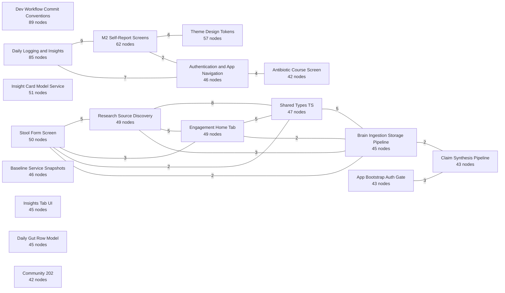

# Semantic graph — generated human view

> **GENERATED FILE — do not hand-edit.** Run `npm run graph:view:write` after Graphify updates.
> The machine graph is a rebuildable semantic projection; curated architecture and contracts remain truth.

This is the repository’s single tracked human-readable view of `graphify-out/graph.json`. It compresses
the graph into communities, cross-community connections, bridge nodes, and hyperedges. It is deliberately
lossy: use `graphify query`, `graphify path`, or `graphify explain` for node-level investigation.

## Snapshot

| Measure | Value |
|---|---:|
| Nodes | 5725 |
| Pair links | 7819 |
| Hyperedges | 47 |
| Communities | 621 |
| Source files represented | 756 |
| Dangling pair-link endpoints | 0 |
| Dangling hyperedge members | 0 |

- Graphify revision stamp: `ec1db8e246f43d414de6a18f0e9efb461124eda6`
- Exact source-file SHA-256: `9046d3fb0b9f4d8116d871095ba4525218935b72e24eec0e525e7e2827368ca6`
- Semantic-content SHA-256 (revision metadata excluded): `65eb4868145412f8b29b4a8e9690474d9e22b459532d25641c2868153631d81a`

## Main community topology

The 18 largest communities are shown. Edge labels are aggregated pair-link counts;
an absent line does not mean two areas have no path through smaller communities.

## Graph composition

### Node types

| Kind | Count | Share |
|---|---:|---:|
| code | 3651 | 63.8% |
| document | 1624 | 28.4% |
| concept | 188 | 3.3% |
| rationale | 148 | 2.6% |
| image | 112 | 2.0% |
| paper | 2 | 0.0% |

### Node origins

| Kind | Count | Share |
|---|---:|---:|
| ast | 5105 | 89.2% |
| unspecified | 620 | 10.8% |

### Pair-link confidence

| Kind | Count | Share |
|---|---:|---:|
| EXTRACTED | 7729 | 98.8% |
| INFERRED | 88 | 1.1% |
| AMBIGUOUS | 2 | 0.0% |

### Most common pair-link relations

| Relation | Links |
|---|---:|
| contains | 3279 |
| imports | 1268 |
| defines | 990 |
| calls | 815 |
| references | 599 |
| imports_from | 281 |
| re_exports | 169 |
| conceptually_related_to | 102 |
| inherits | 82 |
| method | 75 |
| rationale_for | 52 |
| implements | 38 |
| semantically_similar_to | 31 |
| shares_data_with | 16 |
| exports | 13 |
| mixes_in | 4 |
| navigates | 4 |
| extends | 1 |

## Strongest cross-community connections

| Community A | Community B | Pair links |
|---|---|---:|
| `48` Flutter LLDB Helper | `89` Community 101 | 30 |
| `13` Brain Ingestion Storage Pipeline | `25` Brain Ingestion Storage Pipeline | 23 |
| `15` Claim Synthesis Pipeline | `66` Claim Synthesis Pipeline | 22 |
| `48` Flutter LLDB Helper | `59` Community 74 | 18 |
| `30` Architecture Module Dependency Graph | `59` Community 74 | 17 |
| `60` Claim Verification Types | `124` Claim Verification Workflow | 17 |
| `37` Windows Flutter Window C++ | `55` Community 68 | 15 |
| `59` Community 74 | `89` Community 101 | 15 |
| `14` App Bootstrap Auth Gate | `210` App Bootstrap Auth Gate | 14 |
| `48` Flutter LLDB Helper | `107` Community 83 | 14 |
| `7` Engagement Home Tab | `25` Brain Ingestion Storage Pipeline | 13 |
| `96` Windows Win32 Runner | `141` Windows Win32 Runner | 13 |
| `108` iOS/macOS Runner Tests | `124` Claim Verification Workflow | 12 |
| `145` Insight Rules Engine Two-Tier | `621` Run 3 Product Units | 12 |
| `30` Architecture Module Dependency Graph | `48` Flutter LLDB Helper | 11 |
| `37` Windows Flutter Window C++ | `43` Session Isolation Worktrees | 11 |
| `39` Consent Service | `43` Session Isolation Worktrees | 11 |
| `48` Flutter LLDB Helper | `149` Community 124 | 11 |
| `123` Claim Verification Workflow | `124` Claim Verification Workflow | 11 |
| `6` Research Source Discovery | `25` Brain Ingestion Storage Pipeline | 10 |
| `30` Architecture Module Dependency Graph | `89` Community 101 | 10 |
| `43` Session Isolation Worktrees | `55` Community 68 | 10 |
| `109` Claim Verification Types | `124` Claim Verification Workflow | 10 |
| `1` Daily Logging and Insights | `2` M2 Self-Report Screens | 9 |
| `6` Research Source Discovery | `19` Home Navigation Routes | 9 |
| `19` Home Navigation Routes | `25` Brain Ingestion Storage Pipeline | 9 |
| `30` Architecture Module Dependency Graph | `171` Architecture Module Dependency Graph | 9 |
| `48` Flutter LLDB Helper | `173` Community 210 | 9 |
| `69` Windows Win32 Runner | `96` Windows Win32 Runner | 9 |
| `124` Claim Verification Workflow | `167` Community 196 | 9 |
| `1` Daily Logging and Insights | `26` Antibiotic Course Service | 8 |
| `6` Research Source Discovery | `8` Shared Types TS | 8 |
| `8` Shared Types TS | `19` Home Navigation Routes | 8 |
| `14` App Bootstrap Auth Gate | `74` Agent Worktree Setup | 8 |
| `14` App Bootstrap Auth Gate | `122` App Bootstrap Auth Gate | 8 |
| `21` Symptom Flags Screen | `74` Agent Worktree Setup | 8 |
| `60` Claim Verification Types | `109` Claim Verification Types | 8 |
| `66` Claim Synthesis Pipeline | `74` Agent Worktree Setup | 8 |
| `126` Community 142 | `128` Paper Detail Display | 8 |
| `1` Daily Logging and Insights | `9` Authentication and App Navigation | 7 |
| `8` Shared Types TS | `25` Brain Ingestion Storage Pipeline | 7 |
| `9` Authentication and App Navigation | `23` Authentication and App Navigation | 7 |
| `14` App Bootstrap Auth Gate | `89` Community 101 | 7 |
| `15` Claim Synthesis Pipeline | `210` App Bootstrap Auth Gate | 7 |
| `85` Community 85 | `621` Run 3 Product Units | 7 |
| `108` iOS/macOS Runner Tests | `109` Claim Verification Types | 7 |
| `109` Claim Verification Types | `123` Claim Verification Workflow | 7 |
| `128` Paper Detail Display | `131` Paper Detail Display | 7 |
| `2` M2 Self-Report Screens | `3` Theme Design Tokens | 6 |
| `6` Research Source Discovery | `80` Community 87 | 6 |

## Bridge nodes

Bridge nodes touch several communities. They are useful starting points for blast-radius questions,
but high degree can also reflect generic infrastructure or documentation hubs.

| Node | Community | Neighbor communities | Cross links | Source |
|---|---|---:|---:|---|
| package:supabase_flutter/supabase_flutter.dart | `41` Supabase Package | 19 | 20 | `no source` |
| run.ts | `25` Brain Ingestion Storage Pipeline | 18 | 78 | `tools/brain-ingest/src/run.ts` |
| package:flutter/material.dart | `9` Authentication and App Navigation | 16 | 18 | `no source` |
| cli.ts | `74` Agent Worktree Setup | 15 | 36 | `tools/brain-ingest/src/cli.ts` |
| index.ts | `89` Community 101 | 14 | 66 | `tools/llm-router/src/index.ts` |
| SourceName | `19` Home Navigation Routes | 13 | 27 | `tools/brain-ingest/src/types.ts` |
| SourceCtx | `6` Research Source Discovery | 13 | 24 | `tools/brain-ingest/src/types.ts` |
| List | `142` Linux GTK Runner | 13 | 14 | `no source` |
| insight_provenance_screen.dart | `2` M2 Self-Report Screens | 11 | 28 | `apps/biotope/lib/modules/m5b_insight_engine/ui/screens/insight_provenance_screen.dart` |
| home_tab.dart | `26` Antibiotic Course Service | 11 | 22 | `apps/biotope/lib/modules/m1_core/ui/screens/home_tab.dart` |
| Config | `13` Brain Ingestion Storage Pipeline | 11 | 14 | `tools/brain-ingest/src/types.ts` |
| verifier.ts | `124` Claim Verification Workflow | 10 | 54 | `tools/brain-ingest/src/verify/verifier.ts` |
| index.ts | `15` Claim Synthesis Pipeline | 10 | 30 | `tools/brain-ingest/src/synth/index.ts` |
| PaperRecord | `53` User Consent and Metrics Models | 10 | 21 | `tools/brain-ingest/src/types.ts` |
| daily_log_screen.dart | `1` Daily Logging and Insights | 10 | 17 | `apps/biotope/lib/modules/m2_self_report/ui/screens/daily_log_screen.dart` |
| FetchOptions | `6` Research Source Discovery | 10 | 16 | `tools/brain-ingest/src/types.ts` |
| ../../../../core/theme.dart | `23` Authentication and App Navigation | 10 | 12 | `no source` |
| LlmRouter | `370` Community 461 | 10 | 12 | `tools/llm-router/src/router.ts` |
| package:google_fonts/google_fonts.dart | `9` Authentication and App Navigation | 10 | 12 | `no source` |
| package:flutter_test/flutter_test.dart | `64` Community 73 | 9 | 16 | `no source` |
| loadConfig() | `59` Community 74 | 9 | 14 | `tools/llm-router/src/config.ts` |
| insights_tab.dart | `24` Wearable Sync Service | 9 | 12 | `apps/biotope/lib/modules/m5b_insight_engine/ui/screens/insights_tab.dart` |
| router.ts | `48` Flutter LLDB Helper | 8 | 28 | `tools/llm-router/src/router.ts` |
| verify.test.ts | `123` Claim Verification Workflow | 8 | 24 | `tools/brain-ingest/tests/verify.test.ts` |
| retrieval.ts | `108` iOS/macOS Runner Tests | 8 | 17 | `tools/brain-ingest/src/verify/retrieval.ts` |
| types.ts | `8` Shared Types TS | 8 | 16 | `tools/brain-ingest/src/types.ts` |
| Seed | `122` App Bootstrap Auth Gate | 8 | 15 | `tools/brain-ingest/src/types.ts` |
| SynthClaim | `60` Claim Verification Types | 8 | 15 | `tools/brain-ingest/src/synth/types.ts` |
| LlmResponse | `89` Community 101 | 8 | 12 | `tools/llm-router/src/types.ts` |
| Candidate | `6` Research Source Discovery | 8 | 11 | `tools/brain-ingest/src/types.ts` |
| LlmRequest | `89` Community 101 | 8 | 10 | `tools/llm-router/src/types.ts` |
| SupabaseClient | `41` Supabase Package | 8 | 8 | `no source` |
| types.ts | `109` Claim Verification Types | 7 | 17 | `tools/brain-ingest/src/verify/types.ts` |
| retrieveRecord() | `13` Brain Ingestion Storage Pipeline | 7 | 10 | `tools/brain-ingest/src/run.ts` |
| createServerSupabaseClient() | `76` Community 128 | 7 | 9 | `apps/nao/src/lib/supabase-server.ts` |
| Identifiers | `8` Shared Types TS | 7 | 9 | `tools/brain-ingest/src/types.ts` |
| State | `90` Antibiotic Course Screen | 7 | 9 | `no source` |
| StatefulWidget | `90` Antibiotic Course Screen | 7 | 9 | `no source` |
| RouterConfig | `48` Flutter LLDB Helper | 7 | 7 | `tools/llm-router/src/config.ts` |
| static const | `81` Community 88 | 7 | 7 | `no source` |
| index.ts | `43` Session Isolation Worktrees | 6 | 36 | `supabase/functions/generate-insights/index.ts` |
| config.ts | `59` Community 74 | 6 | 17 | `tools/llm-router/src/config.ts` |
| budget.ts | `48` Flutter LLDB Helper | 6 | 16 | `tools/llm-router/src/budget.ts` |
| d1.ts | `70` Community 78 | 6 | 9 | `apps/nao/src/lib/d1.ts` |
| metric_trend_section.dart | `27` Linux GTK Runner | 6 | 9 | `apps/biotope/lib/modules/m5a_baselines/ui/widgets/metric_trend_section.dart` |
| stool_form_screen.dart | `16` Antibiotic Course Screen | 6 | 9 | `apps/biotope/lib/modules/m2_self_report/ui/screens/stool_form_screen.dart` |
| europepmc.ts | `80` Community 87 | 6 | 8 | `tools/brain-ingest/src/sources/discovery/europepmc.ts` |
| pubmed.ts | `33` iOS/macOS Runner Tests | 6 | 8 | `tools/brain-ingest/src/sources/discovery/pubmed.ts` |
| identity.ts | `7` Engagement Home Tab | 6 | 7 | `tools/brain-ingest/src/identity.ts` |
| R2Store | `13` Brain Ingestion Storage Pipeline | 6 | 7 | `tools/brain-ingest/src/storage/r2.ts` |

## Hyperedges

Hyperedges express one relationship spanning three or more nodes. A non-zero missing-member count is
an integrity defect in the machine graph and should be resolved before treating that hyperedge as usable.

| Hyperedge | Relation | Members | Missing | Confidence | Source |
|---|---|---:|---:|---|---|
| Anomaly and personal-signal detectors | participate_in | 8 | 0 | EXTRACTED | `docs/development/decisions/0002-anomaly-definition.md` |
| Resumable Multi-Unit Run Governance | participate_in | 7 | 0 | EXTRACTED | `.claude/skills/orchestrate-build-run/SKILL.md` |
| Run 3 Security Data and Scientific Semantics Tranche | participate_in | 7 | 0 | EXTRACTED | `docs/archive/runs/run3/pending-build-register.md` |
| Citation reference graph pipeline | participate_in | 6 | 0 | EXTRACTED | `docs/development/decisions/0001-citation-extraction.md` |
| Graphify Adoption History | participate_in | 6 | 0 | EXTRACTED | `docs/sessions/20260617T041218Z-uandiqueue-claude-graphify-adoption.md` |
| Run 3 Locked Remediation Units | form | 6 | 0 | EXTRACTED | `docs/archive/runs/run3/README.md` |
| Brain-to-card Pipeline Slice | participate_in | 5 | 0 | EXTRACTED | `docs/sessions/20260716T050639Z-agentjwork-claude-s7-composer-s8-cards.md` |
| Graph build and human-view refresh flow | participate_in | 5 | 0 | INFERRED | `docs/graph/README.md` |
| Graph-view renderer verification suite | implement | 5 | 0 | EXTRACTED | `tools/graph-view/tests/render_graph_view.test.mjs` |
| Graphify Knowledge Graph Workflow | form | 5 | 0 | EXTRACTED | `.claude/skills/graphify/SKILL.md` |
| Isolated Model-Training Workstreams | participate_in | 5 | 0 | EXTRACTED | `docs/development/model-training/README.md` |
| Localized Low-Friction Capture | participate_in | 5 | 0 | EXTRACTED | `docs/implemented/biotope/metrics-catalog.md` |
| M2 Self-Report Logging Contract | form | 5 | 0 | EXTRACTED | `apps/biotope/lib/modules/m2_self_report/m2-context.md` |
| Manual Collection Tiers | form | 5 | 0 | EXTRACTED | `docs/implemented/biotope/metrics-catalog.md` |
| Ourobion Master Identity System | form | 5 | 0 | EXTRACTED | `assets/ourobion-brand/DESIGN.md` |
| Phase 2 Audit Fix Units | participate_in | 5 | 0 | EXTRACTED | `docs/sessions/20260718T051721Z-agentjwork-claude-u25-db-constraint-hygiene.md` |
| Run 2 early pipeline units | conceptually_related_to | 5 | 0 | INFERRED | `docs/sessions/20260724T083316Z-agentjwork-claude-run2-u4-card-semantics.md` |
| Run 3 Client Trust Tranche | participate_in | 5 | 0 | EXTRACTED | `docs/archive/runs/run3/pending-build-register.md` |
| Sustainable Trend Discovery | form | 5 | 0 | EXTRACTED | `docs/implemented/biotope/metrics-catalog.md` |
| Transparent Decorative Cutouts | participate_in | 5 | 0 | EXTRACTED | `assets/ui-generation/biomech-botanical/prompts/deco_flower_cluster_blush.md` |
| Accepted Empty-State Asset Family | participate_in | 4 | 0 | EXTRACTED | `assets/ui-generation/biomech-botanical/reviews/empty_scan_bloom.md` |
| Decorative Review Family | participate_in | 4 | 0 | EXTRACTED | `assets/ui-generation/biomech-botanical/reviews/deco_flower_cluster_blush.md` |
| Deterministic Insight-Engine Foundation | form | 4 | 0 | EXTRACTED | `docs/sessions/20260716T024359Z-agentjwork-claude-s4-signals-s5-evaluator.md` |
| Documentation Routing and Authority | form | 4 | 0 | EXTRACTED | `docs/INDEX.md` |
| Enforced Cross-Language Safety | form | 4 | 0 | EXTRACTED | `docs/graph/couplings.yaml` |
| Generated Asset Quality System | participate_in | 4 | 0 | EXTRACTED | `assets/ui-generation/biomech-botanical/README.md` |
| Ingestion Identity and Retrieval Flow | participate_in | 4 | 0 | EXTRACTED | `docs/implemented/nao/brain-ingestion-design.md` |
| Insight engine deterministic serve flow | participate_in | 4 | 0 | EXTRACTED | `docs/implemented/insight-engine-architecture.md` |
| Metric Platform Foundation History | participate_in | 4 | 0 | INFERRED | `docs/sessions/20260622T021945Z-uandiqueue-claude-w0-metric-platform-foundation.md` |
| One-Card Proof and CI Backstop | form | 4 | 0 | INFERRED | `docs/sessions/20260716T061453Z-agentjwork-claude-ci-node-tool-suites.md` |
| Phase 2 Workflow Evolution | participate_in | 4 | 0 | EXTRACTED | `docs/sessions/20260610T042206Z-uandiqueue-claude-consolidate-onto-dev-phase2.md` |
| Porcelain Archive Asset Family | form | 4 | 0 | EXTRACTED | `assets/ui-generation/biomech-botanical/prompts/archive_report_thumbnail_base.md` |
| Run 2 demo curation features | conceptually_related_to | 4 | 0 | EXTRACTED | `docs/sessions/20260724T165648Z-agentjwork-claude-run2-u12-demo-dryrun.md` |
| Run-3 Documentation Reconciliation | participate_in | 4 | 0 | EXTRACTED | `docs/development/documentation-freshness-audit-2026-07-26.md` |
| Scan Asset Family | participate_in | 4 | 0 | EXTRACTED | `assets/ui-generation/biomech-botanical/prompts/scan_biomech_orchid.md` |
| U6 Simulated Data Loading Flow | participate_in | 4 | 0 | EXTRACTED | `docs/sessions/20260724T094500Z-agentjwork-claude-run2-u6-nao-data-loader.md` |
| U8 Model Configuration Boundary | participate_in | 4 | 0 | EXTRACTED | `docs/sessions/20260724T121500Z-agentjwork-claude-run2-u8-model-config-spend.md` |
| Accepted Insights Asset Family | participate_in | 3 | 0 | EXTRACTED | `assets/ui-generation/biomech-botanical/reviews/insights_neural_botanical_cluster.md` |
| Agent Guidance Graphify Navigation | participate_in | 3 | 0 | INFERRED | `CLAUDE.md` |
| Brain Verification Support | participate_in | 3 | 0 | INFERRED | `docs/sessions/20260715T143750Z-agentjwork-claude-brain-llm-router.md` |
| Insight engine authoring loop | participate_in | 3 | 0 | EXTRACTED | `docs/implemented/insight-engine-architecture.md` |
| Phase 2 Demo Analysis Flow | participate_in | 3 | 0 | INFERRED | `docs/development/phase2-demo-runbook.md` |
| Profile Asset Family | participate_in | 3 | 0 | EXTRACTED | `assets/ui-generation/biomech-botanical/prompts/profile_botanical_crest.md` |
| Semantic Graph Quality Gaps | participate_in | 3 | 0 | EXTRACTED | `docs/archive/runs/run3/pending-build-register.md` |
| Shared Contract Projection Pattern | participate_in | 3 | 0 | INFERRED | `shared/brain/README.md` |
| Shared engineering delivery guidance | conceptually_related_to | 3 | 0 | INFERRED | `docs/development/dev-workflow.md` |
| U5 Pipeline and Baseline Lifecycle | participate_in | 3 | 0 | EXTRACTED | `docs/sessions/20260724T090500Z-agentjwork-claude-run2-u5-trigger-provenance-prune.md` |

<strong>Complete community directory (621)</strong>

Communities are ordered by node count. “Cross links” counts incidences, so each connection contributes
once to each endpoint community.

| ID | Community | Nodes | Internal links | Cross links | Inferred incidences | Key nodes | Representative sources |
|---:|---|---:|---:|---:|---:|---|---|
| 0 | Dev Workflow Commit Conventions | 89 | 88 | 1 | 0 | index.dart · activeTitle · BaselineSnapshot · body | `shared/types/index.dart` |
| 1 | Daily Logging and Insights | 85 | 93 | 42 | 0 | daily_log_screen.dart · StatelessWidget · _ActiveCourseCard · _CardHeader | `apps/biotope/lib/modules/m2_self_report/ui/screens/daily_log_screen.dart` `apps/biotope/lib/modules/m5b_insight_engine/ui/screens/insight_provenance_screen.dart` `apps/biotope/lib/modules/m1_core/ui/screens/home_tab.dart` |
| 2 | M2 Self-Report Screens | 62 | 61 | 28 | 0 | insight_provenance_screen.dart · _body · _centeredNote · _dateOnly | `apps/biotope/lib/modules/m5b_insight_engine/ui/screens/insight_provenance_screen.dart` |
| 3 | Theme Design Tokens | 57 | 56 | 12 | 0 | provenance_models.dart · ProvenanceCardInfo · ProvenanceCitation · ProvenanceCompleteness | `apps/biotope/lib/modules/m5b_insight_engine/impl/provenance_models.dart` |
| 4 | Insight Card Model Service | 51 | 79 | 0 | 3 | win32_window.cpp · Create() · MessageHandler() · WndProc() | `apps/biotope/windows/runner/win32_window.cpp` `apps/biotope/windows/runner/flutter_window.cpp` `apps/biotope/windows/flutter/generated_plugin_registrant.cc` |
| 5 | Stool Form Screen | 50 | 97 | 22 | 0 | core.retrieval.test.ts · capture.ts · core.ts · capture.test.ts | `tools/brain-ingest/src/retrieval/capture.ts` `tools/brain-ingest/src/retrieval/core.ts` `tools/brain-ingest/tests/core.retrieval.test.ts` |
| 6 | Research Source Discovery | 49 | 80 | 78 | 0 | SourceCtx · FetchOptions · arxiv.test.ts · arxiv.ts | `tools/brain-ingest/src/sources/discovery/arxiv.ts` `tools/brain-ingest/src/sources/discovery/s2.ts` `tools/brain-ingest/tests/arxiv.test.ts` |
| 7 | Engagement Home Tab | 49 | 93 | 39 | 0 | identity.ts · idconv.ts · normalizeIdentifiers() · idconv.test.ts | `tools/brain-ingest/src/identity.ts` `tools/brain-ingest/src/sources/idconv.ts` `tools/brain-ingest/tests/idconv.test.ts` |
| 8 | Shared Types TS | 47 | 83 | 53 | 0 | openalex.ts · types.ts · openalex.test.ts · unpaywall.ts | `tools/brain-ingest/src/sources/oa/openalex.ts` `tools/brain-ingest/src/sources/oa/unpaywall.ts` `tools/brain-ingest/src/types.ts` |
| 9 | Authentication and App Navigation | 46 | 50 | 52 | 0 | antibiotic_course_screen.dart · package:flutter/material.dart · app_shell.dart · package:google_fonts/google_fonts.dart | `apps/biotope/lib/modules/m2_self_report/ui/screens/antibiotic_course_screen.dart` `apps/biotope/lib/modules/m1_core/ui/screens/app_shell.dart` `apps/biotope/lib/modules/m1_core/ui/screens/home_screen.dart` |
| 10 | Baseline Service Snapshots | 46 | 49 | 0 | 1 | Ourobion — Brand Assets · Ourobion — Brand & Logo Design Principles · Ourobion Biotope — Logo & Design Notes · Ourobion Master Identity | `assets/ourobion-brand/DESIGN.md` `assets/ourobion-biotope-logo/DESIGN.md` `assets/ourobion-brand/README.md` |
| 11 | Insights Tab UI | 45 | 79 | 1 | 0 | simulatedHealth.ts · route.ts · LoaderPanel.tsx · simulatedHealth.test.ts | `apps/nao/src/lib/simulatedHealth.ts` `apps/nao/src/components/LoaderPanel.tsx` `apps/nao/src/app/(app)/api/loader/route.ts` |
| 12 | Daily Gut Row Model | 45 | 44 | 0 | 0 | Session 20260719T154600Z — agentjwork — claude — research-fixes-lag2 · Session 20260719T151130Z — agentjwork — claude — research-fixes-c5-cu… · Session 20260719T152353Z — agentjwork — claude — research-fixes-edge-… · Left (worklist, resume at F6) | `docs/sessions/20260719T154600Z-agentjwork-claude-research-fixes-lag2.md` `docs/sessions/20260719T144911Z-agentjwork-claude-research-fixes-run-setup.md` `docs/sessions/20260719T151130Z-agentjwork-claude-research-fixes-c5-cutoff.md` |
| 13 | Brain Ingestion Storage Pipeline | 45 | 86 | 64 | 0 | r2.ts · Config · run.test.ts · R2Store | `tools/brain-ingest/src/storage/r2.ts` `tools/brain-ingest/tests/r2.test.ts` `tools/brain-ingest/tests/run.test.ts` |
| 14 | App Bootstrap Auth Gate | 43 | 112 | 46 | 0 | index.ts · seeder.test.ts · artifact.ts · candidates.ts | `tools/brain-ingest/src/seeder/types.ts` `tools/brain-ingest/tests/seeder.test.ts` `tools/brain-ingest/src/seeder/artifact.ts` |
| 15 | Claim Synthesis Pipeline | 43 | 80 | 61 | 0 | index.ts · types.ts · postprocess.ts · passages.ts | `tools/brain-ingest/src/synth/types.ts` `tools/brain-ingest/src/synth/passages.ts` `tools/brain-ingest/src/synth/index.ts` |
| 16 | Antibiotic Course Screen | 42 | 43 | 20 | 0 | stool_form_screen.dart · urine_color_screen.dart · AnimationController · Animation | `apps/biotope/lib/modules/m2_self_report/ui/screens/stool_form_screen.dart` `apps/biotope/lib/modules/m2_self_report/ui/screens/urine_color_screen.dart` |
| 17 | Community 202 | 42 | 47 | 0 | 0 | Graphify Knowledge Graph Pipeline · Graphify Incremental Update · Graphify Query Path and Explain Flow · Semantic Extraction Contract | `.claude/skills/graphify/SKILL.md` `.claude/skills/graphify/references/extraction-spec.md` `.claude/skills/graphify/references/query.md` |
| 18 | Context-Sync Enforcer | 42 | 41 | 6 | 0 | insight_service.dart · InsightService · _client · _parseCategory | `apps/biotope/lib/modules/m5b_insight_engine/impl/insight_service.dart` |
| 19 | Home Navigation Routes | 41 | 78 | 48 | 0 | SourceName · unpaywall.test.ts · budget.ts · FileBudgetGuard | `tools/brain-ingest/src/limits/budget.ts` `tools/brain-ingest/tests/unpaywall.test.ts` `tools/brain-ingest/tests/budget.test.ts` |
| 20 | Sign-In Sign-Up Screens | 39 | 38 | 3 | 0 | guard_support.dart · activeKeysFor · allMatches · baselineApplicable | `apps/biotope/test/guards/guard_support.dart` |
| 21 | Symptom Flags Screen | 39 | 77 | 8 | 0 | venue.test.ts · banding.ts · cache.ts · openalexSources.ts | `tools/brain-ingest/src/venue/cache.ts` `tools/brain-ingest/src/venue/openalexSources.ts` `tools/brain-ingest/src/venue/banding.ts` |
| 22 | Home Tab Widgets | 39 | 99 | 0 | 0 | context_sync.mjs · read() · runCheck() · isFile() | `tools/context_sync.mjs` |
| 23 | Authentication and App Navigation | 38 | 41 | 27 | 0 | sign_up_screen.dart · sign_in_screen.dart · ../../../../core/theme.dart · MaterialPageRoute | `apps/biotope/lib/modules/m1_core/ui/screens/sign_up_screen.dart` `apps/biotope/lib/modules/m1_core/ui/screens/sign_in_screen.dart` `apps/biotope/lib/modules/m1_core/ui/screens/home_screen.dart` |
| 24 | Wearable Sync Service | 38 | 38 | 18 | 0 | insights_tab.dart · _ResearchBasis · _ResearchBasisState · _EmptyState | `apps/biotope/lib/modules/m5b_insight_engine/ui/screens/insights_tab.dart` |
| 25 | Brain Ingestion Storage Pipeline | 38 | 65 | 110 | 2 | run.ts · run() · rateLimiter.ts · memoryGuard.ts | `tools/brain-ingest/src/run.ts` `tools/brain-ingest/src/limits/memoryGuard.ts` `tools/brain-ingest/src/limits/rateLimiter.ts` |
| 26 | Antibiotic Course Service | 37 | 37 | 29 | 0 | home_tab.dart · ../../impl/auth_service.dart · ../../impl/profile_service.dart · index.dart | `apps/biotope/lib/modules/m1_core/ui/screens/home_tab.dart` `apps/biotope/lib/modules/m1_core/index.dart` |
| 27 | Linux GTK Runner | 36 | 36 | 17 | 0 | metric_trend_section.dart · MetricTrendSectionState · ../../index.dart · MetricTrendSection | `apps/biotope/lib/modules/m5a_baselines/ui/widgets/metric_trend_section.dart` |
| 28 | Auth Service | 35 | 34 | 1 | 0 | registry.dart · availability · baselineApplicable · continuity | `shared/metrics/registry.dart` |
| 29 | Consent Screen Records | 34 | 33 | 0 | 0 | devDependencies · scripts · dependencies · package.json | `apps/nao/package.json` |
| 30 | Architecture Module Dependency Graph | 33 | 55 | 55 | 0 | apiWorker.test.ts · errors.ts · router.test.ts · budget.test.ts | `tools/llm-router/src/errors.ts` `tools/llm-router/tests/apiWorker.test.ts` `tools/llm-router/tests/helpers.ts` |
| 31 | Community 198 | 32 | 35 | 0 | 6 | Ourobion biotope Flutter App · DailyGutRow Raw Data Asset · M2 Self-Report Logging Module · biotope Package Manifest | `apps/biotope/README.md` `apps/biotope/lib/modules/m2_self_report/m2-context.md` `apps/biotope/lib/modules/m1_core/m1-context.md` |
| 32 | Baselines Compute TS | 31 | 30 | 3 | 0 | theme.dart · base · copyWith · manrope | `apps/biotope/lib/core/theme.dart` |
| 33 | iOS/macOS Runner Tests | 31 | 48 | 19 | 0 | pubmed.ts · pubmed.test.ts · articleToCandidate() · discover() | `tools/brain-ingest/src/sources/discovery/pubmed.ts` `tools/brain-ingest/tests/pubmed.test.ts` |
| 34 | Project Toolchain CI | 29 | 47 | 4 | 0 | claimsControl.ts · ClaimsPanel.tsx · claimsControl.test.ts · route.ts | `apps/nao/src/lib/claimsControl.ts` `apps/nao/src/components/ClaimsPanel.tsx` `apps/nao/src/app/(app)/api/claims/reject/route.ts` |
| 35 | render graph view mjs | 29 | 42 | 0 | 1 | renderGraphView() · generate_graph_view.mjs · render_graph_view.mjs · Graph-view generation entrypoint | `tools/graph-view/generate_graph_view.mjs` `tools/graph-view/lib/render_graph_view.mjs` `tools/graph-view/tests/render_graph_view.test.mjs` |
| 36 | Web App Manifest | 28 | 27 | 1 | 0 | generated_assets.dart · _base · archiveHerbariumSpecimen · archivePreservedFlowerFragment | `apps/biotope/lib/core/generated_assets.dart` |
| 37 | Windows Flutter Window C++ | 28 | 39 | 26 | 0 | composer.ts · engine_orientation_gap.test.ts · classifyPattern() · CandidatePattern | `supabase/functions/generate-insights/composer.ts` `tools/rules/tests/engine_orientation_gap.test.ts` `supabase/functions/generate-insights/render.ts` |
| 38 | Stool Form Screen State | 28 | 62 | 18 | 0 | types.ts · ingestControl.ts · route.ts · route.ts | `apps/nao/src/lib/types.ts` `apps/nao/src/lib/ingestControl.ts` `apps/nao/src/app/(app)/api/ingest-control/route.ts` |
| 39 | Consent Service | 27 | 48 | 13 | 0 | evaluators.ts · engine_condition_coverage.test.ts · windowedBaseline() · evaluateCoincidence() | `supabase/functions/generate-insights/evaluators.ts` `tools/rules/tests/engine_condition_coverage.test.ts` |
| 40 | Parity Schema Tests | 27 | 26 | 0 | 0 | What Phase 2 contains (by workstream) · Phase 2 plan · The metric platform (the floor everything else stands on) · Tracks, dependencies & sequencing | `docs/development/phase-2-plan.md` |
| 41 | Supabase Package | 26 | 28 | 30 | 0 | package:supabase_flutter/supabase_flutter.dart · SupabaseClient · mosquito_logging.dart · metric_series_service.dart | `apps/biotope/lib/modules/m2_self_report/impl/behaviour/mosquito_logging.dart` `apps/biotope/lib/modules/m1_core/impl/profile_service.dart` `apps/biotope/lib/modules/m5a_baselines/impl/metric_series_service.dart` |
| 42 | Graphify Extraction Spec | 26 | 51 | 1 | 0 | modelsControl.ts · ModelsPanel.tsx · modelsControl.test.ts · ModelsPanel() | `apps/nao/src/lib/modelsControl.ts` `apps/nao/src/components/ModelsPanel.tsx` `apps/nao/src/app/(app)/api/models/caps/route.ts` |
| 43 | Session Isolation Worktrees | 26 | 27 | 38 | 0 | index.ts · Branch · GapStatus · GapEventRow | `supabase/functions/generate-insights/index.ts` `supabase/functions/generate-insights/composer.ts` |
| 44 | Profile Service | 25 | 30 | 0 | 2 | my_application.cc · _MyApplication · GApplication · my_application_local_command_line() | `apps/biotope/linux/runner/my_application.cc` `apps/biotope/linux/flutter/generated_plugin_registrant.cc` `apps/biotope/linux/runner/main.cc` |
| 45 | Auth Result Model | 25 | 29 | 6 | 0 | index.ts · relationships.ts · EdgeVerification · Citation | `shared/brain/relationships.ts` `shared/brain/index.ts` |
| 46 | Urine Color Screen | 25 | 24 | 0 | 0 | The Brain — Ingestion (paper corpus) Design · 10 · Build sequence · 2 · The source-API catalog · 5 · Tooling — fetch, capture, extract (TypeScript, no Python) | `docs/implemented/nao/brain-ingestion-design.md` |
| 47 | Copy Guidelines Enforcement | 25 | 36 | 14 | 0 | pmcJats.ts · pmcJats.test.ts · retrieveJats() · parseJats() | `tools/brain-ingest/src/retrieval/pmcJats.ts` `tools/brain-ingest/tests/pmcJats.test.ts` |
| 48 | Flutter LLDB Helper | 25 | 61 | 102 | 0 | router.ts · budget.ts · types.ts · LlmNodeId | `tools/llm-router/src/budget.ts` `tools/llm-router/src/router.ts` `tools/llm-router/src/types.ts` |
| 49 | Community 310 | 24 | 27 | 0 | 5 | Semantic context graph · Graphify operational policy · Curated coupling guards · Deferred structural import graph | `docs/graph/README.md` `docs/memory/0008-graphify-context-tool.md` `shared/brain/README.md` |
| 50 | Setup Script | 24 | 23 | 6 | 0 | main.dart · AuthGate · OurobionApp · _checkOnboarding | `apps/biotope/lib/main.dart` |
| 51 | Claude Settings Hooks | 24 | 23 | 0 | 0 | What You Must Do When Invoked · /graphify · Step 3 - Extract entities and relationships · For --update and --cluster-only | `.claude/skills/graphify/SKILL.md` |
| 52 | iOS Scene Delegate | 24 | 23 | 7 | 0 | engagement_service.dart · _client · _computeStreak · _dateStr | `apps/biotope/lib/modules/m6_engagement/impl/engagement_service.dart` |
| 53 | User Consent and Metrics Models | 24 | 53 | 29 | 0 | PaperRecord · Manifest · manifest.ts · manifest.test.ts | `tools/brain-ingest/src/manifest.ts` `tools/brain-ingest/tests/manifest.test.ts` `tools/brain-ingest/src/types.ts` |
| 54 | Community 67 | 23 | 22 | 13 | 0 | living_backdrop.dart · Color · CustomPainter · _OrbPainter | `apps/biotope/lib/modules/m1_core/ui/widgets/living_backdrop.dart` `apps/biotope/lib/modules/m2_self_report/ui/screens/stool_form_screen.dart` `apps/biotope/lib/modules/m5a_baselines/ui/widgets/metric_trend_section.dart` |
| 55 | Community 68 | 23 | 31 | 29 | 0 | engine_composer_render.test.ts · render.ts · renderCard() · ServableEdge | `supabase/functions/generate-insights/render.ts` `tools/rules/tests/engine_composer_render.test.ts` `supabase/functions/generate-insights/composer.ts` |
| 56 | Community 69 | 23 | 22 | 5 | 0 | baseline_service.dart · _client · _parseConfidence · _parseTrend | `apps/biotope/lib/modules/m5a_baselines/impl/baseline_service.dart` |
| 57 | Community 70 | 23 | 22 | 0 | 0 | compilerOptions · tsconfig.json · paths · @/* | `apps/nao/tsconfig.json` |
| 58 | Community 99 | 23 | 22 | 0 | 0 | scripts · package.json · devDependencies · context:check | `package.json` |
| 59 | Community 74 | 23 | 36 | 71 | 3 | config.ts · loadConfig() · testMode.test.ts · validateConfig() | `tools/llm-router/src/config.ts` `tools/llm-router/tests/testMode.test.ts` `tools/llm-router/src/types.ts` |
| 60 | Claim Verification Types | 23 | 38 | 47 | 0 | enforce.ts · SynthClaim · enforceVerification() · RetrievalResult | `tools/brain-ingest/src/verify/enforce.ts` `tools/brain-ingest/src/verify/types.ts` `tools/brain-ingest/src/synth/types.ts` |
| 61 | Community 77 | 22 | 29 | 11 | 0 | IngestControlPanel.tsx · SeedsPanel.tsx · GapsAndSeeds.tsx · GapsPanel.tsx | `apps/nao/src/components/GapsPanel.tsx` `apps/nao/src/components/SeedsPanel.tsx` `apps/nao/src/components/IngestControlPanel.tsx` |
| 62 | macOS App Delegate | 22 | 36 | 1 | 0 | index.ts · buildSnapshots() · lifecycle.ts · s3_baseline_lifecycle.test.ts | `supabase/functions/compute-baselines/index.ts` `supabase/functions/compute-baselines/lifecycle.ts` `tools/engine-stats/tests/s3_baseline_lifecycle.test.ts` |
| 63 | Community 72 | 22 | 21 | 0 | 0 | package.json · scripts · dependencies · devDependencies | `tools/edge-loader/package.json` |
| 64 | Community 73 | 22 | 29 | 18 | 0 | package:flutter_test/flutter_test.dart · guard_support.dart · copy_guidelines_parity_test.dart · daily_gut_row_schema_test.dart | `apps/biotope/test/guards/copy_guidelines_parity_test.dart` `apps/biotope/test/guards/daily_gut_row_schema_test.dart` `apps/biotope/test/guards/metrics_registry_baselines_test.dart` |
| 65 | macOS App Delegate | 22 | 22 | 4 | 0 | registry.ts · index.ts · METRICS · byKey() | `shared/metrics/registry.ts` `shared/metrics/index.ts` |
| 66 | Claim Synthesis Pipeline | 22 | 38 | 44 | 1 | synth.test.ts · synthesize() · artifact.ts · appendClaimsToDir() | `tools/brain-ingest/src/synth/artifact.ts` `tools/brain-ingest/tests/synth.test.ts` `tools/brain-ingest/src/synth/index.ts` |
| 67 | Community 75 | 22 | 34 | 17 | 0 | quoteCheck.ts · quoteCheck.test.ts · checkClaimQuotes() · normalizeForMatch() | `tools/brain-ingest/src/verify/quoteCheck.ts` `tools/brain-ingest/tests/quoteCheck.test.ts` |
| 68 | Community 76 | 21 | 20 | 0 | 0 | package.json · dependencies · devDependencies · scripts | `tools/brain-ingest/package.json` |
| 69 | Windows Win32 Runner | 21 | 24 | 22 | 0 | index.ts · config.ts · SIGNAL_CONFIG · PAIR_CONFIG | `supabase/functions/evaluate-signals/index.ts` `supabase/functions/evaluate-signals/config.ts` `supabase/functions/evaluate-signals/stats.ts` |
| 70 | Community 78 | 21 | 36 | 22 | 0 | d1.ts · searchPapers() · facetCounts · corpusStats | `apps/nao/src/lib/d1.ts` `apps/nao/src/lib/types.ts` |
| 71 | Community 79 | 21 | 20 | 0 | 0 | package.json · scripts · devDependencies · allowScripts | `tools/metric-view/package.json` |
| 72 | Community 80 | 21 | 35 | 19 | 0 | europepmcFulltext.test.ts · europepmcFulltext.ts · fetchEuropePmcJats() · jatsToText() | `tools/brain-ingest/src/retrieval/europepmcFulltext.ts` `tools/brain-ingest/tests/europepmcFulltext.test.ts` |
| 73 | Community 81 | 21 | 20 | 0 | 0 | package.json · scripts · dependencies · devDependencies | `tools/rules/package.json` |
| 74 | Agent Worktree Setup | 21 | 37 | 67 | 5 | cli.ts · main() · runVerify() · runSeedQueries() | `tools/brain-ingest/src/cli.ts` `tools/brain-ingest/src/config.ts` `tools/brain-ingest/src/seeder/dbSeeds.ts` |
| 75 | Community 84 | 20 | 21 | 0 | 0 | AppDelegate · .application() · AppDelegate · .applicationShouldTerminateAfterLastWindowClosed() | `apps/biotope/ios/Runner/AppDelegate.swift` `apps/biotope/macos/Runner/AppDelegate.swift` |
| 76 | Community 128 | 20 | 28 | 10 | 0 | createServerSupabaseClient() · layout.tsx · page.tsx · supabase.ts | `apps/nao/src/app/(app)/api/models/route.ts` `apps/nao/src/app/login/page.tsx` `apps/nao/src/components/SubNav.tsx` |
| 77 | Authentication and App Navigation | 20 | 20 | 7 | 0 | profile_setup_screen.dart · _ProfileSetupScreenState · FormState · ProfileSetupScreen | `apps/biotope/lib/modules/m1_core/ui/screens/profile_setup_screen.dart` |
| 78 | Community 85 | 20 | 19 | 3 | 0 | chart_math.dart · bool get · compactValueLabel · dayFraction | `apps/biotope/lib/modules/m5a_baselines/impl/chart_math.dart` |
| 79 | Research Source Discovery | 20 | 35 | 12 | 0 | crossref.test.ts · crossref.ts · toCandidate() · discover() | `tools/brain-ingest/src/sources/discovery/crossref.ts` `tools/brain-ingest/tests/crossref.test.ts` |
| 80 | Community 87 | 20 | 31 | 18 | 0 | europepmc.ts · europepmc.test.ts · mapResult() · toIdentifiers() | `tools/brain-ingest/src/sources/discovery/europepmc.ts` `tools/brain-ingest/tests/europepmc.test.ts` |
| 81 | Community 88 | 20 | 19 | 16 | 0 | wearable_service.dart · static const · double? · _aggregate | `apps/biotope/lib/modules/m3_passive_health/impl/wearable_service.dart` |
| 82 | User Consent and Metrics Models | 20 | 19 | 1 | 0 | metric_series_models.dart · d · date · distinctMetricKeys | `apps/biotope/lib/modules/m5a_baselines/impl/metric_series_models.dart` |
| 83 | Community 92 | 20 | 20 | 20 | 0 | rule.schema.ts · gateTemplate() · templateSyntaxError() · coincidenceConditionSchema | `shared/rules/rule.schema.ts` |
| 84 | Community 94 | 20 | 19 | 0 | 0 | ui-design-context.md — Ourobion · Component Specs · AI-Generated Image Assets · Cards | `docs/implemented/biotope/ui-design-context.md` |
| 86 | Logging and Metric Trends | 19 | 18 | 8 | 0 | logging_controller.dart · int? · _client · DailyLogInput | `apps/biotope/lib/modules/m2_self_report/impl/logging_controller.dart` |
| 87 | Community 97 | 19 | 32 | 8 | 0 | artifacts.mjs · edge_artifacts.test.ts · buildLoad() · parseClaims() | `tools/edge-loader/lib/artifacts.mjs` `tools/edge-loader/tests/edge_artifacts.test.ts` `tools/edge-loader/tests/edge_endpoints_registry.test.ts` |
| 88 | Community 98 | 19 | 28 | 0 | 2 | auth.ts · verifyAccessToken() · middleware.ts · auth.test.ts | `apps/nao/src/lib/auth.ts` `apps/nao/src/middleware.ts` `apps/nao/tests/auth.test.ts` |
| 89 | Community 101 | 19 | 44 | 99 | 0 | index.ts · LlmRequest · LlmResponse · localAgent.ts | `tools/llm-router/src/routes/localAgent.ts` `tools/llm-router/tests/localAgent.test.ts` `tools/llm-router/src/types.ts` |
| 90 | Antibiotic Course Screen | 19 | 28 | 35 | 0 | State · StatefulWidget · HomeTabState · _LivingBackdropState | `apps/biotope/lib/modules/m2_self_report/ui/screens/daily_log_screen.dart` `apps/biotope/lib/modules/m1_core/ui/screens/home_tab.dart` `apps/biotope/lib/modules/m1_core/ui/widgets/living_backdrop.dart` |
| 91 | Community 102 | 19 | 18 | 0 | 0 | Session 20260617T041218Z — uandiqueue — claude — graphify-adoption · 20260610T093356Z-uandiqueue-claude-graphify-dart-probe.md · 20260617T041218Z-uandiqueue-claude-graphify-adoption.md · 20260617T064658Z-uandiqueue-claude-graphify-setup-and-readme.md | `docs/sessions/20260617T041218Z-uandiqueue-claude-graphify-adoption.md` `docs/sessions/20260610T093356Z-uandiqueue-claude-graphify-dart-probe.md` `docs/sessions/20260617T064658Z-uandiqueue-claude-graphify-setup-and-readme.md` |
| 92 | Community 235 | 18 | 17 | 0 | 5 | Insight Engine · Offline authoring and loop pipeline · Composed insights · Brain support models | `docs/implemented/insight-engine-architecture.md` `AGENTS.md` `docs/implemented/biotope/architecture-context.md` |
| 93 | Community 104 | 18 | 17 | 10 | 0 | relationships.schema.ts · citationSchema · claimKindSchema · edgeVerificationSchema | `shared/brain/relationships.schema.ts` |
| 94 | Community 107 | 18 | 17 | 0 | 0 | ADR: Paper-reliability scoring — the evidence-tier ladder and the rel… · Decision · Options considered · 0003-paper-reliability.md | `docs/development/decisions/0003-paper-reliability.md` |
| 95 | Community 108 | 18 | 17 | 0 | 0 | package.json · devDependencies · scripts · allowScripts | `tools/engine-stats/package.json` |
| 96 | Windows Win32 Runner | 18 | 32 | 24 | 0 | stats.ts · s4_signal.test.ts · classifyDaily() · mad() | `supabase/functions/evaluate-signals/stats.ts` `tools/engine-stats/tests/s4_signal.test.ts` |
| 97 | Community 110 | 18 | 17 | 0 | 0 | compilerOptions · tsconfig.json · declaration · esModuleInterop | `tools/llm-router/tsconfig.json` |
| 98 | Insight Rules Engine Two-Tier | 18 | 29 | 26 | 0 | arxivPdf.test.ts · arxivPdf.ts · FullTextInfo · StorageInfo | `tools/brain-ingest/src/retrieval/arxivPdf.ts` `tools/brain-ingest/tests/arxivPdf.test.ts` `tools/brain-ingest/src/types.ts` |
| 99 | User Consent and Metrics Models | 17 | 17 | 6 | 0 | consent_record.dart · DateTime · user_identity.dart · ConsentScope | `apps/biotope/lib/modules/m1_core/models/consent_record.dart` `apps/biotope/lib/modules/m1_core/models/user_identity.dart` |
| 100 | Community 117 | 17 | 30 | 3 | 0 | gapsControl.ts · gapsControl.test.ts · route.ts · shapeGapRows() | `apps/nao/src/lib/gapsControl.ts` `apps/nao/src/app/(app)/api/gaps/route.ts` `apps/nao/tests/gapsControl.test.ts` |
| 101 | Community 118 | 17 | 17 | 7 | 0 | consent_screen.dart · normaliser.dart · _ConsentScreenState · ConsentScreen | `apps/biotope/lib/modules/m1_core/ui/screens/consent_screen.dart` `apps/biotope/lib/modules/m2_self_report/impl/normaliser.dart` |
| 102 | Community 109 | 17 | 31 | 9 | 0 | seedsControl.ts · route.ts · seedsControl.test.ts · INGEST_SEED_TOPICS | `apps/nao/src/lib/seedsControl.ts` `apps/nao/src/app/(app)/api/seeds/route.ts` `apps/nao/tests/seedsControl.test.ts` |
| 103 | Community 119 | 17 | 16 | 0 | 0 | m2-context.md — M2: Self-Report — Gut & Behaviour · Metrics Implemented (Phase 1 Stage 1) · Antibiotic Tracker (event-based, not daily) · Core Logging Flow (~30 seconds) | `apps/biotope/lib/modules/m2_self_report/m2-context.md` |
| 104 | Community 121 | 17 | 27 | 5 | 0 | d1.test.ts · etl.mjs · manifestToSql() · main() | `apps/nao/scripts/etl.mjs` `apps/nao/tests/d1.test.ts` |
| 105 | Community 122 | 17 | 16 | 0 | 0 | Each Step · dev-workflow.md — Ourobion Development Workflow · 1. Issue · 2. Branch + Worktree | `docs/development/dev-workflow.md` |
| 106 | Community 123 | 17 | 16 | 0 | 0 | package.json · dependencies · devDependencies · scripts | `shared/package.json` |
| 107 | Community 83 | 17 | 38 | 29 | 0 | BudgetLedger · .assertCanSpend() · .record() · .wouldExceed() | `tools/llm-router/src/budget.ts` `tools/llm-router/src/overrides.ts` `tools/llm-router/src/types.ts` |
| 108 | iOS/macOS Runner Tests | 17 | 28 | 42 | 0 | retrieval.ts · DiscoverFn · retrieveForClaim() · claimQueryTerms() | `tools/brain-ingest/src/verify/retrieval.ts` `tools/brain-ingest/src/types.ts` |
| 109 | Claim Verification Types | 17 | 21 | 44 | 1 | types.ts · corpus.ts · CorpusDoc · loadCorpusFromFile() | `tools/brain-ingest/src/verify/types.ts` `tools/brain-ingest/src/verify/corpus.ts` `tools/brain-ingest/src/verify/retrieval.ts` |
| 110 | Community 129 | 16 | 15 | 0 | 0 | compilerOptions · tsconfig.json · esModuleInterop · forceConsistentCasingInFileNames | `tools/brain-ingest/tsconfig.json` |
| 111 | Paper Search Filters | 16 | 24 | 12 | 0 | page.tsx · PapersPage() · one() · filtersFrom() | `apps/nao/src/app/(app)/papers/page.tsx` `apps/nao/src/components/SortSelect.tsx` `apps/nao/src/components/SearchBar.tsx` |
| 112 | Community 131 | 16 | 15 | 0 | 0 | Decision 0002: Anomaly & Personal-Signal Definition for the nao Brain… · Options considered · Decision · 0002-anomaly-definition.md | `docs/development/decisions/0002-anomaly-definition.md` |
| 113 | Community 132 | 16 | 15 | 0 | 0 | compilerOptions · tsconfig.json · allowImportingTsExtensions · allowJs | `tools/edge-loader/tsconfig.json` |
| 114 | Community 133 | 16 | 15 | 4 | 0 | antibiotic_service.dart · AntibioticCourse · _client · _fmt | `apps/biotope/lib/modules/m2_self_report/impl/antibiotic_service.dart` |
| 115 | Community 134 | 16 | 22 | 0 | 0 | view.mjs · view_migration_drift.test.ts · gen_metric_view.mjs · generateViewSql() | `tools/metric-view/lib/view.mjs` `tools/metric-view/gen_metric_view.mjs` `tools/metric-view/tests/view_migration_drift.test.ts` |
| 116 | Community 135 | 16 | 15 | 0 | 0 | package.json · devDependencies · scripts · engines | `tools/llm-router/package.json` |
| 117 | Community 136 | 16 | 15 | 0 | 0 | compilerOptions · tsconfig.json · allowImportingTsExtensions · allowJs | `tools/metric-view/tsconfig.json` |
| 118 | Community 137 | 16 | 15 | 2 | 0 | index.dart · return · activeKeys · activeMetrics | `shared/metrics/index.dart` |
| 119 | Community 138 | 16 | 15 | 8 | 0 | rule.ts · CoincidenceCondition · ThresholdCondition · TrendCondition | `shared/rules/rule.ts` |
| 120 | Community 139 | 16 | 15 | 0 | 0 | compilerOptions · tsconfig.json · allowImportingTsExtensions · allowJs | `tools/rules/tsconfig.json` |
| 121 | Symptoms and Antibiotic Logging | 16 | 16 | 13 | 0 | symptom_flags_screen.dart · VoidCallback · _SymptomFlagsScreenState · SymptomFlagsScreen | `apps/biotope/lib/modules/m2_self_report/ui/screens/symptom_flags_screen.dart` |
| 122 | App Bootstrap Auth Gate | 16 | 26 | 32 | 0 | Seed · dbSeeds.ts · dbSeeds.test.ts · seeds.ts | `tools/brain-ingest/src/seeder/dbSeeds.ts` `tools/brain-ingest/src/seeds.ts` `tools/brain-ingest/tests/dbSeeds.test.ts` |
| 123 | Claim Verification Workflow | 16 | 21 | 35 | 0 | verify.test.ts · triage.ts · decideTriage() · supportingCitationCount() | `tools/brain-ingest/tests/verify.test.ts` `tools/brain-ingest/src/verify/triage.ts` |
| 124 | Claim Verification Workflow | 16 | 25 | 77 | 0 | verifier.ts · verifyClaim() · load.ts · verify() | `tools/brain-ingest/src/verify/verifier.ts` `tools/brain-ingest/src/verify/load.ts` `tools/brain-ingest/src/verify/enforce.ts` |
| 125 | Community 141 | 15 | 14 | 0 | 1 | GeneratedPluginRegistrant.swift · MainFlutterWindow · MainFlutterWindow.swift · RegisterGeneratedPlugins() | `apps/biotope/macos/Flutter/GeneratedPluginRegistrant.swift` `apps/biotope/macos/Runner/MainFlutterWindow.swift` |
| 126 | Community 142 | 15 | 19 | 12 | 0 | page.tsx · OverviewPage() · humanBytes() · retrievabilityConic() | `apps/nao/src/app/(app)/page.tsx` `apps/nao/src/lib/palette.ts` |
| 127 | Community 143 | 15 | 14 | 1 | 0 | C2. Derived `D` (D-1 … D-150) · Activity, fitness & neuromotor (D-28 … D-43) · Cardiovascular / autonomic (D-16 … D-27) — all 🟠 (wearable HR/HRV) · Composite roll-ups (D-146 … D-150) | `docs/implemented/biotope/metrics-catalog.md` |
| 128 | Paper Detail Display | 15 | 26 | 19 | 0 | palette.ts · PaperCard.tsx · PaperCard() · PaperDetailPage() | `apps/nao/src/lib/palette.ts` `apps/nao/src/components/PaperCard.tsx` `apps/nao/src/app/(app)/paper/[uid]/page.tsx` |
| 129 | Community 148 | 14 | 13 | 0 | 0 | Collection Tier Ladder · Manual Logging Budget · Three Data Economies · Event-Triggered Logging | `docs/implemented/biotope/metrics-catalog.md` |
| 130 | Community 149 | 14 | 13 | 0 | 0 | Metrics Registry — Design · Add a metric (safe flow) · Alternatives considered · Fix-on-arrival — RESOLVED (registry seeded from deployed truth) | `docs/implemented/biotope/metrics-registry-design.md` |
| 131 | Paper Detail Display | 14 | 18 | 13 | 0 | page.tsx · r2.ts · getPaperMeta() · PaperRecord | `apps/nao/src/app/(app)/paper/[uid]/page.tsx` `apps/nao/src/lib/r2.ts` `apps/nao/src/components/CollapsibleAbstract.tsx` |
| 132 | Community 151 | 14 | 13 | 0 | 0 | compilerOptions · tsconfig.json · allowImportingTsExtensions · esModuleInterop | `tools/engine-stats/tsconfig.json` |
| 133 | Community 152 | 14 | 13 | 5 | 1 | Record-only evidence-review run · Audit Unit Resume Protocol · Research Unit Resume Protocol · 0. Ground rules (non-negotiable) | `.claude/skills/evidence-review-run/SKILL.md` `.claude/skills/record-only-audit/SKILL.md` |
| 134 | Community 153 | 14 | 13 | 2 | 0 | auth_service.dart · _client · ../models/auth_result.dart · ../models/user_identity.dart | `apps/biotope/lib/modules/m1_core/impl/auth_service.dart` |
| 135 | Community 154 | 14 | 13 | 10 | 0 | provenance_screen_widget_test.dart · InsightProvenance · ProvenanceService · _FakeProvenanceService | `apps/biotope/test/m5b_insight_engine/provenance_screen_widget_test.dart` `apps/biotope/lib/modules/m5b_insight_engine/impl/provenance_models.dart` `apps/biotope/lib/modules/m5b_insight_engine/impl/provenance_service.dart` |
| 136 | Community 146 | 14 | 18 | 22 | 0 | blueprints.mjs · rule_blueprint.test.ts · loadBlueprints() · validateFile() | `tools/rules/lib/blueprints.mjs` `tools/rules/tests/rule_blueprint.test.ts` `shared/rules/rule.schema.ts` |
| 137 | Community 155 | 14 | 13 | 6 | 0 | copy_gate_word_boundary_test.dart · ../../../../shared/constants/copy_guidelines.dart · insight_copy_gate_test.dart · provenance_copy_gate_test.dart | `apps/biotope/test/m5b_insight_engine/copy_gate_word_boundary_test.dart` `apps/biotope/test/m5a_baselines/trend_copy_gate_test.dart` `apps/biotope/test/m5b_insight_engine/insight_copy_gate_test.dart` |
| 138 | Community 156 | 14 | 13 | 0 | 0 | registry.schema.ts · Exact · metricAvailabilitySchema · metricContinuitySchema | `shared/metrics/registry.schema.ts` |
| 139 | Community 157 | 14 | 15 | 8 | 0 | Autonomous Multi-Unit Build Run · Resumable Run Tracking Documents · Phase-2 Multi-Unit Build Run · Blocked Register | `.claude/skills/orchestrate-build-run/SKILL.md` `.claude/skills/orchestrate-build-run/references/tracking-docs.md` `.claude/skills/orchestrate-build-run/references/phase2-run-example.md` |
| 140 | Community 161 | 13 | 12 | 0 | 0 | RunnerTests.swift · RunnerTests.swift · RunnerTests · RunnerTests | `apps/biotope/ios/RunnerTests/RunnerTests.swift` `apps/biotope/macos/RunnerTests/RunnerTests.swift` |
| 141 | Windows Win32 Runner | 13 | 18 | 18 | 0 | s5_pairwise.test.ts · evaluatePair() · spearman() · effectiveN() | `supabase/functions/evaluate-signals/stats.ts` `tools/engine-stats/tests/s5_pairwise.test.ts` |
| 142 | Linux GTK Runner | 13 | 12 | 22 | 0 | metric_trend_section_widget_test.dart · List · MetricSeriesService · _FakeSeriesService | `apps/biotope/test/m5a_baselines/metric_trend_section_widget_test.dart` `apps/biotope/lib/modules/m5a_baselines/impl/metric_series_service.dart` |
| 143 | Community 164 | 13 | 12 | 0 | 1 | deco_flower_cluster_blush.md · deco_flower_cluster_white Review · deco_flower_cluster_blush.md · deco_flower_cluster_white.md | `assets/ui-generation/biomech-botanical/reviews/deco_flower_cluster_white.md` `assets/ui-generation/biomech-botanical/reviews/deco_flower_cluster_blush.md` `assets/ui-generation/biomech-botanical/prompts/deco_flower_cluster_blush.md` |
| 144 | Community 166 | 13 | 15 | 12 | 0 | index.ts · _assert.ts · _assert.typetest.ts · AssertExact | `shared/rules/index.ts` `shared/rules/_assert.ts` `shared/rules/rule.ts` |
| 146 | Community 168 | 13 | 12 | 0 | 0 | Run-2 U9 · Human verdict override + nao claims curation (O13, DEMO-CR… · What ships · 1 · Migration `20260724150000_create_o13_edge_human_verdicts.sql` · 2 · Migration `20260724150001_o13_verified_edges_human_overlay.sql` | `docs/sessions/20260724T150900Z-agentjwork-claude-run2-u9-claims-human-verdict.md` |
| 147 | Community 159 | 13 | 12 | 0 | 0 | shared/SHARED-CONTEXT.md — Ourobion Shared Contract · BaselineSnapshot · DailyEnvRow · DailyGutRow | `shared/SHARED-CONTEXT.md` |
| 148 | Insight Rules Engine Two-Tier | 13 | 19 | 5 | 0 | extract.ts · extract.test.ts · extractFromJats() · extractFromPdf() | `tools/brain-ingest/src/extract.ts` `tools/brain-ingest/tests/extract.test.ts` |
| 149 | Community 124 | 13 | 15 | 26 | 0 | overrides.ts · overrides.test.ts · fetchCapOverrides() · FetchCapOverridesOptions | `tools/llm-router/src/overrides.ts` `tools/llm-router/tests/overrides.test.ts` `tools/llm-router/src/router.ts` |
| 150 | Community 173 | 13 | 23 | 0 | 0 | shared_memory.mjs · main() · loadDb() · cmdClaim() | `tools/shared_memory.mjs` |
| 145 | Insight Rules Engine Two-Tier | 12 | 0 | 12 | 0 | B-BR1 Real Attested Decorrelated Verifier · B-DATA1 Simulated Loader Raw-Truth Corruption Risk · B-DATA2 Pipeline Idempotency Demand Semantics and Atomic Publication · B-PL14 Exact-Tip CI and Deno Release Evidence | `docs/archive/runs/run3/pending-build-register.md` |
| 151 | Community 174 | 12 | 11 | 0 | 0 | Biotope AI Asset Style Guide · Accepted Botanical Direction · Accepted Material Language · Accepted Robot-Hand Direction | `assets/ui-generation/biomech-botanical/asset-style-guide.md` |
| 152 | Community 175 | 12 | 14 | 0 | 2 | GetCommandLineArguments() · wWinMain() · Utf8FromUtf16() · utils.cpp | `apps/biotope/windows/runner/utils.cpp` `apps/biotope/windows/runner/main.cpp` `apps/biotope/windows/runner/utils.h` |
| 153 | Community 177 | 12 | 11 | 7 | 0 | edge_table_schema.test.ts · relationKindSchema · verdictSchema · verificationStatusSchema | `tools/edge-loader/tests/edge_table_schema.test.ts` `shared/brain/relationships.schema.ts` |
| 154 | Community 179 | 12 | 11 | 0 | 0 | Citation extraction & reference-graph construction — architecture dec… · Options considered · 0001-citation-extraction.md · Context (what doc-12 leaves open, why it matters) | `docs/development/decisions/0001-citation-extraction.md` |
| 155 | Documentation Navigation | 12 | 11 | 0 | 1 | Documentation Index · Generated Active Documentation Map · AI Agent Navigation Protocol · Archive Exclusion from Agent Crawl | `docs/INDEX.md` |
| 156 | Community 180 | 12 | 18 | 3 | 0 | load_edges.mjs · main() · loadIntoDb() · parseArgs() | `tools/edge-loader/load_edges.mjs` |
| 157 | Community 184 | 12 | 11 | 0 | 0 | m1-context.md — M1: Core Platform & Compliance · Consent Scopes · Current State · Database Tables Owned | `apps/biotope/lib/modules/m1_core/m1-context.md` |
| 158 | User Consent and Metrics Models | 12 | 11 | 1 | 0 | user_profile.dart · city · createdAt · displayName | `apps/biotope/lib/modules/m1_core/models/user_profile.dart` |
| 159 | Community 187 | 12 | 11 | 0 | 0 | The Brain — Design · The safeguard — a second, independent, adversarial verifier · Alternatives considered · brain-synthesis-design.md | `docs/implemented/nao/brain-synthesis-design.md` |
| 160 | Community 188 | 12 | 11 | 0 | 1 | archive_herbarium_specimen · archive_preserved_flower_fragment · archive_herbarium_specimen.md · archive_preserved_flower_fragment.md | `assets/ui-generation/biomech-botanical/reviews/archive_herbarium_specimen.md` `assets/ui-generation/biomech-botanical/reviews/archive_preserved_flower_fragment.md` |
| 161 | Community 189 | 12 | 11 | 0 | 1 | deco_leaf_brass_node Review · deco_small_biomech_bloom Review · deco_leaf_brass_node.md · deco_small_biomech_bloom.md | `assets/ui-generation/biomech-botanical/reviews/deco_leaf_brass_node.md` `assets/ui-generation/biomech-botanical/reviews/deco_small_biomech_bloom.md` |
| 162 | Community 190 | 12 | 13 | 0 | 0 | demo-dryrun-run2.ps1 · Add-Result() · Invoke-Api() · Invoke-Nao() | `scripts/demo-dryrun-run2.ps1` |
| 163 | Community 192 | 12 | 11 | 0 | 0 | Run-2 U10 · Manual seed-load from nao, seeds-as-data (O14, DEMO-CRITI… · What ships · 1 · Migration `20260724152525_create_o14_ingestion_seeds.sql` · 2 · Pipeline consumption — `tools/brain-ingest/src/seeder/dbSeeds.ts` | `docs/sessions/20260724T152525Z-agentjwork-claude-run2-u10-seeds-as-data.md` |
| 164 | Community 193 | 12 | 11 | 0 | 0 | Part A — decorrelated full-loop simulation (H1) · Run-2 U13 · Decorrelated full-loop simulation (H1) + baseline-confide… · `router.config.json` — restored, proof · 20260725T051506Z-agentjwork-claude-run2-u13-decorrelated-fullrun.md | `docs/sessions/20260725T051506Z-agentjwork-claude-run2-u13-decorrelated-fullrun.md` |
| 165 | Community 194 | 12 | 11 | 0 | 0 | compilerOptions · tsconfig.json · esModuleInterop · exclude | `shared/tsconfig.json` |
| 166 | Community 195 | 12 | 18 | 9 | 0 | config.ts · inspectConfig() · loadConfig() · readEnv() | `tools/brain-ingest/src/config.ts` `tools/brain-ingest/src/types.ts` |
| 167 | Community 196 | 12 | 21 | 16 | 0 | artifact.ts · appendVerificationsToDir() · VerifyRecord · appendVerificationsToR2() | `tools/brain-ingest/src/verify/artifact.ts` `tools/brain-ingest/src/verify/types.ts` `tools/brain-ingest/src/verify/verifier.ts` |
| 168 | Community 199 | 11 | 10 | 9 | 0 | metrics_registry_engine_test.dart · dart:convert · insight_card_roundtrip_test.dart · metric_series_model_test.dart | `apps/biotope/test/guards/metrics_registry_engine_test.dart` `apps/biotope/test/m5a_baselines/metric_series_model_test.dart` `apps/biotope/test/shared_types/insight_card_roundtrip_test.dart` |
| 169 | Community 205 | 11 | 14 | 0 | 8 | Botanical-Luxury Visual Language · Chroma-Key Alpha Workflow · Archive Report Thumbnail Base · Herbarium Archive Cover | `assets/ui-generation/biomech-botanical/prompts/archive_report_thumbnail_base.md` `assets/ui-generation/biomech-botanical/prompts/deco_flower_cluster_blush.md` `assets/ui-generation/biomech-botanical/prompts/deco_vine_corner_left.md` |
| 170 | Community 206 | 11 | 10 | 7 | 0 | Record-only audit run · 2. Resume protocol (what makes a killed session cheap) · 0. Ground rules (non-negotiable) · 1. Scaffold (unit AU0) | `.claude/skills/record-only-audit/SKILL.md` |
| 171 | Architecture Module Dependency Graph | 11 | 16 | 22 | 0 | apiWorker.ts · callApiWorker() · providerFor() · callAnthropic() | `tools/llm-router/src/routes/apiWorker.ts` `tools/llm-router/src/config.ts` |
| 172 | Community 208 | 11 | 10 | 11 | 0 | rules_table_schema.test.ts · CONDITION_TYPES · ruleProvenanceTierSchema · ruleScopeSchema | `tools/rules/tests/rules_table_schema.test.ts` `shared/rules/rule.schema.ts` |
| 173 | Community 210 | 11 | 21 | 25 | 3 | publish-status.ts · resolveRepoPath() · repoRoot() · smoke-openai.ts | `tools/llm-router/scripts/publish-status.ts` `tools/llm-router/scripts/smoke-openai.ts` `tools/llm-router/src/config.ts` |
| 174 | Community 211 | 11 | 10 | 0 | 0 | What shipped · Run-2 U6 · Simulated health-data loader in nao (O11, DEMO-CRITICAL) +… · 20260724T094500Z-agentjwork-claude-run2-u6-nao-data-loader.md · Decisions made autonomously (for review) | `docs/sessions/20260724T094500Z-agentjwork-claude-run2-u6-nao-data-loader.md` |
| 175 | Community 212 | 11 | 10 | 0 | 0 | What was built · Run-2 U8 · Model-config + spend read boundaries + editable caps + nao… · 1 · Migration `supabase/migrations/20260724130000_create_o10_llm_rout… · 2 · Publisher (router side) | `docs/sessions/20260724T121500Z-agentjwork-claude-run2-u8-model-config-spend.md` |
| 176 | Community 213 | 11 | 11 | 0 | 1 | Commit Message Format · Commit message guidelines · AI routing and review protocol · Development workflow | `docs/development/commit-conventions.md` `docs/development/agent-protocol.md` `docs/development/dev-workflow.md` |
| 177 | Community 215 | 11 | 10 | 0 | 0 | project-context.md — Ourobion · Module Map · Phases · Product Principles (Non-Negotiable) | `docs/implemented/project-context.md` |
| 178 | Community 216 | 11 | 10 | 0 | 0 | index.ts · BaselineSnapshot · DailyEnvRow · DailyGutRow | `shared/types/index.ts` |
| 179 | Community 217 | 11 | 10 | 0 | 0 | manifest.json · background_color · description · display | `apps/biotope/web/manifest.json` |
| 180 | Paper Search Filters | 10 | 11 | 8 | 0 | Facets.tsx · facets.ts · ActiveChips.tsx · FacetBucket | `apps/nao/src/lib/facets.ts` `apps/nao/src/components/ActiveChips.tsx` `apps/nao/src/components/Facets.tsx` |
| 181 | Community 221 | 10 | 9 | 0 | 0 | S4 robust median MAD baseline · S5 pairwise personal co-movement · deterministic serve detectors · Anomaly and Personal-Signal Definition | `docs/development/decisions/0002-anomaly-definition.md` |
| 182 | Community 225 | 10 | 9 | 0 | 0 | Prompt Lessons · Background Mode Lessons · Batch 1 Lessons · Botanical Realism Lessons | `assets/ui-generation/biomech-botanical/lessons/prompt-lessons.md` |
| 183 | Community 226 | 10 | 11 | 7 | 0 | load_rules.test.ts · contentHash() · flattenRule() · canonicalJson() | `tools/rules/tests/load_rules.test.ts` `tools/rules/lib/blueprints.mjs` |
| 184 | Community 228 | 10 | 9 | 5 | 0 | Windows Toolchain Gotchas · Self-Contained Build Agent Dispatch Brief · Bookkeeping and Return Contract · Dispatch Environment and Scope Contract | `.claude/skills/windows-toolchain-gotchas/SKILL.md` `.claude/skills/orchestrate-build-run/references/dispatch-brief-template.md` |
| 185 | Community 229 | 10 | 11 | 2 | 0 | Stacked Pull Request Chain · Phase-2 Reverse-Cascade Incident · Bottom-Up Merge Procedure · GitHub Branch-Base Contract | `.claude/skills/stacked-pr-chain/SKILL.md` `.claude/skills/stacked-pr-chain/references/phase2-reverse-cascade.md` `.claude/skills/orchestrate-build-run/references/phase2-run-example.md` |
| 186 | Community 232 | 10 | 9 | 0 | 0 | Run-2 U4 · Card semantics + gap ledger (O16 + O18 + the gap_ledger sl… · What changed · 20260724T083316Z-agentjwork-claude-run2-u4-card-semantics.md · Divergences / judgment calls (recorded) | `docs/sessions/20260724T083316Z-agentjwork-claude-run2-u4-card-semantics.md` |
| 187 | Community 233 | 10 | 9 | 0 | 0 | Run-2 U5 · Serve-pipeline trigger + provenance read + baseline prune … · What changed · 20260724T090500Z-agentjwork-claude-run2-u5-trigger-provenance-prune.md · Divergences / judgment calls (recorded) | `docs/sessions/20260724T090500Z-agentjwork-claude-run2-u5-trigger-provenance-prune.md` |
| 188 | Community 234 | 10 | 9 | 0 | 0 | Run-2 U12 · Scripted E2E demo dry-run + reproducible demo runbook (fi… · 20260724T165648Z-agentjwork-claude-run2-u12-demo-dryrun.md · Biotope visual check (Android emulator; Windows desktop honestly bloc… · Decisions made autonomously (for review) | `docs/sessions/20260724T165648Z-agentjwork-claude-run2-u12-demo-dryrun.md` |
| 620 | Custom Model Training | 10 | 16 | 2 | 0 | Zebra NLI Shadow v0 · Support-Model Roster · Model Training Workstreams · Giraffe Study-Design v0 | `docs/development/model-training/zebra-nli-shadow-v0-training-plan.md` `docs/memory/0017-support-model-dataset-corrections.md` `docs/sessions/20260726T172257Z-agentjwork-claude-model-training-plans.md` |
| 189 | Community 237 | 9 | 8 | 1 | 0 | Part B — The manual layer, rebuilt by tier · B1. Tier 1 — Daily Core (the sticky spine: two ~30s micro-checks) · B2. Tier 2 — Daily Optional / Rotating (opt-in, or app samples a few … · B3. Tier 3 — Event-Triggered (log at the moment via quick-action/widg… | `docs/implemented/biotope/metrics-catalog.md` |
| 190 | User Consent and Metrics Models | 9 | 8 | 3 | 0 | consent_service.dart · ../../models/consent_record.dart · _client · ConsentService | `apps/biotope/lib/modules/m1_core/impl/consent_service.dart` |
| 191 | Community 243 | 9 | 13 | 5 | 0 | load_rules.mjs · buildRows() · loadIntoDb() · main() | `tools/rules/load_rules.mjs` `tools/rules/lib/blueprints.mjs` |
| 192 | Community 246 | 9 | 8 | 0 | 0 | Orchestrate a build run · 1. Roles · 2. Startup checklist (fresh orchestrator session) · 3. Assessment before dispatch | `.claude/skills/orchestrate-build-run/SKILL.md` |
| 193 | Community 247 | 9 | 8 | 0 | 1 | profile_signature_flower.md · profile_porcelain_camellia.md · Background Mode · Flutter Usage | `assets/ui-generation/biomech-botanical/reviews/profile_signature_flower.md` `assets/ui-generation/biomech-botanical/prompts/profile_porcelain_camellia.md` `assets/ui-generation/biomech-botanical/prompts/profile_signature_flower.md` |
| 194 | Community 248 | 9 | 8 | 0 | 0 | graphify reference: extra exports and benchmark · exports.md · Step 6b - Wiki (only if --wiki flag) · Step 7 - Neo4j export (only if --neo4j or --neo4j-push flag) | `.claude/skills/graphify/references/exports.md` |
| 195 | Community 250 | 9 | 8 | 0 | 0 | Session 20260716T042500Z — agentjwork — claude — a8-synthesis · 20260716T042500Z-agentjwork-claude-a8-synthesis.md · Attempted · Blockers | `docs/sessions/20260716T042500Z-agentjwork-claude-a8-synthesis.md` |
| 196 | Community 251 | 9 | 8 | 0 | 0 | Session 20260718T050856Z — agentjwork — claude — u24-loader-hardening · 20260718T050856Z-agentjwork-claude-u24-loader-hardening.md · Attempted · Blockers | `docs/sessions/20260718T050856Z-agentjwork-claude-u24-loader-hardening.md` |
| 197 | Community 252 | 9 | 8 | 0 | 0 | Session 20260718T051721Z — agentjwork — claude — u25-db-constraint-hy… · 20260718T051721Z-agentjwork-claude-u25-db-constraint-hygiene.md · Attempted · Blockers | `docs/sessions/20260718T051721Z-agentjwork-claude-u25-db-constraint-hygiene.md` |
| 198 | Community 253 | 9 | 8 | 0 | 0 | run-pipeline edge function · baseline snapshot lifecycle · get_insight_provenance RPC · InsightProvenanceScreen | `docs/sessions/20260724T090500Z-agentjwork-claude-run2-u5-trigger-provenance-prune.md` `docs/sessions/20260724T102352Z-agentjwork-claude-run2-u7-biotope-trend-provenance.md` `docs/sessions/20260724T094500Z-agentjwork-claude-run2-u6-nao-data-loader.md` |
| 199 | Community 254 | 9 | 8 | 0 | 0 | Run-2 U7 · biotope trend view + insight provenance view (O12 app side… · What shipped · 20260724T102352Z-agentjwork-claude-run2-u7-biotope-trend-provenance.md · Decisions made autonomously (for review) | `docs/sessions/20260724T102352Z-agentjwork-claude-run2-u7-biotope-trend-provenance.md` |
| 200 | Community 255 | 9 | 8 | 0 | 0 | agent-protocol.md — AI Agent Navigation Protocol · agent-protocol.md · Branch and PR Conventions · How to Use This File | `docs/development/agent-protocol.md` |
| 201 | Community 256 | 8 | 7 | 5 | 0 | metrics-catalog.md · Part G — Summary counts · Metrics Catalog — Candidate Metrics, Reorganized Around a Logging Bud… · Manual layer (`L-1 … L-110`) — re-tiered by logging budget | `docs/implemented/biotope/metrics-catalog.md` |
| 202 | TypeScript Config | 8 | 7 | 0 | 0 | Metrics Registry · `MetricDefinition` fields · Add a metric (safe flow) · Guard couplings | `shared/metrics/README.md` `docs/implemented/biotope/metrics-registry-design.md` |
| 203 | Community 258 | 8 | 8 | 0 | 0 | claimCites mapping · format-routed citation pipeline · reference graph · GROBID PDF sidecar | `docs/development/decisions/0001-citation-extraction.md` |
| 204 | Community 259 | 8 | 10 | 0 | 2 | Linux Desktop Relocatable Bundle · Linux Flutter Engine Build · Linux Runner Target · Windows Desktop In-Place Bundle | `apps/biotope/linux/CMakeLists.txt` `apps/biotope/windows/CMakeLists.txt` `apps/biotope/linux/flutter/CMakeLists.txt` |
| 205 | Community 260 | 8 | 7 | 8 | 0 | engine_cards_schema.test.ts · REPO_ROOT · ruleCategorySchema · PRODUCERS | `tools/rules/tests/engine_cards_schema.test.ts` `shared/rules/rule.schema.ts` `supabase/functions/generate-insights/render.ts` |
| 206 | Community 261 | 8 | 7 | 0 | 0 | Checklist · PULL_REQUEST_TEMPLATE.md · Changes · Code | `.github/PULL_REQUEST_TEMPLATE.md` |
| 207 | Community 263 | 8 | 7 | 4 | 0 | insight_card_model_test.dart · insight_service_expiry_test.dart · package:src/modules/m5b_insight_engine/impl/insight_service.dart · _edgeRowJson | `apps/biotope/test/m5b_insight_engine/insight_card_model_test.dart` `apps/biotope/test/m5b_insight_engine/insight_service_expiry_test.dart` |
| 208 | Community 264 | 8 | 7 | 0 | 0 | The four run tracking docs · 1. `&lt;run-slug&gt;-orchestration-log.md` — the resume point · 2. `&lt;run-slug&gt;-blocked-register.md` — human-gated items (B-entr… · 3. `&lt;run-slug&gt;-signoff-decisions.md` — judgment calls (D-entrie… | `.claude/skills/orchestrate-build-run/references/tracking-docs.md` |
| 209 | Community 266 | 8 | 7 | 0 | 0 | gen-env.mjs · appRoot · here · p() | `apps/nao/scripts/gen-env.mjs` |
| 210 | App Bootstrap Auth Gate | 8 | 13 | 34 | 1 | load.ts · load.ts · enumerateSeederCandidates() · repoRoot() | `tools/brain-ingest/src/seeder/load.ts` `tools/brain-ingest/src/synth/load.ts` `tools/brain-ingest/src/seeder/index.ts` |
| 211 | Community 267 | 8 | 7 | 0 | 0 | Session 20260608T045610Z — uandiqueue — claude — context-system-boots… · 20260608T045610Z-uandiqueue-claude-context-system-bootstrap.md · Addendum — branch integration (same session) · Attempted | `docs/sessions/20260608T045610Z-uandiqueue-claude-context-system-bootstrap.md` |
| 212 | Community 268 | 8 | 7 | 0 | 0 | Session 20260608T071424Z — uandiqueue — claude — windows-native-toolc… · 20260608T071424Z-uandiqueue-claude-windows-native-toolchain-setup.md · Attempted · Blockers / notes | `docs/sessions/20260608T071424Z-uandiqueue-claude-windows-native-toolchain-setup.md` |
| 213 | Community 269 | 8 | 7 | 0 | 0 | Session 20260609T021240Z — uandiqueue — claude — next-phase-plan · 20260609T021240Z-uandiqueue-claude-next-phase-plan.md · Addendum — scope generalized + Phase 0 added (same session) · Attempted | `docs/sessions/20260609T021240Z-uandiqueue-claude-next-phase-plan.md` |
| 214 | Community 270 | 8 | 7 | 0 | 0 | Session 20260610T021136Z — uandiqueue — claude — local-test-seeder · 20260610T021136Z-uandiqueue-claude-local-test-seeder.md · Addendum — integration target changed main → dev-phase2 (same session) · Attempted | `docs/sessions/20260610T021136Z-uandiqueue-claude-local-test-seeder.md` |
| 215 | Community 271 | 8 | 7 | 0 | 0 | Session 20260629T054330Z — agentjwork — claude — brain-ingest-pipeline · 20260629T054330Z-agentjwork-claude-brain-ingest-pipeline.md · Attempted · Blockers | `docs/sessions/20260629T054330Z-agentjwork-claude-brain-ingest-pipeline.md` |
| 216 | Community 272 | 8 | 7 | 0 | 0 | Session 20260630T065703Z — agentjwork — claude — apps-monorepo-layout · 20260630T065703Z-agentjwork-claude-apps-monorepo-layout.md · Attempted · Blockers | `docs/sessions/20260630T065703Z-agentjwork-claude-apps-monorepo-layout.md` |
| 217 | Community 273 | 8 | 7 | 0 | 0 | Session 20260630T132112Z — agentjwork — claude — nao-v1-corpus-dashbo… · 20260630T132112Z-agentjwork-claude-nao-v1-corpus-dashboard.md · Attempted · Blockers | `docs/sessions/20260630T132112Z-agentjwork-claude-nao-v1-corpus-dashboard.md` |
| 218 | Community 274 | 8 | 7 | 0 | 0 | Session 20260630T155323Z — agentjwork — claude — nao-design-implement… · 20260630T155323Z-agentjwork-claude-nao-design-implementation.md · Attempted · Blockers | `docs/sessions/20260630T155323Z-agentjwork-claude-nao-design-implementation.md` |
| 219 | Community 275 | 8 | 7 | 0 | 0 | Session 20260701T064546Z — agentjwork — claude — phase2-plan-rewrite · 20260701T064546Z-agentjwork-claude-phase2-plan-rewrite.md · Addendum — demo scope: drop PDPA/privacy; expand nao; flag stale arti… · Attempted | `docs/sessions/20260701T064546Z-agentjwork-claude-phase2-plan-rewrite.md` |
| 220 | Community 276 | 8 | 7 | 0 | 0 | Session 20260716T035351Z — agentjwork — claude — agentic-seeder · 20260716T035351Z-agentjwork-claude-agentic-seeder.md · Attempted · Blockers | `docs/sessions/20260716T035351Z-agentjwork-claude-agentic-seeder.md` |
| 221 | Community 277 | 8 | 7 | 0 | 0 | Session 20260716T044929Z — agentjwork — claude — a10-verifier-scaffold · 20260716T044929Z-agentjwork-claude-a10-verifier-scaffold.md · Attempted · Blockers | `docs/sessions/20260716T044929Z-agentjwork-claude-a10-verifier-scaffold.md` |
| 222 | Community 278 | 8 | 7 | 0 | 0 | Session 20260716T060410Z — agentjwork — claude — l6-one-card-slice · 20260716T060410Z-agentjwork-claude-l6-one-card-slice.md · Attempted · Blockers | `docs/sessions/20260716T060410Z-agentjwork-claude-l6-one-card-slice.md` |
| 223 | Community 279 | 8 | 7 | 0 | 0 | Session 20260716T061453Z — agentjwork — claude — ci-node-tool-suites · 20260716T061453Z-agentjwork-claude-ci-node-tool-suites.md · Attempted · Blockers | `docs/sessions/20260716T061453Z-agentjwork-claude-ci-node-tool-suites.md` |
| 224 | Community 280 | 8 | 7 | 0 | 0 | Session 20260718T035658Z — agentjwork — claude — u19-brain-safeguard-… · 20260718T035658Z-agentjwork-claude-u19-brain-safeguard-hardening.md · Attempted · Blockers | `docs/sessions/20260718T035658Z-agentjwork-claude-u19-brain-safeguard-hardening.md` |
| 225 | Community 281 | 8 | 7 | 0 | 0 | Session 20260718T041457Z — agentjwork — claude — u20-insight-card-cat… · 20260718T041457Z-agentjwork-claude-u20-insight-card-catchup.md · Attempted · Blockers | `docs/sessions/20260718T041457Z-agentjwork-claude-u20-insight-card-catchup.md` |
| 226 | Community 282 | 8 | 7 | 0 | 0 | Session 20260718T045102Z — agentjwork — claude — u21-relationship-car… · 20260718T045102Z-agentjwork-claude-u21-relationship-cards-utc-expiry.… · Attempted · Blockers | `docs/sessions/20260718T045102Z-agentjwork-claude-u21-relationship-cards-utc-expiry.md` |
| 227 | Community 283 | 8 | 7 | 0 | 0 | Session 20260718T053625Z — agentjwork — claude — u26-budget-ledger-li… · 20260718T053625Z-agentjwork-claude-u26-budget-ledger-lifecycle.md · Attempted · Blockers | `docs/sessions/20260718T053625Z-agentjwork-claude-u26-budget-ledger-lifecycle.md` |
| 228 | Community 284 | 8 | 7 | 0 | 0 | Session 20260718T055159Z — agentjwork — claude — u27-ci-deno-migratio… · 20260718T055159Z-agentjwork-claude-u27-ci-deno-migrations.md · Attempted · Blockers | `docs/sessions/20260718T055159Z-agentjwork-claude-u27-ci-deno-migrations.md` |
| 229 | Community 285 | 8 | 7 | 0 | 0 | Session 20260718T061213Z — agentjwork — claude — u28-nit-sweep · 20260718T061213Z-agentjwork-claude-u28-nit-sweep.md · Attempted · Blockers | `docs/sessions/20260718T061213Z-agentjwork-claude-u28-nit-sweep.md` |
| 230 | Community 286 | 8 | 7 | 0 | 0 | Session 20260718T160053Z — agentjwork — claude — u29-deno-client-types · 20260718T160053Z-agentjwork-claude-u29-deno-client-types.md · Attempted · Blockers | `docs/sessions/20260718T160053Z-agentjwork-claude-u29-deno-client-types.md` |
| 231 | Community 287 | 8 | 7 | 0 | 0 | Session: Run 2.0 · U0 bootstrap (orchestrator) · 20260724T065420Z-agentjwork-claude-run2-u0-bootstrap.md · Assessment synthesis + worklist finalization (same session, second co… · Mid-run input from Jayden + U2 closed (orchestrator, same session) | `docs/sessions/20260724T065420Z-agentjwork-claude-run2-u0-bootstrap.md` |
| 232 | Community 288 | 8 | 7 | 0 | 0 | Run 2.0 U2 — ground the adversarial verifier (O15 / verdict B1) · 20260724T074529Z-agentjwork-claude-run2-u2-verifier-grounding.md · Acceptance test (i) · Context | `docs/sessions/20260724T074529Z-agentjwork-claude-run2-u2-verifier-grounding.md` |
| 233 | Community 289 | 8 | 7 | 0 | 0 | Run-2 independent adversarial sign-off audit and Run-3 scope lock · 20260726T045406Z-agentjwork-codex-run2-adversarial-audit.md · Attempted · Blockers | `docs/sessions/20260726T045406Z-agentjwork-codex-run2-adversarial-audit.md` |
| 234 | Community 292 | 8 | 7 | 0 | 0 | Windows toolchain gotchas — the recurring traps on this repo · 1. node/flutter are NOT on the base PATH · 2. Generated-plugin churn (phantom modified files) · 3. Write-tool NUL bytes (binary-looking files) | `.claude/skills/windows-toolchain-gotchas/SKILL.md` |
| 235 | Community 293 | 7 | 6 | 0 | 1 | Biomech-botanical Asset Style · Asset Acceptance Workflow · Background Mode Prompting · Biotope Design Tokens | `assets/ui-generation/biomech-botanical/asset-style-guide.md` `assets/ui-generation/biomech-botanical/lessons/prompt-lessons.md` `assets/ui-generation/biomech-botanical/lessons/rejected-assets.md` |
| 236 | Community 294 | 7 | 6 | 1 | 0 | Part A — Operating principles · A1. The three economies · A2. The three levers that decide every manual metric · A3. The tier ladder | `docs/implemented/biotope/metrics-catalog.md` |
| 237 | Community 295 | 7 | 6 | 1 | 0 | Part D — SG/MY localization deep-dive · D-i. Diet capture kit (replaces gram-level logging) · D-ii. Hydration without asking volume · D-iii. Climate & exposome priorities | `docs/implemented/biotope/metrics-catalog.md` |
| 238 | Community 296 | 7 | 6 | 0 | 0 | copy_guidelines.dart · _forbiddenWordPattern · allowedPhrases · CopyRules | `shared/constants/copy_guidelines.dart` |
| 239 | Community 297 | 7 | 7 | 2 | 0 | copy_guidelines.test.ts · copy_guidelines.ts · COPY_RULES · forbiddenWordPattern() | `shared/constants/copy_guidelines.ts` `tools/rules/tests/copy_guidelines.test.ts` |
| 240 | Windows Win32 Runner | 7 | 10 | 4 | 0 | lifecycle.ts · s5_lifecycle.test.ts · computeStalePairs() · pairEligibilityKey() | `supabase/functions/evaluate-signals/lifecycle.ts` `tools/engine-stats/tests/s5_lifecycle.test.ts` |
| 241 | Community 204 | 7 | 8 | 3 | 0 | githubDispatch.ts · dispatchIngestWorkflow() · githubDispatch.test.ts · requiredEnv() | `apps/nao/src/lib/githubDispatch.ts` `apps/nao/tests/githubDispatch.test.ts` |
| 242 | Community 302 | 7 | 6 | 3 | 0 | provenance_model_test.dart · package:src/modules/m5b_insight_engine/impl/provenance_models.dart · _edgeCardJson · _json | `apps/biotope/test/m5b_insight_engine/provenance_model_test.dart` |
| 243 | Community 303 | 7 | 6 | 0 | 0 | _ · AuthResult · errorMessage · failure | `apps/biotope/lib/modules/m1_core/models/auth_result.dart` |
| 244 | Community 304 | 7 | 6 | 0 | 0 | deco_vine_corner_right.md · Background Mode · deco_vine_corner_right · deco_vine_corner_right.md | `assets/ui-generation/biomech-botanical/reviews/deco_vine_corner_right.md` `assets/ui-generation/biomech-botanical/prompts/deco_vine_corner_right.md` |
| 245 | Community 305 | 7 | 6 | 0 | 0 | empty_archive_specimen.md · Background Mode · empty_archive_specimen · empty_archive_specimen.md | `assets/ui-generation/biomech-botanical/reviews/empty_archive_specimen.md` `assets/ui-generation/biomech-botanical/prompts/empty_archive_specimen.md` |
| 246 | Community 306 | 7 | 6 | 0 | 0 | empty_notifications_flower.md · Background Mode · empty_notifications_flower · empty_notifications_flower.md | `assets/ui-generation/biomech-botanical/reviews/empty_notifications_flower.md` `assets/ui-generation/biomech-botanical/prompts/empty_notifications_flower.md` |
| 247 | Community 307 | 7 | 6 | 0 | 0 | Where audit findings cluster in this repo · 1. The "shared schema is the only gate on foreign inputs" seam · 2. Contract-vs-reality drift on app-facing surfaces · 3. Projection lifecycle — rows that only ever accumulate, or vanish w… | `.claude/skills/record-only-audit/references/finding-hotspots.md` |
| 248 | Community 308 | 7 | 6 | 0 | 1 | Insights Neural Botanical Cluster · Fits Well · Flutter Usage · Insights Branching System | `assets/ui-generation/biomech-botanical/reviews/insights_neural_botanical_cluster.md` `assets/ui-generation/biomech-botanical/reviews/insights_branching_node_system.md` |
| 249 | Community 309 | 7 | 6 | 0 | 1 | scan_circular_bloom · Fits Well · Flutter Usage · Scan Biomechanical Orchid | `assets/ui-generation/biomech-botanical/reviews/scan_circular_bloom.md` `assets/ui-generation/biomech-botanical/reviews/scan_biomech_orchid.md` |
| 250 | Community 312 | 7 | 6 | 0 | 0 | Session 20260601T000000Z — uandiqueue — team — historical-backfill · 20260601T000000Z-uandiqueue-team-historical-backfill.md · Attempted · Blockers / notes | `docs/sessions/20260601T000000Z-uandiqueue-team-historical-backfill.md` |
| 251 | Community 313 | 7 | 6 | 0 | 0 | Session 20260610T035536Z — uandiqueue — claude — pr-target-dev-phase2… · 20260610T035536Z-uandiqueue-claude-pr-target-dev-phase2-alton.md · Attempted · Blockers | `docs/sessions/20260610T035536Z-uandiqueue-claude-pr-target-dev-phase2-alton.md` |
| 252 | Community 314 | 7 | 6 | 0 | 0 | Session 20260610T042206Z — uandiqueue — claude — consolidate-onto-dev… · 20260610T042206Z-uandiqueue-claude-consolidate-onto-dev-phase2.md · Attempted · Blockers | `docs/sessions/20260610T042206Z-uandiqueue-claude-consolidate-onto-dev-phase2.md` |
| 253 | Community 315 | 7 | 6 | 0 | 0 | Session 20260611T070148Z — uandiqueue — claude — phase2-goals-feature… · 20260611T070148Z-uandiqueue-claude-phase2-goals-feature-list.md · Attempted · Blockers | `docs/sessions/20260611T070148Z-uandiqueue-claude-phase2-goals-feature-list.md` |
| 254 | Community 316 | 7 | 6 | 0 | 0 | Session 20260611T073034Z — uandiqueue — claude — docs-cleanup-stale-r… · 20260611T073034Z-uandiqueue-claude-docs-cleanup-stale-redundant.md · Attempted · Blockers | `docs/sessions/20260611T073034Z-uandiqueue-claude-docs-cleanup-stale-redundant.md` |
| 255 | Community 317 | 7 | 6 | 0 | 0 | Session 20260611T084236Z — uandiqueue — claude — phase2-integrated-pl… · 20260611T084236Z-uandiqueue-claude-phase2-integrated-plan.md · Attempted · Blockers | `docs/sessions/20260611T084236Z-uandiqueue-claude-phase2-integrated-plan.md` |
| 256 | Community 318 | 7 | 6 | 0 | 0 | Session 20260617T062023Z — uandiqueue — claude — graphify-hook-and-do… · 20260617T062023Z-uandiqueue-claude-graphify-hook-and-docs-cleanup.md · Attempted · Blockers | `docs/sessions/20260617T062023Z-uandiqueue-claude-graphify-hook-and-docs-cleanup.md` |
| 257 | Community 319 | 7 | 6 | 0 | 0 | Session 20260617T071616Z — uandiqueue — claude — graphify-prewire-cod… · 20260617T071616Z-uandiqueue-claude-graphify-prewire-codex-gemini.md · Attempted · Blockers | `docs/sessions/20260617T071616Z-uandiqueue-claude-graphify-prewire-codex-gemini.md` |
| 258 | Community 320 | 7 | 6 | 0 | 0 | Session 20260618T092022Z — uandiqueue — claude — graphify-claude-skill · 20260618T092022Z-uandiqueue-claude-graphify-claude-skill.md · Attempted · Blockers | `docs/sessions/20260618T092022Z-uandiqueue-claude-graphify-claude-skill.md` |
| 259 | Community 321 | 7 | 6 | 0 | 0 | Session 20260618T094117Z — uandiqueue — claude — readme-context-engin… · 20260618T094117Z-uandiqueue-claude-readme-context-engineering.md · Attempted · Blockers | `docs/sessions/20260618T094117Z-uandiqueue-claude-readme-context-engineering.md` |
| 260 | Community 322 | 7 | 6 | 0 | 0 | Session 20260618T094429Z — uandiqueue — claude — wikilinks-to-markdown · 20260618T094429Z-uandiqueue-claude-wikilinks-to-markdown.md · Attempted · Blockers | `docs/sessions/20260618T094429Z-uandiqueue-claude-wikilinks-to-markdown.md` |
| 261 | Community 323 | 7 | 6 | 0 | 0 | Session 20260619T020858Z — uandiqueue — claude — commit-metrics-regis… · 20260619T020858Z-uandiqueue-claude-commit-metrics-registry-design.md · Attempted · Blockers | `docs/sessions/20260619T020858Z-uandiqueue-claude-commit-metrics-registry-design.md` |
| 262 | Community 324 | 7 | 6 | 0 | 0 | Session 20260619T060221Z — uandiqueue — claude — metrics-registry-sha… · 20260619T060221Z-uandiqueue-claude-metrics-registry-shared-parity.md · Attempted · Blockers | `docs/sessions/20260619T060221Z-uandiqueue-claude-metrics-registry-shared-parity.md` |
| 263 | Community 325 | 7 | 6 | 0 | 0 | Session 20260620T161931Z — uandiqueue — claude — phase2-replan-metric… · 20260620T161931Z-uandiqueue-claude-phase2-replan-metric-platform.md · Attempted · Blockers | `docs/sessions/20260620T161931Z-uandiqueue-claude-phase2-replan-metric-platform.md` |
| 264 | Community 326 | 7 | 6 | 0 | 0 | Session 20260622T021945Z — uandiqueue — claude — w0-metric-platform-f… · 20260622T021945Z-uandiqueue-claude-w0-metric-platform-foundation.md · Attempted · Blockers | `docs/sessions/20260622T021945Z-uandiqueue-claude-w0-metric-platform-foundation.md` |
| 265 | Community 327 | 7 | 6 | 0 | 0 | Session 20260625T030745Z — uandiqueue — claude — brain-relationship-c… · 20260625T030745Z-uandiqueue-claude-brain-relationship-contract.md · Attempted · Blockers | `docs/sessions/20260625T030745Z-uandiqueue-claude-brain-relationship-contract.md` |
| 266 | Community 328 | 7 | 6 | 0 | 0 | Session 20260625T041011Z — uandiqueue — claude — rebrand-ourobion · 20260625T041011Z-uandiqueue-claude-rebrand-ourobion.md · Attempted · Blockers | `docs/sessions/20260625T041011Z-uandiqueue-claude-rebrand-ourobion.md` |
| 267 | Community 329 | 7 | 6 | 0 | 0 | Session 20260629T152720Z — agentjwork — claude — docs-feature-folders · 20260629T152720Z-agentjwork-claude-docs-feature-folders.md · Attempted · Blockers | `docs/sessions/20260629T152720Z-agentjwork-claude-docs-feature-folders.md` |
| 268 | Community 330 | 7 | 6 | 0 | 0 | Session 20260630T050141Z — agentjwork — claude — nao-design-doc · 20260630T050141Z-agentjwork-claude-nao-design-doc.md · Attempted · Blockers | `docs/sessions/20260630T050141Z-agentjwork-claude-nao-design-doc.md` |
| 269 | Community 331 | 7 | 6 | 0 | 0 | Session 20260630T071429Z — agentjwork — claude — nao-research-brief · 20260630T071429Z-agentjwork-claude-nao-research-brief.md · Attempted · Blockers | `docs/sessions/20260630T071429Z-agentjwork-claude-nao-research-brief.md` |
| 270 | Community 332 | 7 | 6 | 0 | 0 | Session 20260630T075152Z — agentjwork — claude — nao-env-convention · 20260630T075152Z-agentjwork-claude-nao-env-convention.md · Attempted · Blockers | `docs/sessions/20260630T075152Z-agentjwork-claude-nao-env-convention.md` |
| 271 | Community 333 | 7 | 6 | 0 | 0 | Session 20260701T031916Z — agentjwork — claude — readme-restructure · 20260701T031916Z-agentjwork-claude-readme-restructure.md · Attempted · Blockers | `docs/sessions/20260701T031916Z-agentjwork-claude-readme-restructure.md` |
| 272 | Community 334 | 7 | 6 | 0 | 0 | Session 20260701T052316Z — agentjwork — claude — brain-pipeline-decis… · 20260701T052316Z-agentjwork-claude-brain-pipeline-decision.md · Attempted · Blockers | `docs/sessions/20260701T052316Z-agentjwork-claude-brain-pipeline-decision.md` |
| 273 | Community 335 | 7 | 6 | 0 | 0 | Session 20260701T061754Z — agentjwork — claude — phase2-integrated-pl… · 20260701T061754Z-agentjwork-claude-phase2-integrated-plan-update.md · Attempted · Blockers | `docs/sessions/20260701T061754Z-agentjwork-claude-phase2-integrated-plan-update.md` |
| 274 | Community 336 | 7 | 6 | 0 | 0 | Session 20260701T062951Z — agentjwork — claude — metric-100-decision-… · 20260701T062951Z-agentjwork-claude-metric-100-decision-consolidate.md · Attempted · Blockers | `docs/sessions/20260701T062951Z-agentjwork-claude-metric-100-decision-consolidate.md` |
| 275 | Community 337 | 7 | 6 | 0 | 0 | Session 20260701T080448Z — agentjwork — claude — demo-scope-propagate · 20260701T080448Z-agentjwork-claude-demo-scope-propagate.md · Attempted · Blockers | `docs/sessions/20260701T080448Z-agentjwork-claude-demo-scope-propagate.md` |
| 276 | Community 338 | 7 | 6 | 0 | 0 | Session 20260702T080203Z — altogennn — claude — m2-standing-water-aud… · 20260702T080203Z-altogennn-claude-m2-standing-water-audit.md · Attempted · Blockers | `docs/sessions/20260702T080203Z-altogennn-claude-m2-standing-water-audit.md` |
| 277 | Community 339 | 7 | 6 | 0 | 0 | Session 20260703T065307Z — agentjwork — claude — nao-corpus-run-plus-… · 20260703T065307Z-agentjwork-claude-nao-corpus-run-plus-controls.md · Attempted · Blockers | `docs/sessions/20260703T065307Z-agentjwork-claude-nao-corpus-run-plus-controls.md` |
| 278 | Community 340 | 7 | 6 | 0 | 0 | Session 20260708T164343Z — altogennn — claude — biotope-nao-link-refi… · 20260708T164343Z-altogennn-claude-biotope-nao-link-refine.md · Attempted · Blockers | `docs/sessions/20260708T164343Z-altogennn-claude-biotope-nao-link-refine.md` |
| 279 | Community 341 | 7 | 6 | 0 | 0 | Session 20260715T134326Z — agentjwork — claude — phase2-run-orchestra… · 20260715T134326Z-agentjwork-claude-phase2-run-orchestration-bootstrap… · Attempted · Blockers | `docs/sessions/20260715T134326Z-agentjwork-claude-phase2-run-orchestration-bootstrap.md` |
| 280 | Community 342 | 7 | 6 | 0 | 0 | Session 20260715T135541Z — agentjwork — claude — l0-contract-extension · 20260715T135541Z-agentjwork-claude-l0-contract-extension.md · Attempted · Blockers | `docs/sessions/20260715T135541Z-agentjwork-claude-l0-contract-extension.md` |
| 281 | Community 343 | 7 | 6 | 0 | 0 | Session 20260715T140420Z — agentjwork — claude — storage-primitives · 20260715T140420Z-agentjwork-claude-storage-primitives.md · Attempted · Blockers | `docs/sessions/20260715T140420Z-agentjwork-claude-storage-primitives.md` |
| 282 | Community 344 | 7 | 6 | 0 | 0 | Session 20260715T143750Z — agentjwork — claude — brain-llm-router · 20260715T143750Z-agentjwork-claude-brain-llm-router.md · Attempted · Blockers | `docs/sessions/20260715T143750Z-agentjwork-claude-brain-llm-router.md` |
| 283 | Community 345 | 7 | 6 | 0 | 0 | Session 20260715T145734Z — agentjwork — claude — quotecheck-venue-loo… · 20260715T145734Z-agentjwork-claude-quotecheck-venue-lookup.md · Attempted · Blockers | `docs/sessions/20260715T145734Z-agentjwork-claude-quotecheck-venue-lookup.md` |
| 284 | Community 346 | 7 | 6 | 0 | 0 | Session 20260715T152517Z — agentjwork — claude — rules-as-data · 20260715T152517Z-agentjwork-claude-rules-as-data.md · Attempted · Blockers | `docs/sessions/20260715T152517Z-agentjwork-claude-rules-as-data.md` |
| 285 | Community 347 | 7 | 6 | 0 | 0 | Session 20260715T153917Z — agentjwork — claude — s2-view-s3-baseline-… · 20260715T153917Z-agentjwork-claude-s2-view-s3-baseline-v2.md · Attempted · Blockers | `docs/sessions/20260715T153917Z-agentjwork-claude-s2-view-s3-baseline-v2.md` |
| 286 | Community 348 | 7 | 6 | 0 | 0 | Session 20260716T024359Z — agentjwork — claude — s4-signals-s5-evalua… · 20260716T024359Z-agentjwork-claude-s4-signals-s5-evaluator.md · Attempted · Blockers | `docs/sessions/20260716T024359Z-agentjwork-claude-s4-signals-s5-evaluator.md` |
| 287 | Community 349 | 7 | 6 | 0 | 0 | Session 20260716T031048Z — agentjwork — claude — s6-edge-store-a11-lo… · 20260716T031048Z-agentjwork-claude-s6-edge-store-a11-loader.md · Attempted · Blockers | `docs/sessions/20260716T031048Z-agentjwork-claude-s6-edge-store-a11-loader.md` |
| 288 | Community 350 | 7 | 6 | 0 | 0 | Session 20260716T050639Z — agentjwork — claude — s7-composer-s8-cards · 20260716T050639Z-agentjwork-claude-s7-composer-s8-cards.md · Attempted · Blockers | `docs/sessions/20260716T050639Z-agentjwork-claude-s7-composer-s8-cards.md` |
| 289 | Community 351 | 7 | 6 | 0 | 0 | Session 20260718T033750Z — agentjwork — claude — chain-recovery-docs-… · 20260718T033750Z-agentjwork-claude-chain-recovery-docs-move.md · Attempted · Blockers | `docs/sessions/20260718T033750Z-agentjwork-claude-chain-recovery-docs-move.md` |
| 290 | Community 352 | 7 | 6 | 0 | 0 | Session 20260718T043726Z — agentjwork — claude — u22-snooze-stale-sig… · 20260718T043726Z-agentjwork-claude-u22-snooze-stale-signals.md · Attempted · Blockers | `docs/sessions/20260718T043726Z-agentjwork-claude-u22-snooze-stale-signals.md` |
| 291 | Community 353 | 7 | 6 | 0 | 0 | Session 20260718T062214Z — agentjwork — claude — backend-test-plan-br… · 20260718T062214Z-agentjwork-claude-backend-test-plan-brief.md · Attempted · Blockers | `docs/sessions/20260718T062214Z-agentjwork-claude-backend-test-plan-brief.md` |
| 292 | Community 354 | 7 | 6 | 0 | 0 | Session 20260718T163741Z — agentjwork — claude — skills-run-procedures · 20260718T163741Z-agentjwork-claude-skills-run-procedures.md · Attempted · Blockers | `docs/sessions/20260718T163741Z-agentjwork-claude-skills-run-procedures.md` |
| 293 | Community 355 | 7 | 6 | 0 | 0 | Session 20260719T102011Z — agentjwork — claude — skills-generality-re… · 20260719T102011Z-agentjwork-claude-skills-generality-refactor.md · Attempted · Blockers | `docs/sessions/20260719T102011Z-agentjwork-claude-skills-generality-refactor.md` |
| 294 | Community 356 | 7 | 6 | 0 | 0 | Session 20260719T161537Z — agentjwork — claude — research-fixes-compo… · 20260719T161537Z-agentjwork-claude-research-fixes-composite-calibrati… · Attempted · Blockers | `docs/sessions/20260719T161537Z-agentjwork-claude-research-fixes-composite-calibration.md` |
| 295 | Community 357 | 7 | 6 | 0 | 0 | Session 20260720T040750Z — agentjwork — claude — research-fixes-commi… · 20260720T040750Z-agentjwork-claude-research-fixes-commit-evidence-rev… · Attempted · Blockers | `docs/sessions/20260720T040750Z-agentjwork-claude-research-fixes-commit-evidence-review.md` |
| 296 | Community 358 | 7 | 6 | 0 | 0 | Session 20260720T054702Z — agentjwork — claude — phase2-unit-signoff-… · 20260720T054702Z-agentjwork-claude-phase2-unit-signoff-review.md · Attempted · Blockers | `docs/sessions/20260720T054702Z-agentjwork-claude-phase2-unit-signoff-review.md` |
| 297 | Community 359 | 7 | 6 | 0 | 0 | What was done · Run 2.0 U3 — contract hardening (O17 + O20; verdict B3 + H3) · 20260724T080239Z-agentjwork-claude-run2-u3-contract-hardening.md · Gate summary (all green) | `docs/sessions/20260724T080239Z-agentjwork-claude-run2-u3-contract-hardening.md` |
| 298 | Community 360 | 7 | 6 | 0 | 0 | Run-2 U11 — gap surfacing in nao (O9 demo slice / feature (d)) · 20260724T161012Z-agentjwork-claude-run2-u11-gap-surfacing.md · Decisions made autonomously (for review) · Gates | `docs/sessions/20260724T161012Z-agentjwork-claude-run2-u11-gap-surfacing.md` |
| 299 | Community 363 | 7 | 6 | 0 | 0 | Stacked PR chains — run, merge, recover · Branch-cleanup safety · Recovery · SKILL.md | `.claude/skills/stacked-pr-chain/SKILL.md` |
| 300 | Community 235 | 7 | 6 | 0 | 0 | Documentation Readiness · Truth Hierarchy · B-PL20 Documentation and Agent Safety Work · B-PL21 Shared Contract Debt | `docs/development/documentation-freshness-audit-2026-07-26.md` |
| 301 | Claim Verification Workflow | 7 | 7 | 11 | 0 | prompt.ts · buildVerifierPrompt() · VerifyCitation · claimBlock() | `tools/brain-ingest/src/verify/prompt.ts` `tools/brain-ingest/src/verify/types.ts` |
| 621 | Run 3 Product Units | 7 | 0 | 19 | 1 | O24-O29 Locked Six-Unit Product-Only Run 3 Tranche · O29 Live Verifier Attestation · O24 Exact-Tip CI and Reproducible Deno Release Gate · O25 Security and Privacy Boundary | `docs/archive/runs/run3/pending-build-register.md` |
| 302 | Community 366 | 6 | 5 | 0 | 0 | Biotope AI Image Assets · Continuation Workflow · Flutter Usage · README.md | `assets/ui-generation/biomech-botanical/README.md` |
| 303 | Community 303 | 6 | 5 | 0 | 0 | Tracked human semantic-graph view · Graph projection parity · Semantic graph-view implementation session · Graph-view tooling structure | `docs/development/documentation-freshness-audit-2026-07-26.md` `docs/graph/README.md` `docs/sessions/20260726T163505Z-agentjwork-codex-zebra-model-training-doc-split.md` |
| 304 | Community 374 | 6 | 5 | 3 | 0 | edge_human_verdicts.test.ts · REPO_ROOT · migrationsDir · migrationSql() | `tools/edge-loader/tests/edge_human_verdicts.test.ts` `tools/edge-loader/lib/artifacts.mjs` |
| 305 | Community 73 | 6 | 4 | 2 | 0 | chart_math_test.dart · mosquito_logging_test.dart · main · main | `apps/biotope/test/m2_self_report/mosquito_logging_test.dart` `apps/biotope/test/m5a_baselines/chart_math_test.dart` |
| 306 | Community 186 | 6 | 5 | 0 | 0 | Corpus as Durable Truth · Open-access Retrieval Pattern · paper_uid Identity Scheme · Resumable Ingest CLI | `docs/implemented/nao/brain-ingestion-design.md` |
| 307 | Community 381 | 6 | 5 | 0 | 0 | The Phase-2 reverse-cascade merge (2026-07-18) — the incident behind … · How the chain came to exist · Lessons encoded in the skill · phase2-reverse-cascade.md | `.claude/skills/stacked-pr-chain/references/phase2-reverse-cascade.md` |
| 308 | Community 382 | 6 | 5 | 0 | 0 | graphify reference: query, path, explain · For /graphify explain · For /graphify path · query.md | `.claude/skills/graphify/references/query.md` |
| 309 | Community 385 | 6 | 5 | 0 | 0 | archive_report_thumbnail_base · archive_report_thumbnail_base.md · Fits Well · Flutter Usage | `assets/ui-generation/biomech-botanical/reviews/archive_report_thumbnail_base.md` |
| 310 | Community 386 | 6 | 5 | 0 | 0 | deco_vine_corner_left Review · Background Mode · deco_vine_corner_left.md · Flutter Usage | `assets/ui-generation/biomech-botanical/reviews/deco_vine_corner_left.md` |
| 311 | Community 387 | 6 | 5 | 0 | 0 | empty_insights_seedpod Review · Background Mode · empty_insights_seedpod.md · Flutter Usage | `assets/ui-generation/biomech-botanical/reviews/empty_insights_seedpod.md` |
| 312 | Community 388 | 6 | 5 | 0 | 0 | empty_scan_bloom Review · Background Mode · empty_scan_bloom.md · Flutter Usage | `assets/ui-generation/biomech-botanical/reviews/empty_scan_bloom.md` |
| 313 | Community 389 | 6 | 5 | 0 | 0 | home_flower_cluster_card · Fits Well · Flutter Usage · home_flower_cluster_card.md | `assets/ui-generation/biomech-botanical/reviews/home_flower_cluster_card.md` |
| 314 | Community 390 | 6 | 5 | 0 | 0 | home_hero_robot_hand_alt_01 · Fits Well · Flutter Usage · home_hero_robot_hand_alt_01.md | `assets/ui-generation/biomech-botanical/reviews/home_hero_robot_hand_alt_01.md` |
| 315 | Community 391 | 6 | 5 | 0 | 0 | home_hero_robot_hand_main · Fits Well · Flutter Usage · home_hero_robot_hand_main.md | `assets/ui-generation/biomech-botanical/reviews/home_hero_robot_hand_main.md` |
| 316 | Community 392 | 6 | 5 | 0 | 0 | insights_biomech_heart_bloom · Fits Well · Flutter Usage · insights_biomech_heart_bloom.md | `assets/ui-generation/biomech-botanical/reviews/insights_biomech_heart_bloom.md` |
| 317 | Community 393 | 6 | 5 | 0 | 0 | insights_branching_node_system · Fits Well · Flutter Usage · insights_branching_node_system.md | `assets/ui-generation/biomech-botanical/reviews/insights_branching_node_system.md` |
| 318 | Community 394 | 6 | 5 | 0 | 0 | profile_botanical_crest Review · Background Mode · Flutter Usage · profile_botanical_crest.md | `assets/ui-generation/biomech-botanical/reviews/profile_botanical_crest.md` |
| 319 | Community 395 | 6 | 5 | 0 | 0 | profile_porcelain_camellia Review · Background Mode · Flutter Usage · profile_porcelain_camellia.md | `assets/ui-generation/biomech-botanical/reviews/profile_porcelain_camellia.md` |
| 320 | Community 396 | 6 | 5 | 0 | 0 | scan_biomech_orchid · Fits Well · Flutter Usage · scan_biomech_orchid.md | `assets/ui-generation/biomech-botanical/reviews/scan_biomech_orchid.md` |
| 321 | Community 397 | 6 | 5 | 0 | 0 | Scan Sensor Flower Closeup · Fits Well · Flutter Usage · scan_sensor_flower_closeup.md | `assets/ui-generation/biomech-botanical/reviews/scan_sensor_flower_closeup.md` |
| 322 | Community 400 | 6 | 5 | 0 | 3 | Run 2 U0 bootstrap session · Run 2 U1 router OpenAI session · Run 2 U2 verifier grounding session · Run 2 U3 contract hardening session | `docs/sessions/20260720T054702Z-agentjwork-claude-phase2-unit-signoff-review.md` `docs/sessions/20260724T065420Z-agentjwork-claude-run2-u0-bootstrap.md` `docs/sessions/20260724T071456Z-agentjwork-claude-run2-u1-router-openai.md` |
| 323 | Community 401 | 6 | 5 | 0 | 0 | Session: Run 2.0 · U1 router OpenAI-only posture (TEST-MODE decorrela… · 20260724T071456Z-agentjwork-claude-run2-u1-router-openai.md · Decisions taken inside the unit's mandate · Gate | `docs/sessions/20260724T071456Z-agentjwork-claude-run2-u1-router-openai.md` |
| 324 | Community 402 | 6 | 5 | 0 | 0 | simulated health generator · planLoadRange · Run-2 U6 Nao Data Loader · loader API route | `docs/sessions/20260724T094500Z-agentjwork-claude-run2-u6-nao-data-loader.md` |
| 325 | Community 403 | 6 | 6 | 0 | 0 | ModelsPanel · llm router cap overrides · llm_router_spend projection · llm_router_status projection | `docs/sessions/20260724T121500Z-agentjwork-claude-run2-u8-model-config-spend.md` |
| 326 | Community 404 | 6 | 5 | 0 | 0 | Project Context · One Health personal ecological health monitor · shared contract · graceful degradation | `docs/implemented/project-context.md` |
| 327 | Community 406 | 6 | 5 | 0 | 0 | edge_loader_cli.test.ts · CLI · emptyMirror() · FIXTURES | `tools/edge-loader/tests/edge_loader_cli.test.ts` |
| 328 | Community 407 | 6 | 5 | 0 | 0 | verify.cli.integration.test.ts · CLAIMS · CORPUS · EVIDENCE_SNIPPETS | `tools/brain-ingest/tests/verify.cli.integration.test.ts` |
| 329 | Community 408 | 6 | 8 | 0 | 0 | setup_agent_worktree.mjs · main() · parseArgs() · runCmd() | `tools/setup_agent_worktree.mjs` |
| 330 | Community 409 | 5 | 4 | 0 | 0 | Ourobion Pull Request Checklist · Code Boundary and Copy Gate · dev-phase2 Target Gate · Session Context Gate | `.github/PULL_REQUEST_TEMPLATE.md` |
| 331 | Community 410 | 5 | 4 | 0 | 0 | layout.tsx · jetbrainsMono · metadata · outfit | `apps/nao/src/app/layout.tsx` |
| 332 | Community 411 | 5 | 4 | 0 | 0 | SceneDelegate.swift · SceneDelegate · Flutter · FlutterSceneDelegate | `apps/biotope/ios/Runner/SceneDelegate.swift` |
| 333 | Community 412 | 5 | 4 | 2 | 0 | C1. Auto-fetchable `E` (E-1 … E-100) · Part C — The passive layer (zero logging budget) · External APIs keyed to location + time (E-58 … E-100) — all collectib… · Phone sensors & OS signals (E-1 … E-30) | `docs/implemented/biotope/metrics-catalog.md` |
| 334 | Community 413 | 5 | 4 | 0 | 0 | Singapore-Malaysia Localization · Local Diet Capture Kit · Hydration Proxy · Metrics Catalog | `docs/implemented/biotope/metrics-catalog.md` |
| 335 | Community 415 | 5 | 7 | 0 | 0 | setup.sh · setup.sh script · hint_docker() · hint_flutter() | `scripts/setup.sh` |
| 336 | Community 417 | 5 | 4 | 0 | 0 | hooks · settings.json · $schema · PreToolUse | `.claude/settings.json` |
| 337 | Community 169 | 5 | 4 | 0 | 0 | Insight-Engine Architecture · biotope Architecture Context · Brain Ingestion Design · Brain Synthesis and Verification Design | `docs/INDEX.md` |
| 338 | Community 73 | 5 | 4 | 2 | 0 | rules_table_contract_test.dart · checkListLiteral · group · m | `apps/biotope/test/guards/rules_table_contract_test.dart` |
| 339 | Community 421 | 5 | 4 | 0 | 0 | index.dart · impl/baseline_service.dart · impl/chart_math.dart · impl/metric_series_models.dart | `apps/biotope/lib/modules/m5a_baselines/index.dart` |
| 340 | Community 422 | 5 | 4 | 0 | 0 | Rejected Assets · Needs Regeneration, Not Rejected · empty_scan_bloom - attempt 1 · home_flower_cluster_card - attempt 1 | `assets/ui-generation/biomech-botanical/lessons/rejected-assets.md` |
| 341 | Brain Ingestion Storage Pipeline | 5 | 5 | 1 | 0 | TokenBucket · .consumeOne() · .refill() · .acquire() | `tools/brain-ingest/src/limits/rateLimiter.ts` |
| 342 | Community 424 | 5 | 4 | 0 | 0 | eslint.config.mjs · __dirname · __filename · compat | `apps/nao/eslint.config.mjs` |
| 343 | Community 158 | 5 | 4 | 0 | 0 | nao Research Operations Dashboard · Ourobion · CI Pipeline · D1 Search Index | `apps/nao/README.md` `README.md` `.github/workflows/ci.yml` |
| 344 | Community 425 | 5 | 4 | 0 | 1 | empty_scan_bloom · empty_scan_bloom.md · scan_circular_bloom.md · Attempt 2 Refinement | `assets/ui-generation/biomech-botanical/prompts/empty_scan_bloom.md` `assets/ui-generation/biomech-botanical/prompts/scan_circular_bloom.md` |
| 345 | Community 427 | 5 | 4 | 1 | 0 | Audit Finding Hotspots · App-Facing Contract Drift · Foreign Artifact Schema Seam · Projection Lifecycle Ownership | `.claude/skills/record-only-audit/references/finding-hotspots.md` |
| 346 | Community 428 | 5 | 4 | 0 | 0 | The Phase-2 run — the proven instance behind this skill · Named incidents (with their D/B ids) · phase2-run-example.md · Primary records | `.claude/skills/orchestrate-build-run/references/phase2-run-example.md` |
| 347 | User Consent and Metrics Models | 5 | 5 | 0 | 0 | B-PL17 Semantic Graph Freshness · B-PL18 Semantic Graph Broad-Query Ranking · Freshness versus retrieval-quality ownership boundary · Local session-end semantic freshness checker | `docs/archive/runs/run3/pending-build-register.md` |
| 348 | Community 433 | 5 | 4 | 0 | 1 | Phase 2 Integrated Plan Session · Metric 100 Decision Consolidation Session · Brain Pipeline Decision Session · Phase 2 Goals and Features Session | `docs/sessions/20260611T070148Z-uandiqueue-claude-phase2-goals-feature-list.md` `docs/sessions/20260611T084236Z-uandiqueue-claude-phase2-integrated-plan.md` `docs/sessions/20260701T052316Z-agentjwork-claude-brain-pipeline-decision.md` |
| 349 | Community 434 | 5 | 4 | 0 | 0 | A8 Synthesis Session · S6 Edge Store and A11 Loader Session · A10 Verifier Scaffold Session · Agentic Seeder Session | `docs/sessions/20260716T031048Z-agentjwork-claude-s6-edge-store-a11-loader.md` `docs/sessions/20260716T035351Z-agentjwork-claude-agentic-seeder.md` `docs/sessions/20260716T042500Z-agentjwork-claude-a8-synthesis.md` |
| 350 | verified edges | 5 | 4 | 0 | 0 | verified_edges · L6 One-Card End-to-End Slice · Biotope–nao Runtime Boundary · quoteCheck | `docs/implemented/biotope-nao-link.md` `docs/development/insight-slice-demo-runbook.md` |
| 351 | Community 437 | 5 | 5 | 1 | 0 | edge_score_components.test.ts · referenceBand() · referenceScore() · mk() | `tools/edge-loader/tests/edge_score_components.test.ts` |
| 85 | Community 85 | 4 | 1 | 9 | 1 | Run 3 Product Remediation Tranche · Adversarial Verification · Agentic Systems Track · Durable Memory Index | `docs/hackathon/the_launchpad_challenge/plan/hackathon-direction.md` `docs/memory/README.md` `docs/archive/runs/run3/README.md` |
| 352 | Community 438 | 4 | 3 | 1 | 0 | Part F — Logging reliability & accuracy · F1. Reliability ladder (most → least trustworthy) · F2. Quick reference · F3. Implications for the model | `docs/implemented/biotope/metrics-catalog.md` |
| 353 | Community 301 | 4 | 4 | 0 | 0 | Shared Contract Two-Reviewer Gate · Executable Semantic Data Couplings · Non-Diagnostic Copy Rule · HRV SDNN iOS-Only Signal | `docs/graph/couplings.yaml` `docs/memory/0002-shared-contract-two-reviewers.md` `docs/memory/0003-non-diagnostic-copy.md` |
| 354 | Community 442 | 4 | 3 | 0 | 0 | index.dart · impl/insight_service.dart · impl/provenance_models.dart · impl/provenance_service.dart | `apps/biotope/lib/modules/m5b_insight_engine/index.dart` |
| 355 | Community 218 | 4 | 3 | 0 | 1 | Bug Report Form · Feature Request Form · Module and Environment Triage · Phase Scope and Acceptance Gate | `.github/ISSUE_TEMPLATE/bug_report.yml` `.github/ISSUE_TEMPLATE/feature_request.yml` |
| 356 | Community 443 | 4 | 3 | 0 | 1 | 0005-pgcron-config-prereqs.md · 0009-local-test-data-seeding.md · Local test data seeding (don't log for a week by hand) · pg_cron migrations need app config set in the Supabase dashboard first | `docs/memory/0005-pgcron-config-prereqs.md` `docs/memory/0009-local-test-data-seeding.md` |
| 357 | Community 444 | 4 | 3 | 0 | 0 | 0006-wearable-sync-best-effort.md · iOS Build and HealthKit Constraints · Local Supabase Auth Constraints · Wearable sync is best-effort | `docs/memory/0006-wearable-sync-best-effort.md` `docs/memory/0010-ios-build-needs-mac-and-paid-account.md` `docs/memory/0011-local-supabase-auth-email-only.md` |
| 358 | Community 378 | 4 | 3 | 0 | 0 | Adversarial Edge Verification · Brain Pipeline and Support Models · 100-metric Collector-gated Expansion · L6 One-card Slice with Interim Verifier | `docs/memory/0012-brain-adversarial-edge-verification.md` `docs/memory/0013-brain-pipeline-and-support-models-decision.md` `docs/memory/0014-metric-catalog-100-expansion-decision.md` |
| 359 | Community 446 | 4 | 3 | 0 | 1 | home_hero_robot_hand_alt_01.md · home_hero_robot_hand_main.md · home_hero_robot_hand_alt_01 · home_hero_robot_hand_main | `assets/ui-generation/biomech-botanical/prompts/home_hero_robot_hand_alt_01.md` `assets/ui-generation/biomech-botanical/prompts/home_hero_robot_hand_main.md` |
| 360 | Community 447 | 4 | 3 | 0 | 1 | insights_branching_node_system.md · insights_neural_botanical_cluster.md · insights_branching_node_system · insights_neural_botanical_cluster | `assets/ui-generation/biomech-botanical/prompts/insights_branching_node_system.md` `assets/ui-generation/biomech-botanical/prompts/insights_neural_botanical_cluster.md` |
| 361 | Community 448 | 4 | 3 | 0 | 0 | graphify reference: add a URL and watch a folder · add-watch.md · For --watch · For /graphify add | `.claude/skills/graphify/references/add-watch.md` |
| 362 | Community 449 | 4 | 3 | 0 | 0 | Dispatch-brief anatomy — the proven build-agent brief skeleton · dispatch-brief-template.md · Filled example (condensed from the run's U24 dispatch) · Skeleton | `.claude/skills/orchestrate-build-run/references/dispatch-brief-template.md` |
| 363 | Community 450 | 4 | 3 | 0 | 0 | graphify reference: commit hook and native CLAUDE.md integration · For git commit hook · For native CLAUDE.md integration · hooks.md | `.claude/skills/graphify/references/hooks.md` |
| 364 | Community 451 | 4 | 3 | 0 | 0 | graphify reference: incremental update and cluster-only · For --cluster-only · For --update (incremental re-extraction) · update.md | `.claude/skills/graphify/references/update.md` |
| 365 | Supabase Package | 4 | 3 | 0 | 0 | Run 3 Pending-Build Register · 100-Metric Expansion · Next-Build Optimizations · Superset Gap Map | `docs/archive/runs/run3/pending-build-register.md` |
| 366 | Community 457 | 4 | 5 | 1 | 0 | route.ts · POST() · json() · supabaseUrl() | `apps/nao/src/app/(app)/api/loader/run-pipeline/route.ts` |
| 367 | Community 458 | 4 | 3 | 0 | 1 | Graphify Adoption Session · Graphify Codex and Gemini Prewire Session · Graphify Dart Probe Session · Graphify Hook and Docs Cleanup Session | `docs/sessions/20260610T093356Z-uandiqueue-claude-graphify-dart-probe.md` `docs/sessions/20260617T041218Z-uandiqueue-claude-graphify-adoption.md` `docs/sessions/20260617T062023Z-uandiqueue-claude-graphify-hook-and-docs-cleanup.md` |
| 368 | Community 459 | 4 | 3 | 0 | 1 | Metric Daily Values and Baseline V2 · Signal and Pairwise Evaluator · Continuity Storage Primitives · Rules as Data | `docs/sessions/20260715T140420Z-agentjwork-claude-storage-primitives.md` `docs/sessions/20260715T152517Z-agentjwork-claude-rules-as-data.md` `docs/sessions/20260715T153917Z-agentjwork-claude-s2-view-s3-baseline-v2.md` |
| 369 | Community 460 | 4 | 4 | 0 | 0 | Run 2 U9 claims human-verdict session · Run 2 U10 seeds-as-data session · Run 2 U11 gap-surfacing session · Run 2 U12 demo dry-run session | `docs/sessions/20260724T150900Z-agentjwork-claude-run2-u9-claims-human-verdict.md` `docs/sessions/20260724T152525Z-agentjwork-claude-run2-u10-seeds-as-data.md` `docs/sessions/20260724T161012Z-agentjwork-claude-run2-u11-gap-surfacing.md` |
| 370 | Community 461 | 4 | 3 | 16 | 0 | LlmRouter · .testModeState() · .budgetState() · .constructor() | `tools/llm-router/src/router.ts` |
| 371 | Community 462 | 3 | 2 | 0 | 0 | MainActivity · FlutterFragmentActivity · MainActivity.kt | `apps/biotope/android/app/src/main/kotlin/com/ourobion/app/MainActivity.kt` |
| 372 | Community 464 | 3 | 2 | 0 | 0 | FlutterWindow() · class · flutter_window.h | `apps/biotope/windows/runner/flutter_window.h` |
| 373 | Community 491 | 3 | 2 | 0 | 0 | graphify-build.sh · graphify-build.sh script · graphify-build.sh script | `scripts/graphify-build.sh` |
| 374 | Community 465 | 3 | 2 | 0 | 0 | imports · @supabase/functions-js · deno.json | `supabase/functions/compute-baselines/deno.json` |
| 375 | Community 466 | 3 | 2 | 0 | 0 | Cross-Metric Rule Blueprints · Coincidence Condition Contract · Engine Refactor Gate for Cross Rules | `data/rules/cross/README.md` |
| 376 | Community 467 | 3 | 2 | 0 | 0 | imports · @supabase/functions-js · deno.json | `supabase/functions/evaluate-signals/deno.json` |
| 377 | Community 471 | 3 | 2 | 0 | 0 | imports · @supabase/functions-js · deno.json | `supabase/functions/generate-insights/deno.json` |
| 378 | Community 73 | 3 | 2 | 1 | 0 | normaliser_test.dart · main · package:src/modules/m2_self_report/impl/normaliser.dart | `apps/biotope/test/m2_self_report/normaliser_test.dart` |
| 379 | Community 379 | 3 | 2 | 0 | 0 | Adversarial Edge Verification · Brain Knowledge Graph · Serving-Band Gating | `docs/implemented/nao/brain-synthesis-design.md` |
| 380 | Community 475 | 3 | 2 | 0 | 0 | Asset Generation Completion · Manifest-First Asset Planning · Resumable Asset Generation State | `assets/ui-generation/biomech-botanical/progress/current-batch.md` `assets/ui-generation/biomech-botanical/progress/next-actions.md` `assets/ui-generation/biomech-botanical/progress/README.md` |
| 381 | Community 476 | 3 | 2 | 0 | 0 | graphify reference: GitHub clone and cross-repo merge · github-and-merge.md · Step 0 - Clone GitHub repo(s) (only if a GitHub URL was given) | `.claude/skills/graphify/references/github-and-merge.md` |
| 382 | Community 479 | 3 | 2 | 0 | 0 | graphify reference: transcribe video and audio · Step 2.5 - Transcribe video / audio files (only if video files detect… · transcribe.md | `.claude/skills/graphify/references/transcribe.md` |
| 383 | Community 483 | 3 | 2 | 0 | 0 | imports · @supabase/functions-js · deno.json | `supabase/functions/run-pipeline/deno.json` |
| 384 | Community 484 | 3 | 2 | 0 | 0 | index.ts · PIPELINE_STAGES · StageResult | `supabase/functions/run-pipeline/index.ts` |
| 385 | Community 485 | 3 | 2 | 0 | 1 | Local Test-Data Seeder · Next-Phase Rules-as-Data Plan · Windows-Native Toolchain | `docs/sessions/20260608T071424Z-uandiqueue-claude-windows-native-toolchain-setup.md` `docs/sessions/20260609T021240Z-uandiqueue-claude-next-phase-plan.md` `docs/sessions/20260610T021136Z-uandiqueue-claude-local-test-seeder.md` |
| 386 | Community 486 | 3 | 2 | 0 | 1 | Brain Safeguard Hardening · Projection Loader Hardening · Stacked-Chain Recovery | `docs/sessions/20260718T033750Z-agentjwork-claude-chain-recovery-docs-move.md` `docs/sessions/20260718T035658Z-agentjwork-claude-u19-brain-safeguard-hardening.md` `docs/sessions/20260718T050856Z-agentjwork-claude-u24-loader-hardening.md` |
| 387 | Community 487 | 3 | 2 | 0 | 1 | Skills Run Procedures Session · Skills Generality Refactor Session · U26 Budget Ledger Lifecycle Session | `docs/sessions/20260718T053625Z-agentjwork-claude-u26-budget-ledger-lifecycle.md` `docs/sessions/20260718T163741Z-agentjwork-claude-skills-run-procedures.md` `docs/sessions/20260719T102011Z-agentjwork-claude-skills-generality-refactor.md` |
| 388 | Community 488 | 3 | 2 | 0 | 0 | MetricSeriesService · Run-2 U7 Biotope Trend and Provenance · TrendChartPainter | `docs/sessions/20260724T102352Z-agentjwork-claude-run2-u7-biotope-trend-provenance.md` |
| 389 | Phase 2 Demo Runbook | 3 | 2 | 0 | 0 | Phase 2 Demo Runbook · Decorrelated Full Run · Next Steps and Roadmap | `docs/development/phase2-demo-runbook.md` `docs/development/next-steps.md` |
| 390 | Community 378 | 2 | 1 | 0 | 1 | Claude Agent Guidance · Gemini Agent Guidance | `CLAUDE.md` `GEMINI.md` |
| 391 | Community 493 | 2 | 1 | 0 | 0 | EyebrowLabel.tsx · EyebrowLabel() | `apps/nao/src/components/EyebrowLabel.tsx` |
| 392 | Community 494 | 2 | 1 | 0 | 0 | data/rules/cross — cross-metric rule blueprints · README.md | `data/rules/cross/README.md` |
| 393 | Community 495 | 2 | 1 | 0 | 0 | Insight-engine ADR index · Paper-reliability scoring decision | `docs/development/decisions/0003-paper-reliability.md` `docs/development/decisions/README.md` |
| 394 | Community 496 | 2 | 1 | 0 | 0 | Insight-engine architecture decisions (ADRs) · README.md | `docs/development/decisions/README.md` |
| 395 | Community 497 | 2 | 1 | 0 | 1 | Phase 2 Plan · Project Context | `docs/INDEX.md` |
| 396 | Community 498 | 2 | 1 | 0 | 0 | FIXTURE edge artifacts — hand-authored, NEVER synthesized · README.md | `tools/edge-loader/tests/fixtures/edges/README.md` |
| 397 | Community 501 | 2 | 1 | 0 | 1 | Europe PMC full-text-not-found fixture · Minimal arXiv PDF fixture | `tools/brain-ingest/tests/fixtures/arxiv-2401.12345.pdf` `tools/brain-ingest/tests/fixtures/europepmc-fulltext-notfound.html` |
| 398 | Community 504 | 2 | 1 | 0 | 0 | impl/engagement_service.dart · index.dart | `apps/biotope/lib/modules/m6_engagement/index.dart` |
| 399 | Community 505 | 2 | 1 | 0 | 0 | impl/wearable_service.dart · index.dart | `apps/biotope/lib/modules/m3_passive_health/index.dart` |
| 400 | Community 506 | 2 | 1 | 0 | 0 | Launch Screen Assets · README.md | `apps/biotope/ios/Runner/Assets.xcassets/LaunchImage.imageset/README.md` |
| 401 | Community 507 | 2 | 1 | 0 | 0 | Style Drift Notes · style-drift-notes.md | `assets/ui-generation/biomech-botanical/lessons/style-drift-notes.md` |
| 402 | Community 301 | 2 | 1 | 0 | 0 | 0001-two-tier-truth.md · Two-tier truth | `docs/memory/0001-two-tier-truth.md` |
| 403 | Community 508 | 2 | 1 | 0 | 0 | 0002-shared-contract-two-reviewers.md · Shared contract changes need 2 reviewers | `docs/memory/0002-shared-contract-two-reviewers.md` |
| 404 | Community 509 | 2 | 1 | 0 | 0 | 0003-non-diagnostic-copy.md · Non-diagnostic language is mandatory for all user-facing copy | `docs/memory/0003-non-diagnostic-copy.md` |
| 405 | Community 510 | 2 | 1 | 0 | 0 | 0004-hrv-sdnn-ios-only.md · HRV SDNN is iOS-only | `docs/memory/0004-hrv-sdnn-ios-only.md` |
| 406 | Community 377 | 2 | 1 | 0 | 0 | 0007 — Analysis rules become data, via a two-tier blueprint→table pat… · 0007-rules-as-data-two-tier.md | `docs/memory/0007-rules-as-data-two-tier.md` |
| 407 | Community 511 | 2 | 1 | 0 | 0 | 0010-ios-build-needs-mac-and-paid-account.md · iOS builds need a Mac; HealthKit needs a paid Apple account + real de… | `docs/memory/0010-ios-build-needs-mac-and-paid-account.md` |
| 408 | Community 512 | 2 | 1 | 0 | 0 | 0011-local-supabase-auth-email-only.md · Local Supabase auth: email/password works; OAuth needs a hosted proje… | `docs/memory/0011-local-supabase-auth-email-only.md` |
| 409 | Community 513 | 2 | 1 | 0 | 0 | 0012 — The brain verifies synthesised edges with a second, grounded, … · 0012-brain-adversarial-edge-verification.md | `docs/memory/0012-brain-adversarial-edge-verification.md` |
| 410 | Community 514 | 2 | 1 | 0 | 0 | 0013 — Brain pipeline + support-models decision (the anchor) · 0013-brain-pipeline-and-support-models-decision.md | `docs/memory/0013-brain-pipeline-and-support-models-decision.md` |
| 411 | Community 515 | 2 | 1 | 0 | 0 | 0014 — Metric-catalog 100-expansion decision · 0014-metric-catalog-100-expansion-decision.md | `docs/memory/0014-metric-catalog-100-expansion-decision.md` |
| 412 | Community 516 | 2 | 1 | 0 | 0 | 0015 — Docs taxonomy and enforcement · 0015-docs-taxonomy-and-enforcement.md | `docs/memory/0015-docs-taxonomy-and-enforcement.md` |
| 413 | Community 517 | 2 | 1 | 0 | 0 | 0016 — Insight engine L6 one-card slice shipped (interim-verifier cav… · 0016-insight-engine-l6-one-card-slice.md | `docs/memory/0016-insight-engine-l6-one-card-slice.md` |
| 414 | Community 518 | 2 | 1 | 0 | 0 | CloudflareEnv · env.d.ts | `apps/nao/env.d.ts` |
| 415 | Community 519 | 2 | 1 | 0 | 0 | next.config.mjs · nextConfig | `apps/nao/next.config.mjs` |
| 416 | Community 520 | 2 | 1 | 0 | 0 | Current Batch · current-batch.md | `assets/ui-generation/biomech-botanical/progress/current-batch.md` |
| 417 | Community 521 | 2 | 1 | 0 | 0 | Next Actions · next-actions.md | `assets/ui-generation/biomech-botanical/progress/next-actions.md` |
| 418 | Community 522 | 2 | 1 | 0 | 0 | AI Asset Generation Progress · README.md | `assets/ui-generation/biomech-botanical/progress/README.md` |
| 419 | Community 523 | 2 | 1 | 0 | 0 | archive_herbarium_specimen · archive_herbarium_specimen.md | `assets/ui-generation/biomech-botanical/prompts/archive_herbarium_specimen.md` |
| 420 | Community 524 | 2 | 1 | 0 | 0 | archive_preserved_flower_fragment · archive_preserved_flower_fragment.md | `assets/ui-generation/biomech-botanical/prompts/archive_preserved_flower_fragment.md` |
| 421 | Community 525 | 2 | 1 | 0 | 0 | deco_flower_cluster_white · deco_flower_cluster_white.md | `assets/ui-generation/biomech-botanical/prompts/deco_flower_cluster_white.md` |
| 422 | Community 526 | 2 | 1 | 0 | 0 | deco_leaf_brass_node · deco_leaf_brass_node.md | `assets/ui-generation/biomech-botanical/prompts/deco_leaf_brass_node.md` |
| 423 | Community 527 | 2 | 1 | 0 | 0 | deco_small_biomech_bloom · deco_small_biomech_bloom.md | `assets/ui-generation/biomech-botanical/prompts/deco_small_biomech_bloom.md` |
| 424 | Community 528 | 2 | 1 | 0 | 0 | deco_vine_corner_left · deco_vine_corner_left.md | `assets/ui-generation/biomech-botanical/prompts/deco_vine_corner_left.md` |
| 425 | Community 529 | 2 | 1 | 0 | 0 | empty_insights_seedpod · empty_insights_seedpod.md | `assets/ui-generation/biomech-botanical/prompts/empty_insights_seedpod.md` |
| 426 | Community 530 | 2 | 1 | 0 | 0 | home_flower_cluster_card · home_flower_cluster_card.md | `assets/ui-generation/biomech-botanical/prompts/home_flower_cluster_card.md` |
| 427 | Community 531 | 2 | 1 | 0 | 0 | insights_biomech_heart_bloom · insights_biomech_heart_bloom.md | `assets/ui-generation/biomech-botanical/prompts/insights_biomech_heart_bloom.md` |
| 428 | Community 532 | 2 | 1 | 0 | 0 | profile_botanical_crest · profile_botanical_crest.md | `assets/ui-generation/biomech-botanical/prompts/profile_botanical_crest.md` |
| 429 | Community 533 | 2 | 1 | 0 | 0 | scan_biomech_orchid · scan_biomech_orchid.md | `assets/ui-generation/biomech-botanical/prompts/scan_biomech_orchid.md` |
| 430 | Community 534 | 2 | 1 | 0 | 0 | scan_sensor_flower_closeup · scan_sensor_flower_closeup.md | `assets/ui-generation/biomech-botanical/prompts/scan_sensor_flower_closeup.md` |
| 431 | Community 535 | 2 | 1 | 0 | 0 | extraction-spec.md · graphify reference: extraction subagent prompt | `.claude/skills/graphify/references/extraction-spec.md` |
| 432 | Community 537 | 2 | 1 | 0 | 1 | Accepted Left Vine Overlay · Accepted Right Vine Overlay | `assets/ui-generation/biomech-botanical/reviews/deco_vine_corner_left.md` `assets/ui-generation/biomech-botanical/reviews/deco_vine_corner_right.md` |
| 433 | Community 538 | 2 | 1 | 0 | 1 | Alternate Home Hero · Primary Home Hero | `assets/ui-generation/biomech-botanical/reviews/home_hero_robot_hand_alt_01.md` `assets/ui-generation/biomech-botanical/reviews/home_hero_robot_hand_main.md` |
| 434 | Community 539 | 2 | 1 | 0 | 1 | Profile Porcelain Camellia · Profile Signature Flower | `assets/ui-generation/biomech-botanical/reviews/profile_porcelain_camellia.md` `assets/ui-generation/biomech-botanical/reviews/profile_signature_flower.md` |
| 435 | Agent Worktree Setup | 2 | 1 | 0 | 0 | B-PL20 Canonical Orientation Docs Lag Long-Horizon Builds · B-PL21 PaperRecord Shared Contract Debt | `docs/archive/runs/run3/pending-build-register.md` |
| 436 | Community 545 | 2 | 1 | 0 | 0 | seed-test-data.ps1 · Write-Step() | `scripts/seed-test-data.ps1` |
| 437 | Community 546 | 2 | 1 | 0 | 0 | setup.ps1 · Step() | `scripts/setup.ps1` |
| 438 | Community 547 | 2 | 1 | 0 | 1 | Context-System Bootstrap · Historical Session Backfill | `docs/sessions/20260601T000000Z-uandiqueue-team-historical-backfill.md` `docs/sessions/20260608T045610Z-uandiqueue-claude-context-system-bootstrap.md` |
| 439 | Community 548 | 2 | 1 | 0 | 0 | Dev-Phase2 PR Target · Single Dev-Phase2 Integration Line | `docs/sessions/20260610T035536Z-uandiqueue-claude-pr-target-dev-phase2-alton.md` `docs/sessions/20260610T042206Z-uandiqueue-claude-consolidate-onto-dev-phase2.md` |
| 440 | Community 549 | 2 | 1 | 0 | 1 | Metrics Registry Design Session · Metrics Registry Shared Parity Session | `docs/sessions/20260619T020858Z-uandiqueue-claude-commit-metrics-registry-design.md` `docs/sessions/20260619T060221Z-uandiqueue-claude-metrics-registry-shared-parity.md` |
| 441 | Community 550 | 2 | 1 | 0 | 1 | Docs Feature Folders Session · Nao Design Document Session | `docs/sessions/20260629T152720Z-agentjwork-claude-docs-feature-folders.md` `docs/sessions/20260630T050141Z-agentjwork-claude-nao-design-doc.md` |
| 442 | Community 551 | 2 | 1 | 0 | 1 | Nao V1 Design Implementation Session · Readme Restructure Session | `docs/sessions/20260630T155323Z-agentjwork-claude-nao-design-implementation.md` `docs/sessions/20260701T031916Z-agentjwork-claude-readme-restructure.md` |
| 443 | Community 553 | 2 | 1 | 0 | 1 | Biotope Nao Link Refinement Session · Nao Corpus Run and Controls Session | `docs/sessions/20260703T065307Z-agentjwork-claude-nao-corpus-run-plus-controls.md` `docs/sessions/20260708T164343Z-altogennn-claude-biotope-nao-link-refine.md` |
| 444 | Community 378 | 2 | 1 | 0 | 0 | Docs Consolidation and Hackathon Narrative · Docs Taxonomy and Enforcement | `docs/sessions/20260713T033718Z-agentjwork-claude-docs-consolidation-hackathon.md` |
| 445 | Community 554 | 2 | 1 | 0 | 0 | L0 Contract Extension Session · Phase 2 Run Orchestration Bootstrap Session | `docs/sessions/20260715T134326Z-agentjwork-claude-phase2-run-orchestration-bootstrap.md` `docs/sessions/20260715T135541Z-agentjwork-claude-l0-contract-extension.md` |
| 446 | Community 555 | 2 | 1 | 0 | 1 | Dual-Route LLM Router · QuoteCheck and Venue Lookup | `docs/sessions/20260715T143750Z-agentjwork-claude-brain-llm-router.md` `docs/sessions/20260715T145734Z-agentjwork-claude-quotecheck-venue-lookup.md` |
| 447 | Community 556 | 2 | 1 | 0 | 0 | L6 One-Card End-to-End Slice · Node Tool CI Matrix | `docs/sessions/20260716T060410Z-agentjwork-claude-l6-one-card-slice.md` `docs/sessions/20260716T061453Z-agentjwork-claude-ci-node-tool-suites.md` |
| 448 | Shared Memory Coordinator | 2 | 1 | 0 | 1 | Relationship Cards and UTC Expiry · Snooze and Stale-Signal Safety | `docs/sessions/20260718T043726Z-agentjwork-claude-u22-snooze-stale-signals.md` `docs/sessions/20260718T045102Z-agentjwork-claude-u21-relationship-cards-utc-expiry.md` |
| 449 | Community 557 | 2 | 1 | 0 | 1 | U25 DB Constraint Hygiene Session · U28 Nit Sweep Session | `docs/sessions/20260718T051721Z-agentjwork-claude-u25-db-constraint-hygiene.md` `docs/sessions/20260718T061213Z-agentjwork-claude-u28-nit-sweep.md` |
| 450 | Community 558 | 2 | 1 | 0 | 1 | U27 CI Deno and Migrations Session · U29 Deno Client Types Session | `docs/sessions/20260718T055159Z-agentjwork-claude-u27-ci-deno-migrations.md` `docs/sessions/20260718T160053Z-agentjwork-claude-u29-deno-client-types.md` |
| 451 | Community 559 | 2 | 1 | 0 | 0 | Research Fixes Rho Label Session · Research Fixes Run Setup Session | `docs/sessions/20260719T144911Z-agentjwork-claude-research-fixes-run-setup.md` `docs/sessions/20260719T145507Z-agentjwork-claude-research-fixes-rho-label.md` |
| 452 | Community 560 | 2 | 1 | 0 | 1 | C5 Medium Confidence Cutoff · Deadband Fire-Rate Instrumentation | `docs/sessions/20260719T151130Z-agentjwork-claude-research-fixes-c5-cutoff.md` `docs/sessions/20260719T153645Z-agentjwork-claude-research-fixes-deadbandk.md` |
| 453 | Community 561 | 2 | 1 | 0 | 1 | Lag-Two Coincidence Window · xDF Effective-N Seam | `docs/sessions/20260719T154600Z-agentjwork-claude-research-fixes-lag2.md` `docs/sessions/20260719T155721Z-agentjwork-claude-research-fixes-xdf-seam.md` |
| 454 | Community 562 | 2 | 1 | 0 | 0 | Research fixes commit evidence review session · Research fixes composite calibration session | `docs/sessions/20260719T161537Z-agentjwork-claude-research-fixes-composite-calibration.md` `docs/sessions/20260720T040750Z-agentjwork-claude-research-fixes-commit-evidence-review.md` |
| 455 | Community 245 | 2 | 1 | 0 | 0 | Brain Ingestion Workflow · Remote-Controlled Corpus Ingestion | `.github/workflows/brain-ingest.yml` |
| 456 | Community 565 | 1 | 0 | 0 | 0 | build.gradle.kts | `apps/biotope/android/build.gradle.kts` |
| 457 | Community 566 | 1 | 0 | 0 | 0 | settings.gradle.kts | `apps/biotope/android/settings.gradle.kts` |
| 458 | Community 567 | 1 | 0 | 0 | 0 | build.gradle.kts | `apps/biotope/android/app/build.gradle.kts` |
| 459 | Community 568 | 1 | 0 | 0 | 0 | Nao application icon | `apps/nao/src/app/icon.png` |
| 460 | Community 569 | 1 | 0 | 0 | 0 | Flutter macOS app icon at 16 pixels | `apps/biotope/macos/Runner/Assets.xcassets/AppIcon.appiconset/app_icon_16.png` |
| 461 | Community 570 | 1 | 0 | 0 | 0 | Flutter app icon | `apps/biotope/ios/Runner/Assets.xcassets/AppIcon.appiconset/Icon-App-1024x1024@1x.png` |
| 462 | Community 571 | 1 | 0 | 0 | 0 | Flutter app icon | `apps/biotope/ios/Runner/Assets.xcassets/AppIcon.appiconset/Icon-App-20x20@1x.png` |
| 463 | Community 572 | 1 | 0 | 0 | 0 | Flutter app icon | `apps/biotope/ios/Runner/Assets.xcassets/AppIcon.appiconset/Icon-App-20x20@2x.png` |
| 464 | Community 573 | 1 | 0 | 0 | 0 | Flutter app icon | `apps/biotope/ios/Runner/Assets.xcassets/AppIcon.appiconset/Icon-App-20x20@3x.png` |
| 465 | Community 574 | 1 | 0 | 0 | 0 | Flutter app icon | `apps/biotope/ios/Runner/Assets.xcassets/AppIcon.appiconset/Icon-App-29x29@1x.png` |
| 466 | Community 575 | 1 | 0 | 0 | 0 | Flutter app icon at 29x29 2x scale | `apps/biotope/ios/Runner/Assets.xcassets/AppIcon.appiconset/Icon-App-29x29@2x.png` |
| 467 | Community 576 | 1 | 0 | 0 | 0 | Flutter app icon at 40x40 1x scale | `apps/biotope/ios/Runner/Assets.xcassets/AppIcon.appiconset/Icon-App-40x40@1x.png` |
| 468 | Community 577 | 1 | 0 | 0 | 0 | Flutter app icon at 60x60 2x scale | `apps/biotope/ios/Runner/Assets.xcassets/AppIcon.appiconset/Icon-App-60x60@2x.png` |
| 469 | Community 578 | 1 | 0 | 0 | 0 | Flutter app icon at 83.5x83.5 2x scale | `apps/biotope/ios/Runner/Assets.xcassets/AppIcon.appiconset/Icon-App-83.5x83.5@2x.png` |
| 470 | Community 580 | 1 | 0 | 0 | 0 | generated_plugin_registrant.h | `apps/biotope/linux/flutter/generated_plugin_registrant.h` |
| 471 | Community 581 | 1 | 0 | 0 | 0 | my_application.h | `apps/biotope/linux/runner/my_application.h` |
| 472 | Community 582 | 1 | 0 | 0 | 0 | generated_plugin_registrant.h | `apps/biotope/windows/flutter/generated_plugin_registrant.h` |
| 473 | Community 583 | 1 | 0 | 0 | 0 | win32_window.h | `apps/biotope/windows/runner/win32_window.h` |
| 474 | Community 584 | 1 | 0 | 0 | 0 | Biomechanical herbarium specimen | `apps/biotope/assets/images/generated/biomech_botanical/archive/archive_herbarium_specimen.png` |
| 475 | Community 585 | 1 | 0 | 0 | 0 | Mechanical preserved flower fragment | `apps/biotope/assets/images/generated/biomech_botanical/archive/archive_preserved_flower_fragment.png` |
| 476 | Community 586 | 1 | 0 | 0 | 0 | Botanical report thumbnail | `apps/biotope/assets/images/generated/biomech_botanical/archive/archive_report_thumbnail_base.png` |
| 477 | Community 592 | 1 | 0 | 0 | 0 | antibiotics_logging.dart | `apps/biotope/lib/modules/m2_self_report/impl/behaviour/antibiotics_logging.dart` |
| 478 | Community 593 | 1 | 0 | 0 | 0 | food_logging.dart | `apps/biotope/lib/modules/m2_self_report/impl/behaviour/food_logging.dart` |
| 479 | Community 594 | 1 | 0 | 0 | 0 | Ourobion dark lockup | `apps/nao/public/brand/ourobion-lockup-dark.svg` |
| 480 | Community 595 | 1 | 0 | 0 | 0 | Ourobion dark mark | `apps/nao/public/brand/ourobion-mark-dark-512.png` |
| 481 | Community 596 | 1 | 0 | 0 | 0 | Ourobion dark mark | `apps/nao/public/brand/ourobion-mark-dark.svg` |
| 482 | Community 597 | 1 | 0 | 0 | 0 | Herbarium specimen candidate | `assets/ui-generation/biomech-botanical/reviews/candidates/archive_herbarium_specimen_attempt_1.png` |
| 483 | Community 598 | 1 | 0 | 0 | 0 | Preserved flower fragment candidate | `assets/ui-generation/biomech-botanical/reviews/candidates/archive_preserved_flower_fragment_attempt_1.png` |
| 484 | Community 599 | 1 | 0 | 0 | 0 | Archive report thumbnail candidate | `assets/ui-generation/biomech-botanical/reviews/candidates/archive_report_thumbnail_base_attempt_1.png` |
| 485 | Community 600 | 1 | 0 | 0 | 0 | Blush flower cluster candidate | `assets/ui-generation/biomech-botanical/reviews/candidates/deco_flower_cluster_blush_attempt_1.png` |
| 486 | Community 601 | 1 | 0 | 0 | 0 | White flower cluster candidate | `assets/ui-generation/biomech-botanical/reviews/candidates/deco_flower_cluster_white_attempt_1.png` |
| 487 | Community 602 | 1 | 0 | 0 | 0 | Brass leaf node candidate | `assets/ui-generation/biomech-botanical/reviews/candidates/deco_leaf_brass_node_attempt_1.png` |
| 488 | Community 603 | 1 | 0 | 0 | 0 | Small biomechanical bloom candidate | `assets/ui-generation/biomech-botanical/reviews/candidates/deco_small_biomech_bloom_attempt_1.png` |
| 489 | Community 604 | 1 | 0 | 0 | 0 | Left vine corner candidate | `assets/ui-generation/biomech-botanical/reviews/candidates/deco_vine_corner_left_attempt_1.png` |
| 490 | Community 605 | 1 | 0 | 0 | 0 | Right vine corner candidate | `assets/ui-generation/biomech-botanical/reviews/candidates/deco_vine_corner_right_attempt_1.png` |
| 491 | Community 606 | 1 | 0 | 0 | 0 | Empty archive specimen candidate | `assets/ui-generation/biomech-botanical/reviews/candidates/empty_archive_specimen_attempt_1.png` |
| 492 | Community 607 | 1 | 0 | 0 | 0 | Pale green biomechanical seedpod on a curved stem with leaves and gol… | `assets/ui-generation/biomech-botanical/reviews/candidates/empty_insights_seedpod_attempt_1.png` |
| 493 | Community 608 | 1 | 0 | 0 | 0 | Drooping white bell flower with botanical stem, leaf, and gold mechan… | `assets/ui-generation/biomech-botanical/reviews/candidates/empty_notifications_flower_attempt_1.png` |
| 494 | Community 609 | 1 | 0 | 0 | 0 | White orchid bloom with buds and a cream mechanical ring | `assets/ui-generation/biomech-botanical/reviews/candidates/empty_scan_bloom_attempt_1.png` |
| 495 | Community 610 | 1 | 0 | 0 | 0 | White orchid bloom with buds, long leaf, and cream mechanical arc | `assets/ui-generation/biomech-botanical/reviews/candidates/empty_scan_bloom_attempt_2.png` |
| 496 | Community 611 | 1 | 0 | 0 | 0 | White biomechanical flowering branch cluster arranged in the lower-ri… | `assets/ui-generation/biomech-botanical/reviews/candidates/home_flower_cluster_card_attempt_1.png` |
| 497 | Community 612 | 1 | 0 | 0 | 0 | Dense white and blush biomechanical flower cluster with branching gol… | `assets/ui-generation/biomech-botanical/reviews/candidates/home_flower_cluster_card_attempt_2.png` |
| 498 | Community 613 | 1 | 0 | 0 | 0 | White robotic hand cradling a lush white botanical flower arrangement | `assets/ui-generation/biomech-botanical/reviews/candidates/home_hero_robot_hand_alt_01_attempt_1.png` |
| 499 | Community 614 | 1 | 0 | 0 | 0 | Upraised white robotic hand holding white flowers and green botanical… | `assets/ui-generation/biomech-botanical/reviews/candidates/home_hero_robot_hand_main_attempt_1.png` |
| 500 | Community 615 | 1 | 0 | 0 | 0 | Heart-shaped biomechanical frame filled with white and blush flowers | `assets/ui-generation/biomech-botanical/reviews/candidates/insights_biomech_heart_bloom_attempt_1.png` |
| 501 | Community 616 | 1 | 0 | 0 | 0 | Branching biomechanical node network interwoven with white and blush … | `assets/ui-generation/biomech-botanical/reviews/candidates/insights_branching_node_system_attempt_1.png` |
| 502 | Community 617 | 1 | 0 | 0 | 0 | Neural-like biomechanical node system woven through a white botanical… | `assets/ui-generation/biomech-botanical/reviews/candidates/insights_neural_botanical_cluster_attempt_1.png` |
| 503 | Community 618 | 1 | 0 | 0 | 0 | Symmetrical botanical crest with central cream mechanical node and pa… | `assets/ui-generation/biomech-botanical/reviews/candidates/profile_botanical_crest_attempt_1.png` |
| 504 | Community 619 | 1 | 0 | 0 | 0 | Porcelain camellia candidate one | `assets/ui-generation/biomech-botanical/reviews/candidates/profile_porcelain_camellia_attempt_1.png` |
| 505 | Community 620 | 1 | 0 | 0 | 0 | Signature flower candidate one | `assets/ui-generation/biomech-botanical/reviews/candidates/profile_signature_flower_attempt_1.png` |
| 506 | Community 621 | 1 | 0 | 0 | 0 | Biomechanical orchid candidate one | `assets/ui-generation/biomech-botanical/reviews/candidates/scan_biomech_orchid_attempt_1.png` |
| 507 | Community 622 | 1 | 0 | 0 | 0 | Circular bloom candidate one | `assets/ui-generation/biomech-botanical/reviews/candidates/scan_circular_bloom_attempt_1.png` |
| 508 | Community 623 | 1 | 0 | 0 | 0 | Circular bloom candidate two | `assets/ui-generation/biomech-botanical/reviews/candidates/scan_circular_bloom_attempt_2.png` |
| 509 | Community 624 | 1 | 0 | 0 | 0 | Sensor flower closeup candidate | `assets/ui-generation/biomech-botanical/reviews/candidates/scan_sensor_flower_closeup_attempt_1.png` |
| 510 | Community 625 | 1 | 0 | 0 | 0 | daily_checkin.dart | `apps/biotope/lib/modules/m2_self_report/impl/checkin/daily_checkin.dart` |
| 511 | Community 626 | 1 | 0 | 0 | 0 | Blush mechanical flower cluster | `apps/biotope/assets/images/generated/biomech_botanical/decorative/deco_flower_cluster_blush.png` |
| 512 | Community 627 | 1 | 0 | 0 | 0 | White mechanical flower cluster | `apps/biotope/assets/images/generated/biomech_botanical/decorative/deco_flower_cluster_white.png` |
| 513 | Community 628 | 1 | 0 | 0 | 0 | Brass leaf node | `apps/biotope/assets/images/generated/biomech_botanical/decorative/deco_leaf_brass_node.png` |
| 514 | Community 629 | 1 | 0 | 0 | 0 | Small biomechanical bloom | `apps/biotope/assets/images/generated/biomech_botanical/decorative/deco_small_biomech_bloom.png` |
| 515 | Community 630 | 1 | 0 | 0 | 0 | Left biomechanical botanical corner vine decoration | `apps/biotope/assets/images/generated/biomech_botanical/decorative/deco_vine_corner_left.png` |
| 516 | Community 631 | 1 | 0 | 0 | 0 | Right biomechanical botanical corner vine decoration | `apps/biotope/assets/images/generated/biomech_botanical/decorative/deco_vine_corner_right.png` |
| 517 | Community 368 | 1 | 0 | 0 | 0 | Hand-authored edge artifact fixtures | `tools/edge-loader/tests/fixtures/edges/README.md` |
| 518 | Community 632 | 1 | 0 | 0 | 0 | Pinned pressed-flower archive empty-state illustration | `apps/biotope/assets/images/generated/biomech_botanical/empty_states/empty_archive_specimen.png` |
| 519 | Community 633 | 1 | 0 | 0 | 0 | Seedpod empty-state illustration for insights | `apps/biotope/assets/images/generated/biomech_botanical/empty_states/empty_insights_seedpod.png` |
| 520 | Community 634 | 1 | 0 | 0 | 0 | Pendant bell-flower empty-state illustration for notifications | `apps/biotope/assets/images/generated/biomech_botanical/empty_states/empty_notifications_flower.png` |
| 521 | Community 635 | 1 | 0 | 0 | 0 | Biomechanical orchid empty-state illustration for scanning | `apps/biotope/assets/images/generated/biomech_botanical/empty_states/empty_scan_bloom.png` |
| 522 | Community 636 | 1 | 0 | 0 | 0 | Ourobion circular teal apple touch icon at 180 pixels | `assets/ourobion-brand/favicon/apple-touch-icon-180.png` |
| 523 | Community 637 | 1 | 0 | 0 | 0 | Biotope touch icon | `assets/ourobion-biotope-logo/favicon/apple-touch-icon-180.png` |
| 524 | Community 638 | 1 | 0 | 0 | 0 | Ourobion circular teal favicon at 16 pixels | `assets/ourobion-brand/favicon/favicon-16.png` |
| 525 | Community 639 | 1 | 0 | 0 | 0 | Biotope favicon | `assets/ourobion-biotope-logo/favicon/favicon-16.png` |
| 526 | Community 640 | 1 | 0 | 0 | 0 | Biotope favicon | `assets/ourobion-biotope-logo/favicon/favicon-32.png` |
| 527 | Community 641 | 1 | 0 | 0 | 0 | Biotope favicon | `assets/ourobion-biotope-logo/favicon/favicon.svg` |
| 528 | Community 642 | 1 | 0 | 0 | 0 | Ourobion favicon | `assets/ourobion-brand/favicon/favicon.svg` |
| 529 | Community 643 | 1 | 0 | 0 | 0 | stool_logging.dart | `apps/biotope/lib/modules/m2_self_report/impl/gut/stool_logging.dart` |
| 530 | Community 644 | 1 | 0 | 0 | 0 | urine_logging.dart | `apps/biotope/lib/modules/m2_self_report/impl/gut/urine_logging.dart` |
| 531 | Community 645 | 1 | 0 | 0 | 0 | hackathon-rules.md | `docs/hackathon/the_launchpad_challenge/plan/hackathon-rules.md` |
| 532 | Community 646 | 1 | 0 | 0 | 0 | Launchpad 2026 hackathon rules | `docs/hackathon/the_launchpad_challenge/plan/hackathon-rules.md` |
| 533 | Community 647 | 1 | 0 | 0 | 0 | Biomechanical flower cluster for a home card | `apps/biotope/assets/images/generated/biomech_botanical/home/home_flower_cluster_card.png` |
| 534 | Community 648 | 1 | 0 | 0 | 0 | Alternate home hero image of a robotic hand with blossoms | `apps/biotope/assets/images/generated/biomech_botanical/home/home_hero_robot_hand_alt_01.png` |
| 535 | Community 649 | 1 | 0 | 0 | 0 | Main home hero image of an upraised robotic hand with blossoms | `apps/biotope/assets/images/generated/biomech_botanical/home/home_hero_robot_hand_main.png` |
| 536 | Community 650 | 1 | 0 | 0 | 0 | Flutter web icon at 192 pixels | `apps/biotope/web/icons/Icon-192.png` |
| 537 | Community 651 | 1 | 0 | 0 | 0 | Flutter web icon at 512 pixels | `apps/biotope/web/icons/Icon-512.png` |
| 538 | Community 652 | 1 | 0 | 0 | 0 | Flutter maskable web icon at 192 pixels | `apps/biotope/web/icons/Icon-maskable-192.png` |
| 539 | Community 653 | 1 | 0 | 0 | 0 | Flutter web maskable icon | `apps/biotope/web/icons/Icon-maskable-512.png` |
| 540 | Community 654 | 1 | 0 | 0 | 0 | Biotope logo mark | `apps/biotope/assets/images/logo.png` |
| 541 | Community 655 | 1 | 0 | 0 | 0 | Heart-shaped biomechanical floral illustration for insights | `apps/biotope/assets/images/generated/biomech_botanical/insights/insights_biomech_heart_bloom.png` |
| 542 | Community 656 | 1 | 0 | 0 | 0 | Branching biomechanical node network for insights | `apps/biotope/assets/images/generated/biomech_botanical/insights/insights_branching_node_system.png` |
| 543 | Community 657 | 1 | 0 | 0 | 0 | Neural botanical cluster illustration for insights | `apps/biotope/assets/images/generated/biomech_botanical/insights/insights_neural_botanical_cluster.png` |
| 544 | Community 658 | 1 | 0 | 0 | 0 | Blank white launch image at 2x scale | `apps/biotope/ios/Runner/Assets.xcassets/LaunchImage.imageset/LaunchImage@2x.png` |
| 545 | Community 659 | 1 | 0 | 0 | 0 | Blank white launch image | `apps/biotope/ios/Runner/Assets.xcassets/LaunchImage.imageset/LaunchImage.png` |
| 546 | Community 660 | 1 | 0 | 0 | 0 | index.dart | `apps/biotope/lib/modules/m4_environmental/index.dart` |
| 547 | Community 661 | 1 | 0 | 0 | 0 | index.dart | `apps/biotope/lib/modules/m7_community/index.dart` |
| 548 | Community 378 | 1 | 0 | 0 | 0 | Docs Taxonomy and Enforcement | `docs/memory/0015-docs-taxonomy-and-enforcement.md` |
| 549 | Community 368 | 1 | 0 | 0 | 0 | Metrics registry contract | `shared/metrics/README.md` |
| 550 | Community 662 | 1 | 0 | 0 | 0 | Flutter launcher logo | `apps/biotope/android/app/src/main/res/mipmap-hdpi/ic_launcher.png` |
| 551 | Community 663 | 1 | 0 | 0 | 0 | Flutter launcher logo | `apps/biotope/android/app/src/main/res/mipmap-mdpi/ic_launcher.png` |
| 552 | Community 664 | 1 | 0 | 0 | 0 | Flutter launcher logo | `apps/biotope/android/app/src/main/res/mipmap-xhdpi/ic_launcher.png` |
| 553 | Community 665 | 1 | 0 | 0 | 0 | Flutter launcher logo | `apps/biotope/android/app/src/main/res/mipmap-xxhdpi/ic_launcher.png` |
| 554 | Community 666 | 1 | 0 | 0 | 0 | Flutter launcher logo | `apps/biotope/android/app/src/main/res/mipmap-xxxhdpi/ic_launcher.png` |
| 555 | Community 668 | 1 | 0 | 0 | 0 | open-next.config.ts | `apps/nao/open-next.config.ts` |
| 556 | Community 669 | 1 | 0 | 0 | 0 | bool? |  |
| 557 | Community 670 | 1 | 0 | 0 | 0 | Biotope dark lockup | `assets/ourobion-biotope-logo/logo/png/biotope-lockup-dark-1024.png` |
| 558 | Community 671 | 1 | 0 | 0 | 0 | Biotope light lockup | `assets/ourobion-biotope-logo/logo/png/biotope-lockup-light-1024.png` |
| 559 | Community 672 | 1 | 0 | 0 | 0 | Biotope dark mark | `assets/ourobion-biotope-logo/logo/png/biotope-mark-dark-1024.png` |
| 560 | Community 673 | 1 | 0 | 0 | 0 | Biotope dark logo mark at 256 pixels | `assets/ourobion-biotope-logo/logo/png/biotope-mark-dark-256.png` |
| 561 | Community 674 | 1 | 0 | 0 | 0 | Biotope dark logo mark at 512 pixels | `assets/ourobion-biotope-logo/logo/png/biotope-mark-dark-512.png` |
| 562 | Community 675 | 1 | 0 | 0 | 0 | Biotope light logo mark at 1024 pixels | `assets/ourobion-biotope-logo/logo/png/biotope-mark-light-1024.png` |
| 563 | Community 676 | 1 | 0 | 0 | 0 | Biotope light logo mark at 256 pixels | `assets/ourobion-biotope-logo/logo/png/biotope-mark-light-256.png` |
| 564 | Community 677 | 1 | 0 | 0 | 0 | Biotope light logo mark at 512 pixels | `assets/ourobion-biotope-logo/logo/png/biotope-mark-light-512.png` |
| 565 | Community 678 | 1 | 0 | 0 | 0 | Ourobion dark lockup | `assets/ourobion-brand/logo/png/ourobion-lockup-dark-1024.png` |
| 566 | Community 679 | 1 | 0 | 0 | 0 | Ourobion light lockup | `assets/ourobion-brand/logo/png/ourobion-lockup-light-1024.png` |
| 567 | Community 680 | 1 | 0 | 0 | 0 | Ourobion dark mark | `assets/ourobion-brand/logo/png/ourobion-mark-dark-1024.png` |
| 568 | Community 681 | 1 | 0 | 0 | 0 | Ourobion dark mark | `assets/ourobion-brand/logo/png/ourobion-mark-dark-256.png` |
| 569 | Community 682 | 1 | 0 | 0 | 0 | Ourobion dark mark | `assets/ourobion-brand/logo/png/ourobion-mark-dark-512.png` |
| 570 | Community 683 | 1 | 0 | 0 | 0 | Ourobion light mark | `assets/ourobion-brand/logo/png/ourobion-mark-light-1024.png` |
| 571 | Community 684 | 1 | 0 | 0 | 0 | Ourobion light mark | `assets/ourobion-brand/logo/png/ourobion-mark-light-256.png` |
| 572 | Community 685 | 1 | 0 | 0 | 0 | Ourobion light mark | `assets/ourobion-brand/logo/png/ourobion-mark-light-512.png` |
| 573 | Community 686 | 1 | 0 | 0 | 0 | Botanical mechanical profile crest | `apps/biotope/assets/images/generated/biomech_botanical/profile/profile_botanical_crest.png` |
| 574 | Community 687 | 1 | 0 | 0 | 0 | Porcelain camellia profile flower | `apps/biotope/assets/images/generated/biomech_botanical/profile/profile_porcelain_camellia.png` |
| 575 | Community 688 | 1 | 0 | 0 | 0 | Signature mechanical flower | `apps/biotope/assets/images/generated/biomech_botanical/profile/profile_signature_flower.png` |
| 576 | Community 689 | 1 | 0 | 0 | 0 | Biomechanical botanical UI reference | `assets/ui-generation/biomech-botanical/references/biomech-botanical-ui-seed.png` |
| 577 | Community 692 | 1 | 0 | 0 | 0 | Archive Empty-State Specimen | `assets/ui-generation/biomech-botanical/reviews/empty_archive_specimen.md` |
| 578 | Community 693 | 1 | 0 | 0 | 0 | Insights Empty-State Seedpod | `assets/ui-generation/biomech-botanical/reviews/empty_insights_seedpod.md` |
| 579 | Community 694 | 1 | 0 | 0 | 0 | Notifications Empty-State Flower | `assets/ui-generation/biomech-botanical/reviews/empty_notifications_flower.md` |
| 580 | Community 695 | 1 | 0 | 0 | 0 | Scan Empty-State Bloom | `assets/ui-generation/biomech-botanical/reviews/empty_scan_bloom.md` |
| 581 | Community 696 | 1 | 0 | 0 | 0 | Home Flower Card Accent | `assets/ui-generation/biomech-botanical/reviews/home_flower_cluster_card.md` |
| 582 | Community 697 | 1 | 0 | 0 | 0 | Insights Heart Bloom | `assets/ui-generation/biomech-botanical/reviews/insights_biomech_heart_bloom.md` |
| 583 | Community 698 | 1 | 0 | 0 | 0 | Profile Botanical Crest | `assets/ui-generation/biomech-botanical/reviews/profile_botanical_crest.md` |
| 584 | Community 606 | 1 | 0 | 0 | 0 | B-BR4 Custom Support Models | `docs/archive/runs/run3/pending-build-register.md` |
| 585 | Community 700 | 1 | 0 | 0 | 0 | Runner-Bridging-Header.h | `apps/biotope/ios/Runner/Runner-Bridging-Header.h` |
| 586 | Community 701 | 1 | 0 | 0 | 0 | Biomechanical orchid scan | `apps/biotope/assets/images/generated/biomech_botanical/scan/scan_biomech_orchid.png` |
| 587 | Community 702 | 1 | 0 | 0 | 0 | Circular biomechanical bloom scan | `apps/biotope/assets/images/generated/biomech_botanical/scan/scan_circular_bloom.png` |
| 588 | Community 703 | 1 | 0 | 0 | 0 | Sensor flower closeup | `apps/biotope/assets/images/generated/biomech_botanical/scan/scan_sensor_flower_closeup.png` |
| 589 | Community 704 | 1 | 0 | 0 | 0 | biotope-env.ps1 | `scripts/biotope-env.ps1` |
| 590 | Community 705 | 1 | 0 | 0 | 0 | graphify-build.ps1 | `scripts/graphify-build.ps1` |
| 591 | Community 706 | 1 | 0 | 0 | 0 | Docs Cleanup Session | `docs/sessions/20260611T073034Z-uandiqueue-claude-docs-cleanup-stale-redundant.md` |
| 592 | Community 707 | 1 | 0 | 0 | 0 | Graphify Setup and Readme Session | `docs/sessions/20260617T064658Z-uandiqueue-claude-graphify-setup-and-readme.md` |
| 593 | Community 708 | 1 | 0 | 0 | 0 | Graphify Claude Skill Session | `docs/sessions/20260618T092022Z-uandiqueue-claude-graphify-claude-skill.md` |
| 594 | Community 709 | 1 | 0 | 0 | 0 | Readme Context Engineering Session | `docs/sessions/20260618T094117Z-uandiqueue-claude-readme-context-engineering.md` |
| 595 | Community 710 | 1 | 0 | 0 | 0 | Wikilinks to Markdown Session | `docs/sessions/20260618T094429Z-uandiqueue-claude-wikilinks-to-markdown.md` |
| 596 | Community 711 | 1 | 0 | 0 | 0 | Phase 2 Metric Platform Replan Session | `docs/sessions/20260620T161931Z-uandiqueue-claude-phase2-replan-metric-platform.md` |
| 597 | Community 712 | 1 | 0 | 0 | 0 | W0 Metric Platform Foundation Session | `docs/sessions/20260622T021945Z-uandiqueue-claude-w0-metric-platform-foundation.md` |
| 598 | Community 713 | 1 | 0 | 0 | 0 | Ourobion Rebrand Session | `docs/sessions/20260625T041011Z-uandiqueue-claude-rebrand-ourobion.md` |
| 599 | Community 368 | 1 | 0 | 0 | 0 | Brain Ingest Pipeline Session | `docs/sessions/20260629T054330Z-agentjwork-claude-brain-ingest-pipeline.md` |
| 600 | Community 245 | 1 | 0 | 0 | 0 | Apps Monorepo Layout | `docs/sessions/20260630T065703Z-agentjwork-claude-apps-monorepo-layout.md` |
| 601 | Community 245 | 1 | 0 | 0 | 0 | Nao Architecture Research Snapshot | `docs/sessions/20260630T071429Z-agentjwork-claude-nao-research-brief.md` |
| 602 | Community 245 | 1 | 0 | 0 | 0 | Nao Environment Convention | `docs/sessions/20260630T075152Z-agentjwork-claude-nao-env-convention.md` |
| 603 | Community 552 | 1 | 0 | 0 | 0 | Demo Scope Propagation Session | `docs/sessions/20260701T080448Z-agentjwork-claude-demo-scope-propagate.md` |
| 604 | Community 714 | 1 | 0 | 0 | 0 | M2 Standing-water Audit Session | `docs/sessions/20260702T080203Z-altogennn-claude-m2-standing-water-audit.md` |
| 605 | Community 715 | 1 | 0 | 0 | 0 | Backend Test Plan Brief Session | `docs/sessions/20260718T062214Z-agentjwork-claude-backend-test-plan-brief.md` |
| 606 | Community 169 | 1 | 0 | 0 | 0 | Run 2 U13 decorrelated full-run session | `docs/sessions/20260725T051506Z-agentjwork-claude-run2-u13-decorrelated-fullrun.md` |
| 607 | Run Three Build Register | 1 | 0 | 0 | 0 | Run-2 Adversarial Audit Session | `docs/sessions/20260726T045406Z-agentjwork-codex-run2-adversarial-audit.md` |
| 608 | NLI Support Model Pilot | 1 | 0 | 0 | 0 | Run-3 GMI Training-plan Session | `docs/sessions/20260726T141532Z-agentjwork-codex-run3-gmi-training-plan.md` |
| 610 | Community 716 | 1 | 0 | 0 | 0 | Ourobion shared contract context | `shared/SHARED-CONTEXT.md` |
| 611 | Community 717 | 1 | 0 | 0 | 0 | Ourobion Biotope dark lockup: gold six-petal botanical emblem encircl… | `assets/ourobion-biotope-logo/logo/svg/biotope-lockup-dark.svg` |
| 612 | Community 718 | 1 | 0 | 0 | 0 | Ourobion Biotope light lockup: gold six-petal botanical emblem and wh… | `assets/ourobion-biotope-logo/logo/svg/biotope-lockup-light.svg` |
| 613 | Community 719 | 1 | 0 | 0 | 0 | Biotope dark mark: gold six-petal botanical emblem inside a circular … | `assets/ourobion-biotope-logo/logo/svg/biotope-mark-dark.svg` |
| 614 | Community 720 | 1 | 0 | 0 | 0 | Biotope light mark: gold six-petal botanical emblem inside a white-ac… | `assets/ourobion-biotope-logo/logo/svg/biotope-mark-light.svg` |
| 615 | Community 721 | 1 | 0 | 0 | 0 | Ourobion dark lockup | `assets/ourobion-brand/logo/svg/ourobion-lockup-dark.svg` |
| 616 | Community 722 | 1 | 0 | 0 | 0 | Ourobion light lockup | `assets/ourobion-brand/logo/svg/ourobion-lockup-light.svg` |
| 617 | Community 723 | 1 | 0 | 0 | 0 | Ourobion dark mark | `assets/ourobion-brand/logo/svg/ourobion-mark-dark.svg` |
| 618 | Community 724 | 1 | 0 | 0 | 0 | Ourobion light mark | `assets/ourobion-brand/logo/svg/ourobion-mark-light.svg` |
| 619 | Community 725 | 1 | 0 | 0 | 0 | Flutter web favicon | `apps/biotope/web/favicon.png` |

## Interpretation limits

- Community labels and inferred links are probabilistic; they are navigation aids, not reviewed facts.
- Node and link counts depend on Graphify’s extractors and ignore rules, not just repository size.
- This view does not replace `docs/implemented/biotope/architecture-context.md`, `shared/` contracts, migrations,
  `docs/graph/couplings.yaml`, memory records, or accepted ADRs.
- Historical `docs/archive/` material and this generated file are excluded through `.graphifyignore`.
